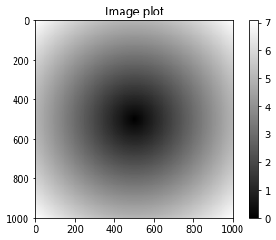
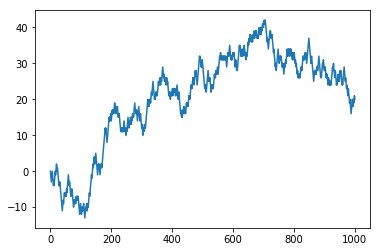

```python
data1 = [6, 7.5, 8, 0, 1]
```


```python
import numpy as np
```


```python
arr1 = np.array(data1)
```


```python
arr1
```


    array([ 6. ,  7.5,  8. ,  0. ,  1. ])


```python
len(arr1)
```


    5


```python
data2 = [[1, 2, 3, 4], [5, 6, 7, 8]]
```


```python
arr2 = np.array(data2)
```


```python
arr2
```


    array([[1, 2, 3, 4],
           [5, 6, 7, 8]])


```python
arr2.shape
```


    (2, 4)


```python
arr2.ndim
```


    2


```python
arr2.dtype
```


    dtype('int64')


```python
arr1.dtype
```


    dtype('float64')


```python
np.zeros(10)
```


    array([ 0.,  0.,  0.,  0.,  0.,  0.,  0.,  0.,  0.,  0.])


```python
np.zeros((3, 6))
```


    array([[ 0.,  0.,  0.,  0.,  0.,  0.],
           [ 0.,  0.,  0.,  0.,  0.,  0.],
           [ 0.,  0.,  0.,  0.,  0.,  0.]])


```python
np.empty((2, 3, 2))
```


    array([[[ -0.00000000e+000,  -0.00000000e+000],
            [  6.95326598e-310,   2.22829268e-314],
            [  0.00000000e+000,   0.00000000e+000]],
    
           [[ -0.00000000e+000,  -0.00000000e+000],
            [  1.97626258e-323,   0.00000000e+000],
            [  0.00000000e+000,   0.00000000e+000]]])


```python
np.arange(15)
```


    array([ 0,  1,  2,  3,  4,  5,  6,  7,  8,  9, 10, 11, 12, 13, 14])


```python
arr1 = np.array([1, 2, 3], dtype=np.float64)
```


```python
arr1
```


    array([ 1.,  2.,  3.])


```python
arr1.dtype
```


    dtype('float64')


```python
arr2 = np.array([1, 2, 3], dtype=np.int32)
```


```python
arr2.dtype
```


    dtype('int32')


```python
arr2
```


    array([1, 2, 3], dtype=int32)


```python
arr = np.array([1, 2, 3, 4, 5])
```


```python
arr.dtype
```


    dtype('int64')


```python
float_arr = arr.astype(np.float64)
```


```python
float_arr
```


    array([ 1.,  2.,  3.,  4.,  5.])


```python
float_arr.dtype
```


    dtype('float64')


```python
arr = np.array([3.7, -1.2, -2.6, 0.5, 12.9, 10.1])
```


```python
arr
```


    array([  3.7,  -1.2,  -2.6,   0.5,  12.9,  10.1])


```python
arr.astype(np.int32)
```


    array([ 3, -1, -2,  0, 12, 10], dtype=int32)


```python
numeric_strings = np.array(['1.25', '-9.6', '42'], dtype=np.string_)
```


```python
numeric_strings
```


    array(['1.25', '-9.6', '42'],
          dtype='|S4')


```python
numeric_strings.astype(float)
```


    array([  1.25,  -9.6 ,  42.  ])


```python
numeric_strings.dtype
```


    dtype('S4')


```python
arr2 = numeric_strings.astype(float)
```


```python
arr2
```


    array([  1.25,  -9.6 ,  42.  ])


```python
arr2.dtype
```


    dtype('float64')


```python
int_array = np.arange(10)
```


```python
int_array
```


    array([0, 1, 2, 3, 4, 5, 6, 7, 8, 9])


```python
calibers = np.array([.22, .270, .357, .380, .44, .50], dtype=np.float64)
```


```python
calibers
```


    array([ 0.22 ,  0.27 ,  0.357,  0.38 ,  0.44 ,  0.5  ])


```python
int_array.astype(calibers.dtype)
```


    array([ 0.,  1.,  2.,  3.,  4.,  5.,  6.,  7.,  8.,  9.])


```python
empty_uint32 = np.empty(8, dtype='u4')
```


```python
empty_uint32
```


    array([         0, 1075314688,          0, 1075707904,          0,
           1075838976,          0, 1072693248], dtype=uint32)


```python
len(empty_uint32)
```


    8


```python
arr = np.array([[1., 2., 3.], [4., 5., 6.]])
```


```python
arr
```


    array([[ 1.,  2.,  3.],
           [ 4.,  5.,  6.]])


```python
arr.dtype
```


    dtype('float64')


```python
arr * arr
```


    array([[  1.,   4.,   9.],
           [ 16.,  25.,  36.]])


```python
arr - arr
```


    array([[ 0.,  0.,  0.],
           [ 0.,  0.,  0.]])


```python
arr
```


    array([[ 1.,  2.,  3.],
           [ 4.,  5.,  6.]])


```python
1 / arr
```


    array([[ 1.        ,  0.5       ,  0.33333333],
           [ 0.25      ,  0.2       ,  0.16666667]])


```python
arr ** 0.5
```


    array([[ 1.        ,  1.41421356,  1.73205081],
           [ 2.        ,  2.23606798,  2.44948974]])


```python
arr = np.arange(10)
```


```python
arr
```


    array([0, 1, 2, 3, 4, 5, 6, 7, 8, 9])


```python
arr[5]
```


    5


```python
arr[5:8]
```


    array([5, 6, 7])


```python
arr[5:8] = 12
```


```python
arr
```


    array([ 0,  1,  2,  3,  4, 12, 12, 12,  8,  9])


```python
arr_slice = arr[5:8]
```


```python
arr_slice
```


    array([12, 12, 12])


```python
arr_slice[1] = 12345
```


```python
arr
```


    array([    0,     1,     2,     3,     4,    12, 12345,    12,     8,     9])


```python
arr_slice[:] = 64
```


```python
arr
```


    array([ 0,  1,  2,  3,  4, 64, 64, 64,  8,  9])


```python
testarr = [item for item in range(10)]
```


```python
testarr
```


    [0, 1, 2, 3, 4, 5, 6, 7, 8, 9]


```python
ta_slice = testarr[5:8]
```


```python
ta_slice
```


    [5, 6, 7]


```python
ta_slice[1] = 12
```


```python
testarr
```


    [0, 1, 2, 3, 4, 5, 6, 7, 8, 9]


```python
ta_slice
```


    [5, 12, 7]


```python
arr2d = np.array([[1, 2, 3], [4, 5, 6], [7, 8, 9]])
```


```python
arr2d
```


    array([[1, 2, 3],
           [4, 5, 6],
           [7, 8, 9]])


```python
arr2d[2]
```


    array([7, 8, 9])


```python
arr2d[0][2]
```


    3


```python
arr3d = np.array([[[1, 2, 3], [4, 5, 6]], [[7, 8, 9], [10, 11, 12]]])
```


```python
arr3d.shape
```


    (2, 2, 3)


```python
arr3d
```


    array([[[ 1,  2,  3],
            [ 4,  5,  6]],
    
           [[ 7,  8,  9],
            [10, 11, 12]]])


```python
arr3d[1][1][2]
```


    12


```python
arr3d[0]
```


    array([[1, 2, 3],
           [4, 5, 6]])


```python
old_values = arr3d[0].copy()
```


```python
old_values
```


    array([[1, 2, 3],
           [4, 5, 6]])


```python
arr3d[0] = 42
```


```python
arr3d
```


    array([[[42, 42, 42],
            [42, 42, 42]],
    
           [[ 7,  8,  9],
            [10, 11, 12]]])


```python
arr3d[0] = old_values
```


```python
arr3d
```


    array([[[ 1,  2,  3],
            [ 4,  5,  6]],
    
           [[ 7,  8,  9],
            [10, 11, 12]]])


```python
arr3d[1, 0]
```


    array([7, 8, 9])


```python
arr3d[1][0]
```


    array([7, 8, 9])


```python
arr
```


    array([ 0,  1,  2,  3,  4, 64, 64, 64,  8,  9])


```python
arr[1:6]
```


    array([ 1,  2,  3,  4, 64])


```python
arr2d
```


    array([[1, 2, 3],
           [4, 5, 6],
           [7, 8, 9]])


```python
arr2d[:2]
```


    array([[1, 2, 3],
           [4, 5, 6]])


```python
arr2d[:2, 1:]
```


    array([[2, 3],
           [5, 6]])


```python
arr2d[1, :2]
```


    array([4, 5])


```python
arr2d[2, :1]
```


    array([7])


```python
arr2d[:, :1]
```


    array([[1],
           [4],
           [7]])


```python
arr2d[:2, 1:] = 0
```


```python
arr2d
```


    array([[1, 0, 0],
           [4, 0, 0],
           [7, 8, 9]])


```python
from numpy.random import randn
```


```python
names = np.array(['Bob', 'Joe', 'Will', 'Bob', 'Will', 'Joe', 'Joe'])
```


```python
data = randn(7, 4)
```


```python
data
```


    array([[ 0.4740226 ,  1.81934933,  0.07632592,  0.33280215],
           [-1.97563226,  1.7312606 , -0.27074024,  0.72895738],
           [-0.53074025,  0.89452733,  0.02060066, -0.71894378],
           [-0.89550107, -0.02137296,  1.09955728, -0.64981456],
           [-0.21193726,  1.01235491,  0.84287831, -0.30039432],
           [ 0.24188939, -1.05191705, -0.04147694,  0.80103789],
           [-1.29211853,  0.50117247,  0.82817723, -0.42907666]])


```python
names
```


    array(['Bob', 'Joe', 'Will', 'Bob', 'Will', 'Joe', 'Joe'],
          dtype='|S4')


```python
names == 'Bob'
```


    array([ True, False, False,  True, False, False, False], dtype=bool)


```python
data[names == 'Bob']
```


    array([[ 0.4740226 ,  1.81934933,  0.07632592,  0.33280215],
           [-0.89550107, -0.02137296,  1.09955728, -0.64981456]])


```python
data[names == 'Bob', 2:]
```


    array([[ 0.07632592,  0.33280215],
           [ 1.09955728, -0.64981456]])


```python
data[names == 'Bob', 3]
```


    array([ 0.33280215, -0.64981456])


```python
names != 'Bob'
```


    array([False,  True,  True, False,  True,  True,  True], dtype=bool)


```python
data[names != 'Bob']
```


    array([[-1.97563226,  1.7312606 , -0.27074024,  0.72895738],
           [-0.53074025,  0.89452733,  0.02060066, -0.71894378],
           [-0.21193726,  1.01235491,  0.84287831, -0.30039432],
           [ 0.24188939, -1.05191705, -0.04147694,  0.80103789],
           [-1.29211853,  0.50117247,  0.82817723, -0.42907666]])


```python
mask = (names == 'Bob') | (names == 'Will')
```


```python
mask
```


    array([ True, False,  True,  True,  True, False, False], dtype=bool)


```python
data[mask]
```


    array([[ 0.4740226 ,  1.81934933,  0.07632592,  0.33280215],
           [-0.53074025,  0.89452733,  0.02060066, -0.71894378],
           [-0.89550107, -0.02137296,  1.09955728, -0.64981456],
           [-0.21193726,  1.01235491,  0.84287831, -0.30039432]])


```python
data[data < 0] = 0
```


```python
data
```


    array([[ 0.4740226 ,  1.81934933,  0.07632592,  0.33280215],
           [ 0.        ,  1.7312606 ,  0.        ,  0.72895738],
           [ 0.        ,  0.89452733,  0.02060066,  0.        ],
           [ 0.        ,  0.        ,  1.09955728,  0.        ],
           [ 0.        ,  1.01235491,  0.84287831,  0.        ],
           [ 0.24188939,  0.        ,  0.        ,  0.80103789],
           [ 0.        ,  0.50117247,  0.82817723,  0.        ]])


```python
data[names != 'Joe'] = 7
```


```python
data
```


    array([[ 7.        ,  7.        ,  7.        ,  7.        ],
           [ 0.        ,  1.7312606 ,  0.        ,  0.72895738],
           [ 7.        ,  7.        ,  7.        ,  7.        ],
           [ 7.        ,  7.        ,  7.        ,  7.        ],
           [ 7.        ,  7.        ,  7.        ,  7.        ],
           [ 0.24188939,  0.        ,  0.        ,  0.80103789],
           [ 0.        ,  0.50117247,  0.82817723,  0.        ]])


```python
# Fancy indexing
```


```python
arr = np.empty((8, 4))
```


```python
arr
```


    array([[ -0.00000000e+000,  -0.00000000e+000,   1.03753786e-322,
              0.00000000e+000],
           [  0.00000000e+000,   0.00000000e+000,   0.00000000e+000,
              0.00000000e+000],
           [  0.00000000e+000,   0.00000000e+000,   0.00000000e+000,
              0.00000000e+000],
           [  1.51609000e+006,   1.18795336e-037,  -0.00000000e+000,
             -0.00000000e+000],
           [  4.26221150e-096,   9.08366791e+223,   4.25939326e-096,
              9.08366793e+223],
           [  2.11063361e-052,   3.38610856e-057,   7.12460790e-067,
              6.23586876e-038],
           [  1.41529402e+161,   9.16651763e-072,   4.95380163e+097,
              4.76878324e-038],
           [  2.74087023e+126,   1.58268989e-319,  -0.00000000e+000,
             -1.49457636e-154]])


```python
for i in range(8):
    arr[i] = i
```


```python
arr
```


    array([[ 0.,  0.,  0.,  0.],
           [ 1.,  1.,  1.,  1.],
           [ 2.,  2.,  2.,  2.],
           [ 3.,  3.,  3.,  3.],
           [ 4.,  4.,  4.,  4.],
           [ 5.,  5.,  5.,  5.],
           [ 6.,  6.,  6.,  6.],
           [ 7.,  7.,  7.,  7.]])


```python
arr[[4, 3, 0, 6]]
```


    array([[ 4.,  4.,  4.,  4.],
           [ 3.,  3.,  3.,  3.],
           [ 0.,  0.,  0.,  0.],
           [ 6.,  6.,  6.,  6.]])


```python
arr[[-3, -5, -7]]
```


    array([[ 5.,  5.,  5.,  5.],
           [ 3.,  3.,  3.,  3.],
           [ 1.,  1.,  1.,  1.]])


```python
arr = np.arange(32).reshape((8, 4))
```


```python
arr
```


    array([[ 0,  1,  2,  3],
           [ 4,  5,  6,  7],
           [ 8,  9, 10, 11],
           [12, 13, 14, 15],
           [16, 17, 18, 19],
           [20, 21, 22, 23],
           [24, 25, 26, 27],
           [28, 29, 30, 31]])


```python
arr[[1, 5, 7, 2]]
```


    array([[ 4,  5,  6,  7],
           [20, 21, 22, 23],
           [28, 29, 30, 31],
           [ 8,  9, 10, 11]])


```python
arr[[1, 5, 7, 2], [0, 3, 1, 2]]
```


    array([ 4, 23, 29, 10])


```python
arr[[1, 5, 7, 2]][:, [0, 3, 1, 2]]
```


    array([[ 4,  7,  5,  6],
           [20, 23, 21, 22],
           [28, 31, 29, 30],
           [ 8, 11,  9, 10]])


```python
arr[np.ix_([1, 5, 7, 2], [0, 3, 1, 2])]
```


    array([[ 4,  7,  5,  6],
           [20, 23, 21, 22],
           [28, 31, 29, 30],
           [ 8, 11,  9, 10]])


```python
# Transpose
```


```python
import numpy as np
```


```python
arr = np.arange(15).reshape((3, 5))
```


```python
arr
```


    array([[ 0,  1,  2,  3,  4],
           [ 5,  6,  7,  8,  9],
           [10, 11, 12, 13, 14]])


```python
arr.T
```


    array([[ 0,  5, 10],
           [ 1,  6, 11],
           [ 2,  7, 12],
           [ 3,  8, 13],
           [ 4,  9, 14]])


```python
arr = np.random.randn(6, 3)
```


```python
arr
```


    array([[-2.40630711,  0.3726119 ,  0.03536991],
           [-1.1623263 ,  0.49990416,  0.5548169 ],
           [-0.14965318,  0.49762392, -1.23951685],
           [ 0.1231437 ,  1.04249975, -0.41531405],
           [-0.2701725 ,  1.09525646,  0.58012769],
           [-1.2489472 ,  0.30820263, -1.18384402]])


```python
arr.T
```


    array([[-2.40630711, -1.1623263 , -0.14965318,  0.1231437 , -0.2701725 ,
            -1.2489472 ],
           [ 0.3726119 ,  0.49990416,  0.49762392,  1.04249975,  1.09525646,
             0.30820263],
           [ 0.03536991,  0.5548169 , -1.23951685, -0.41531405,  0.58012769,
            -1.18384402]])


```python
np.dot(arr, arr.T)
```


    array([[ 5.93040456,  3.0028081 ,  0.50169051,  0.07743663,  1.07874265,
             3.07831805],
           [ 3.0028081 ,  1.90872839, -0.2649948 ,  0.14759355,  1.18341651,
             0.94893929],
           [ 0.50169051, -0.2649948 ,  1.80642767,  1.01513273, -0.13362007,
             1.80767253],
           [ 0.07743663,  0.14759355,  1.01513273,  1.27445587,  0.86759937,
             0.65916824],
           [ 1.07874265,  1.18341651, -0.13362007,  0.86759937,  1.60912804,
            -0.0117886 ],
           [ 3.07831805,  0.94893929,  1.80767253,  0.65916824, -0.0117886 ,
             3.05634463]])


```python
np.dot(arr.T, arr)
```


    array([[ 8.81173906, -2.10460113,  0.72618932],
           [-2.10460113,  3.01775468, -0.48871873],
           [ 0.72618932, -0.48871873,  3.75599541]])


```python
arr = np.arange(16).reshape((2, 2, 4))
```


```python
arr
```


    array([[[ 0,  1,  2,  3],
            [ 4,  5,  6,  7]],
    
           [[ 8,  9, 10, 11],
            [12, 13, 14, 15]]])


```python
arr.transpose((1, 0, 2))
```


    array([[[ 0,  1,  2,  3],
            [ 8,  9, 10, 11]],
    
           [[ 4,  5,  6,  7],
            [12, 13, 14, 15]]])


```python
# Change to 2, 4, 2, only return the data view, no data copy
arr.swapaxes(1, 2)
```


    array([[[ 0,  4],
            [ 1,  5],
            [ 2,  6],
            [ 3,  7]],
    
           [[ 8, 12],
            [ 9, 13],
            [10, 14],
            [11, 15]]])


```python
arr = np.arange(10)
```


```python
arr
```


    array([0, 1, 2, 3, 4, 5, 6, 7, 8, 9])


```python
np.sqrt(arr)
```


    array([ 0.        ,  1.        ,  1.41421356,  1.73205081,  2.        ,
            2.23606798,  2.44948974,  2.64575131,  2.82842712,  3.        ])


```python
np.exp(arr)
```


    array([  1.00000000e+00,   2.71828183e+00,   7.38905610e+00,
             2.00855369e+01,   5.45981500e+01,   1.48413159e+02,
             4.03428793e+02,   1.09663316e+03,   2.98095799e+03,
             8.10308393e+03])


```python
x = np.random.randn(8)
```


```python
x
```


    array([-0.95024559,  0.56781732, -0.31695716, -0.06859122, -0.08514861,
            2.73657509, -1.00751464, -0.17331926])


```python
y = np.random.randn(9)
```


```python
y
```


    array([-1.22017408,  0.86746418,  1.21278447,  2.65485631,  0.83030083,
            0.09284469,  0.05065772, -0.0584023 , -1.5760021 ])


```python
 help(np.maximum)
```

    Help on ufunc object:
    
    maximum = class ufunc(__builtin__.object)
     |  Functions that operate element by element on whole arrays.
     |  
     |  To see the documentation for a specific ufunc, use `info`.  For
     |  example, ``np.info(np.sin)``.  Because ufuncs are written in C
     |  (for speed) and linked into Python with NumPy's ufunc facility,
     |  Python's help() function finds this page whenever help() is called
     |  on a ufunc.
     |  
     |  A detailed explanation of ufuncs can be found in the docs for :ref:`ufuncs`.
     |  
     |  Calling ufuncs:
     |  ===============
     |  
     |  op(*x[, out], where=True, **kwargs)
     |  Apply `op` to the arguments `*x` elementwise, broadcasting the arguments.
     |  
     |  The broadcasting rules are:
     |  
     |  * Dimensions of length 1 may be prepended to either array.
     |  * Arrays may be repeated along dimensions of length 1.
     |  
     |  Parameters
     |  ----------
     |  *x : array_like
     |      Input arrays.
     |  out : ndarray, None, or tuple of ndarray and None, optional
     |      Alternate array object(s) in which to put the result; if provided, it
     |      must have a shape that the inputs broadcast to. A tuple of arrays
     |      (possible only as a keyword argument) must have length equal to the
     |      number of outputs; use `None` for outputs to be allocated by the ufunc.
     |  where : array_like, optional
     |      Values of True indicate to calculate the ufunc at that position, values
     |      of False indicate to leave the value in the output alone.
     |  **kwargs
     |      For other keyword-only arguments, see the :ref:`ufunc docs <ufuncs.kwargs>`.
     |  
     |  Returns
     |  -------
     |  r : ndarray or tuple of ndarray
     |      `r` will have the shape that the arrays in `x` broadcast to; if `out` is
     |      provided, `r` will be equal to `out`. If the function has more than one
     |      output, then the result will be a tuple of arrays.
     |  
     |  Methods defined here:
     |  
     |  __call__(...)
     |      x.__call__(...) <==> x(...)
     |  
     |  __repr__(...)
     |      x.__repr__() <==> repr(x)
     |  
     |  __str__(...)
     |      x.__str__() <==> str(x)
     |  
     |  accumulate(...)
     |      accumulate(array, axis=0, dtype=None, out=None, keepdims=None)
     |      
     |      Accumulate the result of applying the operator to all elements.
     |      
     |      For a one-dimensional array, accumulate produces results equivalent to::
     |      
     |        r = np.empty(len(A))
     |        t = op.identity        # op = the ufunc being applied to A's  elements
     |        for i in range(len(A)):
     |            t = op(t, A[i])
     |            r[i] = t
     |        return r
     |      
     |      For example, add.accumulate() is equivalent to np.cumsum().
     |      
     |      For a multi-dimensional array, accumulate is applied along only one
     |      axis (axis zero by default; see Examples below) so repeated use is
     |      necessary if one wants to accumulate over multiple axes.
     |      
     |      Parameters
     |      ----------
     |      array : array_like
     |          The array to act on.
     |      axis : int, optional
     |          The axis along which to apply the accumulation; default is zero.
     |      dtype : data-type code, optional
     |          The data-type used to represent the intermediate results. Defaults
     |          to the data-type of the output array if such is provided, or the
     |          the data-type of the input array if no output array is provided.
     |      out : ndarray, None, or tuple of ndarray and None, optional
     |          A location into which the result is stored. If not provided or `None`,
     |          a freshly-allocated array is returned. For consistency with
     |          :ref:`ufunc.__call__`, if given as a keyword, this may be wrapped in a
     |          1-element tuple.
     |      
     |          .. versionchanged:: 1.13.0
     |             Tuples are allowed for keyword argument.
     |      keepdims : bool
     |          Has no effect. Deprecated, and will be removed in future.
     |      
     |      Returns
     |      -------
     |      r : ndarray
     |          The accumulated values. If `out` was supplied, `r` is a reference to
     |          `out`.
     |      
     |      Examples
     |      --------
     |      1-D array examples:
     |      
     |      >>> np.add.accumulate([2, 3, 5])
     |      array([ 2,  5, 10])
     |      >>> np.multiply.accumulate([2, 3, 5])
     |      array([ 2,  6, 30])
     |      
     |      2-D array examples:
     |      
     |      >>> I = np.eye(2)
     |      >>> I
     |      array([[ 1.,  0.],
     |             [ 0.,  1.]])
     |      
     |      Accumulate along axis 0 (rows), down columns:
     |      
     |      >>> np.add.accumulate(I, 0)
     |      array([[ 1.,  0.],
     |             [ 1.,  1.]])
     |      >>> np.add.accumulate(I) # no axis specified = axis zero
     |      array([[ 1.,  0.],
     |             [ 1.,  1.]])
     |      
     |      Accumulate along axis 1 (columns), through rows:
     |      
     |      >>> np.add.accumulate(I, 1)
     |      array([[ 1.,  1.],
     |             [ 0.,  1.]])
     |  
     |  at(...)
     |      at(a, indices, b=None)
     |      
     |      Performs unbuffered in place operation on operand 'a' for elements
     |      specified by 'indices'. For addition ufunc, this method is equivalent to
     |      `a[indices] += b`, except that results are accumulated for elements that
     |      are indexed more than once. For example, `a[[0,0]] += 1` will only
     |      increment the first element once because of buffering, whereas
     |      `add.at(a, [0,0], 1)` will increment the first element twice.
     |      
     |      .. versionadded:: 1.8.0
     |      
     |      Parameters
     |      ----------
     |      a : array_like
     |          The array to perform in place operation on.
     |      indices : array_like or tuple
     |          Array like index object or slice object for indexing into first
     |          operand. If first operand has multiple dimensions, indices can be a
     |          tuple of array like index objects or slice objects.
     |      b : array_like
     |          Second operand for ufuncs requiring two operands. Operand must be
     |          broadcastable over first operand after indexing or slicing.
     |      
     |      Examples
     |      --------
     |      Set items 0 and 1 to their negative values:
     |      
     |      >>> a = np.array([1, 2, 3, 4])
     |      >>> np.negative.at(a, [0, 1])
     |      >>> print(a)
     |      array([-1, -2, 3, 4])
     |      
     |      ::
     |      
     |      Increment items 0 and 1, and increment item 2 twice:
     |      
     |      >>> a = np.array([1, 2, 3, 4])
     |      >>> np.add.at(a, [0, 1, 2, 2], 1)
     |      >>> print(a)
     |      array([2, 3, 5, 4])
     |      
     |      ::
     |      
     |      Add items 0 and 1 in first array to second array,
     |      and store results in first array:
     |      
     |      >>> a = np.array([1, 2, 3, 4])
     |      >>> b = np.array([1, 2])
     |      >>> np.add.at(a, [0, 1], b)
     |      >>> print(a)
     |      array([2, 4, 3, 4])
     |  
     |  outer(...)
     |      outer(A, B, **kwargs)
     |      
     |      Apply the ufunc `op` to all pairs (a, b) with a in `A` and b in `B`.
     |      
     |      Let ``M = A.ndim``, ``N = B.ndim``. Then the result, `C`, of
     |      ``op.outer(A, B)`` is an array of dimension M + N such that:
     |      
     |      .. math:: C[i_0, ..., i_{M-1}, j_0, ..., j_{N-1}] =
     |         op(A[i_0, ..., i_{M-1}], B[j_0, ..., j_{N-1}])
     |      
     |      For `A` and `B` one-dimensional, this is equivalent to::
     |      
     |        r = empty(len(A),len(B))
     |        for i in range(len(A)):
     |            for j in range(len(B)):
     |                r[i,j] = op(A[i], B[j]) # op = ufunc in question
     |      
     |      Parameters
     |      ----------
     |      A : array_like
     |          First array
     |      B : array_like
     |          Second array
     |      kwargs : any
     |          Arguments to pass on to the ufunc. Typically `dtype` or `out`.
     |      
     |      Returns
     |      -------
     |      r : ndarray
     |          Output array
     |      
     |      See Also
     |      --------
     |      numpy.outer
     |      
     |      Examples
     |      --------
     |      >>> np.multiply.outer([1, 2, 3], [4, 5, 6])
     |      array([[ 4,  5,  6],
     |             [ 8, 10, 12],
     |             [12, 15, 18]])
     |      
     |      A multi-dimensional example:
     |      
     |      >>> A = np.array([[1, 2, 3], [4, 5, 6]])
     |      >>> A.shape
     |      (2, 3)
     |      >>> B = np.array([[1, 2, 3, 4]])
     |      >>> B.shape
     |      (1, 4)
     |      >>> C = np.multiply.outer(A, B)
     |      >>> C.shape; C
     |      (2, 3, 1, 4)
     |      array([[[[ 1,  2,  3,  4]],
     |              [[ 2,  4,  6,  8]],
     |              [[ 3,  6,  9, 12]]],
     |             [[[ 4,  8, 12, 16]],
     |              [[ 5, 10, 15, 20]],
     |              [[ 6, 12, 18, 24]]]])
     |  
     |  reduce(...)
     |      reduce(a, axis=0, dtype=None, out=None, keepdims=False)
     |      
     |      Reduces `a`'s dimension by one, by applying ufunc along one axis.
     |      
     |      Let :math:`a.shape = (N_0, ..., N_i, ..., N_{M-1})`.  Then
     |      :math:`ufunc.reduce(a, axis=i)[k_0, ..,k_{i-1}, k_{i+1}, .., k_{M-1}]` =
     |      the result of iterating `j` over :math:`range(N_i)`, cumulatively applying
     |      ufunc to each :math:`a[k_0, ..,k_{i-1}, j, k_{i+1}, .., k_{M-1}]`.
     |      For a one-dimensional array, reduce produces results equivalent to:
     |      ::
     |      
     |       r = op.identity # op = ufunc
     |       for i in range(len(A)):
     |         r = op(r, A[i])
     |       return r
     |      
     |      For example, add.reduce() is equivalent to sum().
     |      
     |      Parameters
     |      ----------
     |      a : array_like
     |          The array to act on.
     |      axis : None or int or tuple of ints, optional
     |          Axis or axes along which a reduction is performed.
     |          The default (`axis` = 0) is perform a reduction over the first
     |          dimension of the input array. `axis` may be negative, in
     |          which case it counts from the last to the first axis.
     |      
     |          .. versionadded:: 1.7.0
     |      
     |          If this is `None`, a reduction is performed over all the axes.
     |          If this is a tuple of ints, a reduction is performed on multiple
     |          axes, instead of a single axis or all the axes as before.
     |      
     |          For operations which are either not commutative or not associative,
     |          doing a reduction over multiple axes is not well-defined. The
     |          ufuncs do not currently raise an exception in this case, but will
     |          likely do so in the future.
     |      dtype : data-type code, optional
     |          The type used to represent the intermediate results. Defaults
     |          to the data-type of the output array if this is provided, or
     |          the data-type of the input array if no output array is provided.
     |      out : ndarray, None, or tuple of ndarray and None, optional
     |          A location into which the result is stored. If not provided or `None`,
     |          a freshly-allocated array is returned. For consistency with
     |          :ref:`ufunc.__call__`, if given as a keyword, this may be wrapped in a
     |          1-element tuple.
     |      
     |          .. versionchanged:: 1.13.0
     |             Tuples are allowed for keyword argument.
     |      keepdims : bool, optional
     |          If this is set to True, the axes which are reduced are left
     |          in the result as dimensions with size one. With this option,
     |          the result will broadcast correctly against the original `arr`.
     |      
     |          .. versionadded:: 1.7.0
     |      
     |      Returns
     |      -------
     |      r : ndarray
     |          The reduced array. If `out` was supplied, `r` is a reference to it.
     |      
     |      Examples
     |      --------
     |      >>> np.multiply.reduce([2,3,5])
     |      30
     |      
     |      A multi-dimensional array example:
     |      
     |      >>> X = np.arange(8).reshape((2,2,2))
     |      >>> X
     |      array([[[0, 1],
     |              [2, 3]],
     |             [[4, 5],
     |              [6, 7]]])
     |      >>> np.add.reduce(X, 0)
     |      array([[ 4,  6],
     |             [ 8, 10]])
     |      >>> np.add.reduce(X) # confirm: default axis value is 0
     |      array([[ 4,  6],
     |             [ 8, 10]])
     |      >>> np.add.reduce(X, 1)
     |      array([[ 2,  4],
     |             [10, 12]])
     |      >>> np.add.reduce(X, 2)
     |      array([[ 1,  5],
     |             [ 9, 13]])
     |  
     |  reduceat(...)
     |      reduceat(a, indices, axis=0, dtype=None, out=None)
     |      
     |      Performs a (local) reduce with specified slices over a single axis.
     |      
     |      For i in ``range(len(indices))``, `reduceat` computes
     |      ``ufunc.reduce(a[indices[i]:indices[i+1]])``, which becomes the i-th
     |      generalized "row" parallel to `axis` in the final result (i.e., in a
     |      2-D array, for example, if `axis = 0`, it becomes the i-th row, but if
     |      `axis = 1`, it becomes the i-th column).  There are three exceptions to this:
     |      
     |      * when ``i = len(indices) - 1`` (so for the last index),
     |        ``indices[i+1] = a.shape[axis]``.
     |      * if ``indices[i] >= indices[i + 1]``, the i-th generalized "row" is
     |        simply ``a[indices[i]]``.
     |      * if ``indices[i] >= len(a)`` or ``indices[i] < 0``, an error is raised.
     |      
     |      The shape of the output depends on the size of `indices`, and may be
     |      larger than `a` (this happens if ``len(indices) > a.shape[axis]``).
     |      
     |      Parameters
     |      ----------
     |      a : array_like
     |          The array to act on.
     |      indices : array_like
     |          Paired indices, comma separated (not colon), specifying slices to
     |          reduce.
     |      axis : int, optional
     |          The axis along which to apply the reduceat.
     |      dtype : data-type code, optional
     |          The type used to represent the intermediate results. Defaults
     |          to the data type of the output array if this is provided, or
     |          the data type of the input array if no output array is provided.
     |      out : ndarray, None, or tuple of ndarray and None, optional
     |          A location into which the result is stored. If not provided or `None`,
     |          a freshly-allocated array is returned. For consistency with
     |          :ref:`ufunc.__call__`, if given as a keyword, this may be wrapped in a
     |          1-element tuple.
     |      
     |          .. versionchanged:: 1.13.0
     |             Tuples are allowed for keyword argument.
     |      
     |      Returns
     |      -------
     |      r : ndarray
     |          The reduced values. If `out` was supplied, `r` is a reference to
     |          `out`.
     |      
     |      Notes
     |      -----
     |      A descriptive example:
     |      
     |      If `a` is 1-D, the function `ufunc.accumulate(a)` is the same as
     |      ``ufunc.reduceat(a, indices)[::2]`` where `indices` is
     |      ``range(len(array) - 1)`` with a zero placed
     |      in every other element:
     |      ``indices = zeros(2 * len(a) - 1)``, ``indices[1::2] = range(1, len(a))``.
     |      
     |      Don't be fooled by this attribute's name: `reduceat(a)` is not
     |      necessarily smaller than `a`.
     |      
     |      Examples
     |      --------
     |      To take the running sum of four successive values:
     |      
     |      >>> np.add.reduceat(np.arange(8),[0,4, 1,5, 2,6, 3,7])[::2]
     |      array([ 6, 10, 14, 18])
     |      
     |      A 2-D example:
     |      
     |      >>> x = np.linspace(0, 15, 16).reshape(4,4)
     |      >>> x
     |      array([[  0.,   1.,   2.,   3.],
     |             [  4.,   5.,   6.,   7.],
     |             [  8.,   9.,  10.,  11.],
     |             [ 12.,  13.,  14.,  15.]])
     |      
     |      ::
     |      
     |       # reduce such that the result has the following five rows:
     |       # [row1 + row2 + row3]
     |       # [row4]
     |       # [row2]
     |       # [row3]
     |       # [row1 + row2 + row3 + row4]
     |      
     |      >>> np.add.reduceat(x, [0, 3, 1, 2, 0])
     |      array([[ 12.,  15.,  18.,  21.],
     |             [ 12.,  13.,  14.,  15.],
     |             [  4.,   5.,   6.,   7.],
     |             [  8.,   9.,  10.,  11.],
     |             [ 24.,  28.,  32.,  36.]])
     |      
     |      ::
     |      
     |       # reduce such that result has the following two columns:
     |       # [col1 * col2 * col3, col4]
     |      
     |      >>> np.multiply.reduceat(x, [0, 3], 1)
     |      array([[    0.,     3.],
     |             [  120.,     7.],
     |             [  720.,    11.],
     |             [ 2184.,    15.]])
     |  
     |  ----------------------------------------------------------------------
     |  Data descriptors defined here:
     |  
     |  identity
     |      The identity value.
     |      
     |      Data attribute containing the identity element for the ufunc, if it has one.
     |      If it does not, the attribute value is None.
     |      
     |      Examples
     |      --------
     |      >>> np.add.identity
     |      0
     |      >>> np.multiply.identity
     |      1
     |      >>> np.power.identity
     |      1
     |      >>> print(np.exp.identity)
     |      None
     |  
     |  nargs
     |      The number of arguments.
     |      
     |      Data attribute containing the number of arguments the ufunc takes, including
     |      optional ones.
     |      
     |      Notes
     |      -----
     |      Typically this value will be one more than what you might expect because all
     |      ufuncs take  the optional "out" argument.
     |      
     |      Examples
     |      --------
     |      >>> np.add.nargs
     |      3
     |      >>> np.multiply.nargs
     |      3
     |      >>> np.power.nargs
     |      3
     |      >>> np.exp.nargs
     |      2
     |  
     |  nin
     |      The number of inputs.
     |      
     |      Data attribute containing the number of arguments the ufunc treats as input.
     |      
     |      Examples
     |      --------
     |      >>> np.add.nin
     |      2
     |      >>> np.multiply.nin
     |      2
     |      >>> np.power.nin
     |      2
     |      >>> np.exp.nin
     |      1
     |  
     |  nout
     |      The number of outputs.
     |      
     |      Data attribute containing the number of arguments the ufunc treats as output.
     |      
     |      Notes
     |      -----
     |      Since all ufuncs can take output arguments, this will always be (at least) 1.
     |      
     |      Examples
     |      --------
     |      >>> np.add.nout
     |      1
     |      >>> np.multiply.nout
     |      1
     |      >>> np.power.nout
     |      1
     |      >>> np.exp.nout
     |      1
     |  
     |  ntypes
     |      The number of types.
     |      
     |      The number of numerical NumPy types - of which there are 18 total - on which
     |      the ufunc can operate.
     |      
     |      See Also
     |      --------
     |      numpy.ufunc.types
     |      
     |      Examples
     |      --------
     |      >>> np.add.ntypes
     |      18
     |      >>> np.multiply.ntypes
     |      18
     |      >>> np.power.ntypes
     |      17
     |      >>> np.exp.ntypes
     |      7
     |      >>> np.remainder.ntypes
     |      14
     |  
     |  signature
     |  
     |  types
     |      Returns a list with types grouped input->output.
     |      
     |      Data attribute listing the data-type "Domain-Range" groupings the ufunc can
     |      deliver. The data-types are given using the character codes.
     |      
     |      See Also
     |      --------
     |      numpy.ufunc.ntypes
     |      
     |      Examples
     |      --------
     |      >>> np.add.types
     |      ['??->?', 'bb->b', 'BB->B', 'hh->h', 'HH->H', 'ii->i', 'II->I', 'll->l',
     |      'LL->L', 'qq->q', 'QQ->Q', 'ff->f', 'dd->d', 'gg->g', 'FF->F', 'DD->D',
     |      'GG->G', 'OO->O']
     |      
     |      >>> np.multiply.types
     |      ['??->?', 'bb->b', 'BB->B', 'hh->h', 'HH->H', 'ii->i', 'II->I', 'll->l',
     |      'LL->L', 'qq->q', 'QQ->Q', 'ff->f', 'dd->d', 'gg->g', 'FF->F', 'DD->D',
     |      'GG->G', 'OO->O']
     |      
     |      >>> np.power.types
     |      ['bb->b', 'BB->B', 'hh->h', 'HH->H', 'ii->i', 'II->I', 'll->l', 'LL->L',
     |      'qq->q', 'QQ->Q', 'ff->f', 'dd->d', 'gg->g', 'FF->F', 'DD->D', 'GG->G',
     |      'OO->O']
     |      
     |      >>> np.exp.types
     |      ['f->f', 'd->d', 'g->g', 'F->F', 'D->D', 'G->G', 'O->O']
     |      
     |      >>> np.remainder.types
     |      ['bb->b', 'BB->B', 'hh->h', 'HH->H', 'ii->i', 'II->I', 'll->l', 'LL->L',
     |      'qq->q', 'QQ->Q', 'ff->f', 'dd->d', 'gg->g', 'OO->O']
    


```python
arr = np.random.randn(7) * 5
```


```python
arr
```


    array([  0.17162152,   3.83571401,  -8.61122634,   7.01403428,
            -4.60838827,  11.64731595, -12.07628622])


```python
np.modf(arr)
```


    (array([ 0.17162152,  0.83571401, -0.61122634,  0.01403428, -0.60838827,
             0.64731595, -0.07628622]),
     array([  0.,   3.,  -8.,   7.,  -4.,  11., -12.]))


```python
x
```


    array([-0.95024559,  0.56781732, -0.31695716, -0.06859122, -0.08514861,
            2.73657509, -1.00751464, -0.17331926])


```python
y
```


    array([-1.22017408,  0.86746418,  1.21278447,  2.65485631,  0.83030083,
            0.09284469,  0.05065772, -0.0584023 , -1.5760021 ])


```python
import numpy as np
%matplotlib inline
points = np.arange(-5, 5, 0.01)
```


```python
points
```


    array([ -5.00000000e+00,  -4.99000000e+00,  -4.98000000e+00,
            -4.97000000e+00,  -4.96000000e+00,  -4.95000000e+00,
            -4.94000000e+00,  -4.93000000e+00,  -4.92000000e+00,
            -4.91000000e+00,  -4.90000000e+00,  -4.89000000e+00,
            -4.88000000e+00,  -4.87000000e+00,  -4.86000000e+00,
            -4.85000000e+00,  -4.84000000e+00,  -4.83000000e+00,
            -4.82000000e+00,  -4.81000000e+00,  -4.80000000e+00,
            -4.79000000e+00,  -4.78000000e+00,  -4.77000000e+00,
            -4.76000000e+00,  -4.75000000e+00,  -4.74000000e+00,
            -4.73000000e+00,  -4.72000000e+00,  -4.71000000e+00,
            -4.70000000e+00,  -4.69000000e+00,  -4.68000000e+00,
            -4.67000000e+00,  -4.66000000e+00,  -4.65000000e+00,
            -4.64000000e+00,  -4.63000000e+00,  -4.62000000e+00,
            -4.61000000e+00,  -4.60000000e+00,  -4.59000000e+00,
            -4.58000000e+00,  -4.57000000e+00,  -4.56000000e+00,
            -4.55000000e+00,  -4.54000000e+00,  -4.53000000e+00,
            -4.52000000e+00,  -4.51000000e+00,  -4.50000000e+00,
            -4.49000000e+00,  -4.48000000e+00,  -4.47000000e+00,
            -4.46000000e+00,  -4.45000000e+00,  -4.44000000e+00,
            -4.43000000e+00,  -4.42000000e+00,  -4.41000000e+00,
            -4.40000000e+00,  -4.39000000e+00,  -4.38000000e+00,
            -4.37000000e+00,  -4.36000000e+00,  -4.35000000e+00,
            -4.34000000e+00,  -4.33000000e+00,  -4.32000000e+00,
            -4.31000000e+00,  -4.30000000e+00,  -4.29000000e+00,
            -4.28000000e+00,  -4.27000000e+00,  -4.26000000e+00,
            -4.25000000e+00,  -4.24000000e+00,  -4.23000000e+00,
            -4.22000000e+00,  -4.21000000e+00,  -4.20000000e+00,
            -4.19000000e+00,  -4.18000000e+00,  -4.17000000e+00,
            -4.16000000e+00,  -4.15000000e+00,  -4.14000000e+00,
            -4.13000000e+00,  -4.12000000e+00,  -4.11000000e+00,
            -4.10000000e+00,  -4.09000000e+00,  -4.08000000e+00,
            -4.07000000e+00,  -4.06000000e+00,  -4.05000000e+00,
            -4.04000000e+00,  -4.03000000e+00,  -4.02000000e+00,
            -4.01000000e+00,  -4.00000000e+00,  -3.99000000e+00,
            -3.98000000e+00,  -3.97000000e+00,  -3.96000000e+00,
            -3.95000000e+00,  -3.94000000e+00,  -3.93000000e+00,
            -3.92000000e+00,  -3.91000000e+00,  -3.90000000e+00,
            -3.89000000e+00,  -3.88000000e+00,  -3.87000000e+00,
            -3.86000000e+00,  -3.85000000e+00,  -3.84000000e+00,
            -3.83000000e+00,  -3.82000000e+00,  -3.81000000e+00,
            -3.80000000e+00,  -3.79000000e+00,  -3.78000000e+00,
            -3.77000000e+00,  -3.76000000e+00,  -3.75000000e+00,
            -3.74000000e+00,  -3.73000000e+00,  -3.72000000e+00,
            -3.71000000e+00,  -3.70000000e+00,  -3.69000000e+00,
            -3.68000000e+00,  -3.67000000e+00,  -3.66000000e+00,
            -3.65000000e+00,  -3.64000000e+00,  -3.63000000e+00,
            -3.62000000e+00,  -3.61000000e+00,  -3.60000000e+00,
            -3.59000000e+00,  -3.58000000e+00,  -3.57000000e+00,
            -3.56000000e+00,  -3.55000000e+00,  -3.54000000e+00,
            -3.53000000e+00,  -3.52000000e+00,  -3.51000000e+00,
            -3.50000000e+00,  -3.49000000e+00,  -3.48000000e+00,
            -3.47000000e+00,  -3.46000000e+00,  -3.45000000e+00,
            -3.44000000e+00,  -3.43000000e+00,  -3.42000000e+00,
            -3.41000000e+00,  -3.40000000e+00,  -3.39000000e+00,
            -3.38000000e+00,  -3.37000000e+00,  -3.36000000e+00,
            -3.35000000e+00,  -3.34000000e+00,  -3.33000000e+00,
            -3.32000000e+00,  -3.31000000e+00,  -3.30000000e+00,
            -3.29000000e+00,  -3.28000000e+00,  -3.27000000e+00,
            -3.26000000e+00,  -3.25000000e+00,  -3.24000000e+00,
            -3.23000000e+00,  -3.22000000e+00,  -3.21000000e+00,
            -3.20000000e+00,  -3.19000000e+00,  -3.18000000e+00,
            -3.17000000e+00,  -3.16000000e+00,  -3.15000000e+00,
            -3.14000000e+00,  -3.13000000e+00,  -3.12000000e+00,
            -3.11000000e+00,  -3.10000000e+00,  -3.09000000e+00,
            -3.08000000e+00,  -3.07000000e+00,  -3.06000000e+00,
            -3.05000000e+00,  -3.04000000e+00,  -3.03000000e+00,
            -3.02000000e+00,  -3.01000000e+00,  -3.00000000e+00,
            -2.99000000e+00,  -2.98000000e+00,  -2.97000000e+00,
            -2.96000000e+00,  -2.95000000e+00,  -2.94000000e+00,
            -2.93000000e+00,  -2.92000000e+00,  -2.91000000e+00,
            -2.90000000e+00,  -2.89000000e+00,  -2.88000000e+00,
            -2.87000000e+00,  -2.86000000e+00,  -2.85000000e+00,
            -2.84000000e+00,  -2.83000000e+00,  -2.82000000e+00,
            -2.81000000e+00,  -2.80000000e+00,  -2.79000000e+00,
            -2.78000000e+00,  -2.77000000e+00,  -2.76000000e+00,
            -2.75000000e+00,  -2.74000000e+00,  -2.73000000e+00,
            -2.72000000e+00,  -2.71000000e+00,  -2.70000000e+00,
            -2.69000000e+00,  -2.68000000e+00,  -2.67000000e+00,
            -2.66000000e+00,  -2.65000000e+00,  -2.64000000e+00,
            -2.63000000e+00,  -2.62000000e+00,  -2.61000000e+00,
            -2.60000000e+00,  -2.59000000e+00,  -2.58000000e+00,
            -2.57000000e+00,  -2.56000000e+00,  -2.55000000e+00,
            -2.54000000e+00,  -2.53000000e+00,  -2.52000000e+00,
            -2.51000000e+00,  -2.50000000e+00,  -2.49000000e+00,
            -2.48000000e+00,  -2.47000000e+00,  -2.46000000e+00,
            -2.45000000e+00,  -2.44000000e+00,  -2.43000000e+00,
            -2.42000000e+00,  -2.41000000e+00,  -2.40000000e+00,
            -2.39000000e+00,  -2.38000000e+00,  -2.37000000e+00,
            -2.36000000e+00,  -2.35000000e+00,  -2.34000000e+00,
            -2.33000000e+00,  -2.32000000e+00,  -2.31000000e+00,
            -2.30000000e+00,  -2.29000000e+00,  -2.28000000e+00,
            -2.27000000e+00,  -2.26000000e+00,  -2.25000000e+00,
            -2.24000000e+00,  -2.23000000e+00,  -2.22000000e+00,
            -2.21000000e+00,  -2.20000000e+00,  -2.19000000e+00,
            -2.18000000e+00,  -2.17000000e+00,  -2.16000000e+00,
            -2.15000000e+00,  -2.14000000e+00,  -2.13000000e+00,
            -2.12000000e+00,  -2.11000000e+00,  -2.10000000e+00,
            -2.09000000e+00,  -2.08000000e+00,  -2.07000000e+00,
            -2.06000000e+00,  -2.05000000e+00,  -2.04000000e+00,
            -2.03000000e+00,  -2.02000000e+00,  -2.01000000e+00,
            -2.00000000e+00,  -1.99000000e+00,  -1.98000000e+00,
            -1.97000000e+00,  -1.96000000e+00,  -1.95000000e+00,
            -1.94000000e+00,  -1.93000000e+00,  -1.92000000e+00,
            -1.91000000e+00,  -1.90000000e+00,  -1.89000000e+00,
            -1.88000000e+00,  -1.87000000e+00,  -1.86000000e+00,
            -1.85000000e+00,  -1.84000000e+00,  -1.83000000e+00,
            -1.82000000e+00,  -1.81000000e+00,  -1.80000000e+00,
            -1.79000000e+00,  -1.78000000e+00,  -1.77000000e+00,
            -1.76000000e+00,  -1.75000000e+00,  -1.74000000e+00,
            -1.73000000e+00,  -1.72000000e+00,  -1.71000000e+00,
            -1.70000000e+00,  -1.69000000e+00,  -1.68000000e+00,
            -1.67000000e+00,  -1.66000000e+00,  -1.65000000e+00,
            -1.64000000e+00,  -1.63000000e+00,  -1.62000000e+00,
            -1.61000000e+00,  -1.60000000e+00,  -1.59000000e+00,
            -1.58000000e+00,  -1.57000000e+00,  -1.56000000e+00,
            -1.55000000e+00,  -1.54000000e+00,  -1.53000000e+00,
            -1.52000000e+00,  -1.51000000e+00,  -1.50000000e+00,
            -1.49000000e+00,  -1.48000000e+00,  -1.47000000e+00,
            -1.46000000e+00,  -1.45000000e+00,  -1.44000000e+00,
            -1.43000000e+00,  -1.42000000e+00,  -1.41000000e+00,
            -1.40000000e+00,  -1.39000000e+00,  -1.38000000e+00,
            -1.37000000e+00,  -1.36000000e+00,  -1.35000000e+00,
            -1.34000000e+00,  -1.33000000e+00,  -1.32000000e+00,
            -1.31000000e+00,  -1.30000000e+00,  -1.29000000e+00,
            -1.28000000e+00,  -1.27000000e+00,  -1.26000000e+00,
            -1.25000000e+00,  -1.24000000e+00,  -1.23000000e+00,
            -1.22000000e+00,  -1.21000000e+00,  -1.20000000e+00,
            -1.19000000e+00,  -1.18000000e+00,  -1.17000000e+00,
            -1.16000000e+00,  -1.15000000e+00,  -1.14000000e+00,
            -1.13000000e+00,  -1.12000000e+00,  -1.11000000e+00,
            -1.10000000e+00,  -1.09000000e+00,  -1.08000000e+00,
            -1.07000000e+00,  -1.06000000e+00,  -1.05000000e+00,
            -1.04000000e+00,  -1.03000000e+00,  -1.02000000e+00,
            -1.01000000e+00,  -1.00000000e+00,  -9.90000000e-01,
            -9.80000000e-01,  -9.70000000e-01,  -9.60000000e-01,
            -9.50000000e-01,  -9.40000000e-01,  -9.30000000e-01,
            -9.20000000e-01,  -9.10000000e-01,  -9.00000000e-01,
            -8.90000000e-01,  -8.80000000e-01,  -8.70000000e-01,
            -8.60000000e-01,  -8.50000000e-01,  -8.40000000e-01,
            -8.30000000e-01,  -8.20000000e-01,  -8.10000000e-01,
            -8.00000000e-01,  -7.90000000e-01,  -7.80000000e-01,
            -7.70000000e-01,  -7.60000000e-01,  -7.50000000e-01,
            -7.40000000e-01,  -7.30000000e-01,  -7.20000000e-01,
            -7.10000000e-01,  -7.00000000e-01,  -6.90000000e-01,
            -6.80000000e-01,  -6.70000000e-01,  -6.60000000e-01,
            -6.50000000e-01,  -6.40000000e-01,  -6.30000000e-01,
            -6.20000000e-01,  -6.10000000e-01,  -6.00000000e-01,
            -5.90000000e-01,  -5.80000000e-01,  -5.70000000e-01,
            -5.60000000e-01,  -5.50000000e-01,  -5.40000000e-01,
            -5.30000000e-01,  -5.20000000e-01,  -5.10000000e-01,
            -5.00000000e-01,  -4.90000000e-01,  -4.80000000e-01,
            -4.70000000e-01,  -4.60000000e-01,  -4.50000000e-01,
            -4.40000000e-01,  -4.30000000e-01,  -4.20000000e-01,
            -4.10000000e-01,  -4.00000000e-01,  -3.90000000e-01,
            -3.80000000e-01,  -3.70000000e-01,  -3.60000000e-01,
            -3.50000000e-01,  -3.40000000e-01,  -3.30000000e-01,
            -3.20000000e-01,  -3.10000000e-01,  -3.00000000e-01,
            -2.90000000e-01,  -2.80000000e-01,  -2.70000000e-01,
            -2.60000000e-01,  -2.50000000e-01,  -2.40000000e-01,
            -2.30000000e-01,  -2.20000000e-01,  -2.10000000e-01,
            -2.00000000e-01,  -1.90000000e-01,  -1.80000000e-01,
            -1.70000000e-01,  -1.60000000e-01,  -1.50000000e-01,
            -1.40000000e-01,  -1.30000000e-01,  -1.20000000e-01,
            -1.10000000e-01,  -1.00000000e-01,  -9.00000000e-02,
            -8.00000000e-02,  -7.00000000e-02,  -6.00000000e-02,
            -5.00000000e-02,  -4.00000000e-02,  -3.00000000e-02,
            -2.00000000e-02,  -1.00000000e-02,  -1.06581410e-13,
             1.00000000e-02,   2.00000000e-02,   3.00000000e-02,
             4.00000000e-02,   5.00000000e-02,   6.00000000e-02,
             7.00000000e-02,   8.00000000e-02,   9.00000000e-02,
             1.00000000e-01,   1.10000000e-01,   1.20000000e-01,
             1.30000000e-01,   1.40000000e-01,   1.50000000e-01,
             1.60000000e-01,   1.70000000e-01,   1.80000000e-01,
             1.90000000e-01,   2.00000000e-01,   2.10000000e-01,
             2.20000000e-01,   2.30000000e-01,   2.40000000e-01,
             2.50000000e-01,   2.60000000e-01,   2.70000000e-01,
             2.80000000e-01,   2.90000000e-01,   3.00000000e-01,
             3.10000000e-01,   3.20000000e-01,   3.30000000e-01,
             3.40000000e-01,   3.50000000e-01,   3.60000000e-01,
             3.70000000e-01,   3.80000000e-01,   3.90000000e-01,
             4.00000000e-01,   4.10000000e-01,   4.20000000e-01,
             4.30000000e-01,   4.40000000e-01,   4.50000000e-01,
             4.60000000e-01,   4.70000000e-01,   4.80000000e-01,
             4.90000000e-01,   5.00000000e-01,   5.10000000e-01,
             5.20000000e-01,   5.30000000e-01,   5.40000000e-01,
             5.50000000e-01,   5.60000000e-01,   5.70000000e-01,
             5.80000000e-01,   5.90000000e-01,   6.00000000e-01,
             6.10000000e-01,   6.20000000e-01,   6.30000000e-01,
             6.40000000e-01,   6.50000000e-01,   6.60000000e-01,
             6.70000000e-01,   6.80000000e-01,   6.90000000e-01,
             7.00000000e-01,   7.10000000e-01,   7.20000000e-01,
             7.30000000e-01,   7.40000000e-01,   7.50000000e-01,
             7.60000000e-01,   7.70000000e-01,   7.80000000e-01,
             7.90000000e-01,   8.00000000e-01,   8.10000000e-01,
             8.20000000e-01,   8.30000000e-01,   8.40000000e-01,
             8.50000000e-01,   8.60000000e-01,   8.70000000e-01,
             8.80000000e-01,   8.90000000e-01,   9.00000000e-01,
             9.10000000e-01,   9.20000000e-01,   9.30000000e-01,
             9.40000000e-01,   9.50000000e-01,   9.60000000e-01,
             9.70000000e-01,   9.80000000e-01,   9.90000000e-01,
             1.00000000e+00,   1.01000000e+00,   1.02000000e+00,
             1.03000000e+00,   1.04000000e+00,   1.05000000e+00,
             1.06000000e+00,   1.07000000e+00,   1.08000000e+00,
             1.09000000e+00,   1.10000000e+00,   1.11000000e+00,
             1.12000000e+00,   1.13000000e+00,   1.14000000e+00,
             1.15000000e+00,   1.16000000e+00,   1.17000000e+00,
             1.18000000e+00,   1.19000000e+00,   1.20000000e+00,
             1.21000000e+00,   1.22000000e+00,   1.23000000e+00,
             1.24000000e+00,   1.25000000e+00,   1.26000000e+00,
             1.27000000e+00,   1.28000000e+00,   1.29000000e+00,
             1.30000000e+00,   1.31000000e+00,   1.32000000e+00,
             1.33000000e+00,   1.34000000e+00,   1.35000000e+00,
             1.36000000e+00,   1.37000000e+00,   1.38000000e+00,
             1.39000000e+00,   1.40000000e+00,   1.41000000e+00,
             1.42000000e+00,   1.43000000e+00,   1.44000000e+00,
             1.45000000e+00,   1.46000000e+00,   1.47000000e+00,
             1.48000000e+00,   1.49000000e+00,   1.50000000e+00,
             1.51000000e+00,   1.52000000e+00,   1.53000000e+00,
             1.54000000e+00,   1.55000000e+00,   1.56000000e+00,
             1.57000000e+00,   1.58000000e+00,   1.59000000e+00,
             1.60000000e+00,   1.61000000e+00,   1.62000000e+00,
             1.63000000e+00,   1.64000000e+00,   1.65000000e+00,
             1.66000000e+00,   1.67000000e+00,   1.68000000e+00,
             1.69000000e+00,   1.70000000e+00,   1.71000000e+00,
             1.72000000e+00,   1.73000000e+00,   1.74000000e+00,
             1.75000000e+00,   1.76000000e+00,   1.77000000e+00,
             1.78000000e+00,   1.79000000e+00,   1.80000000e+00,
             1.81000000e+00,   1.82000000e+00,   1.83000000e+00,
             1.84000000e+00,   1.85000000e+00,   1.86000000e+00,
             1.87000000e+00,   1.88000000e+00,   1.89000000e+00,
             1.90000000e+00,   1.91000000e+00,   1.92000000e+00,
             1.93000000e+00,   1.94000000e+00,   1.95000000e+00,
             1.96000000e+00,   1.97000000e+00,   1.98000000e+00,
             1.99000000e+00,   2.00000000e+00,   2.01000000e+00,
             2.02000000e+00,   2.03000000e+00,   2.04000000e+00,
             2.05000000e+00,   2.06000000e+00,   2.07000000e+00,
             2.08000000e+00,   2.09000000e+00,   2.10000000e+00,
             2.11000000e+00,   2.12000000e+00,   2.13000000e+00,
             2.14000000e+00,   2.15000000e+00,   2.16000000e+00,
             2.17000000e+00,   2.18000000e+00,   2.19000000e+00,
             2.20000000e+00,   2.21000000e+00,   2.22000000e+00,
             2.23000000e+00,   2.24000000e+00,   2.25000000e+00,
             2.26000000e+00,   2.27000000e+00,   2.28000000e+00,
             2.29000000e+00,   2.30000000e+00,   2.31000000e+00,
             2.32000000e+00,   2.33000000e+00,   2.34000000e+00,
             2.35000000e+00,   2.36000000e+00,   2.37000000e+00,
             2.38000000e+00,   2.39000000e+00,   2.40000000e+00,
             2.41000000e+00,   2.42000000e+00,   2.43000000e+00,
             2.44000000e+00,   2.45000000e+00,   2.46000000e+00,
             2.47000000e+00,   2.48000000e+00,   2.49000000e+00,
             2.50000000e+00,   2.51000000e+00,   2.52000000e+00,
             2.53000000e+00,   2.54000000e+00,   2.55000000e+00,
             2.56000000e+00,   2.57000000e+00,   2.58000000e+00,
             2.59000000e+00,   2.60000000e+00,   2.61000000e+00,
             2.62000000e+00,   2.63000000e+00,   2.64000000e+00,
             2.65000000e+00,   2.66000000e+00,   2.67000000e+00,
             2.68000000e+00,   2.69000000e+00,   2.70000000e+00,
             2.71000000e+00,   2.72000000e+00,   2.73000000e+00,
             2.74000000e+00,   2.75000000e+00,   2.76000000e+00,
             2.77000000e+00,   2.78000000e+00,   2.79000000e+00,
             2.80000000e+00,   2.81000000e+00,   2.82000000e+00,
             2.83000000e+00,   2.84000000e+00,   2.85000000e+00,
             2.86000000e+00,   2.87000000e+00,   2.88000000e+00,
             2.89000000e+00,   2.90000000e+00,   2.91000000e+00,
             2.92000000e+00,   2.93000000e+00,   2.94000000e+00,
             2.95000000e+00,   2.96000000e+00,   2.97000000e+00,
             2.98000000e+00,   2.99000000e+00,   3.00000000e+00,
             3.01000000e+00,   3.02000000e+00,   3.03000000e+00,
             3.04000000e+00,   3.05000000e+00,   3.06000000e+00,
             3.07000000e+00,   3.08000000e+00,   3.09000000e+00,
             3.10000000e+00,   3.11000000e+00,   3.12000000e+00,
             3.13000000e+00,   3.14000000e+00,   3.15000000e+00,
             3.16000000e+00,   3.17000000e+00,   3.18000000e+00,
             3.19000000e+00,   3.20000000e+00,   3.21000000e+00,
             3.22000000e+00,   3.23000000e+00,   3.24000000e+00,
             3.25000000e+00,   3.26000000e+00,   3.27000000e+00,
             3.28000000e+00,   3.29000000e+00,   3.30000000e+00,
             3.31000000e+00,   3.32000000e+00,   3.33000000e+00,
             3.34000000e+00,   3.35000000e+00,   3.36000000e+00,
             3.37000000e+00,   3.38000000e+00,   3.39000000e+00,
             3.40000000e+00,   3.41000000e+00,   3.42000000e+00,
             3.43000000e+00,   3.44000000e+00,   3.45000000e+00,
             3.46000000e+00,   3.47000000e+00,   3.48000000e+00,
             3.49000000e+00,   3.50000000e+00,   3.51000000e+00,
             3.52000000e+00,   3.53000000e+00,   3.54000000e+00,
             3.55000000e+00,   3.56000000e+00,   3.57000000e+00,
             3.58000000e+00,   3.59000000e+00,   3.60000000e+00,
             3.61000000e+00,   3.62000000e+00,   3.63000000e+00,
             3.64000000e+00,   3.65000000e+00,   3.66000000e+00,
             3.67000000e+00,   3.68000000e+00,   3.69000000e+00,
             3.70000000e+00,   3.71000000e+00,   3.72000000e+00,
             3.73000000e+00,   3.74000000e+00,   3.75000000e+00,
             3.76000000e+00,   3.77000000e+00,   3.78000000e+00,
             3.79000000e+00,   3.80000000e+00,   3.81000000e+00,
             3.82000000e+00,   3.83000000e+00,   3.84000000e+00,
             3.85000000e+00,   3.86000000e+00,   3.87000000e+00,
             3.88000000e+00,   3.89000000e+00,   3.90000000e+00,
             3.91000000e+00,   3.92000000e+00,   3.93000000e+00,
             3.94000000e+00,   3.95000000e+00,   3.96000000e+00,
             3.97000000e+00,   3.98000000e+00,   3.99000000e+00,
             4.00000000e+00,   4.01000000e+00,   4.02000000e+00,
             4.03000000e+00,   4.04000000e+00,   4.05000000e+00,
             4.06000000e+00,   4.07000000e+00,   4.08000000e+00,
             4.09000000e+00,   4.10000000e+00,   4.11000000e+00,
             4.12000000e+00,   4.13000000e+00,   4.14000000e+00,
             4.15000000e+00,   4.16000000e+00,   4.17000000e+00,
             4.18000000e+00,   4.19000000e+00,   4.20000000e+00,
             4.21000000e+00,   4.22000000e+00,   4.23000000e+00,
             4.24000000e+00,   4.25000000e+00,   4.26000000e+00,
             4.27000000e+00,   4.28000000e+00,   4.29000000e+00,
             4.30000000e+00,   4.31000000e+00,   4.32000000e+00,
             4.33000000e+00,   4.34000000e+00,   4.35000000e+00,
             4.36000000e+00,   4.37000000e+00,   4.38000000e+00,
             4.39000000e+00,   4.40000000e+00,   4.41000000e+00,
             4.42000000e+00,   4.43000000e+00,   4.44000000e+00,
             4.45000000e+00,   4.46000000e+00,   4.47000000e+00,
             4.48000000e+00,   4.49000000e+00,   4.50000000e+00,
             4.51000000e+00,   4.52000000e+00,   4.53000000e+00,
             4.54000000e+00,   4.55000000e+00,   4.56000000e+00,
             4.57000000e+00,   4.58000000e+00,   4.59000000e+00,
             4.60000000e+00,   4.61000000e+00,   4.62000000e+00,
             4.63000000e+00,   4.64000000e+00,   4.65000000e+00,
             4.66000000e+00,   4.67000000e+00,   4.68000000e+00,
             4.69000000e+00,   4.70000000e+00,   4.71000000e+00,
             4.72000000e+00,   4.73000000e+00,   4.74000000e+00,
             4.75000000e+00,   4.76000000e+00,   4.77000000e+00,
             4.78000000e+00,   4.79000000e+00,   4.80000000e+00,
             4.81000000e+00,   4.82000000e+00,   4.83000000e+00,
             4.84000000e+00,   4.85000000e+00,   4.86000000e+00,
             4.87000000e+00,   4.88000000e+00,   4.89000000e+00,
             4.90000000e+00,   4.91000000e+00,   4.92000000e+00,
             4.93000000e+00,   4.94000000e+00,   4.95000000e+00,
             4.96000000e+00,   4.97000000e+00,   4.98000000e+00,
             4.99000000e+00])


```python
len(points)
```


    1000


```python
points.shape
```


    (1000,)


```python
xs, ys = np.meshgrid(points, points)
```


```python
xs
```


    array([[-5.  , -4.99, -4.98, ...,  4.97,  4.98,  4.99],
           [-5.  , -4.99, -4.98, ...,  4.97,  4.98,  4.99],
           [-5.  , -4.99, -4.98, ...,  4.97,  4.98,  4.99],
           ..., 
           [-5.  , -4.99, -4.98, ...,  4.97,  4.98,  4.99],
           [-5.  , -4.99, -4.98, ...,  4.97,  4.98,  4.99],
           [-5.  , -4.99, -4.98, ...,  4.97,  4.98,  4.99]])


```python
ys
```


    array([[-5.  , -5.  , -5.  , ..., -5.  , -5.  , -5.  ],
           [-4.99, -4.99, -4.99, ..., -4.99, -4.99, -4.99],
           [-4.98, -4.98, -4.98, ..., -4.98, -4.98, -4.98],
           ..., 
           [ 4.97,  4.97,  4.97, ...,  4.97,  4.97,  4.97],
           [ 4.98,  4.98,  4.98, ...,  4.98,  4.98,  4.98],
           [ 4.99,  4.99,  4.99, ...,  4.99,  4.99,  4.99]])


```python
len(xs[0])
```


    1000


```python
import matplotlib.pyplot as plt
```


```python
z = np.sqrt(xs ** 2 + ys ** 2)
```


```python
z
```


    array([[ 7.07106781,  7.06400028,  7.05693985, ...,  7.04988652,
             7.05693985,  7.06400028],
           [ 7.06400028,  7.05692568,  7.04985815, ...,  7.04279774,
             7.04985815,  7.05692568],
           [ 7.05693985,  7.04985815,  7.04278354, ...,  7.03571603,
             7.04278354,  7.04985815],
           ..., 
           [ 7.04988652,  7.04279774,  7.03571603, ...,  7.0286414 ,
             7.03571603,  7.04279774],
           [ 7.05693985,  7.04985815,  7.04278354, ...,  7.03571603,
             7.04278354,  7.04985815],
           [ 7.06400028,  7.05692568,  7.04985815, ...,  7.04279774,
             7.04985815,  7.05692568]])


```python
plt.imshow(z, cmap=plt.cm.gray); plt.colorbar(); plt.title('Image plot')
```


    Text(0.5,1,u'Image plot')





```python
xarr = np.array([1.1, 1.2, 1.3, 1.4, 1.5])
```


```python
yarr = np.array([2.1, 2.2, 2.3, 2.4, 2.5])
```


```python
cond = np.array([True, False, True, True, False])
```


```python
result = [(x if c else y) for x, y, c in zip(xarr, yarr, cond)]
```


```python
result
```


    [1.1000000000000001, 2.2000000000000002, 1.3, 1.3999999999999999, 2.5]


```python
# Use np condition expression
result = np.where(cond, xarr, yarr)
```


```python
result
```


    array([ 1.1,  2.2,  1.3,  1.4,  2.5])


```python
arr = np.random.randn(4, 4)
```


```python
arr
```


    array([[ 2.07165943,  1.28747112,  1.59950846,  0.65584122],
           [-1.30825157,  0.13353413, -0.62999173, -0.26475749],
           [-0.2935316 ,  1.19830604,  0.44383584,  1.57498373],
           [ 1.03783044, -0.93389367,  0.05781786,  0.11478588]])


```python
np.where(arr > 0, 2, -2)
```


    array([[ 2,  2,  2,  2],
           [-2,  2, -2, -2],
           [-2,  2,  2,  2],
           [ 2, -2,  2,  2]])


```python
arr
```


    array([[ 2.07165943,  1.28747112,  1.59950846,  0.65584122],
           [-1.30825157,  0.13353413, -0.62999173, -0.26475749],
           [-0.2935316 ,  1.19830604,  0.44383584,  1.57498373],
           [ 1.03783044, -0.93389367,  0.05781786,  0.11478588]])


```python
np.where(arr > 0, 2, arr)
```


    array([[ 2.        ,  2.        ,  2.        ,  2.        ],
           [-1.30825157,  2.        , -0.62999173, -0.26475749],
           [-0.2935316 ,  2.        ,  2.        ,  2.        ],
           [ 2.        , -0.93389367,  2.        ,  2.        ]])


```python
# Math and statistics
```


```python
arr = np.random.randn(5, 4)
```


```python
arr
```


    array([[-0.60467425,  0.78940041,  1.41122539, -0.3294547 ],
           [-1.01873382,  0.41178995,  1.41551521, -1.97077816],
           [ 0.17030962, -0.7242028 , -0.81012002, -0.08420521],
           [ 0.56556004,  1.66485469, -1.82451737, -0.61603202],
           [-0.64426919,  1.31014707, -0.39642536, -0.21222409]])


```python
arr.mean()
```


    -0.074841730818958604


```python
np.mean(arr)
```


    -0.074841730818958604


```python
arr.sum()
```


    -1.4968346163791721


```python
np.sum(arr)
```


    -1.4968346163791721


```python
arr.mean(axis=1)
```


    array([ 0.31662421, -0.29055171, -0.3620546 , -0.05253366,  0.0143071 ])


```python
arr.mean(axis=0)
```


    array([-0.30636152,  0.69039786, -0.04086443, -0.64253883])


```python
arr.sum(0)
```


    array([-1.53180759,  3.45198931, -0.20432216, -3.21269417])


```python
arr = np.array([[0, 1, 2], [3, 4, 5], [6, 7, 8]])
```


```python
arr.shape
```


    (3, 3)


```python
arr.cumsum(0)
```


    array([[ 0,  1,  2],
           [ 3,  5,  7],
           [ 9, 12, 15]])


```python
arr.cumsum(1)
```


    array([[ 0,  1,  3],
           [ 3,  7, 12],
           [ 6, 13, 21]])


```python
arr.cumsum()
```


    array([ 0,  1,  3,  6, 10, 15, 21, 28, 36])


```python
arr.cumprod(1)
```


    array([[  0,   0,   0],
           [  3,  12,  60],
           [  6,  42, 336]])


```python
# Mathod for bool array
```


```python
arr = np.random.randn(100)
```


```python
arr
```


    array([-0.2496588 ,  1.9041332 ,  1.21068313, -0.1697624 , -0.17141058,
            0.37286132, -1.46542553, -0.91092978,  0.63326277,  0.52012801,
            0.17482452, -0.55552988,  1.37444888,  0.09889598, -1.07540795,
            0.6122035 , -0.32406412,  1.01685476,  0.64426013,  0.65153008,
           -0.88065405,  1.1834874 ,  0.7617274 ,  0.4289894 , -1.3006201 ,
            0.96444064,  2.06972431,  0.8635577 ,  1.30241197, -0.06210766,
           -1.061223  ,  0.95289393,  0.10871018, -1.01577011, -0.5811687 ,
            1.75104603, -1.18538923, -0.0799807 , -1.02862688,  0.18473463,
           -1.54195291,  0.95036984, -0.23636924, -0.35018805, -1.04867725,
            0.90268472, -0.20737195, -1.10187181, -0.28701245,  1.52775207,
           -0.28305612,  0.58674702, -0.31800084, -0.77784872, -1.16904648,
            1.14408247,  0.76033259, -0.38024009, -0.03986902,  0.13124134,
           -1.3008834 , -1.40584734,  0.91139202,  0.96760196, -0.69641565,
            1.71313088, -0.0617366 , -0.49569981,  0.22203413,  0.74276737,
           -0.76607269,  0.18167479,  1.00869648, -1.38869076,  0.64462392,
           -0.03146773,  1.87105571,  0.63909287,  1.79972254, -0.6514759 ,
            0.25969261, -0.38585555, -1.03811594, -0.51435171, -0.05490963,
           -0.80579337,  0.13768122,  0.76333339,  1.65961249,  0.14169782,
           -0.35099784,  0.13117772,  0.00875529, -0.58039077,  0.29684414,
           -2.27656075, -1.06678424, -0.26244098, -1.50064132,  1.23217873])


```python
(arr > 0).sum()
```


    50


```python
bools = np.array([False, False, True, False])
```


```python
bools
```


    array([False, False,  True, False], dtype=bool)


```python
bools.any()
```


    True


```python
bools.all()
```


    False


```python
# Sort
```


```python
arr = np.random.randn(8)
```


```python
arr
```


    array([-2.44222823,  0.20611644, -1.38032804, -0.56467957,  0.06953682,
            0.91179773,  1.22257197, -0.24697798])


```python
arr.sort()
```


```python
arr
```


    array([-2.44222823, -1.38032804, -0.56467957, -0.24697798,  0.06953682,
            0.20611644,  0.91179773,  1.22257197])


```python
arr = np.random.randn(5, 3)
```


```python
arr
```


    array([[-0.3633618 , -1.61708175,  0.27012463],
           [-0.35617689,  2.03770887,  2.45210925],
           [ 0.06628801,  0.32050691,  1.34638175],
           [-0.48108542, -1.09953893, -1.42186695],
           [-0.55929703, -1.02229421,  1.21414407]])


```python
arr.sort(1)
```


```python
arr
```


    array([[-1.61708175, -0.3633618 ,  0.27012463],
           [-0.35617689,  2.03770887,  2.45210925],
           [ 0.06628801,  0.32050691,  1.34638175],
           [-1.42186695, -1.09953893, -0.48108542],
           [-1.02229421, -0.55929703,  1.21414407]])


```python
arr.sort(0)
```


```python
arr
```


    array([[-1.61708175, -1.09953893, -0.48108542],
           [-1.42186695, -0.55929703,  0.27012463],
           [-1.02229421, -0.3633618 ,  1.21414407],
           [-0.35617689,  0.32050691,  1.34638175],
           [ 0.06628801,  2.03770887,  2.45210925]])


```python
large_arr = np.random.randn(1000)
```


```python
large_arr
```


    array([ -1.62128867e-01,   6.50793557e-01,   1.26469961e+00,
            -1.43368810e-01,  -4.34736508e-01,  -1.16955502e+00,
            -9.52648342e-01,   1.61614327e+00,  -2.17744710e+00,
            -1.52095935e+00,  -6.98476901e-01,  -1.17530644e+00,
            -1.26764617e+00,   6.00465934e-01,  -2.44570240e-01,
            -4.29086634e-02,   6.28971176e-01,  -1.60172248e+00,
            -3.17589102e-01,  -3.90600412e-01,   2.89892909e-01,
            -1.39135537e+00,   6.48128975e-01,  -8.57385162e-01,
             2.76018290e-01,   6.06594328e-01,   3.53516465e-01,
             1.57510071e+00,   7.86711304e-01,   1.26696603e+00,
            -4.64899256e-01,  -9.01936488e-01,   6.63470779e-01,
            -3.41397209e-01,   1.10535768e+00,  -4.93091522e-02,
            -2.21989294e+00,   1.61882886e+00,   7.69122110e-01,
             1.14589554e+00,  -3.92316312e-01,  -1.09024668e-02,
            -3.54593752e-01,  -1.78469039e+00,   3.84486138e-01,
            -7.31644879e-01,  -1.82601583e+00,   8.21973542e-01,
            -7.73624387e-02,  -2.90373987e-01,   4.83577558e-01,
             1.80938218e+00,  -7.15387795e-01,  -7.66490575e-01,
             1.32547168e+00,   7.17703843e-01,  -1.00355621e+00,
             1.42480080e-01,  -9.45979716e-01,   5.04695152e-01,
            -6.52148615e-03,  -1.95346877e+00,  -1.50590481e+00,
            -7.21537374e-01,   7.92792148e-01,   7.45599035e-01,
             2.64376947e-01,  -2.75490608e-01,  -1.55019581e+00,
            -6.94561264e-01,  -1.93077261e-01,  -1.05563987e+00,
            -6.81796328e-01,  -2.47358083e-01,  -1.80348321e+00,
             3.12054747e-01,   1.42706081e+00,   2.42724109e-01,
             1.58783079e+00,   4.67860578e-01,   1.22938903e+00,
             5.01530871e-01,  -5.07393240e-01,  -1.23797235e+00,
             2.02952659e+00,  -4.63480986e-01,  -1.77971975e-02,
             9.99084127e-01,   9.08997020e-01,   4.29084444e-01,
            -6.04763598e-01,   1.35814119e+00,  -2.58526594e-01,
             1.79101499e+00,  -4.24699897e-01,  -8.68446066e-01,
             1.00349178e+00,  -3.74765170e-01,   2.72244840e-01,
            -5.80636460e-01,  -7.11833752e-01,  -1.27244121e+00,
            -3.12482694e-01,  -9.40404686e-01,  -5.94852722e-01,
             1.34543602e-01,  -1.42986053e+00,   2.31139012e-01,
             8.05416019e-01,   4.39235246e-01,  -9.10443928e-01,
             3.61324586e-01,   1.71169405e-01,   2.06734552e-01,
            -8.98941860e-01,   2.18162143e-01,   3.06575453e-01,
            -5.22561413e-01,   2.59751809e-01,  -1.53416105e+00,
             8.81043993e-01,   1.70273673e-01,   2.75975948e-01,
             6.16268609e-01,  -1.51855036e+00,  -1.38289871e+00,
            -9.88343343e-01,  -1.22381360e+00,   1.72840651e+00,
             1.19443481e+00,   1.53630295e+00,  -1.02415653e-01,
            -1.14915321e+00,  -8.80965349e-01,  -5.83948749e-01,
             3.88429937e-01,   7.23375808e-01,  -2.68296390e+00,
            -8.39604887e-01,   1.22441261e+00,   3.86432560e-01,
            -1.12855003e+00,   2.05337039e+00,   3.71711033e-01,
             1.31854528e+00,  -1.31249926e+00,  -2.07594239e-02,
            -7.31422518e-01,  -1.21268451e+00,  -1.33443985e+00,
             9.16423028e-01,   4.61507696e-01,   1.10060919e+00,
            -1.19046931e+00,  -1.08508089e+00,  -5.98050546e-01,
             4.62241512e-01,  -4.01585058e-01,  -8.30649704e-02,
            -7.86859233e-01,   5.07863576e-01,   4.76186826e-01,
             6.49458835e-01,   8.92061927e-02,  -1.02418504e+00,
            -3.75872117e-01,  -1.64456901e+00,  -8.87785488e-01,
             1.43772822e+00,  -1.73921939e+00,   6.30021110e-01,
             1.54514781e-01,  -5.80910643e-01,   7.76248313e-01,
            -2.95180868e-01,  -2.88355247e-01,   8.01619709e-01,
             1.14445900e-01,  -7.11545569e-01,   8.93706031e-01,
             1.71135735e-01,   1.02118483e+00,  -2.98579614e-01,
            -5.03869418e-01,  -4.91299797e-01,  -1.64410094e+00,
            -9.70588882e-01,   2.04635787e+00,  -1.00473727e+00,
            -3.76115800e-01,   1.58619487e+00,   2.32644512e+00,
            -8.28637457e-01,   1.05123918e+00,  -4.05573871e-01,
            -6.57414734e-01,   1.40116429e+00,   1.54311066e+00,
             2.08035836e+00,  -3.92628585e-01,  -9.94406041e-01,
            -4.92102447e-01,  -1.12790506e-01,   6.68221951e-01,
             9.10134643e-01,  -1.56203106e+00,  -9.52495892e-02,
             3.54071563e-01,   1.45041391e+00,  -2.39741348e-02,
            -1.33958832e+00,  -1.46855559e+00,  -9.00380172e-01,
             5.86906566e-02,  -2.98314104e-01,  -2.03467508e+00,
             2.94130788e-01,   3.99020402e-01,  -2.84201996e-01,
            -1.75979293e-01,   1.30442345e+00,   4.73979858e-01,
            -6.96289890e-02,  -5.95880192e-02,   1.12167393e+00,
             2.25729753e-01,  -3.33063025e-01,   1.88870953e+00,
            -1.09588867e+00,  -1.33454888e+00,  -1.58676609e+00,
             7.66091982e-01,   7.75475556e-01,  -1.21088325e+00,
            -9.77236472e-01,   7.71501069e-01,   7.42388445e-01,
             6.34960981e-01,  -1.69242672e+00,  -6.63902661e-01,
            -3.85514746e-01,   8.77130921e-01,   9.32178232e-01,
            -1.24747313e+00,  -5.58183631e-01,  -2.27691869e+00,
             1.94125423e+00,  -1.37960498e+00,  -6.57233125e-01,
            -2.83771656e-01,   9.84699304e-01,  -1.17349646e+00,
             5.93366041e-01,  -1.15869083e+00,  -2.72266781e-01,
            -4.66970180e-01,   1.48742648e+00,  -3.27972928e-01,
            -3.82651150e-01,  -1.66651482e+00,   3.79033351e-01,
             1.15306532e+00,   8.81668098e-01,   1.67632627e-01,
            -9.48793314e-02,   4.09413525e-01,  -1.67870325e+00,
            -9.71211417e-01,   2.20802163e-01,   9.60738842e-01,
            -1.24306921e+00,  -7.80518904e-01,   1.13986434e+00,
            -1.33031374e+00,  -1.25417804e-01,  -1.07055941e+00,
            -6.29175100e-01,  -5.14275459e-01,   4.44576664e-01,
             3.68310703e-01,  -6.97226477e-01,  -3.97178424e-01,
            -1.00547923e+00,   1.33002112e+00,  -4.22256532e-01,
            -3.06424124e-01,   1.11539279e+00,  -1.84821464e-02,
            -7.20937778e-01,   7.96840181e-01,  -7.97213792e-01,
            -2.75919458e-01,  -6.67924096e-01,  -2.28685862e-01,
             1.21928061e+00,  -7.95036979e-01,  -1.26225698e+00,
             1.06918159e-01,  -3.48841685e-01,  -9.97513737e-01,
             7.70337894e-01,   1.33132197e+00,   6.33822856e-01,
             2.63048435e+00,   6.51008352e-01,  -4.94895649e-01,
             8.29989198e-03,   2.65496385e-01,   1.09916388e+00,
            -1.03163713e+00,   5.87940615e-01,  -4.94562890e-02,
            -2.23341417e+00,  -2.09755827e+00,  -1.35707672e+00,
            -1.16528753e+00,   7.84725068e-01,  -4.66431688e-01,
             1.15004099e+00,   5.16820860e-01,  -1.07545309e+00,
            -2.15290607e+00,   2.54801561e-01,  -1.22524640e+00,
            -3.76068959e-01,  -6.93529071e-01,   2.66028654e-01,
             1.79753713e-01,   7.24216779e-01,   8.56425201e-01,
             1.68312354e+00,  -1.36791068e+00,  -4.39759621e-01,
            -1.03255397e+00,  -2.15558045e+00,  -9.56172534e-01,
             1.59030880e+00,   5.87983272e-01,  -8.47449382e-02,
            -1.84563313e+00,   4.72515355e-01,  -3.15883978e-01,
             1.48482148e-01,   3.41401370e-01,   7.38410236e-01,
             1.54760687e-02,  -3.36747524e-01,  -6.67943343e-01,
             1.79768498e+00,  -4.59144569e-01,   2.80933207e-01,
            -3.25311073e+00,  -2.43479828e+00,  -8.28715084e-01,
            -3.82886818e-02,  -1.76712322e+00,   5.30638864e-01,
            -1.26763930e+00,   3.76567161e-01,   1.25532405e-01,
            -4.18984557e-01,   2.03529119e-03,   8.08768878e-01,
             1.42222872e+00,   8.14910532e-01,   9.83447500e-02,
             1.44495116e+00,   3.91533692e-01,  -9.89024620e-01,
             7.29296081e-01,  -9.67528567e-01,  -7.15800065e-01,
            -3.06092717e-01,  -3.93409684e-01,  -6.56983052e-01,
             9.81450667e-01,  -8.89239287e-01,   4.72237354e-01,
             6.46854251e-01,  -2.39686244e+00,  -2.61133867e+00,
            -1.69815582e+00,   5.34262660e-02,  -3.69851569e-01,
            -1.33165525e-01,   1.43786350e+00,   1.13305646e+00,
             6.39528374e-01,   1.09701807e+00,   1.05213326e+00,
            -2.42963122e+00,   6.57867319e-03,   8.86116193e-02,
            -1.71620270e+00,   1.59952370e-02,   1.31935825e+00,
            -8.65560679e-01,  -5.77734830e-01,  -8.14363300e-01,
             5.78552882e-03,   1.36769703e+00,  -1.34829609e-01,
            -1.64204401e-01,   5.24699868e-01,   6.57164931e-01,
             1.47038168e+00,   1.91239176e-01,   8.82560064e-01,
            -5.83036481e-01,   1.17465062e+00,  -3.35225796e-01,
             6.86230905e-01,  -1.74290970e-02,  -4.16256021e-01,
             2.60605067e-01,  -1.16354479e+00,   7.48345016e-02,
             1.20828338e+00,  -5.40455568e-01,   2.85713579e-01,
             9.36675582e-02,   2.14065377e+00,  -1.64004369e+00,
            -1.47481506e+00,  -2.36028788e+00,   7.87701322e-01,
             1.20829500e+00,  -1.45325946e+00,  -6.62655263e-01,
            -1.60777150e+00,  -6.45054765e-01,  -1.14720760e+00,
             8.63554253e-01,  -1.86486923e-01,   5.38777830e-01,
             2.65710723e+00,   1.08636843e+00,  -4.56787267e-01,
            -2.10274093e-02,   2.95367721e+00,  -3.52113072e-01,
            -1.32134487e+00,   1.59613169e-01,   3.40602616e-01,
             9.85888586e-01,  -1.34050967e+00,   5.35687000e-02,
             1.31564190e-01,   6.78587343e-01,  -1.90613876e-01,
            -4.74818993e-01,  -1.25742338e+00,  -9.41074909e-01,
            -6.12720933e-01,  -2.06721624e-01,   8.01927998e-01,
            -2.00627890e+00,   1.39759130e+00,   2.93801538e+00,
             9.23496168e-01,  -9.90870188e-01,   3.03730672e-01,
             1.45165958e-01,   6.69119414e-01,  -3.77458626e-01,
             8.49294586e-01,  -5.94931139e-01,  -1.70639108e-01,
             1.34314594e+00,   1.73584601e+00,  -4.14897850e-01,
            -3.17844132e-02,   1.36749791e-01,  -1.34512290e+00,
             3.08956323e-01,  -1.23694614e+00,   2.26886085e+00,
             1.19342689e+00,   6.19698588e-01,   1.45439672e-01,
             1.71180748e+00,   1.93362850e-02,   8.73426878e-01,
            -7.74862789e-01,  -1.55542639e+00,   7.63045045e-02,
            -6.78586883e-01,  -3.78086225e-01,  -1.45943093e+00,
            -4.76707370e-01,   8.97933503e-01,   9.18949119e-01,
            -2.63071075e+00,   7.22585246e-01,   1.85932905e-01,
             1.62649177e+00,  -3.13557557e-01,  -9.27495250e-01,
            -2.53517123e-01,   1.04173609e+00,   9.49214440e-02,
            -8.27632568e-01,   1.22943945e+00,   5.24248451e-01,
            -1.63812667e+00,   1.48973804e-01,  -1.78062496e-01,
             9.04188054e-02,  -1.13855537e-01,  -1.87716542e+00,
             1.17534227e-01,   9.36916487e-01,   1.40512671e+00,
             8.51480757e-01,   4.20066912e-01,   6.96751124e-01,
             1.06824029e+00,  -4.62296163e-01,   1.09238093e+00,
            -1.19684735e+00,  -4.98055004e-01,   3.66987663e-01,
             9.92282511e-01,   7.24084681e-01,   1.10018151e+00,
             4.70426425e-01,  -1.57054236e+00,   3.56327853e-01,
            -1.22013957e+00,   4.12514586e-01,   1.57907884e+00,
            -5.56753085e-01,  -4.73676515e-01,   7.84568157e-01,
             2.65362474e-01,  -3.88292330e-02,  -1.47079190e+00,
             5.43400364e-01,   1.92534204e-01,   1.15074977e+00,
             3.30019991e-01,   1.29378397e+00,  -1.01695007e+00,
            -1.46178098e+00,  -5.57347508e-01,   7.47613618e-01,
            -7.70125783e-01,   1.60980868e+00,   1.68780651e-01,
            -9.62245066e-01,   2.55591889e-01,  -6.35491550e-01,
            -1.03511332e+00,   2.21949132e+00,   4.73986216e-01,
             7.38960902e-01,  -3.63579019e-01,  -1.09680588e+00,
             1.11818762e-01,   8.00638093e-01,  -2.90407955e-01,
             1.00756617e+00,   4.88968947e-01,  -4.89066579e-01,
            -4.22820014e-02,   2.82985340e-01,  -4.03671385e-01,
             6.68858745e-01,  -3.80126555e-01,   1.43021713e+00,
             3.96382425e-01,  -3.28851664e-01,  -1.23063363e+00,
            -1.25286040e+00,  -3.95627195e-01,   5.08923436e-01,
             6.63150979e-01,  -1.07578743e-01,   1.15680026e+00,
             3.83667223e-01,   8.48598926e-01,  -1.95133780e-01,
            -6.78439694e-01,   1.12000820e+00,   1.13116141e+00,
             8.53701562e-01,  -1.67445156e+00,   5.54701063e-01,
             7.25139895e-01,   4.11713621e-01,   1.13249064e+00,
             1.49467170e+00,  -5.35167981e-01,   2.73191308e-01,
            -1.61059228e+00,  -1.61967328e+00,  -1.22310979e+00,
             6.80231815e-01,   5.87606864e-01,   2.94164418e-01,
             1.20706574e-01,  -1.37650589e-01,   6.14654624e-01,
             9.12546392e-01,   3.25469841e-01,   5.27752998e-01,
            -3.40696208e+00,  -2.78668835e+00,  -5.05696709e-01,
             1.23862711e+00,   2.87343560e-01,   1.06485299e+00,
            -7.22374853e-01,  -3.62913786e-01,   5.41766199e-01,
            -7.09077015e-01,   1.12756037e+00,  -4.17600925e-01,
            -9.87553816e-01,   4.37425771e-01,   9.09301273e-01,
            -1.22699133e+00,   2.35415456e-02,  -1.11801521e-01,
             2.30156914e-01,   2.28318034e-01,   1.26115817e+00,
             1.21631531e+00,  -9.06280273e-02,  -3.61426415e-01,
            -6.96331747e-01,  -1.94063266e+00,   1.22205715e+00,
            -3.77909747e-01,   8.49252808e-01,   4.58694345e-01,
            -1.42788436e+00,  -1.62382041e+00,  -6.28021401e-01,
             2.44454405e-01,  -1.61341670e-01,  -6.49172277e-01,
            -1.11924994e+00,  -1.68006711e-02,  -6.48008081e-02,
            -1.84845707e+00,   1.42146204e+00,  -8.67234010e-01,
             1.14561421e+00,   7.03428072e-01,  -5.75153609e-01,
             1.17905246e+00,   3.99585440e-01,   7.82358346e-02,
            -1.19461445e+00,   7.50889624e-01,  -1.24852240e+00,
            -1.41139420e+00,   7.43215835e-01,  -1.81826428e+00,
            -6.63625223e-01,   1.75513641e-01,   6.67149494e-01,
             9.68583886e-01,  -5.04380394e-01,   1.05009955e-01,
             1.66295770e-01,  -1.68677655e-01,  -6.42559183e-02,
             3.58290658e-01,  -2.44932975e-02,  -1.03774944e+00,
            -1.13919324e+00,  -2.07196636e-01,  -5.36039837e-02,
             2.23786765e+00,   9.45434466e-01,   1.06754406e+00,
            -5.10926738e-01,   1.20196228e-01,   6.05997582e-01,
             1.55649789e+00,  -2.83885762e+00,   5.21480677e-01,
             1.67043941e+00,  -1.08945052e+00,  -3.72430207e-01,
             1.30668824e+00,  -9.52582157e-01,  -9.71767058e-01,
             4.33921264e-01,  -8.24318736e-01,   1.49572142e+00,
            -1.03009478e+00,  -9.50339750e-01,  -1.95173307e-01,
            -2.20487703e-01,  -6.12990240e-01,   2.44867117e-01,
            -1.84377503e+00,  -2.08983384e+00,   4.68015509e-01,
             1.57400424e+00,  -8.66078506e-01,   9.63297482e-01,
            -1.23256291e-01,   7.15142235e-02,   1.22415760e+00,
             1.05507268e+00,  -1.08428240e-02,   1.49264205e+00,
            -1.42379597e-01,   5.87635694e-01,  -1.53323972e+00,
             1.30565381e+00,  -5.29187637e-01,  -5.47889116e-02,
            -7.38166746e-01,   5.54745706e-01,  -1.18279947e+00,
             2.39582866e-01,   1.96502498e-01,   1.01419869e-01,
            -8.23639873e-01,  -2.88572945e-01,  -5.62596952e-01,
            -1.09855048e+00,  -8.01796506e-01,   4.09177246e-01,
             1.07475489e+00,  -3.63462976e-02,   2.61313512e-01,
            -5.98264426e-01,  -1.70308943e+00,   1.19661992e+00,
            -5.82858751e-01,  -8.50806649e-01,  -4.38129075e-01,
             2.57165018e+00,   1.48067143e-01,   1.09638604e-01,
            -7.99207836e-01,  -5.78881763e-01,  -1.22981631e+00,
             1.84346002e+00,   4.94882528e-01,  -1.18365511e+00,
             7.87813011e-01,   4.19808609e-01,   5.04271197e-01,
             8.90545862e-01,  -1.28980887e+00,  -2.39377880e-01,
             1.45501637e+00,  -7.12612856e-01,   2.80149611e-01,
            -6.93387961e-01,   1.25198469e-01,  -4.40910853e-01,
             1.15259402e+00,  -3.43659476e-01,   6.34755108e-01,
            -4.80974037e-01,   1.18622864e-01,   3.42227718e-01,
             5.16812649e-02,  -9.04097241e-01,  -6.96344234e-01,
            -1.31820427e+00,   3.81985044e-01,  -1.99225687e-01,
            -1.29829858e+00,   1.15496280e+00,  -5.02501841e-01,
             1.48850446e-01,   1.22681633e+00,  -2.19345472e+00,
             5.94729550e-01,  -5.83323587e-01,   9.85143719e-01,
             1.51205806e+00,  -9.27502968e-01,   1.24977230e-01,
            -9.17885160e-01,  -1.16719391e+00,   2.26287581e-01,
            -1.23464074e+00,  -3.09290482e-01,  -2.15380808e-01,
             1.11532300e+00,  -2.78788847e-01,   7.96495008e-01,
            -1.93360085e+00,  -6.17112386e-02,   1.13508069e+00,
             6.91196406e-01,   6.34607132e-01,  -2.54002146e-01,
             4.54011261e-01,   1.30815116e+00,   2.11311379e+00,
            -9.59234704e-01,   5.17512983e-01,  -1.49461835e-01,
            -1.09731225e+00,  -2.11585195e-01,   1.32294444e-01,
            -4.94153929e-01,  -8.99168194e-01,  -1.12645402e+00,
            -5.43879129e-01,  -9.44509085e-01,  -7.76946472e-01,
             1.58445567e-01,  -2.59361391e-01,   2.92228453e-01,
             2.45150318e-01,   8.63558637e-01,   7.35818319e-01,
             4.63328353e-01,   3.49705412e-01,  -1.14645157e+00,
             2.50839133e-01,  -7.65267580e-01,   1.09337802e+00,
            -1.09634265e+00,   2.54331127e-02,  -5.56858541e-01,
            -2.36421015e-01,   3.58086040e-01,  -4.28176923e-01,
             2.72892593e+00,   1.00114740e+00,  -9.44833266e-01,
             1.37890410e+00,  -1.73151868e-01,  -1.65403326e+00,
            -3.50034511e-01,  -1.61750919e+00,  -1.53760141e+00,
             1.81475449e+00,  -1.36738076e+00,  -4.37657711e-01,
             5.76076275e-01,  -9.49772042e-01,   6.84676969e-02,
            -2.11165415e-01,  -1.59357402e+00,   2.11736916e+00,
             7.67393705e-01,   1.37046066e+00,  -1.51989544e+00,
             5.88491946e-01,  -1.26332395e+00,   3.39623648e-01,
             3.18587873e-01,   4.32047879e-01,  -9.04102460e-01,
            -2.05232732e+00,   1.25275561e+00,  -5.76113739e-01,
            -4.89478457e-01,   4.42045512e-01,  -3.56989433e-01,
            -1.32979243e+00,  -5.54043467e-01,   1.72860528e+00,
            -9.52280087e-02,   5.41774676e-01,  -6.94357112e-01,
             1.27952160e-01,   2.59226147e+00,  -1.07691205e+00,
            -2.85243587e-01,   6.37099331e-01,  -1.96155581e+00,
             1.04489246e+00,   3.59519802e-01,  -4.06800155e-01,
            -1.17736405e+00,  -2.18613097e+00,  -3.78150332e-02,
             1.93824281e-02,   9.03137949e-01,   7.94452028e-01,
            -9.80731637e-01,   1.63071534e-01,   6.33745805e-01,
             9.92430074e-01,   2.04123460e+00,  -5.93656368e-01,
             7.54307764e-01,  -1.31307973e+00,   1.24716074e+00,
            -6.75734221e-01,   7.21830970e-01,   3.07262684e-01,
            -1.66391612e+00,   1.60534021e-01,   1.99096835e-01,
            -1.05230140e+00,  -2.28266908e-01,  -4.39582983e-01,
            -7.77787821e-01,  -1.45698376e+00,   6.06817420e-01,
             1.56190914e+00,  -1.30297275e-01,  -7.54713068e-01,
             1.76668068e+00,   8.45108040e-01,  -7.74233715e-01,
            -2.06158610e+00,  -1.25284939e-01,  -4.87244905e-01,
            -1.12913273e+00,  -1.62510329e+00,  -4.11881809e-01,
            -1.28251015e+00,  -6.47761379e-01,   6.70174419e-01,
            -9.60821823e-01,   4.90746281e-02,  -1.15808266e+00,
            -7.28769176e-01,  -6.31316859e-01,   1.84873023e-01,
            -8.38821384e-02,   5.07799301e-01,  -1.80984347e+00,
             2.75715119e+00,   5.17671181e-01,   1.69450816e-01,
            -9.43769270e-01,  -1.80871872e+00,   4.71589184e-01,
             1.15358935e+00,  -1.44976897e+00,  -4.34161710e-01,
            -5.27432808e-01,  -1.13276709e+00,   1.30123351e+00,
            -1.08083663e+00,   7.51285563e-02,  -1.34857344e-02,
            -6.88352696e-01,  -7.49415752e-01,   1.89508207e+00,
             2.78255264e-01,  -2.44145405e-01,  -2.57428281e-01,
             1.47160217e+00,   8.03170357e-01,   3.80695204e-01,
            -8.77771070e-01,   9.65815932e-01,  -7.70243671e-01,
            -1.04974991e+00,  -4.88407602e-01,   2.12654819e-01,
            -5.16785547e-01,   8.29478365e-02,   1.71459619e-01,
            -8.39892498e-01,   6.06278251e-01,  -1.93359600e-01,
             1.37217644e+00,  -9.61691931e-02,   6.65869042e-01,
             6.05688599e-02,   2.19964208e+00,   4.51589264e-01,
             1.23413668e+00,  -5.15658746e-01,   4.23667911e-01,
            -6.34409517e-01,  -4.19908910e-01,  -1.51501854e-01,
            -1.11579748e+00,   1.86407222e+00,  -9.68520027e-01,
             1.52675324e+00,  -1.99777695e-01,  -2.60717933e-01,
            -1.23382688e-01,  -4.34164811e-01,  -2.04664956e+00,
             3.49194360e-01,  -7.77237850e-01,   1.54362782e+00,
             1.31288768e+00,  -2.06686241e-01,   6.55864923e-01,
            -2.26231731e-01,  -1.67145364e+00,  -1.02394952e+00,
             2.88120355e-01,  -3.28401811e-01,   4.50562781e-01,
            -6.27546709e-01])


```python
large_arr.sort()
```


```python
large_arr
```


    array([ -3.40696208e+00,  -3.25311073e+00,  -2.83885762e+00,
            -2.78668835e+00,  -2.68296390e+00,  -2.63071075e+00,
            -2.61133867e+00,  -2.43479828e+00,  -2.42963122e+00,
            -2.39686244e+00,  -2.36028788e+00,  -2.27691869e+00,
            -2.23341417e+00,  -2.21989294e+00,  -2.19345472e+00,
            -2.18613097e+00,  -2.17744710e+00,  -2.15558045e+00,
            -2.15290607e+00,  -2.09755827e+00,  -2.08983384e+00,
            -2.06158610e+00,  -2.05232732e+00,  -2.04664956e+00,
            -2.03467508e+00,  -2.00627890e+00,  -1.96155581e+00,
            -1.95346877e+00,  -1.94063266e+00,  -1.93360085e+00,
            -1.87716542e+00,  -1.84845707e+00,  -1.84563313e+00,
            -1.84377503e+00,  -1.82601583e+00,  -1.81826428e+00,
            -1.80984347e+00,  -1.80871872e+00,  -1.80348321e+00,
            -1.78469039e+00,  -1.76712322e+00,  -1.73921939e+00,
            -1.71620270e+00,  -1.70308943e+00,  -1.69815582e+00,
            -1.69242672e+00,  -1.67870325e+00,  -1.67445156e+00,
            -1.67145364e+00,  -1.66651482e+00,  -1.66391612e+00,
            -1.65403326e+00,  -1.64456901e+00,  -1.64410094e+00,
            -1.64004369e+00,  -1.63812667e+00,  -1.62510329e+00,
            -1.62382041e+00,  -1.61967328e+00,  -1.61750919e+00,
            -1.61059228e+00,  -1.60777150e+00,  -1.60172248e+00,
            -1.59357402e+00,  -1.58676609e+00,  -1.57054236e+00,
            -1.56203106e+00,  -1.55542639e+00,  -1.55019581e+00,
            -1.53760141e+00,  -1.53416105e+00,  -1.53323972e+00,
            -1.52095935e+00,  -1.51989544e+00,  -1.51855036e+00,
            -1.50590481e+00,  -1.47481506e+00,  -1.47079190e+00,
            -1.46855559e+00,  -1.46178098e+00,  -1.45943093e+00,
            -1.45698376e+00,  -1.45325946e+00,  -1.44976897e+00,
            -1.42986053e+00,  -1.42788436e+00,  -1.41139420e+00,
            -1.39135537e+00,  -1.38289871e+00,  -1.37960498e+00,
            -1.36791068e+00,  -1.36738076e+00,  -1.35707672e+00,
            -1.34512290e+00,  -1.34050967e+00,  -1.33958832e+00,
            -1.33454888e+00,  -1.33443985e+00,  -1.33031374e+00,
            -1.32979243e+00,  -1.32134487e+00,  -1.31820427e+00,
            -1.31307973e+00,  -1.31249926e+00,  -1.29829858e+00,
            -1.28980887e+00,  -1.28251015e+00,  -1.27244121e+00,
            -1.26764617e+00,  -1.26763930e+00,  -1.26332395e+00,
            -1.26225698e+00,  -1.25742338e+00,  -1.25286040e+00,
            -1.24852240e+00,  -1.24747313e+00,  -1.24306921e+00,
            -1.23797235e+00,  -1.23694614e+00,  -1.23464074e+00,
            -1.23063363e+00,  -1.22981631e+00,  -1.22699133e+00,
            -1.22524640e+00,  -1.22381360e+00,  -1.22310979e+00,
            -1.22013957e+00,  -1.21268451e+00,  -1.21088325e+00,
            -1.19684735e+00,  -1.19461445e+00,  -1.19046931e+00,
            -1.18365511e+00,  -1.18279947e+00,  -1.17736405e+00,
            -1.17530644e+00,  -1.17349646e+00,  -1.16955502e+00,
            -1.16719391e+00,  -1.16528753e+00,  -1.16354479e+00,
            -1.15869083e+00,  -1.15808266e+00,  -1.14915321e+00,
            -1.14720760e+00,  -1.14645157e+00,  -1.13919324e+00,
            -1.13276709e+00,  -1.12913273e+00,  -1.12855003e+00,
            -1.12645402e+00,  -1.11924994e+00,  -1.11579748e+00,
            -1.09855048e+00,  -1.09731225e+00,  -1.09680588e+00,
            -1.09634265e+00,  -1.09588867e+00,  -1.08945052e+00,
            -1.08508089e+00,  -1.08083663e+00,  -1.07691205e+00,
            -1.07545309e+00,  -1.07055941e+00,  -1.05563987e+00,
            -1.05230140e+00,  -1.04974991e+00,  -1.03774944e+00,
            -1.03511332e+00,  -1.03255397e+00,  -1.03163713e+00,
            -1.03009478e+00,  -1.02418504e+00,  -1.02394952e+00,
            -1.01695007e+00,  -1.00547923e+00,  -1.00473727e+00,
            -1.00355621e+00,  -9.97513737e-01,  -9.94406041e-01,
            -9.90870188e-01,  -9.89024620e-01,  -9.88343343e-01,
            -9.87553816e-01,  -9.80731637e-01,  -9.77236472e-01,
            -9.71767058e-01,  -9.71211417e-01,  -9.70588882e-01,
            -9.68520027e-01,  -9.67528567e-01,  -9.62245066e-01,
            -9.60821823e-01,  -9.59234704e-01,  -9.56172534e-01,
            -9.52648342e-01,  -9.52582157e-01,  -9.50339750e-01,
            -9.49772042e-01,  -9.45979716e-01,  -9.44833266e-01,
            -9.44509085e-01,  -9.43769270e-01,  -9.41074909e-01,
            -9.40404686e-01,  -9.27502968e-01,  -9.27495250e-01,
            -9.17885160e-01,  -9.10443928e-01,  -9.04102460e-01,
            -9.04097241e-01,  -9.01936488e-01,  -9.00380172e-01,
            -8.99168194e-01,  -8.98941860e-01,  -8.89239287e-01,
            -8.87785488e-01,  -8.80965349e-01,  -8.77771070e-01,
            -8.68446066e-01,  -8.67234010e-01,  -8.66078506e-01,
            -8.65560679e-01,  -8.57385162e-01,  -8.50806649e-01,
            -8.39892498e-01,  -8.39604887e-01,  -8.28715084e-01,
            -8.28637457e-01,  -8.27632568e-01,  -8.24318736e-01,
            -8.23639873e-01,  -8.14363300e-01,  -8.01796506e-01,
            -7.99207836e-01,  -7.97213792e-01,  -7.95036979e-01,
            -7.86859233e-01,  -7.80518904e-01,  -7.77787821e-01,
            -7.77237850e-01,  -7.76946472e-01,  -7.74862789e-01,
            -7.74233715e-01,  -7.70243671e-01,  -7.70125783e-01,
            -7.66490575e-01,  -7.65267580e-01,  -7.54713068e-01,
            -7.49415752e-01,  -7.38166746e-01,  -7.31644879e-01,
            -7.31422518e-01,  -7.28769176e-01,  -7.22374853e-01,
            -7.21537374e-01,  -7.20937778e-01,  -7.15800065e-01,
            -7.15387795e-01,  -7.12612856e-01,  -7.11833752e-01,
            -7.11545569e-01,  -7.09077015e-01,  -6.98476901e-01,
            -6.97226477e-01,  -6.96344234e-01,  -6.96331747e-01,
            -6.94561264e-01,  -6.94357112e-01,  -6.93529071e-01,
            -6.93387961e-01,  -6.88352696e-01,  -6.81796328e-01,
            -6.78586883e-01,  -6.78439694e-01,  -6.75734221e-01,
            -6.67943343e-01,  -6.67924096e-01,  -6.63902661e-01,
            -6.63625223e-01,  -6.62655263e-01,  -6.57414734e-01,
            -6.57233125e-01,  -6.56983052e-01,  -6.49172277e-01,
            -6.47761379e-01,  -6.45054765e-01,  -6.35491550e-01,
            -6.34409517e-01,  -6.31316859e-01,  -6.29175100e-01,
            -6.28021401e-01,  -6.27546709e-01,  -6.12990240e-01,
            -6.12720933e-01,  -6.04763598e-01,  -5.98264426e-01,
            -5.98050546e-01,  -5.94931139e-01,  -5.94852722e-01,
            -5.93656368e-01,  -5.83948749e-01,  -5.83323587e-01,
            -5.83036481e-01,  -5.82858751e-01,  -5.80910643e-01,
            -5.80636460e-01,  -5.78881763e-01,  -5.77734830e-01,
            -5.76113739e-01,  -5.75153609e-01,  -5.62596952e-01,
            -5.58183631e-01,  -5.57347508e-01,  -5.56858541e-01,
            -5.56753085e-01,  -5.54043467e-01,  -5.43879129e-01,
            -5.40455568e-01,  -5.35167981e-01,  -5.29187637e-01,
            -5.27432808e-01,  -5.22561413e-01,  -5.16785547e-01,
            -5.15658746e-01,  -5.14275459e-01,  -5.10926738e-01,
            -5.07393240e-01,  -5.05696709e-01,  -5.04380394e-01,
            -5.03869418e-01,  -5.02501841e-01,  -4.98055004e-01,
            -4.94895649e-01,  -4.94153929e-01,  -4.92102447e-01,
            -4.91299797e-01,  -4.89478457e-01,  -4.89066579e-01,
            -4.88407602e-01,  -4.87244905e-01,  -4.80974037e-01,
            -4.76707370e-01,  -4.74818993e-01,  -4.73676515e-01,
            -4.66970180e-01,  -4.66431688e-01,  -4.64899256e-01,
            -4.63480986e-01,  -4.62296163e-01,  -4.59144569e-01,
            -4.56787267e-01,  -4.40910853e-01,  -4.39759621e-01,
            -4.39582983e-01,  -4.38129075e-01,  -4.37657711e-01,
            -4.34736508e-01,  -4.34164811e-01,  -4.34161710e-01,
            -4.28176923e-01,  -4.24699897e-01,  -4.22256532e-01,
            -4.19908910e-01,  -4.18984557e-01,  -4.17600925e-01,
            -4.16256021e-01,  -4.14897850e-01,  -4.11881809e-01,
            -4.06800155e-01,  -4.05573871e-01,  -4.03671385e-01,
            -4.01585058e-01,  -3.97178424e-01,  -3.95627195e-01,
            -3.93409684e-01,  -3.92628585e-01,  -3.92316312e-01,
            -3.90600412e-01,  -3.85514746e-01,  -3.82651150e-01,
            -3.80126555e-01,  -3.78086225e-01,  -3.77909747e-01,
            -3.77458626e-01,  -3.76115800e-01,  -3.76068959e-01,
            -3.75872117e-01,  -3.74765170e-01,  -3.72430207e-01,
            -3.69851569e-01,  -3.63579019e-01,  -3.62913786e-01,
            -3.61426415e-01,  -3.56989433e-01,  -3.54593752e-01,
            -3.52113072e-01,  -3.50034511e-01,  -3.48841685e-01,
            -3.43659476e-01,  -3.41397209e-01,  -3.36747524e-01,
            -3.35225796e-01,  -3.33063025e-01,  -3.28851664e-01,
            -3.28401811e-01,  -3.27972928e-01,  -3.17589102e-01,
            -3.15883978e-01,  -3.13557557e-01,  -3.12482694e-01,
            -3.09290482e-01,  -3.06424124e-01,  -3.06092717e-01,
            -2.98579614e-01,  -2.98314104e-01,  -2.95180868e-01,
            -2.90407955e-01,  -2.90373987e-01,  -2.88572945e-01,
            -2.88355247e-01,  -2.85243587e-01,  -2.84201996e-01,
            -2.83771656e-01,  -2.78788847e-01,  -2.75919458e-01,
            -2.75490608e-01,  -2.72266781e-01,  -2.60717933e-01,
            -2.59361391e-01,  -2.58526594e-01,  -2.57428281e-01,
            -2.54002146e-01,  -2.53517123e-01,  -2.47358083e-01,
            -2.44570240e-01,  -2.44145405e-01,  -2.39377880e-01,
            -2.36421015e-01,  -2.28685862e-01,  -2.28266908e-01,
            -2.26231731e-01,  -2.20487703e-01,  -2.15380808e-01,
            -2.11585195e-01,  -2.11165415e-01,  -2.07196636e-01,
            -2.06721624e-01,  -2.06686241e-01,  -1.99777695e-01,
            -1.99225687e-01,  -1.95173307e-01,  -1.95133780e-01,
            -1.93359600e-01,  -1.93077261e-01,  -1.90613876e-01,
            -1.86486923e-01,  -1.78062496e-01,  -1.75979293e-01,
            -1.73151868e-01,  -1.70639108e-01,  -1.68677655e-01,
            -1.64204401e-01,  -1.62128867e-01,  -1.61341670e-01,
            -1.51501854e-01,  -1.49461835e-01,  -1.43368810e-01,
            -1.42379597e-01,  -1.37650589e-01,  -1.34829609e-01,
            -1.33165525e-01,  -1.30297275e-01,  -1.25417804e-01,
            -1.25284939e-01,  -1.23382688e-01,  -1.23256291e-01,
            -1.13855537e-01,  -1.12790506e-01,  -1.11801521e-01,
            -1.07578743e-01,  -1.02415653e-01,  -9.61691931e-02,
            -9.52495892e-02,  -9.52280087e-02,  -9.48793314e-02,
            -9.06280273e-02,  -8.47449382e-02,  -8.38821384e-02,
            -8.30649704e-02,  -7.73624387e-02,  -6.96289890e-02,
            -6.48008081e-02,  -6.42559183e-02,  -6.17112386e-02,
            -5.95880192e-02,  -5.47889116e-02,  -5.36039837e-02,
            -4.94562890e-02,  -4.93091522e-02,  -4.29086634e-02,
            -4.22820014e-02,  -3.88292330e-02,  -3.82886818e-02,
            -3.78150332e-02,  -3.63462976e-02,  -3.17844132e-02,
            -2.44932975e-02,  -2.39741348e-02,  -2.10274093e-02,
            -2.07594239e-02,  -1.84821464e-02,  -1.77971975e-02,
            -1.74290970e-02,  -1.68006711e-02,  -1.34857344e-02,
            -1.09024668e-02,  -1.08428240e-02,  -6.52148615e-03,
             2.03529119e-03,   5.78552882e-03,   6.57867319e-03,
             8.29989198e-03,   1.54760687e-02,   1.59952370e-02,
             1.93362850e-02,   1.93824281e-02,   2.35415456e-02,
             2.54331127e-02,   4.90746281e-02,   5.16812649e-02,
             5.34262660e-02,   5.35687000e-02,   5.86906566e-02,
             6.05688599e-02,   6.84676969e-02,   7.15142235e-02,
             7.48345016e-02,   7.51285563e-02,   7.63045045e-02,
             7.82358346e-02,   8.29478365e-02,   8.86116193e-02,
             8.92061927e-02,   9.04188054e-02,   9.36675582e-02,
             9.49214440e-02,   9.83447500e-02,   1.01419869e-01,
             1.05009955e-01,   1.06918159e-01,   1.09638604e-01,
             1.11818762e-01,   1.14445900e-01,   1.17534227e-01,
             1.18622864e-01,   1.20196228e-01,   1.20706574e-01,
             1.24977230e-01,   1.25198469e-01,   1.25532405e-01,
             1.27952160e-01,   1.31564190e-01,   1.32294444e-01,
             1.34543602e-01,   1.36749791e-01,   1.42480080e-01,
             1.45165958e-01,   1.45439672e-01,   1.48067143e-01,
             1.48482148e-01,   1.48850446e-01,   1.48973804e-01,
             1.54514781e-01,   1.58445567e-01,   1.59613169e-01,
             1.60534021e-01,   1.63071534e-01,   1.66295770e-01,
             1.67632627e-01,   1.68780651e-01,   1.69450816e-01,
             1.70273673e-01,   1.71135735e-01,   1.71169405e-01,
             1.71459619e-01,   1.75513641e-01,   1.79753713e-01,
             1.84873023e-01,   1.85932905e-01,   1.91239176e-01,
             1.92534204e-01,   1.96502498e-01,   1.99096835e-01,
             2.06734552e-01,   2.12654819e-01,   2.18162143e-01,
             2.20802163e-01,   2.25729753e-01,   2.26287581e-01,
             2.28318034e-01,   2.30156914e-01,   2.31139012e-01,
             2.39582866e-01,   2.42724109e-01,   2.44454405e-01,
             2.44867117e-01,   2.45150318e-01,   2.50839133e-01,
             2.54801561e-01,   2.55591889e-01,   2.59751809e-01,
             2.60605067e-01,   2.61313512e-01,   2.64376947e-01,
             2.65362474e-01,   2.65496385e-01,   2.66028654e-01,
             2.72244840e-01,   2.73191308e-01,   2.75975948e-01,
             2.76018290e-01,   2.78255264e-01,   2.80149611e-01,
             2.80933207e-01,   2.82985340e-01,   2.85713579e-01,
             2.87343560e-01,   2.88120355e-01,   2.89892909e-01,
             2.92228453e-01,   2.94130788e-01,   2.94164418e-01,
             3.03730672e-01,   3.06575453e-01,   3.07262684e-01,
             3.08956323e-01,   3.12054747e-01,   3.18587873e-01,
             3.25469841e-01,   3.30019991e-01,   3.39623648e-01,
             3.40602616e-01,   3.41401370e-01,   3.42227718e-01,
             3.49194360e-01,   3.49705412e-01,   3.53516465e-01,
             3.54071563e-01,   3.56327853e-01,   3.58086040e-01,
             3.58290658e-01,   3.59519802e-01,   3.61324586e-01,
             3.66987663e-01,   3.68310703e-01,   3.71711033e-01,
             3.76567161e-01,   3.79033351e-01,   3.80695204e-01,
             3.81985044e-01,   3.83667223e-01,   3.84486138e-01,
             3.86432560e-01,   3.88429937e-01,   3.91533692e-01,
             3.96382425e-01,   3.99020402e-01,   3.99585440e-01,
             4.09177246e-01,   4.09413525e-01,   4.11713621e-01,
             4.12514586e-01,   4.19808609e-01,   4.20066912e-01,
             4.23667911e-01,   4.29084444e-01,   4.32047879e-01,
             4.33921264e-01,   4.37425771e-01,   4.39235246e-01,
             4.42045512e-01,   4.44576664e-01,   4.50562781e-01,
             4.51589264e-01,   4.54011261e-01,   4.58694345e-01,
             4.61507696e-01,   4.62241512e-01,   4.63328353e-01,
             4.67860578e-01,   4.68015509e-01,   4.70426425e-01,
             4.71589184e-01,   4.72237354e-01,   4.72515355e-01,
             4.73979858e-01,   4.73986216e-01,   4.76186826e-01,
             4.83577558e-01,   4.88968947e-01,   4.94882528e-01,
             5.01530871e-01,   5.04271197e-01,   5.04695152e-01,
             5.07799301e-01,   5.07863576e-01,   5.08923436e-01,
             5.16820860e-01,   5.17512983e-01,   5.17671181e-01,
             5.21480677e-01,   5.24248451e-01,   5.24699868e-01,
             5.27752998e-01,   5.30638864e-01,   5.38777830e-01,
             5.41766199e-01,   5.41774676e-01,   5.43400364e-01,
             5.54701063e-01,   5.54745706e-01,   5.76076275e-01,
             5.87606864e-01,   5.87635694e-01,   5.87940615e-01,
             5.87983272e-01,   5.88491946e-01,   5.93366041e-01,
             5.94729550e-01,   6.00465934e-01,   6.05997582e-01,
             6.06278251e-01,   6.06594328e-01,   6.06817420e-01,
             6.14654624e-01,   6.16268609e-01,   6.19698588e-01,
             6.28971176e-01,   6.30021110e-01,   6.33745805e-01,
             6.33822856e-01,   6.34607132e-01,   6.34755108e-01,
             6.34960981e-01,   6.37099331e-01,   6.39528374e-01,
             6.46854251e-01,   6.48128975e-01,   6.49458835e-01,
             6.50793557e-01,   6.51008352e-01,   6.55864923e-01,
             6.57164931e-01,   6.63150979e-01,   6.63470779e-01,
             6.65869042e-01,   6.67149494e-01,   6.68221951e-01,
             6.68858745e-01,   6.69119414e-01,   6.70174419e-01,
             6.78587343e-01,   6.80231815e-01,   6.86230905e-01,
             6.91196406e-01,   6.96751124e-01,   7.03428072e-01,
             7.17703843e-01,   7.21830970e-01,   7.22585246e-01,
             7.23375808e-01,   7.24084681e-01,   7.24216779e-01,
             7.25139895e-01,   7.29296081e-01,   7.35818319e-01,
             7.38410236e-01,   7.38960902e-01,   7.42388445e-01,
             7.43215835e-01,   7.45599035e-01,   7.47613618e-01,
             7.50889624e-01,   7.54307764e-01,   7.66091982e-01,
             7.67393705e-01,   7.69122110e-01,   7.70337894e-01,
             7.71501069e-01,   7.75475556e-01,   7.76248313e-01,
             7.84568157e-01,   7.84725068e-01,   7.86711304e-01,
             7.87701322e-01,   7.87813011e-01,   7.92792148e-01,
             7.94452028e-01,   7.96495008e-01,   7.96840181e-01,
             8.00638093e-01,   8.01619709e-01,   8.01927998e-01,
             8.03170357e-01,   8.05416019e-01,   8.08768878e-01,
             8.14910532e-01,   8.21973542e-01,   8.45108040e-01,
             8.48598926e-01,   8.49252808e-01,   8.49294586e-01,
             8.51480757e-01,   8.53701562e-01,   8.56425201e-01,
             8.63554253e-01,   8.63558637e-01,   8.73426878e-01,
             8.77130921e-01,   8.81043993e-01,   8.81668098e-01,
             8.82560064e-01,   8.90545862e-01,   8.93706031e-01,
             8.97933503e-01,   9.03137949e-01,   9.08997020e-01,
             9.09301273e-01,   9.10134643e-01,   9.12546392e-01,
             9.16423028e-01,   9.18949119e-01,   9.23496168e-01,
             9.32178232e-01,   9.36916487e-01,   9.45434466e-01,
             9.60738842e-01,   9.63297482e-01,   9.65815932e-01,
             9.68583886e-01,   9.81450667e-01,   9.84699304e-01,
             9.85143719e-01,   9.85888586e-01,   9.92282511e-01,
             9.92430074e-01,   9.99084127e-01,   1.00114740e+00,
             1.00349178e+00,   1.00756617e+00,   1.02118483e+00,
             1.04173609e+00,   1.04489246e+00,   1.05123918e+00,
             1.05213326e+00,   1.05507268e+00,   1.06485299e+00,
             1.06754406e+00,   1.06824029e+00,   1.07475489e+00,
             1.08636843e+00,   1.09238093e+00,   1.09337802e+00,
             1.09701807e+00,   1.09916388e+00,   1.10018151e+00,
             1.10060919e+00,   1.10535768e+00,   1.11532300e+00,
             1.11539279e+00,   1.12000820e+00,   1.12167393e+00,
             1.12756037e+00,   1.13116141e+00,   1.13249064e+00,
             1.13305646e+00,   1.13508069e+00,   1.13986434e+00,
             1.14561421e+00,   1.14589554e+00,   1.15004099e+00,
             1.15074977e+00,   1.15259402e+00,   1.15306532e+00,
             1.15358935e+00,   1.15496280e+00,   1.15680026e+00,
             1.17465062e+00,   1.17905246e+00,   1.19342689e+00,
             1.19443481e+00,   1.19661992e+00,   1.20828338e+00,
             1.20829500e+00,   1.21631531e+00,   1.21928061e+00,
             1.22205715e+00,   1.22415760e+00,   1.22441261e+00,
             1.22681633e+00,   1.22938903e+00,   1.22943945e+00,
             1.23413668e+00,   1.23862711e+00,   1.24716074e+00,
             1.25275561e+00,   1.26115817e+00,   1.26469961e+00,
             1.26696603e+00,   1.29378397e+00,   1.30123351e+00,
             1.30442345e+00,   1.30565381e+00,   1.30668824e+00,
             1.30815116e+00,   1.31288768e+00,   1.31854528e+00,
             1.31935825e+00,   1.32547168e+00,   1.33002112e+00,
             1.33132197e+00,   1.34314594e+00,   1.35814119e+00,
             1.36769703e+00,   1.37046066e+00,   1.37217644e+00,
             1.37890410e+00,   1.39759130e+00,   1.40116429e+00,
             1.40512671e+00,   1.42146204e+00,   1.42222872e+00,
             1.42706081e+00,   1.43021713e+00,   1.43772822e+00,
             1.43786350e+00,   1.44495116e+00,   1.45041391e+00,
             1.45501637e+00,   1.47038168e+00,   1.47160217e+00,
             1.48742648e+00,   1.49264205e+00,   1.49467170e+00,
             1.49572142e+00,   1.51205806e+00,   1.52675324e+00,
             1.53630295e+00,   1.54311066e+00,   1.54362782e+00,
             1.55649789e+00,   1.56190914e+00,   1.57400424e+00,
             1.57510071e+00,   1.57907884e+00,   1.58619487e+00,
             1.58783079e+00,   1.59030880e+00,   1.60980868e+00,
             1.61614327e+00,   1.61882886e+00,   1.62649177e+00,
             1.67043941e+00,   1.68312354e+00,   1.71180748e+00,
             1.72840651e+00,   1.72860528e+00,   1.73584601e+00,
             1.76668068e+00,   1.79101499e+00,   1.79768498e+00,
             1.80938218e+00,   1.81475449e+00,   1.84346002e+00,
             1.86407222e+00,   1.88870953e+00,   1.89508207e+00,
             1.94125423e+00,   2.02952659e+00,   2.04123460e+00,
             2.04635787e+00,   2.05337039e+00,   2.08035836e+00,
             2.11311379e+00,   2.11736916e+00,   2.14065377e+00,
             2.19964208e+00,   2.21949132e+00,   2.23786765e+00,
             2.26886085e+00,   2.32644512e+00,   2.57165018e+00,
             2.59226147e+00,   2.63048435e+00,   2.65710723e+00,
             2.72892593e+00,   2.75715119e+00,   2.93801538e+00,
             2.95367721e+00])


```python
large_arr[int(0.05 * len(large_arr))]
```


    -1.6639161195918739


```python
# Uniquelize and other set logic
```


```python
names = np.array(['Bob', 'Joe', 'Will', 'Bob', 'Will', 'Joe', 'Joe'])
```


```python
np.unique(names)
```


    array(['Bob', 'Joe', 'Will'],
          dtype='|S4')


```python
ints = np.array([3, 3, 3, 2, 2, 1, 1, 4, 4])
```


```python
ints
```


    array([3, 3, 3, 2, 2, 1, 1, 4, 4])


```python
np.unique(ints)
```


    array([1, 2, 3, 4])


```python
values = np.array([6, 0, 0, 3, 2, 5, 6])
```


```python
np.in1d(values, [2, 3, 6])
```


    array([ True, False, False,  True,  True, False,  True], dtype=bool)


```python
# File related input/output
```


```python
arr = np.arange(10)
```


```python
arr
```


    array([0, 1, 2, 3, 4, 5, 6, 7, 8, 9])


```python
np.save('some_array', arr)
```


```python
data = np.load('some_array.npy')
```


```python
data
```


    array([0, 1, 2, 3, 4, 5, 6, 7, 8, 9])


```python
np.savez('array_archive.npz', a=arr, b=arr)
```


```python
arch = np.load('array_archive.npz')
```


```python
arch['b']
```


    array([0, 1, 2, 3, 4, 5, 6, 7, 8, 9])


```python
arch['a']
```


    array([0, 1, 2, 3, 4, 5, 6, 7, 8, 9])


```python
# Txt file operation
```


```python
arr = np.random.randn(10).reshape(5, 2)
```


```python
arr
```


    array([[ 0.78140064,  2.11349514],
           [ 1.09371583, -0.30666248],
           [ 1.8420122 ,  0.11714616],
           [-1.27706081, -1.51484247],
           [ 0.28108195,  1.22707937]])


```python
arr = np.loadtxt('array.txt', delimiter=',')
```


```python
arr
```


    array([[ 1.,  2.,  3.],
           [ 4.,  5.,  6.],
           [ 7.,  8.,  9.]])


```python
arr.shape
```


    (3, 3)


```python
np.savetxt('save_array.txt', arr)
```


```python
arr.dtype
```


    dtype('float64')


```python
arr.dtype = 'uint64'
```


```python
arr
```


    array([[4607182418800017408, 4611686018427387904, 4613937818241073152],
           [4616189618054758400, 4617315517961601024, 4618441417868443648],
           [4619567317775286272, 4620693217682128896, 4621256167635550208]], dtype=uint64)


```python
arr = np.random.randn(10).reshape(5, 2)
```


```python
b = arr.astype(int)
```


```python
b
```


    array([[-1,  0],
           [ 0,  0],
           [-1,  1],
           [ 0,  0],
           [ 1,  0]])


```python
arr = np.loadtxt('array.txt', delimiter=',')
```


```python
arr
```


    array([[ 1.,  2.,  3.],
           [ 4.,  5.,  6.],
           [ 7.,  8.,  9.]])


```python
arr.dtype
```


    dtype('float64')


```python
b = arr.astype(int)
```


```python
b
```


    array([[1, 2, 3],
           [4, 5, 6],
           [7, 8, 9]])


```python
np.savetxt('save_array.txt', arr)
```


```python
np.savetxt('save_array.txt', b)
```


```python
b.dtype
```


    dtype('int64')


```python
b
```


    array([[1, 2, 3],
           [4, 5, 6],
           [7, 8, 9]])


```python
np.savetxt('b_save_array.txt', b)
```


```python
x = np.array([[1, 2, 3], [4, 5, 6]])
```


```python
y = np.array([[6, 23], [-1, 7], [8, 9]])
```


```python
x
```


    array([[1, 2, 3],
           [4, 5, 6]])


```python
y
```


    array([[ 6, 23],
           [-1,  7],
           [ 8,  9]])


```python
x.dtype
```


    dtype('int64')


```python
x.dot(y)
```


    array([[ 28,  64],
           [ 67, 181]])


```python
np.ones(3)
```


    array([ 1.,  1.,  1.])


```python
np.dot(x, np.ones(3))
```


    array([  6.,  15.])


```python
from numpy.linalg import inv, qr
```


```python
X = np.random.randn(5, 5)
```


```python
x
```


    array([[1, 2, 3],
           [4, 5, 6]])


```python
X
```


    array([[ 1.07591347, -0.47930645,  0.07737984,  0.9078878 , -1.3481806 ],
           [ 0.48755374, -0.5589896 ,  0.74230582,  1.15364833, -1.56036619],
           [-0.80854295,  0.54750255,  1.53627621,  0.26707754,  1.12930869],
           [ 0.41557422,  0.40303424, -0.00648431, -1.0982434 , -1.00285286],
           [-1.11974509, -0.13789455,  0.29355892, -0.91896194,  1.60791404]])


```python
mat = X.T.dot(X)
```


```python
mat
```


    array([[ 3.47557115, -0.90901168, -1.12838319,  1.89593209, -5.34159626],
           [-0.90901168,  1.0234146 ,  0.34599169, -1.24971811,  1.5108129 ],
           [-1.12838319,  0.34599169,  3.00336906,  1.07426882,  0.9508595 ],
           [ 1.89593209, -1.24971811,  1.07426882,  4.27712475, -3.09873287],
           [-5.34159626,  1.5108129 ,  0.9508595 , -3.09873287,  9.1187731 ]])


```python
inv(mat)
```


    array([[ 6.61579611, -1.72278898,  2.12576515, -1.480499  ,  3.43607066],
           [-1.72278898,  2.47761723, -1.00161598,  1.04310118, -0.96076206],
           [ 2.12576515, -1.00161598,  1.21704007, -0.80947808,  1.00919751],
           [-1.480499  ,  1.04310118, -0.80947808,  0.93630802, -0.63748601],
           [ 3.43607066, -0.96076206,  1.00919751, -0.63748601,  1.95976255]])


```python
mat.dot(inv(mat))
```


    array([[  1.00000000e+00,   7.26422527e-16,   9.49096656e-16,
              2.92507251e-16,   0.00000000e+00],
           [ -9.49011013e-16,   1.00000000e+00,  -3.22023997e-16,
             -2.34695963e-16,   0.00000000e+00],
           [ -2.24718441e-15,  -1.03762710e-15,   1.00000000e+00,
             -4.76466969e-16,   6.66133815e-16],
           [  1.11285842e-15,   1.67219597e-16,   4.81184618e-16,
              1.00000000e+00,   0.00000000e+00],
           [ -3.55271368e-15,   0.00000000e+00,   0.00000000e+00,
             -1.77635684e-15,   1.00000000e+00]])


```python
q, r = qr(mat)
```


```python
q
```


    array([[-0.51074707, -0.20762323,  0.04577968, -0.19451851,  0.80999802],
           [ 0.13358238, -0.71955429, -0.26115025, -0.58728432, -0.2264841 ],
           [ 0.16581977,  0.01730119, -0.89999766,  0.32497897,  0.23790197],
           [-0.27861371,  0.62925743, -0.30959813, -0.63872945, -0.150277  ],
           [ 0.78496585,  0.20705064,  0.15446027, -0.32198298,  0.46198229]])


```python
r
```


    array([[ -6.80487728,   2.1924826 ,   1.56764099,  -4.58121213,
             11.10896884],
           [  0.        ,  -1.01526399,   0.91014833,   2.57400452,
             -0.02347429],
           [  0.        ,   0.        ,  -3.03075958,  -2.35650098,
              0.87299294],
           [  0.        ,   0.        ,   0.        ,  -1.01992556,
             -0.49606584],
           [  0.        ,   0.        ,   0.        ,   0.        ,
              0.23573381]])


```python
samples = np.random.normal(size=(4, 4))
```


```python
samples
```


    array([[-0.66711741,  1.3338017 , -1.18393556,  0.83267535],
           [-0.57995543,  0.51982438,  0.19594959, -0.48894883],
           [ 1.12299403, -0.68966786, -0.05838506,  2.11240701],
           [ 0.16923169, -0.52380054, -0.08764185, -0.27672964]])


```python
from random import normalvariate
```


```python
N = 1000000
```


```python
%timeit samples = [normalvariate(0, 1) for _ in xrange(N)]
```

    1 loop, best of 3: 998 ms per loop


```python
%timeit np.random.normal(size=N)
```

    10 loops, best of 3: 38.9 ms per loop


```python
import random
```


```python
position = 0
```


```python
walk = [position]
```


```python
walk
```


    [0]


```python
steps = 1000
```


```python
for i in xrange(steps):
    step = 1 if random.randint(0, 1) else -1
    position += step
    walk.append(position)
```


```python
walk
```


    [0,
     -1,
     -2,
     -3,
     -2,
     -1,
     0,
     -1,
     -2,
     -3,
     -4,
     -3,
     -4,
     -3,
     -2,
     -1,
     0,
     -1,
     0,
     1,
     2,
     1,
     0,
     1,
     0,
     -1,
     -2,
     -3,
     -4,
     -3,
     -4,
     -3,
     -4,
     -5,
     -6,
     -7,
     -8,
     -9,
     -10,
     -11,
     -10,
     -9,
     -8,
     -9,
     -8,
     -7,
     -6,
     -7,
     -6,
     -7,
     -6,
     -7,
     -6,
     -5,
     -6,
     -5,
     -4,
     -3,
     -2,
     -1,
     -2,
     -3,
     -4,
     -3,
     -4,
     -5,
     -6,
     -7,
     -6,
     -5,
     -6,
     -5,
     -6,
     -7,
     -8,
     -9,
     -10,
     -9,
     -8,
     -9,
     -8,
     -9,
     -8,
     -9,
     -8,
     -7,
     -8,
     -7,
     -8,
     -7,
     -8,
     -7,
     -8,
     -9,
     -10,
     -11,
     -12,
     -11,
     -10,
     -9,
     -10,
     -11,
     -12,
     -11,
     -10,
     -11,
     -10,
     -11,
     -10,
     -9,
     -10,
     -11,
     -12,
     -13,
     -12,
     -11,
     -10,
     -11,
     -10,
     -9,
     -10,
     -11,
     -10,
     -9,
     -10,
     -9,
     -8,
     -7,
     -6,
     -7,
     -6,
     -5,
     -4,
     -3,
     -2,
     -1,
     -2,
     -1,
     0,
     1,
     2,
     1,
     2,
     3,
     4,
     3,
     2,
     3,
     4,
     5,
     4,
     3,
     2,
     1,
     0,
     -1,
     0,
     1,
     2,
     1,
     2,
     1,
     0,
     -1,
     0,
     1,
     2,
     1,
     2,
     1,
     2,
     3,
     4,
     5,
     6,
     7,
     8,
     9,
     10,
     11,
     12,
     11,
     12,
     11,
     10,
     9,
     8,
     9,
     10,
     11,
     12,
     13,
     14,
     15,
     14,
     15,
     14,
     15,
     16,
     15,
     14,
     15,
     16,
     17,
     16,
     17,
     16,
     17,
     16,
     17,
     18,
     19,
     18,
     17,
     18,
     17,
     16,
     17,
     18,
     17,
     18,
     17,
     16,
     15,
     16,
     15,
     16,
     15,
     14,
     13,
     12,
     11,
     12,
     11,
     12,
     11,
     12,
     11,
     12,
     11,
     12,
     13,
     14,
     13,
     12,
     11,
     12,
     11,
     10,
     11,
     12,
     11,
     12,
     13,
     14,
     15,
     14,
     13,
     12,
     13,
     14,
     13,
     14,
     15,
     14,
     13,
     14,
     15,
     14,
     15,
     16,
     15,
     16,
     15,
     16,
     17,
     18,
     19,
     18,
     17,
     16,
     17,
     16,
     17,
     16,
     15,
     14,
     15,
     16,
     17,
     18,
     17,
     16,
     15,
     14,
     15,
     16,
     15,
     14,
     13,
     12,
     13,
     12,
     11,
     10,
     11,
     12,
     11,
     12,
     13,
     12,
     13,
     12,
     13,
     14,
     15,
     16,
     17,
     18,
     19,
     20,
     19,
     18,
     19,
     18,
     19,
     20,
     19,
     20,
     19,
     20,
     21,
     22,
     21,
     22,
     23,
     24,
     25,
     24,
     23,
     22,
     21,
     20,
     21,
     20,
     21,
     22,
     21,
     22,
     21,
     22,
     21,
     22,
     23,
     24,
     25,
     24,
     25,
     24,
     25,
     26,
     25,
     24,
     25,
     26,
     25,
     26,
     27,
     28,
     29,
     28,
     27,
     26,
     27,
     26,
     25,
     26,
     25,
     26,
     25,
     24,
     25,
     26,
     25,
     24,
     25,
     24,
     23,
     22,
     21,
     22,
     21,
     22,
     21,
     20,
     21,
     22,
     21,
     22,
     21,
     22,
     23,
     22,
     21,
     22,
     23,
     22,
     23,
     22,
     23,
     22,
     21,
     22,
     21,
     22,
     23,
     24,
     23,
     22,
     21,
     20,
     21,
     22,
     21,
     20,
     19,
     18,
     17,
     16,
     17,
     16,
     15,
     16,
     15,
     16,
     17,
     16,
     17,
     18,
     17,
     18,
     17,
     16,
     17,
     16,
     17,
     18,
     19,
     18,
     19,
     18,
     19,
     18,
     19,
     20,
     21,
     20,
     21,
     20,
     21,
     22,
     23,
     24,
     23,
     24,
     23,
     24,
     25,
     26,
     25,
     26,
     25,
     24,
     25,
     26,
     27,
     28,
     27,
     28,
     27,
     26,
     25,
     24,
     25,
     26,
     27,
     28,
     29,
     30,
     31,
     32,
     31,
     32,
     31,
     30,
     29,
     30,
     29,
     30,
     31,
     30,
     29,
     28,
     27,
     26,
     25,
     24,
     23,
     24,
     23,
     24,
     23,
     22,
     23,
     24,
     25,
     26,
     27,
     28,
     27,
     26,
     25,
     26,
     25,
     26,
     25,
     24,
     23,
     22,
     23,
     24,
     23,
     24,
     23,
     24,
     23,
     24,
     25,
     26,
     27,
     26,
     27,
     26,
     27,
     28,
     27,
     28,
     27,
     28,
     29,
     28,
     27,
     28,
     29,
     30,
     31,
     32,
     31,
     32,
     33,
     32,
     31,
     32,
     31,
     32,
     31,
     32,
     31,
     32,
     31,
     32,
     31,
     32,
     31,
     32,
     31,
     32,
     31,
     30,
     29,
     30,
     31,
     32,
     33,
     32,
     33,
     32,
     33,
     34,
     35,
     34,
     33,
     32,
     31,
     32,
     31,
     32,
     31,
     32,
     33,
     32,
     33,
     32,
     33,
     32,
     31,
     30,
     29,
     30,
     31,
     30,
     29,
     28,
     29,
     28,
     29,
     30,
     31,
     32,
     33,
     34,
     35,
     34,
     35,
     34,
     33,
     32,
     33,
     32,
     33,
     34,
     33,
     32,
     33,
     34,
     33,
     34,
     35,
     34,
     33,
     32,
     33,
     32,
     31,
     32,
     33,
     32,
     33,
     34,
     35,
     36,
     35,
     36,
     37,
     36,
     37,
     38,
     37,
     38,
     37,
     36,
     37,
     36,
     37,
     36,
     37,
     38,
     37,
     38,
     39,
     38,
     37,
     38,
     39,
     38,
     39,
     38,
     39,
     38,
     37,
     38,
     37,
     38,
     37,
     38,
     39,
     40,
     39,
     38,
     39,
     40,
     39,
     38,
     39,
     40,
     39,
     40,
     41,
     40,
     41,
     40,
     41,
     42,
     41,
     42,
     41,
     42,
     41,
     40,
     39,
     38,
     37,
     36,
     37,
     36,
     35,
     34,
     35,
     36,
     37,
     38,
     39,
     38,
     39,
     38,
     37,
     38,
     37,
     38,
     37,
     36,
     35,
     34,
     33,
     34,
     33,
     32,
     31,
     30,
     29,
     30,
     29,
     28,
     29,
     30,
     31,
     32,
     33,
     34,
     33,
     32,
     31,
     30,
     31,
     32,
     31,
     32,
     31,
     32,
     31,
     30,
     29,
     30,
     29,
     30,
     29,
     28,
     27,
     28,
     29,
     30,
     29,
     30,
     31,
     30,
     31,
     32,
     33,
     34,
     33,
     32,
     33,
     34,
     33,
     34,
     33,
     32,
     33,
     34,
     33,
     34,
     33,
     32,
     33,
     32,
     31,
     32,
     33,
     32,
     31,
     32,
     33,
     32,
     31,
     30,
     31,
     30,
     29,
     30,
     29,
     28,
     27,
     28,
     27,
     26,
     27,
     26,
     27,
     26,
     27,
     26,
     27,
     28,
     29,
     28,
     29,
     28,
     29,
     30,
     31,
     32,
     31,
     32,
     31,
     32,
     31,
     32,
     33,
     32,
     33,
     32,
     31,
     30,
     31,
     32,
     33,
     34,
     35,
     36,
     37,
     36,
     35,
     34,
     33,
     32,
     31,
     30,
     31,
     32,
     31,
     30,
     29,
     28,
     27,
     26,
     25,
     26,
     27,
     28,
     27,
     28,
     27,
     28,
     27,
     28,
     29,
     28,
     29,
     28,
     29,
     30,
     31,
     32,
     31,
     30,
     29,
     28,
     27,
     26,
     27,
     26,
     27,
     28,
     29,
     30,
     29,
     30,
     31,
     30,
     29,
     28,
     29,
     28,
     29,
     28,
     27,
     26,
     27,
     26,
     27,
     26,
     25,
     24,
     25,
     26,
     25,
     24,
     25,
     24,
     25,
     24,
     25,
     24,
     25,
     26,
     27,
     28,
     29,
     28,
     29,
     30,
     29,
     28,
     27,
     26,
     27,
     28,
     27,
     26,
     25,
     24,
     25,
     24,
     25,
     26,
     27,
     26,
     25,
     26,
     25,
     26,
     27,
     28,
     27,
     28,
     27,
     26,
     25,
     24,
     25,
     24,
     25,
     26,
     27,
     28,
     29,
     28,
     27,
     26,
     25,
     26,
     25,
     24,
     23,
     24,
     23,
     22,
     21,
     22,
     23,
     22,
     21,
     20,
     19,
     20,
     19,
     18,
     17,
     16,
     17,
     18,
     19,
     20,
     19,
     18,
     19,
     20,
     19,
     20,
     21,
     ...]


```python
plt.plot(walk)
```


    [<matplotlib.lines.Line2D at 0x1038e3950>]




