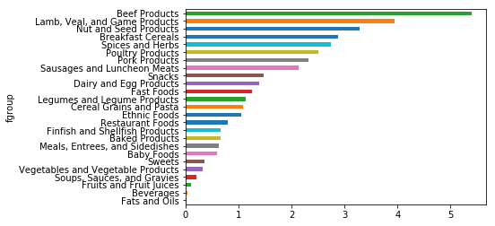

```python
# 数据规整化：清理、转换、合并和重塑
```


```python
from pandas import Series, DataFrame
import pandas as pd
import numpy as np
import matplotlib.pyplot as plt
%matplotlib inline
```


```python
# 数据库风格的DataFrame合并
```


```python
df1 = DataFrame({
    'key': list('bbacaab'),
    'data1': range(7)
})
```


```python
df1
```


<div>
<style scoped>
    .dataframe tbody tr th:only-of-type {
        vertical-align: middle;
    }

    .dataframe tbody tr th {
        vertical-align: top;
    }

    .dataframe thead th {
        text-align: right;
    }
</style>
<table border="1" class="dataframe">
  <thead>
    <tr style="text-align: right;">
      <th></th>
      <th>data1</th>
      <th>key</th>
    </tr>
  </thead>
  <tbody>
    <tr>
      <th>0</th>
      <td>0</td>
      <td>b</td>
    </tr>
    <tr>
      <th>1</th>
      <td>1</td>
      <td>b</td>
    </tr>
    <tr>
      <th>2</th>
      <td>2</td>
      <td>a</td>
    </tr>
    <tr>
      <th>3</th>
      <td>3</td>
      <td>c</td>
    </tr>
    <tr>
      <th>4</th>
      <td>4</td>
      <td>a</td>
    </tr>
    <tr>
      <th>5</th>
      <td>5</td>
      <td>a</td>
    </tr>
    <tr>
      <th>6</th>
      <td>6</td>
      <td>b</td>
    </tr>
  </tbody>
</table>
</div>


```python
df2 = DataFrame({
    'key': list('abd'),
    'data2': range(3)
})
```


```python
df2
```


<div>
<style scoped>
    .dataframe tbody tr th:only-of-type {
        vertical-align: middle;
    }

    .dataframe tbody tr th {
        vertical-align: top;
    }

    .dataframe thead th {
        text-align: right;
    }
</style>
<table border="1" class="dataframe">
  <thead>
    <tr style="text-align: right;">
      <th></th>
      <th>data2</th>
      <th>key</th>
    </tr>
  </thead>
  <tbody>
    <tr>
      <th>0</th>
      <td>0</td>
      <td>a</td>
    </tr>
    <tr>
      <th>1</th>
      <td>1</td>
      <td>b</td>
    </tr>
    <tr>
      <th>2</th>
      <td>2</td>
      <td>d</td>
    </tr>
  </tbody>
</table>
</div>


```python
pd.merge(df1, df2)
```


<div>
<style scoped>
    .dataframe tbody tr th:only-of-type {
        vertical-align: middle;
    }

    .dataframe tbody tr th {
        vertical-align: top;
    }

    .dataframe thead th {
        text-align: right;
    }
</style>
<table border="1" class="dataframe">
  <thead>
    <tr style="text-align: right;">
      <th></th>
      <th>data1</th>
      <th>key</th>
      <th>data2</th>
    </tr>
  </thead>
  <tbody>
    <tr>
      <th>0</th>
      <td>0</td>
      <td>b</td>
      <td>1</td>
    </tr>
    <tr>
      <th>1</th>
      <td>1</td>
      <td>b</td>
      <td>1</td>
    </tr>
    <tr>
      <th>2</th>
      <td>6</td>
      <td>b</td>
      <td>1</td>
    </tr>
    <tr>
      <th>3</th>
      <td>2</td>
      <td>a</td>
      <td>0</td>
    </tr>
    <tr>
      <th>4</th>
      <td>4</td>
      <td>a</td>
      <td>0</td>
    </tr>
    <tr>
      <th>5</th>
      <td>5</td>
      <td>a</td>
      <td>0</td>
    </tr>
  </tbody>
</table>
</div>


```python
pd.merge(df1, df2, on='key')
```


<div>
<style scoped>
    .dataframe tbody tr th:only-of-type {
        vertical-align: middle;
    }

    .dataframe tbody tr th {
        vertical-align: top;
    }

    .dataframe thead th {
        text-align: right;
    }
</style>
<table border="1" class="dataframe">
  <thead>
    <tr style="text-align: right;">
      <th></th>
      <th>data1</th>
      <th>key</th>
      <th>data2</th>
    </tr>
  </thead>
  <tbody>
    <tr>
      <th>0</th>
      <td>0</td>
      <td>b</td>
      <td>1</td>
    </tr>
    <tr>
      <th>1</th>
      <td>1</td>
      <td>b</td>
      <td>1</td>
    </tr>
    <tr>
      <th>2</th>
      <td>6</td>
      <td>b</td>
      <td>1</td>
    </tr>
    <tr>
      <th>3</th>
      <td>2</td>
      <td>a</td>
      <td>0</td>
    </tr>
    <tr>
      <th>4</th>
      <td>4</td>
      <td>a</td>
      <td>0</td>
    </tr>
    <tr>
      <th>5</th>
      <td>5</td>
      <td>a</td>
      <td>0</td>
    </tr>
  </tbody>
</table>
</div>


```python
df3 = DataFrame({
    'lkey': list('bbacaab'),
    'data1': range(7)
})
```


```python
df4 = DataFrame({
    'rkey': list('abd'),
    'data2': range(3)
})
```


```python
df3
```


<div>
<style scoped>
    .dataframe tbody tr th:only-of-type {
        vertical-align: middle;
    }

    .dataframe tbody tr th {
        vertical-align: top;
    }

    .dataframe thead th {
        text-align: right;
    }
</style>
<table border="1" class="dataframe">
  <thead>
    <tr style="text-align: right;">
      <th></th>
      <th>data1</th>
      <th>lkey</th>
    </tr>
  </thead>
  <tbody>
    <tr>
      <th>0</th>
      <td>0</td>
      <td>b</td>
    </tr>
    <tr>
      <th>1</th>
      <td>1</td>
      <td>b</td>
    </tr>
    <tr>
      <th>2</th>
      <td>2</td>
      <td>a</td>
    </tr>
    <tr>
      <th>3</th>
      <td>3</td>
      <td>c</td>
    </tr>
    <tr>
      <th>4</th>
      <td>4</td>
      <td>a</td>
    </tr>
    <tr>
      <th>5</th>
      <td>5</td>
      <td>a</td>
    </tr>
    <tr>
      <th>6</th>
      <td>6</td>
      <td>b</td>
    </tr>
  </tbody>
</table>
</div>


```python
df4
```


<div>
<style scoped>
    .dataframe tbody tr th:only-of-type {
        vertical-align: middle;
    }

    .dataframe tbody tr th {
        vertical-align: top;
    }

    .dataframe thead th {
        text-align: right;
    }
</style>
<table border="1" class="dataframe">
  <thead>
    <tr style="text-align: right;">
      <th></th>
      <th>data2</th>
      <th>rkey</th>
    </tr>
  </thead>
  <tbody>
    <tr>
      <th>0</th>
      <td>0</td>
      <td>a</td>
    </tr>
    <tr>
      <th>1</th>
      <td>1</td>
      <td>b</td>
    </tr>
    <tr>
      <th>2</th>
      <td>2</td>
      <td>d</td>
    </tr>
  </tbody>
</table>
</div>


```python
# 默认情况下，merge做的试“inner”连接；其他还有“left”，”right"以及“outer"连接
pd.merge(df3, df4, left_on='lkey', right_on='rkey')
```


<div>
<style scoped>
    .dataframe tbody tr th:only-of-type {
        vertical-align: middle;
    }

    .dataframe tbody tr th {
        vertical-align: top;
    }

    .dataframe thead th {
        text-align: right;
    }
</style>
<table border="1" class="dataframe">
  <thead>
    <tr style="text-align: right;">
      <th></th>
      <th>data1</th>
      <th>lkey</th>
      <th>data2</th>
      <th>rkey</th>
    </tr>
  </thead>
  <tbody>
    <tr>
      <th>0</th>
      <td>0</td>
      <td>b</td>
      <td>1</td>
      <td>b</td>
    </tr>
    <tr>
      <th>1</th>
      <td>1</td>
      <td>b</td>
      <td>1</td>
      <td>b</td>
    </tr>
    <tr>
      <th>2</th>
      <td>6</td>
      <td>b</td>
      <td>1</td>
      <td>b</td>
    </tr>
    <tr>
      <th>3</th>
      <td>2</td>
      <td>a</td>
      <td>0</td>
      <td>a</td>
    </tr>
    <tr>
      <th>4</th>
      <td>4</td>
      <td>a</td>
      <td>0</td>
      <td>a</td>
    </tr>
    <tr>
      <th>5</th>
      <td>5</td>
      <td>a</td>
      <td>0</td>
      <td>a</td>
    </tr>
  </tbody>
</table>
</div>


```python
pd.merge(df1, df2, how='outer')
```


<div>
<style scoped>
    .dataframe tbody tr th:only-of-type {
        vertical-align: middle;
    }

    .dataframe tbody tr th {
        vertical-align: top;
    }

    .dataframe thead th {
        text-align: right;
    }
</style>
<table border="1" class="dataframe">
  <thead>
    <tr style="text-align: right;">
      <th></th>
      <th>data1</th>
      <th>key</th>
      <th>data2</th>
    </tr>
  </thead>
  <tbody>
    <tr>
      <th>0</th>
      <td>0.0</td>
      <td>b</td>
      <td>1.0</td>
    </tr>
    <tr>
      <th>1</th>
      <td>1.0</td>
      <td>b</td>
      <td>1.0</td>
    </tr>
    <tr>
      <th>2</th>
      <td>6.0</td>
      <td>b</td>
      <td>1.0</td>
    </tr>
    <tr>
      <th>3</th>
      <td>2.0</td>
      <td>a</td>
      <td>0.0</td>
    </tr>
    <tr>
      <th>4</th>
      <td>4.0</td>
      <td>a</td>
      <td>0.0</td>
    </tr>
    <tr>
      <th>5</th>
      <td>5.0</td>
      <td>a</td>
      <td>0.0</td>
    </tr>
    <tr>
      <th>6</th>
      <td>3.0</td>
      <td>c</td>
      <td>NaN</td>
    </tr>
    <tr>
      <th>7</th>
      <td>NaN</td>
      <td>d</td>
      <td>2.0</td>
    </tr>
  </tbody>
</table>
</div>


```python
df1 = DataFrame({
    'key': list('bbacab'),
    'data1': range(6)
})
```


```python
df2 = DataFrame({
    'key': list('ababd'),
    'data2': range(5)
})
```


```python
df1
```


<div>
<style scoped>
    .dataframe tbody tr th:only-of-type {
        vertical-align: middle;
    }

    .dataframe tbody tr th {
        vertical-align: top;
    }

    .dataframe thead th {
        text-align: right;
    }
</style>
<table border="1" class="dataframe">
  <thead>
    <tr style="text-align: right;">
      <th></th>
      <th>data1</th>
      <th>key</th>
    </tr>
  </thead>
  <tbody>
    <tr>
      <th>0</th>
      <td>0</td>
      <td>b</td>
    </tr>
    <tr>
      <th>1</th>
      <td>1</td>
      <td>b</td>
    </tr>
    <tr>
      <th>2</th>
      <td>2</td>
      <td>a</td>
    </tr>
    <tr>
      <th>3</th>
      <td>3</td>
      <td>c</td>
    </tr>
    <tr>
      <th>4</th>
      <td>4</td>
      <td>a</td>
    </tr>
    <tr>
      <th>5</th>
      <td>5</td>
      <td>b</td>
    </tr>
  </tbody>
</table>
</div>


```python
df2
```


<div>
<style scoped>
    .dataframe tbody tr th:only-of-type {
        vertical-align: middle;
    }

    .dataframe tbody tr th {
        vertical-align: top;
    }

    .dataframe thead th {
        text-align: right;
    }
</style>
<table border="1" class="dataframe">
  <thead>
    <tr style="text-align: right;">
      <th></th>
      <th>data2</th>
      <th>key</th>
    </tr>
  </thead>
  <tbody>
    <tr>
      <th>0</th>
      <td>0</td>
      <td>a</td>
    </tr>
    <tr>
      <th>1</th>
      <td>1</td>
      <td>b</td>
    </tr>
    <tr>
      <th>2</th>
      <td>2</td>
      <td>a</td>
    </tr>
    <tr>
      <th>3</th>
      <td>3</td>
      <td>b</td>
    </tr>
    <tr>
      <th>4</th>
      <td>4</td>
      <td>d</td>
    </tr>
  </tbody>
</table>
</div>


```python
pd.merge(df1, df2, on='key', how='left')
```


<div>
<style scoped>
    .dataframe tbody tr th:only-of-type {
        vertical-align: middle;
    }

    .dataframe tbody tr th {
        vertical-align: top;
    }

    .dataframe thead th {
        text-align: right;
    }
</style>
<table border="1" class="dataframe">
  <thead>
    <tr style="text-align: right;">
      <th></th>
      <th>data1</th>
      <th>key</th>
      <th>data2</th>
    </tr>
  </thead>
  <tbody>
    <tr>
      <th>0</th>
      <td>0</td>
      <td>b</td>
      <td>1.0</td>
    </tr>
    <tr>
      <th>1</th>
      <td>0</td>
      <td>b</td>
      <td>3.0</td>
    </tr>
    <tr>
      <th>2</th>
      <td>1</td>
      <td>b</td>
      <td>1.0</td>
    </tr>
    <tr>
      <th>3</th>
      <td>1</td>
      <td>b</td>
      <td>3.0</td>
    </tr>
    <tr>
      <th>4</th>
      <td>2</td>
      <td>a</td>
      <td>0.0</td>
    </tr>
    <tr>
      <th>5</th>
      <td>2</td>
      <td>a</td>
      <td>2.0</td>
    </tr>
    <tr>
      <th>6</th>
      <td>3</td>
      <td>c</td>
      <td>NaN</td>
    </tr>
    <tr>
      <th>7</th>
      <td>4</td>
      <td>a</td>
      <td>0.0</td>
    </tr>
    <tr>
      <th>8</th>
      <td>4</td>
      <td>a</td>
      <td>2.0</td>
    </tr>
    <tr>
      <th>9</th>
      <td>5</td>
      <td>b</td>
      <td>1.0</td>
    </tr>
    <tr>
      <th>10</th>
      <td>5</td>
      <td>b</td>
      <td>3.0</td>
    </tr>
  </tbody>
</table>
</div>


```python
pd.merge(df1, df2, how='inner')
```


<div>
<style scoped>
    .dataframe tbody tr th:only-of-type {
        vertical-align: middle;
    }

    .dataframe tbody tr th {
        vertical-align: top;
    }

    .dataframe thead th {
        text-align: right;
    }
</style>
<table border="1" class="dataframe">
  <thead>
    <tr style="text-align: right;">
      <th></th>
      <th>data1</th>
      <th>key</th>
      <th>data2</th>
    </tr>
  </thead>
  <tbody>
    <tr>
      <th>0</th>
      <td>0</td>
      <td>b</td>
      <td>1</td>
    </tr>
    <tr>
      <th>1</th>
      <td>0</td>
      <td>b</td>
      <td>3</td>
    </tr>
    <tr>
      <th>2</th>
      <td>1</td>
      <td>b</td>
      <td>1</td>
    </tr>
    <tr>
      <th>3</th>
      <td>1</td>
      <td>b</td>
      <td>3</td>
    </tr>
    <tr>
      <th>4</th>
      <td>5</td>
      <td>b</td>
      <td>1</td>
    </tr>
    <tr>
      <th>5</th>
      <td>5</td>
      <td>b</td>
      <td>3</td>
    </tr>
    <tr>
      <th>6</th>
      <td>2</td>
      <td>a</td>
      <td>0</td>
    </tr>
    <tr>
      <th>7</th>
      <td>2</td>
      <td>a</td>
      <td>2</td>
    </tr>
    <tr>
      <th>8</th>
      <td>4</td>
      <td>a</td>
      <td>0</td>
    </tr>
    <tr>
      <th>9</th>
      <td>4</td>
      <td>a</td>
      <td>2</td>
    </tr>
  </tbody>
</table>
</div>


```python
left = DataFrame({
    'key1': ['foo', 'foo', 'bar'],
    'key2': ['one', 'two', 'one'],
    'lval': [1, 2, 3]
})
```


```python
right = DataFrame({
    'key1': ['foo', 'foo', 'bar', 'bar'],
    'key2': ['one', 'one', 'one', 'two'],
    'rval': [4, 5, 6, 7]
})
```


```python
left
```


<div>
<style scoped>
    .dataframe tbody tr th:only-of-type {
        vertical-align: middle;
    }

    .dataframe tbody tr th {
        vertical-align: top;
    }

    .dataframe thead th {
        text-align: right;
    }
</style>
<table border="1" class="dataframe">
  <thead>
    <tr style="text-align: right;">
      <th></th>
      <th>key1</th>
      <th>key2</th>
      <th>lval</th>
    </tr>
  </thead>
  <tbody>
    <tr>
      <th>0</th>
      <td>foo</td>
      <td>one</td>
      <td>1</td>
    </tr>
    <tr>
      <th>1</th>
      <td>foo</td>
      <td>two</td>
      <td>2</td>
    </tr>
    <tr>
      <th>2</th>
      <td>bar</td>
      <td>one</td>
      <td>3</td>
    </tr>
  </tbody>
</table>
</div>


```python
right
```


<div>
<style scoped>
    .dataframe tbody tr th:only-of-type {
        vertical-align: middle;
    }

    .dataframe tbody tr th {
        vertical-align: top;
    }

    .dataframe thead th {
        text-align: right;
    }
</style>
<table border="1" class="dataframe">
  <thead>
    <tr style="text-align: right;">
      <th></th>
      <th>key1</th>
      <th>key2</th>
      <th>rval</th>
    </tr>
  </thead>
  <tbody>
    <tr>
      <th>0</th>
      <td>foo</td>
      <td>one</td>
      <td>4</td>
    </tr>
    <tr>
      <th>1</th>
      <td>foo</td>
      <td>one</td>
      <td>5</td>
    </tr>
    <tr>
      <th>2</th>
      <td>bar</td>
      <td>one</td>
      <td>6</td>
    </tr>
    <tr>
      <th>3</th>
      <td>bar</td>
      <td>two</td>
      <td>7</td>
    </tr>
  </tbody>
</table>
</div>


```python
pd.merge(left, right, on=['key1', 'key2'], how='outer')
```


<div>
<style scoped>
    .dataframe tbody tr th:only-of-type {
        vertical-align: middle;
    }

    .dataframe tbody tr th {
        vertical-align: top;
    }

    .dataframe thead th {
        text-align: right;
    }
</style>
<table border="1" class="dataframe">
  <thead>
    <tr style="text-align: right;">
      <th></th>
      <th>key1</th>
      <th>key2</th>
      <th>lval</th>
      <th>rval</th>
    </tr>
  </thead>
  <tbody>
    <tr>
      <th>0</th>
      <td>foo</td>
      <td>one</td>
      <td>1.0</td>
      <td>4.0</td>
    </tr>
    <tr>
      <th>1</th>
      <td>foo</td>
      <td>one</td>
      <td>1.0</td>
      <td>5.0</td>
    </tr>
    <tr>
      <th>2</th>
      <td>foo</td>
      <td>two</td>
      <td>2.0</td>
      <td>NaN</td>
    </tr>
    <tr>
      <th>3</th>
      <td>bar</td>
      <td>one</td>
      <td>3.0</td>
      <td>6.0</td>
    </tr>
    <tr>
      <th>4</th>
      <td>bar</td>
      <td>two</td>
      <td>NaN</td>
      <td>7.0</td>
    </tr>
  </tbody>
</table>
</div>


```python
pd.merge(left, right, on='key1')
```


<div>
<style scoped>
    .dataframe tbody tr th:only-of-type {
        vertical-align: middle;
    }

    .dataframe tbody tr th {
        vertical-align: top;
    }

    .dataframe thead th {
        text-align: right;
    }
</style>
<table border="1" class="dataframe">
  <thead>
    <tr style="text-align: right;">
      <th></th>
      <th>key1</th>
      <th>key2_x</th>
      <th>lval</th>
      <th>key2_y</th>
      <th>rval</th>
    </tr>
  </thead>
  <tbody>
    <tr>
      <th>0</th>
      <td>foo</td>
      <td>one</td>
      <td>1</td>
      <td>one</td>
      <td>4</td>
    </tr>
    <tr>
      <th>1</th>
      <td>foo</td>
      <td>one</td>
      <td>1</td>
      <td>one</td>
      <td>5</td>
    </tr>
    <tr>
      <th>2</th>
      <td>foo</td>
      <td>two</td>
      <td>2</td>
      <td>one</td>
      <td>4</td>
    </tr>
    <tr>
      <th>3</th>
      <td>foo</td>
      <td>two</td>
      <td>2</td>
      <td>one</td>
      <td>5</td>
    </tr>
    <tr>
      <th>4</th>
      <td>bar</td>
      <td>one</td>
      <td>3</td>
      <td>one</td>
      <td>6</td>
    </tr>
    <tr>
      <th>5</th>
      <td>bar</td>
      <td>one</td>
      <td>3</td>
      <td>two</td>
      <td>7</td>
    </tr>
  </tbody>
</table>
</div>


```python
pd.merge(left, right, on='key1', suffixes=('_left', '_right'))
```


<div>
<style scoped>
    .dataframe tbody tr th:only-of-type {
        vertical-align: middle;
    }

    .dataframe tbody tr th {
        vertical-align: top;
    }

    .dataframe thead th {
        text-align: right;
    }
</style>
<table border="1" class="dataframe">
  <thead>
    <tr style="text-align: right;">
      <th></th>
      <th>key1</th>
      <th>key2_left</th>
      <th>lval</th>
      <th>key2_right</th>
      <th>rval</th>
    </tr>
  </thead>
  <tbody>
    <tr>
      <th>0</th>
      <td>foo</td>
      <td>one</td>
      <td>1</td>
      <td>one</td>
      <td>4</td>
    </tr>
    <tr>
      <th>1</th>
      <td>foo</td>
      <td>one</td>
      <td>1</td>
      <td>one</td>
      <td>5</td>
    </tr>
    <tr>
      <th>2</th>
      <td>foo</td>
      <td>two</td>
      <td>2</td>
      <td>one</td>
      <td>4</td>
    </tr>
    <tr>
      <th>3</th>
      <td>foo</td>
      <td>two</td>
      <td>2</td>
      <td>one</td>
      <td>5</td>
    </tr>
    <tr>
      <th>4</th>
      <td>bar</td>
      <td>one</td>
      <td>3</td>
      <td>one</td>
      <td>6</td>
    </tr>
    <tr>
      <th>5</th>
      <td>bar</td>
      <td>one</td>
      <td>3</td>
      <td>two</td>
      <td>7</td>
    </tr>
  </tbody>
</table>
</div>


```python
# 索引上的合并
```


```python
left1 = DataFrame({
    'key': list('abaabc'),
    'value': range(6)
})
```


```python
left1
```


<div>
<style scoped>
    .dataframe tbody tr th:only-of-type {
        vertical-align: middle;
    }

    .dataframe tbody tr th {
        vertical-align: top;
    }

    .dataframe thead th {
        text-align: right;
    }
</style>
<table border="1" class="dataframe">
  <thead>
    <tr style="text-align: right;">
      <th></th>
      <th>key</th>
      <th>value</th>
    </tr>
  </thead>
  <tbody>
    <tr>
      <th>0</th>
      <td>a</td>
      <td>0</td>
    </tr>
    <tr>
      <th>1</th>
      <td>b</td>
      <td>1</td>
    </tr>
    <tr>
      <th>2</th>
      <td>a</td>
      <td>2</td>
    </tr>
    <tr>
      <th>3</th>
      <td>a</td>
      <td>3</td>
    </tr>
    <tr>
      <th>4</th>
      <td>b</td>
      <td>4</td>
    </tr>
    <tr>
      <th>5</th>
      <td>c</td>
      <td>5</td>
    </tr>
  </tbody>
</table>
</div>


```python
right1 = DataFrame({'group_val': [3.5, 7]}, index=['a', 'b'])
```


```python
right1
```


<div>
<style scoped>
    .dataframe tbody tr th:only-of-type {
        vertical-align: middle;
    }

    .dataframe tbody tr th {
        vertical-align: top;
    }

    .dataframe thead th {
        text-align: right;
    }
</style>
<table border="1" class="dataframe">
  <thead>
    <tr style="text-align: right;">
      <th></th>
      <th>group_val</th>
    </tr>
  </thead>
  <tbody>
    <tr>
      <th>a</th>
      <td>3.5</td>
    </tr>
    <tr>
      <th>b</th>
      <td>7.0</td>
    </tr>
  </tbody>
</table>
</div>


```python
pd.merge(left1, right1, left_on='key', right_index=True)
```


<div>
<style scoped>
    .dataframe tbody tr th:only-of-type {
        vertical-align: middle;
    }

    .dataframe tbody tr th {
        vertical-align: top;
    }

    .dataframe thead th {
        text-align: right;
    }
</style>
<table border="1" class="dataframe">
  <thead>
    <tr style="text-align: right;">
      <th></th>
      <th>key</th>
      <th>value</th>
      <th>group_val</th>
    </tr>
  </thead>
  <tbody>
    <tr>
      <th>0</th>
      <td>a</td>
      <td>0</td>
      <td>3.5</td>
    </tr>
    <tr>
      <th>2</th>
      <td>a</td>
      <td>2</td>
      <td>3.5</td>
    </tr>
    <tr>
      <th>3</th>
      <td>a</td>
      <td>3</td>
      <td>3.5</td>
    </tr>
    <tr>
      <th>1</th>
      <td>b</td>
      <td>1</td>
      <td>7.0</td>
    </tr>
    <tr>
      <th>4</th>
      <td>b</td>
      <td>4</td>
      <td>7.0</td>
    </tr>
  </tbody>
</table>
</div>


```python
pd.merge(left1, right1, left_on='key', right_index=True, how='outer')
```


<div>
<style scoped>
    .dataframe tbody tr th:only-of-type {
        vertical-align: middle;
    }

    .dataframe tbody tr th {
        vertical-align: top;
    }

    .dataframe thead th {
        text-align: right;
    }
</style>
<table border="1" class="dataframe">
  <thead>
    <tr style="text-align: right;">
      <th></th>
      <th>key</th>
      <th>value</th>
      <th>group_val</th>
    </tr>
  </thead>
  <tbody>
    <tr>
      <th>0</th>
      <td>a</td>
      <td>0</td>
      <td>3.5</td>
    </tr>
    <tr>
      <th>2</th>
      <td>a</td>
      <td>2</td>
      <td>3.5</td>
    </tr>
    <tr>
      <th>3</th>
      <td>a</td>
      <td>3</td>
      <td>3.5</td>
    </tr>
    <tr>
      <th>1</th>
      <td>b</td>
      <td>1</td>
      <td>7.0</td>
    </tr>
    <tr>
      <th>4</th>
      <td>b</td>
      <td>4</td>
      <td>7.0</td>
    </tr>
    <tr>
      <th>5</th>
      <td>c</td>
      <td>5</td>
      <td>NaN</td>
    </tr>
  </tbody>
</table>
</div>


```python
lefth = DataFrame({
    'key1': ['Ohio', 'Ohio', 'Ohio', 'Nevada', 'Nevada'],
    'key2': [2000, 2001, 2002, 2001, 2002],
    'data': np.arange(5)
})
```


```python
lefth
```


<div>
<style scoped>
    .dataframe tbody tr th:only-of-type {
        vertical-align: middle;
    }

    .dataframe tbody tr th {
        vertical-align: top;
    }

    .dataframe thead th {
        text-align: right;
    }
</style>
<table border="1" class="dataframe">
  <thead>
    <tr style="text-align: right;">
      <th></th>
      <th>data</th>
      <th>key1</th>
      <th>key2</th>
    </tr>
  </thead>
  <tbody>
    <tr>
      <th>0</th>
      <td>0</td>
      <td>Ohio</td>
      <td>2000</td>
    </tr>
    <tr>
      <th>1</th>
      <td>1</td>
      <td>Ohio</td>
      <td>2001</td>
    </tr>
    <tr>
      <th>2</th>
      <td>2</td>
      <td>Ohio</td>
      <td>2002</td>
    </tr>
    <tr>
      <th>3</th>
      <td>3</td>
      <td>Nevada</td>
      <td>2001</td>
    </tr>
    <tr>
      <th>4</th>
      <td>4</td>
      <td>Nevada</td>
      <td>2002</td>
    </tr>
  </tbody>
</table>
</div>


```python
righth = DataFrame(
    np.arange(12).reshape((6, 2)),
    index=[['Nevada', 'Nevada', 'Ohio', 'Ohio', 'Ohio', 'Ohio'], [2001, 2000, 2000, 2000, 2001, 2002]],
    columns=['event1', 'event2']
)
```


```python
righth
```


<div>
<style scoped>
    .dataframe tbody tr th:only-of-type {
        vertical-align: middle;
    }

    .dataframe tbody tr th {
        vertical-align: top;
    }

    .dataframe thead th {
        text-align: right;
    }
</style>
<table border="1" class="dataframe">
  <thead>
    <tr style="text-align: right;">
      <th></th>
      <th></th>
      <th>event1</th>
      <th>event2</th>
    </tr>
  </thead>
  <tbody>
    <tr>
      <th rowspan="2" valign="top">Nevada</th>
      <th>2001</th>
      <td>0</td>
      <td>1</td>
    </tr>
    <tr>
      <th>2000</th>
      <td>2</td>
      <td>3</td>
    </tr>
    <tr>
      <th rowspan="4" valign="top">Ohio</th>
      <th>2000</th>
      <td>4</td>
      <td>5</td>
    </tr>
    <tr>
      <th>2000</th>
      <td>6</td>
      <td>7</td>
    </tr>
    <tr>
      <th>2001</th>
      <td>8</td>
      <td>9</td>
    </tr>
    <tr>
      <th>2002</th>
      <td>10</td>
      <td>11</td>
    </tr>
  </tbody>
</table>
</div>


```python
pd.merge(lefth, righth, left_on=['key1', 'key2'], right_index=True)
```


<div>
<style scoped>
    .dataframe tbody tr th:only-of-type {
        vertical-align: middle;
    }

    .dataframe tbody tr th {
        vertical-align: top;
    }

    .dataframe thead th {
        text-align: right;
    }
</style>
<table border="1" class="dataframe">
  <thead>
    <tr style="text-align: right;">
      <th></th>
      <th>data</th>
      <th>key1</th>
      <th>key2</th>
      <th>event1</th>
      <th>event2</th>
    </tr>
  </thead>
  <tbody>
    <tr>
      <th>0</th>
      <td>0</td>
      <td>Ohio</td>
      <td>2000</td>
      <td>4</td>
      <td>5</td>
    </tr>
    <tr>
      <th>0</th>
      <td>0</td>
      <td>Ohio</td>
      <td>2000</td>
      <td>6</td>
      <td>7</td>
    </tr>
    <tr>
      <th>1</th>
      <td>1</td>
      <td>Ohio</td>
      <td>2001</td>
      <td>8</td>
      <td>9</td>
    </tr>
    <tr>
      <th>2</th>
      <td>2</td>
      <td>Ohio</td>
      <td>2002</td>
      <td>10</td>
      <td>11</td>
    </tr>
    <tr>
      <th>3</th>
      <td>3</td>
      <td>Nevada</td>
      <td>2001</td>
      <td>0</td>
      <td>1</td>
    </tr>
  </tbody>
</table>
</div>


```python
pd.merge(lefth, righth, left_on=['key1', 'key2'], right_index=True, how='outer')
```


<div>
<style scoped>
    .dataframe tbody tr th:only-of-type {
        vertical-align: middle;
    }

    .dataframe tbody tr th {
        vertical-align: top;
    }

    .dataframe thead th {
        text-align: right;
    }
</style>
<table border="1" class="dataframe">
  <thead>
    <tr style="text-align: right;">
      <th></th>
      <th>data</th>
      <th>key1</th>
      <th>key2</th>
      <th>event1</th>
      <th>event2</th>
    </tr>
  </thead>
  <tbody>
    <tr>
      <th>0</th>
      <td>0.0</td>
      <td>Ohio</td>
      <td>2000</td>
      <td>4.0</td>
      <td>5.0</td>
    </tr>
    <tr>
      <th>0</th>
      <td>0.0</td>
      <td>Ohio</td>
      <td>2000</td>
      <td>6.0</td>
      <td>7.0</td>
    </tr>
    <tr>
      <th>1</th>
      <td>1.0</td>
      <td>Ohio</td>
      <td>2001</td>
      <td>8.0</td>
      <td>9.0</td>
    </tr>
    <tr>
      <th>2</th>
      <td>2.0</td>
      <td>Ohio</td>
      <td>2002</td>
      <td>10.0</td>
      <td>11.0</td>
    </tr>
    <tr>
      <th>3</th>
      <td>3.0</td>
      <td>Nevada</td>
      <td>2001</td>
      <td>0.0</td>
      <td>1.0</td>
    </tr>
    <tr>
      <th>4</th>
      <td>4.0</td>
      <td>Nevada</td>
      <td>2002</td>
      <td>NaN</td>
      <td>NaN</td>
    </tr>
    <tr>
      <th>4</th>
      <td>NaN</td>
      <td>Nevada</td>
      <td>2000</td>
      <td>2.0</td>
      <td>3.0</td>
    </tr>
  </tbody>
</table>
</div>


```python
left2 = DataFrame([[1, 2], [3, 4], [5, 6]], index=['a', 'c', 'e'], columns=['Ohio', 'Nevada'])
```


```python
right2 = DataFrame([[7, 8], [9, 10], [11, 12], [13, 14]], index=['b', 'c', 'd', 'e'], columns=['Missouri', 'Alabama'])
```


```python
left2
```


<div>
<style scoped>
    .dataframe tbody tr th:only-of-type {
        vertical-align: middle;
    }

    .dataframe tbody tr th {
        vertical-align: top;
    }

    .dataframe thead th {
        text-align: right;
    }
</style>
<table border="1" class="dataframe">
  <thead>
    <tr style="text-align: right;">
      <th></th>
      <th>Ohio</th>
      <th>Nevada</th>
    </tr>
  </thead>
  <tbody>
    <tr>
      <th>a</th>
      <td>1</td>
      <td>2</td>
    </tr>
    <tr>
      <th>c</th>
      <td>3</td>
      <td>4</td>
    </tr>
    <tr>
      <th>e</th>
      <td>5</td>
      <td>6</td>
    </tr>
  </tbody>
</table>
</div>


```python
right2
```


<div>
<style scoped>
    .dataframe tbody tr th:only-of-type {
        vertical-align: middle;
    }

    .dataframe tbody tr th {
        vertical-align: top;
    }

    .dataframe thead th {
        text-align: right;
    }
</style>
<table border="1" class="dataframe">
  <thead>
    <tr style="text-align: right;">
      <th></th>
      <th>Missouri</th>
      <th>Alabama</th>
    </tr>
  </thead>
  <tbody>
    <tr>
      <th>b</th>
      <td>7</td>
      <td>8</td>
    </tr>
    <tr>
      <th>c</th>
      <td>9</td>
      <td>10</td>
    </tr>
    <tr>
      <th>d</th>
      <td>11</td>
      <td>12</td>
    </tr>
    <tr>
      <th>e</th>
      <td>13</td>
      <td>14</td>
    </tr>
  </tbody>
</table>
</div>


```python
pd.merge(left2, right2, how='outer', left_index=True, right_index=True)
```


<div>
<style scoped>
    .dataframe tbody tr th:only-of-type {
        vertical-align: middle;
    }

    .dataframe tbody tr th {
        vertical-align: top;
    }

    .dataframe thead th {
        text-align: right;
    }
</style>
<table border="1" class="dataframe">
  <thead>
    <tr style="text-align: right;">
      <th></th>
      <th>Ohio</th>
      <th>Nevada</th>
      <th>Missouri</th>
      <th>Alabama</th>
    </tr>
  </thead>
  <tbody>
    <tr>
      <th>a</th>
      <td>1.0</td>
      <td>2.0</td>
      <td>NaN</td>
      <td>NaN</td>
    </tr>
    <tr>
      <th>b</th>
      <td>NaN</td>
      <td>NaN</td>
      <td>7.0</td>
      <td>8.0</td>
    </tr>
    <tr>
      <th>c</th>
      <td>3.0</td>
      <td>4.0</td>
      <td>9.0</td>
      <td>10.0</td>
    </tr>
    <tr>
      <th>d</th>
      <td>NaN</td>
      <td>NaN</td>
      <td>11.0</td>
      <td>12.0</td>
    </tr>
    <tr>
      <th>e</th>
      <td>5.0</td>
      <td>6.0</td>
      <td>13.0</td>
      <td>14.0</td>
    </tr>
  </tbody>
</table>
</div>


```python
left1
```


<div>
<style scoped>
    .dataframe tbody tr th:only-of-type {
        vertical-align: middle;
    }

    .dataframe tbody tr th {
        vertical-align: top;
    }

    .dataframe thead th {
        text-align: right;
    }
</style>
<table border="1" class="dataframe">
  <thead>
    <tr style="text-align: right;">
      <th></th>
      <th>key</th>
      <th>value</th>
    </tr>
  </thead>
  <tbody>
    <tr>
      <th>0</th>
      <td>a</td>
      <td>0</td>
    </tr>
    <tr>
      <th>1</th>
      <td>b</td>
      <td>1</td>
    </tr>
    <tr>
      <th>2</th>
      <td>a</td>
      <td>2</td>
    </tr>
    <tr>
      <th>3</th>
      <td>a</td>
      <td>3</td>
    </tr>
    <tr>
      <th>4</th>
      <td>b</td>
      <td>4</td>
    </tr>
    <tr>
      <th>5</th>
      <td>c</td>
      <td>5</td>
    </tr>
  </tbody>
</table>
</div>


```python
right1
```


<div>
<style scoped>
    .dataframe tbody tr th:only-of-type {
        vertical-align: middle;
    }

    .dataframe tbody tr th {
        vertical-align: top;
    }

    .dataframe thead th {
        text-align: right;
    }
</style>
<table border="1" class="dataframe">
  <thead>
    <tr style="text-align: right;">
      <th></th>
      <th>group_val</th>
    </tr>
  </thead>
  <tbody>
    <tr>
      <th>a</th>
      <td>3.5</td>
    </tr>
    <tr>
      <th>b</th>
      <td>7.0</td>
    </tr>
  </tbody>
</table>
</div>


```python
left1.join(right1, on='key')
```


<div>
<style scoped>
    .dataframe tbody tr th:only-of-type {
        vertical-align: middle;
    }

    .dataframe tbody tr th {
        vertical-align: top;
    }

    .dataframe thead th {
        text-align: right;
    }
</style>
<table border="1" class="dataframe">
  <thead>
    <tr style="text-align: right;">
      <th></th>
      <th>key</th>
      <th>value</th>
      <th>group_val</th>
    </tr>
  </thead>
  <tbody>
    <tr>
      <th>0</th>
      <td>a</td>
      <td>0</td>
      <td>3.5</td>
    </tr>
    <tr>
      <th>1</th>
      <td>b</td>
      <td>1</td>
      <td>7.0</td>
    </tr>
    <tr>
      <th>2</th>
      <td>a</td>
      <td>2</td>
      <td>3.5</td>
    </tr>
    <tr>
      <th>3</th>
      <td>a</td>
      <td>3</td>
      <td>3.5</td>
    </tr>
    <tr>
      <th>4</th>
      <td>b</td>
      <td>4</td>
      <td>7.0</td>
    </tr>
    <tr>
      <th>5</th>
      <td>c</td>
      <td>5</td>
      <td>NaN</td>
    </tr>
  </tbody>
</table>
</div>


```python
another = DataFrame([[7, 8], [9, 10], [11, 12], [16, 17]], index=['a', 'c', 'e', 'f'], columns=['New York', 'Oregon'])
```


```python
another
```


<div>
<style scoped>
    .dataframe tbody tr th:only-of-type {
        vertical-align: middle;
    }

    .dataframe tbody tr th {
        vertical-align: top;
    }

    .dataframe thead th {
        text-align: right;
    }
</style>
<table border="1" class="dataframe">
  <thead>
    <tr style="text-align: right;">
      <th></th>
      <th>New York</th>
      <th>Oregon</th>
    </tr>
  </thead>
  <tbody>
    <tr>
      <th>a</th>
      <td>7</td>
      <td>8</td>
    </tr>
    <tr>
      <th>c</th>
      <td>9</td>
      <td>10</td>
    </tr>
    <tr>
      <th>e</th>
      <td>11</td>
      <td>12</td>
    </tr>
    <tr>
      <th>f</th>
      <td>16</td>
      <td>17</td>
    </tr>
  </tbody>
</table>
</div>


```python
left2.join([right2, another])
```


<div>
<style scoped>
    .dataframe tbody tr th:only-of-type {
        vertical-align: middle;
    }

    .dataframe tbody tr th {
        vertical-align: top;
    }

    .dataframe thead th {
        text-align: right;
    }
</style>
<table border="1" class="dataframe">
  <thead>
    <tr style="text-align: right;">
      <th></th>
      <th>Ohio</th>
      <th>Nevada</th>
      <th>Missouri</th>
      <th>Alabama</th>
      <th>New York</th>
      <th>Oregon</th>
    </tr>
  </thead>
  <tbody>
    <tr>
      <th>a</th>
      <td>1</td>
      <td>2</td>
      <td>NaN</td>
      <td>NaN</td>
      <td>7</td>
      <td>8</td>
    </tr>
    <tr>
      <th>c</th>
      <td>3</td>
      <td>4</td>
      <td>9.0</td>
      <td>10.0</td>
      <td>9</td>
      <td>10</td>
    </tr>
    <tr>
      <th>e</th>
      <td>5</td>
      <td>6</td>
      <td>13.0</td>
      <td>14.0</td>
      <td>11</td>
      <td>12</td>
    </tr>
  </tbody>
</table>
</div>


```python
left2.join([right2, another], how='outer')
```


<div>
<style scoped>
    .dataframe tbody tr th:only-of-type {
        vertical-align: middle;
    }

    .dataframe tbody tr th {
        vertical-align: top;
    }

    .dataframe thead th {
        text-align: right;
    }
</style>
<table border="1" class="dataframe">
  <thead>
    <tr style="text-align: right;">
      <th></th>
      <th>Ohio</th>
      <th>Nevada</th>
      <th>Missouri</th>
      <th>Alabama</th>
      <th>New York</th>
      <th>Oregon</th>
    </tr>
  </thead>
  <tbody>
    <tr>
      <th>a</th>
      <td>1.0</td>
      <td>2.0</td>
      <td>NaN</td>
      <td>NaN</td>
      <td>7.0</td>
      <td>8.0</td>
    </tr>
    <tr>
      <th>b</th>
      <td>NaN</td>
      <td>NaN</td>
      <td>7.0</td>
      <td>8.0</td>
      <td>NaN</td>
      <td>NaN</td>
    </tr>
    <tr>
      <th>c</th>
      <td>3.0</td>
      <td>4.0</td>
      <td>9.0</td>
      <td>10.0</td>
      <td>9.0</td>
      <td>10.0</td>
    </tr>
    <tr>
      <th>d</th>
      <td>NaN</td>
      <td>NaN</td>
      <td>11.0</td>
      <td>12.0</td>
      <td>NaN</td>
      <td>NaN</td>
    </tr>
    <tr>
      <th>e</th>
      <td>5.0</td>
      <td>6.0</td>
      <td>13.0</td>
      <td>14.0</td>
      <td>11.0</td>
      <td>12.0</td>
    </tr>
    <tr>
      <th>f</th>
      <td>NaN</td>
      <td>NaN</td>
      <td>NaN</td>
      <td>NaN</td>
      <td>16.0</td>
      <td>17.0</td>
    </tr>
  </tbody>
</table>
</div>


```python
# 轴向连接
```


```python
arr = np.arange(12).reshape((3, 4))
```


```python
arr
```


    array([[ 0,  1,  2,  3],
           [ 4,  5,  6,  7],
           [ 8,  9, 10, 11]])


```python
np.concatenate([arr, arr], axis=1)
```


    array([[ 0,  1,  2,  3,  0,  1,  2,  3],
           [ 4,  5,  6,  7,  4,  5,  6,  7],
           [ 8,  9, 10, 11,  8,  9, 10, 11]])


```python
s1 = Series([0, 1], index=['a', 'b'])
```


```python
s1
```


    a    0
    b    1
    dtype: int64


```python
s2 = Series([2, 3, 4], index=['c', 'd', 'e'])
```


```python
s2
```


    c    2
    d    3
    e    4
    dtype: int64


```python
s3 = Series([5, 6], index=['f', 'g'])
```


```python
s3
```


    f    5
    g    6
    dtype: int64


```python
# pd.concat([s1, s3, s3], axis=0)
pd.concat([s1, s2, s3])
```


    a    0
    b    1
    c    2
    d    3
    e    4
    f    5
    g    6
    dtype: int64


```python
pd.concat([s1, s2, s3], axis=1)
```


<div>
<style scoped>
    .dataframe tbody tr th:only-of-type {
        vertical-align: middle;
    }

    .dataframe tbody tr th {
        vertical-align: top;
    }

    .dataframe thead th {
        text-align: right;
    }
</style>
<table border="1" class="dataframe">
  <thead>
    <tr style="text-align: right;">
      <th></th>
      <th>0</th>
      <th>1</th>
      <th>2</th>
    </tr>
  </thead>
  <tbody>
    <tr>
      <th>a</th>
      <td>0.0</td>
      <td>NaN</td>
      <td>NaN</td>
    </tr>
    <tr>
      <th>b</th>
      <td>1.0</td>
      <td>NaN</td>
      <td>NaN</td>
    </tr>
    <tr>
      <th>c</th>
      <td>NaN</td>
      <td>2.0</td>
      <td>NaN</td>
    </tr>
    <tr>
      <th>d</th>
      <td>NaN</td>
      <td>3.0</td>
      <td>NaN</td>
    </tr>
    <tr>
      <th>e</th>
      <td>NaN</td>
      <td>4.0</td>
      <td>NaN</td>
    </tr>
    <tr>
      <th>f</th>
      <td>NaN</td>
      <td>NaN</td>
      <td>5.0</td>
    </tr>
    <tr>
      <th>g</th>
      <td>NaN</td>
      <td>NaN</td>
      <td>6.0</td>
    </tr>
  </tbody>
</table>
</div>


```python
s4 = pd.concat([s1 * 5, s3])
```


```python
s4
```


    a    0
    b    5
    f    5
    g    6
    dtype: int64


```python
pd.concat([s1, s4], axis=1)
```


<div>
<style scoped>
    .dataframe tbody tr th:only-of-type {
        vertical-align: middle;
    }

    .dataframe tbody tr th {
        vertical-align: top;
    }

    .dataframe thead th {
        text-align: right;
    }
</style>
<table border="1" class="dataframe">
  <thead>
    <tr style="text-align: right;">
      <th></th>
      <th>0</th>
      <th>1</th>
    </tr>
  </thead>
  <tbody>
    <tr>
      <th>a</th>
      <td>0.0</td>
      <td>0</td>
    </tr>
    <tr>
      <th>b</th>
      <td>1.0</td>
      <td>5</td>
    </tr>
    <tr>
      <th>f</th>
      <td>NaN</td>
      <td>5</td>
    </tr>
    <tr>
      <th>g</th>
      <td>NaN</td>
      <td>6</td>
    </tr>
  </tbody>
</table>
</div>


```python
pd.concat([s1, s4], axis=1, join='inner')
```


<div>
<style scoped>
    .dataframe tbody tr th:only-of-type {
        vertical-align: middle;
    }

    .dataframe tbody tr th {
        vertical-align: top;
    }

    .dataframe thead th {
        text-align: right;
    }
</style>
<table border="1" class="dataframe">
  <thead>
    <tr style="text-align: right;">
      <th></th>
      <th>0</th>
      <th>1</th>
    </tr>
  </thead>
  <tbody>
    <tr>
      <th>a</th>
      <td>0</td>
      <td>0</td>
    </tr>
    <tr>
      <th>b</th>
      <td>1</td>
      <td>5</td>
    </tr>
  </tbody>
</table>
</div>


```python
pd.concat([s1, s4], axis=1, join_axes=[['a', 'c', 'b', 'e']])
```


<div>
<style scoped>
    .dataframe tbody tr th:only-of-type {
        vertical-align: middle;
    }

    .dataframe tbody tr th {
        vertical-align: top;
    }

    .dataframe thead th {
        text-align: right;
    }
</style>
<table border="1" class="dataframe">
  <thead>
    <tr style="text-align: right;">
      <th></th>
      <th>0</th>
      <th>1</th>
    </tr>
  </thead>
  <tbody>
    <tr>
      <th>a</th>
      <td>0.0</td>
      <td>0.0</td>
    </tr>
    <tr>
      <th>c</th>
      <td>NaN</td>
      <td>NaN</td>
    </tr>
    <tr>
      <th>b</th>
      <td>1.0</td>
      <td>5.0</td>
    </tr>
    <tr>
      <th>e</th>
      <td>NaN</td>
      <td>NaN</td>
    </tr>
  </tbody>
</table>
</div>


```python
# 连接轴上创建一个层次化索引
```


```python
result = pd.concat([s1, s1, s3], keys=['one', 'two', 'three'])
```


```python
result
```


    one    a    0
           b    1
    two    a    0
           b    1
    three  f    5
           g    6
    dtype: int64


```python
result.unstack()
```


<div>
<style scoped>
    .dataframe tbody tr th:only-of-type {
        vertical-align: middle;
    }

    .dataframe tbody tr th {
        vertical-align: top;
    }

    .dataframe thead th {
        text-align: right;
    }
</style>
<table border="1" class="dataframe">
  <thead>
    <tr style="text-align: right;">
      <th></th>
      <th>a</th>
      <th>b</th>
      <th>f</th>
      <th>g</th>
    </tr>
  </thead>
  <tbody>
    <tr>
      <th>one</th>
      <td>0.0</td>
      <td>1.0</td>
      <td>NaN</td>
      <td>NaN</td>
    </tr>
    <tr>
      <th>two</th>
      <td>0.0</td>
      <td>1.0</td>
      <td>NaN</td>
      <td>NaN</td>
    </tr>
    <tr>
      <th>three</th>
      <td>NaN</td>
      <td>NaN</td>
      <td>5.0</td>
      <td>6.0</td>
    </tr>
  </tbody>
</table>
</div>


```python
# 如果沿着axis=1对Series进行合并，则keys就会成为DataFrame的列头
```


```python
pd.concat([s1, s2, s3], axis=1, keys=['one', 'two', 'three'])
```


<div>
<style scoped>
    .dataframe tbody tr th:only-of-type {
        vertical-align: middle;
    }

    .dataframe tbody tr th {
        vertical-align: top;
    }

    .dataframe thead th {
        text-align: right;
    }
</style>
<table border="1" class="dataframe">
  <thead>
    <tr style="text-align: right;">
      <th></th>
      <th>one</th>
      <th>two</th>
      <th>three</th>
    </tr>
  </thead>
  <tbody>
    <tr>
      <th>a</th>
      <td>0.0</td>
      <td>NaN</td>
      <td>NaN</td>
    </tr>
    <tr>
      <th>b</th>
      <td>1.0</td>
      <td>NaN</td>
      <td>NaN</td>
    </tr>
    <tr>
      <th>c</th>
      <td>NaN</td>
      <td>2.0</td>
      <td>NaN</td>
    </tr>
    <tr>
      <th>d</th>
      <td>NaN</td>
      <td>3.0</td>
      <td>NaN</td>
    </tr>
    <tr>
      <th>e</th>
      <td>NaN</td>
      <td>4.0</td>
      <td>NaN</td>
    </tr>
    <tr>
      <th>f</th>
      <td>NaN</td>
      <td>NaN</td>
      <td>5.0</td>
    </tr>
    <tr>
      <th>g</th>
      <td>NaN</td>
      <td>NaN</td>
      <td>6.0</td>
    </tr>
  </tbody>
</table>
</div>


```python
# 同样的逻辑对DataFrame对象也是一样
```


```python
df1 = DataFrame(np.arange(6).reshape(3, 2), index=['a', 'b', 'c'], columns=['one', 'two'])
```


```python
df1
```


<div>
<style scoped>
    .dataframe tbody tr th:only-of-type {
        vertical-align: middle;
    }

    .dataframe tbody tr th {
        vertical-align: top;
    }

    .dataframe thead th {
        text-align: right;
    }
</style>
<table border="1" class="dataframe">
  <thead>
    <tr style="text-align: right;">
      <th></th>
      <th>one</th>
      <th>two</th>
    </tr>
  </thead>
  <tbody>
    <tr>
      <th>a</th>
      <td>0</td>
      <td>1</td>
    </tr>
    <tr>
      <th>b</th>
      <td>2</td>
      <td>3</td>
    </tr>
    <tr>
      <th>c</th>
      <td>4</td>
      <td>5</td>
    </tr>
  </tbody>
</table>
</div>


```python
df2 = DataFrame(5 + np.arange(4).reshape(2, 2), index=['a', 'c'], columns=['three', 'four'])
```


```python
df2
```


<div>
<style scoped>
    .dataframe tbody tr th:only-of-type {
        vertical-align: middle;
    }

    .dataframe tbody tr th {
        vertical-align: top;
    }

    .dataframe thead th {
        text-align: right;
    }
</style>
<table border="1" class="dataframe">
  <thead>
    <tr style="text-align: right;">
      <th></th>
      <th>three</th>
      <th>four</th>
    </tr>
  </thead>
  <tbody>
    <tr>
      <th>a</th>
      <td>5</td>
      <td>6</td>
    </tr>
    <tr>
      <th>c</th>
      <td>7</td>
      <td>8</td>
    </tr>
  </tbody>
</table>
</div>


```python
pd.concat([df1, df2], axis=1, keys=['level1', 'level2'])
```


<div>
<style scoped>
    .dataframe tbody tr th:only-of-type {
        vertical-align: middle;
    }

    .dataframe tbody tr th {
        vertical-align: top;
    }

    .dataframe thead tr th {
        text-align: left;
    }
</style>
<table border="1" class="dataframe">
  <thead>
    <tr>
      <th></th>
      <th colspan="2" halign="left">level1</th>
      <th colspan="2" halign="left">level2</th>
    </tr>
    <tr>
      <th></th>
      <th>one</th>
      <th>two</th>
      <th>three</th>
      <th>four</th>
    </tr>
  </thead>
  <tbody>
    <tr>
      <th>a</th>
      <td>0</td>
      <td>1</td>
      <td>5.0</td>
      <td>6.0</td>
    </tr>
    <tr>
      <th>b</th>
      <td>2</td>
      <td>3</td>
      <td>NaN</td>
      <td>NaN</td>
    </tr>
    <tr>
      <th>c</th>
      <td>4</td>
      <td>5</td>
      <td>7.0</td>
      <td>8.0</td>
    </tr>
  </tbody>
</table>
</div>


```python
# 层次化索引/列头命名
pd.concat([df1, df2], axis=1, keys=['level1', 'level2'], names=['upper', 'lower'])
```


<div>
<style scoped>
    .dataframe tbody tr th:only-of-type {
        vertical-align: middle;
    }

    .dataframe tbody tr th {
        vertical-align: top;
    }

    .dataframe thead tr th {
        text-align: left;
    }
</style>
<table border="1" class="dataframe">
  <thead>
    <tr>
      <th>upper</th>
      <th colspan="2" halign="left">level1</th>
      <th colspan="2" halign="left">level2</th>
    </tr>
    <tr>
      <th>lower</th>
      <th>one</th>
      <th>two</th>
      <th>three</th>
      <th>four</th>
    </tr>
  </thead>
  <tbody>
    <tr>
      <th>a</th>
      <td>0</td>
      <td>1</td>
      <td>5.0</td>
      <td>6.0</td>
    </tr>
    <tr>
      <th>b</th>
      <td>2</td>
      <td>3</td>
      <td>NaN</td>
      <td>NaN</td>
    </tr>
    <tr>
      <th>c</th>
      <td>4</td>
      <td>5</td>
      <td>7.0</td>
      <td>8.0</td>
    </tr>
  </tbody>
</table>
</div>


```python
df1 = DataFrame(np.random.randn(3, 4), columns=['a', 'b', 'c', 'd'])
```


```python
df1
```


<div>
<style scoped>
    .dataframe tbody tr th:only-of-type {
        vertical-align: middle;
    }

    .dataframe tbody tr th {
        vertical-align: top;
    }

    .dataframe thead th {
        text-align: right;
    }
</style>
<table border="1" class="dataframe">
  <thead>
    <tr style="text-align: right;">
      <th></th>
      <th>a</th>
      <th>b</th>
      <th>c</th>
      <th>d</th>
    </tr>
  </thead>
  <tbody>
    <tr>
      <th>0</th>
      <td>-0.218325</td>
      <td>0.366215</td>
      <td>-1.401107</td>
      <td>0.035596</td>
    </tr>
    <tr>
      <th>1</th>
      <td>-1.587783</td>
      <td>1.853612</td>
      <td>-1.191941</td>
      <td>0.937668</td>
    </tr>
    <tr>
      <th>2</th>
      <td>-0.324950</td>
      <td>0.787451</td>
      <td>-0.647613</td>
      <td>0.895841</td>
    </tr>
  </tbody>
</table>
</div>


```python
df2 = DataFrame(np.random.randn(2, 3), columns=['b', 'd', 'a'])
```


```python
df2
```


<div>
<style scoped>
    .dataframe tbody tr th:only-of-type {
        vertical-align: middle;
    }

    .dataframe tbody tr th {
        vertical-align: top;
    }

    .dataframe thead th {
        text-align: right;
    }
</style>
<table border="1" class="dataframe">
  <thead>
    <tr style="text-align: right;">
      <th></th>
      <th>b</th>
      <th>d</th>
      <th>a</th>
    </tr>
  </thead>
  <tbody>
    <tr>
      <th>0</th>
      <td>-1.607702</td>
      <td>-1.269048</td>
      <td>0.651419</td>
    </tr>
    <tr>
      <th>1</th>
      <td>0.668469</td>
      <td>-0.342647</td>
      <td>0.378401</td>
    </tr>
  </tbody>
</table>
</div>


```python
pd.concat([df1, df2], ignore_index=True)
```


<div>
<style scoped>
    .dataframe tbody tr th:only-of-type {
        vertical-align: middle;
    }

    .dataframe tbody tr th {
        vertical-align: top;
    }

    .dataframe thead th {
        text-align: right;
    }
</style>
<table border="1" class="dataframe">
  <thead>
    <tr style="text-align: right;">
      <th></th>
      <th>a</th>
      <th>b</th>
      <th>c</th>
      <th>d</th>
    </tr>
  </thead>
  <tbody>
    <tr>
      <th>0</th>
      <td>-0.218325</td>
      <td>0.366215</td>
      <td>-1.401107</td>
      <td>0.035596</td>
    </tr>
    <tr>
      <th>1</th>
      <td>-1.587783</td>
      <td>1.853612</td>
      <td>-1.191941</td>
      <td>0.937668</td>
    </tr>
    <tr>
      <th>2</th>
      <td>-0.324950</td>
      <td>0.787451</td>
      <td>-0.647613</td>
      <td>0.895841</td>
    </tr>
    <tr>
      <th>3</th>
      <td>0.651419</td>
      <td>-1.607702</td>
      <td>NaN</td>
      <td>-1.269048</td>
    </tr>
    <tr>
      <th>4</th>
      <td>0.378401</td>
      <td>0.668469</td>
      <td>NaN</td>
      <td>-0.342647</td>
    </tr>
  </tbody>
</table>
</div>


```python
pd.concat([df1, df2], ignore_index=False)
```


<div>
<style scoped>
    .dataframe tbody tr th:only-of-type {
        vertical-align: middle;
    }

    .dataframe tbody tr th {
        vertical-align: top;
    }

    .dataframe thead th {
        text-align: right;
    }
</style>
<table border="1" class="dataframe">
  <thead>
    <tr style="text-align: right;">
      <th></th>
      <th>a</th>
      <th>b</th>
      <th>c</th>
      <th>d</th>
    </tr>
  </thead>
  <tbody>
    <tr>
      <th>0</th>
      <td>-0.218325</td>
      <td>0.366215</td>
      <td>-1.401107</td>
      <td>0.035596</td>
    </tr>
    <tr>
      <th>1</th>
      <td>-1.587783</td>
      <td>1.853612</td>
      <td>-1.191941</td>
      <td>0.937668</td>
    </tr>
    <tr>
      <th>2</th>
      <td>-0.324950</td>
      <td>0.787451</td>
      <td>-0.647613</td>
      <td>0.895841</td>
    </tr>
    <tr>
      <th>0</th>
      <td>0.651419</td>
      <td>-1.607702</td>
      <td>NaN</td>
      <td>-1.269048</td>
    </tr>
    <tr>
      <th>1</th>
      <td>0.378401</td>
      <td>0.668469</td>
      <td>NaN</td>
      <td>-0.342647</td>
    </tr>
  </tbody>
</table>
</div>


```python
# 合并重叠数据
```


```python
a = Series([np.nan, 2.5, np.nan, 3.5, 4.5, np.nan], index=['f', 'e', 'd', 'c', 'b', 'a'])
```


```python
a
```


    f    NaN
    e    2.5
    d    NaN
    c    3.5
    b    4.5
    a    NaN
    dtype: float64


```python
b = Series(np.arange(len(a), dtype=np.float64), index=['f', 'e', 'd', 'c', 'b', 'a'])
```


```python
b
```


    f    0.0
    e    1.0
    d    2.0
    c    3.0
    b    4.0
    a    5.0
    dtype: float64


```python
b[-1] = np.nan
```


```python
# if-else: if pd.isnull[i] == True then b[i] else a[i]
np.where(pd.isnull(a), b, a)
```


    array([0. , 2.5, 2. , 3.5, 4.5, nan])


```python
pd.isnull(a)
```


    f     True
    e    False
    d     True
    c    False
    b    False
    a     True
    dtype: bool


```python
b[:-2].combine_first(a[2:])
```


    a    NaN
    b    4.5
    c    3.0
    d    2.0
    e    1.0
    f    0.0
    dtype: float64


```python
b[:-2]
```


    f    0.0
    e    1.0
    d    2.0
    c    3.0
    dtype: float64


```python
a[2:]
```


    d    NaN
    c    3.5
    b    4.5
    a    NaN
    dtype: float64


```python
# 对于DataFrame，combine_first自然也会在列上做同样的事情，因此你可以将其看作：用参数对象中的数据为调用者对象的缺失数据“打补丁”
```


```python
df1 = DataFrame({
    'a': [1., np.nan, 5., np.nan],
    'b': [np.nan, 2., np.nan, 6.],
    'c': range(2, 18, 4)
})
```


```python
df1
```


<div>
<style scoped>
    .dataframe tbody tr th:only-of-type {
        vertical-align: middle;
    }

    .dataframe tbody tr th {
        vertical-align: top;
    }

    .dataframe thead th {
        text-align: right;
    }
</style>
<table border="1" class="dataframe">
  <thead>
    <tr style="text-align: right;">
      <th></th>
      <th>a</th>
      <th>b</th>
      <th>c</th>
    </tr>
  </thead>
  <tbody>
    <tr>
      <th>0</th>
      <td>1.0</td>
      <td>NaN</td>
      <td>2</td>
    </tr>
    <tr>
      <th>1</th>
      <td>NaN</td>
      <td>2.0</td>
      <td>6</td>
    </tr>
    <tr>
      <th>2</th>
      <td>5.0</td>
      <td>NaN</td>
      <td>10</td>
    </tr>
    <tr>
      <th>3</th>
      <td>NaN</td>
      <td>6.0</td>
      <td>14</td>
    </tr>
  </tbody>
</table>
</div>


```python
df2 = DataFrame({
    'a': [5., 4., np.nan, 3., 7.],
    'b': [np.nan, 3., 4., 6., 8.]
})
```


```python
df2
```


<div>
<style scoped>
    .dataframe tbody tr th:only-of-type {
        vertical-align: middle;
    }

    .dataframe tbody tr th {
        vertical-align: top;
    }

    .dataframe thead th {
        text-align: right;
    }
</style>
<table border="1" class="dataframe">
  <thead>
    <tr style="text-align: right;">
      <th></th>
      <th>a</th>
      <th>b</th>
    </tr>
  </thead>
  <tbody>
    <tr>
      <th>0</th>
      <td>5.0</td>
      <td>NaN</td>
    </tr>
    <tr>
      <th>1</th>
      <td>4.0</td>
      <td>3.0</td>
    </tr>
    <tr>
      <th>2</th>
      <td>NaN</td>
      <td>4.0</td>
    </tr>
    <tr>
      <th>3</th>
      <td>3.0</td>
      <td>6.0</td>
    </tr>
    <tr>
      <th>4</th>
      <td>7.0</td>
      <td>8.0</td>
    </tr>
  </tbody>
</table>
</div>


```python
df1.combine_first(df2)
```


<div>
<style scoped>
    .dataframe tbody tr th:only-of-type {
        vertical-align: middle;
    }

    .dataframe tbody tr th {
        vertical-align: top;
    }

    .dataframe thead th {
        text-align: right;
    }
</style>
<table border="1" class="dataframe">
  <thead>
    <tr style="text-align: right;">
      <th></th>
      <th>a</th>
      <th>b</th>
      <th>c</th>
    </tr>
  </thead>
  <tbody>
    <tr>
      <th>0</th>
      <td>1.0</td>
      <td>NaN</td>
      <td>2.0</td>
    </tr>
    <tr>
      <th>1</th>
      <td>4.0</td>
      <td>2.0</td>
      <td>6.0</td>
    </tr>
    <tr>
      <th>2</th>
      <td>5.0</td>
      <td>4.0</td>
      <td>10.0</td>
    </tr>
    <tr>
      <th>3</th>
      <td>3.0</td>
      <td>6.0</td>
      <td>14.0</td>
    </tr>
    <tr>
      <th>4</th>
      <td>7.0</td>
      <td>8.0</td>
      <td>NaN</td>
    </tr>
  </tbody>
</table>
</div>


## 重塑和轴向旋转
有许多用于重新排列表格型数据的基础运算，这些函数也称作重塑（reshape）或轴向旋转（pivot）运算。

### 重塑层次化索引
层次化索引为DataFrame数据的重排任务提供了一种具有良好一致性的方式，主要功能有二：
* stack：将数据的列旋转为行
* unstack：将数据的行旋转为列


```python
data = DataFrame(
    np.arange(6).reshape(2, 3), index=pd.Index(['Ohio', 'Colorado'], name='state'),
    columns=pd.Index(['one', 'two', 'three'], name='number')
)
```


```python
data
```


<div>
<style scoped>
    .dataframe tbody tr th:only-of-type {
        vertical-align: middle;
    }

    .dataframe tbody tr th {
        vertical-align: top;
    }

    .dataframe thead th {
        text-align: right;
    }
</style>
<table border="1" class="dataframe">
  <thead>
    <tr style="text-align: right;">
      <th>number</th>
      <th>one</th>
      <th>two</th>
      <th>three</th>
    </tr>
    <tr>
      <th>state</th>
      <th></th>
      <th></th>
      <th></th>
    </tr>
  </thead>
  <tbody>
    <tr>
      <th>Ohio</th>
      <td>0</td>
      <td>1</td>
      <td>2</td>
    </tr>
    <tr>
      <th>Colorado</th>
      <td>3</td>
      <td>4</td>
      <td>5</td>
    </tr>
  </tbody>
</table>
</div>


```python
# 使用该数据的stack方法即可将列转换为行，得到一个Series
result = data.stack()
```


```python
result
```


    state     number
    Ohio      one       0
              two       1
              three     2
    Colorado  one       3
              two       4
              three     5
    dtype: int32


```python
# 对于一个层次化索引Series，你可以用unstack将其重排为一个DataFrame
```


```python
result.unstack()
```


<div>
<style scoped>
    .dataframe tbody tr th:only-of-type {
        vertical-align: middle;
    }

    .dataframe tbody tr th {
        vertical-align: top;
    }

    .dataframe thead th {
        text-align: right;
    }
</style>
<table border="1" class="dataframe">
  <thead>
    <tr style="text-align: right;">
      <th>number</th>
      <th>one</th>
      <th>two</th>
      <th>three</th>
    </tr>
    <tr>
      <th>state</th>
      <th></th>
      <th></th>
      <th></th>
    </tr>
  </thead>
  <tbody>
    <tr>
      <th>Ohio</th>
      <td>0</td>
      <td>1</td>
      <td>2</td>
    </tr>
    <tr>
      <th>Colorado</th>
      <td>3</td>
      <td>4</td>
      <td>5</td>
    </tr>
  </tbody>
</table>
</div>


```python
# 默认情况下，unstack操作的是最内层（stack也是如此）,传入分层级别的编号或名称即可对其他级别进行unstack操作
```


```python
result.unstack(0)
```


<div>
<style scoped>
    .dataframe tbody tr th:only-of-type {
        vertical-align: middle;
    }

    .dataframe tbody tr th {
        vertical-align: top;
    }

    .dataframe thead th {
        text-align: right;
    }
</style>
<table border="1" class="dataframe">
  <thead>
    <tr style="text-align: right;">
      <th>state</th>
      <th>Ohio</th>
      <th>Colorado</th>
    </tr>
    <tr>
      <th>number</th>
      <th></th>
      <th></th>
    </tr>
  </thead>
  <tbody>
    <tr>
      <th>one</th>
      <td>0</td>
      <td>3</td>
    </tr>
    <tr>
      <th>two</th>
      <td>1</td>
      <td>4</td>
    </tr>
    <tr>
      <th>three</th>
      <td>2</td>
      <td>5</td>
    </tr>
  </tbody>
</table>
</div>


```python
result.unstack('state')
```


<div>
<style scoped>
    .dataframe tbody tr th:only-of-type {
        vertical-align: middle;
    }

    .dataframe tbody tr th {
        vertical-align: top;
    }

    .dataframe thead th {
        text-align: right;
    }
</style>
<table border="1" class="dataframe">
  <thead>
    <tr style="text-align: right;">
      <th>state</th>
      <th>Ohio</th>
      <th>Colorado</th>
    </tr>
    <tr>
      <th>number</th>
      <th></th>
      <th></th>
    </tr>
  </thead>
  <tbody>
    <tr>
      <th>one</th>
      <td>0</td>
      <td>3</td>
    </tr>
    <tr>
      <th>two</th>
      <td>1</td>
      <td>4</td>
    </tr>
    <tr>
      <th>three</th>
      <td>2</td>
      <td>5</td>
    </tr>
  </tbody>
</table>
</div>


```python
result.unstack('number')
```


<div>
<style scoped>
    .dataframe tbody tr th:only-of-type {
        vertical-align: middle;
    }

    .dataframe tbody tr th {
        vertical-align: top;
    }

    .dataframe thead th {
        text-align: right;
    }
</style>
<table border="1" class="dataframe">
  <thead>
    <tr style="text-align: right;">
      <th>number</th>
      <th>one</th>
      <th>two</th>
      <th>three</th>
    </tr>
    <tr>
      <th>state</th>
      <th></th>
      <th></th>
      <th></th>
    </tr>
  </thead>
  <tbody>
    <tr>
      <th>Ohio</th>
      <td>0</td>
      <td>1</td>
      <td>2</td>
    </tr>
    <tr>
      <th>Colorado</th>
      <td>3</td>
      <td>4</td>
      <td>5</td>
    </tr>
  </tbody>
</table>
</div>


```python
# 如果不是所有的级别值都能在各分组中找到的话，则unstack操作可能会引入缺失数据
```


```python
s1 = Series([0, 1, 2, 3], index=['a', 'b', 'c', 'd'])
```


```python
s2 = Series([4, 5, 6], index=['c', 'd', 'e'])
```


```python
s1
```


    a    0
    b    1
    c    2
    d    3
    dtype: int64


```python
s2
```


    c    4
    d    5
    e    6
    dtype: int64


```python
data2 = pd.concat([s1, s2], keys=['one', 'two'])
```


```python
data2
```


    one  a    0
         b    1
         c    2
         d    3
    two  c    4
         d    5
         e    6
    dtype: int64


```python
data2.unstack()
```


<div>
<style scoped>
    .dataframe tbody tr th:only-of-type {
        vertical-align: middle;
    }

    .dataframe tbody tr th {
        vertical-align: top;
    }

    .dataframe thead th {
        text-align: right;
    }
</style>
<table border="1" class="dataframe">
  <thead>
    <tr style="text-align: right;">
      <th></th>
      <th>a</th>
      <th>b</th>
      <th>c</th>
      <th>d</th>
      <th>e</th>
    </tr>
  </thead>
  <tbody>
    <tr>
      <th>one</th>
      <td>0.0</td>
      <td>1.0</td>
      <td>2.0</td>
      <td>3.0</td>
      <td>NaN</td>
    </tr>
    <tr>
      <th>two</th>
      <td>NaN</td>
      <td>NaN</td>
      <td>4.0</td>
      <td>5.0</td>
      <td>6.0</td>
    </tr>
  </tbody>
</table>
</div>


```python
# stack默认会过滤缺失数据，因此该运算是可逆的
```


```python
data2.unstack().stack()
```


    one  a    0.0
         b    1.0
         c    2.0
         d    3.0
    two  c    4.0
         d    5.0
         e    6.0
    dtype: float64


```python
data2.unstack().stack(dropna=False)
```


    one  a    0.0
         b    1.0
         c    2.0
         d    3.0
         e    NaN
    two  a    NaN
         b    NaN
         c    4.0
         d    5.0
         e    6.0
    dtype: float64


```python
# 在对DataFrame进行unstack操作时，作为旋转轴的级别将会成为结果中的最低界别
```


```python
result
```


    state     number
    Ohio      one       0
              two       1
              three     2
    Colorado  one       3
              two       4
              three     5
    dtype: int32


```python
df = DataFrame(
    {'left': result, 'right': result + 5},
    columns=pd.Index(['left', 'right'], name='side')
)
```


```python
df
```


<div>
<style scoped>
    .dataframe tbody tr th:only-of-type {
        vertical-align: middle;
    }

    .dataframe tbody tr th {
        vertical-align: top;
    }

    .dataframe thead th {
        text-align: right;
    }
</style>
<table border="1" class="dataframe">
  <thead>
    <tr style="text-align: right;">
      <th></th>
      <th>side</th>
      <th>left</th>
      <th>right</th>
    </tr>
    <tr>
      <th>state</th>
      <th>number</th>
      <th></th>
      <th></th>
    </tr>
  </thead>
  <tbody>
    <tr>
      <th rowspan="3" valign="top">Ohio</th>
      <th>one</th>
      <td>0</td>
      <td>5</td>
    </tr>
    <tr>
      <th>two</th>
      <td>1</td>
      <td>6</td>
    </tr>
    <tr>
      <th>three</th>
      <td>2</td>
      <td>7</td>
    </tr>
    <tr>
      <th rowspan="3" valign="top">Colorado</th>
      <th>one</th>
      <td>3</td>
      <td>8</td>
    </tr>
    <tr>
      <th>two</th>
      <td>4</td>
      <td>9</td>
    </tr>
    <tr>
      <th>three</th>
      <td>5</td>
      <td>10</td>
    </tr>
  </tbody>
</table>
</div>


```python
df.unstack('state')
```


<div>
<style scoped>
    .dataframe tbody tr th:only-of-type {
        vertical-align: middle;
    }

    .dataframe tbody tr th {
        vertical-align: top;
    }

    .dataframe thead tr th {
        text-align: left;
    }

    .dataframe thead tr:last-of-type th {
        text-align: right;
    }
</style>
<table border="1" class="dataframe">
  <thead>
    <tr>
      <th>side</th>
      <th colspan="2" halign="left">left</th>
      <th colspan="2" halign="left">right</th>
    </tr>
    <tr>
      <th>state</th>
      <th>Ohio</th>
      <th>Colorado</th>
      <th>Ohio</th>
      <th>Colorado</th>
    </tr>
    <tr>
      <th>number</th>
      <th></th>
      <th></th>
      <th></th>
      <th></th>
    </tr>
  </thead>
  <tbody>
    <tr>
      <th>one</th>
      <td>0</td>
      <td>3</td>
      <td>5</td>
      <td>8</td>
    </tr>
    <tr>
      <th>two</th>
      <td>1</td>
      <td>4</td>
      <td>6</td>
      <td>9</td>
    </tr>
    <tr>
      <th>three</th>
      <td>2</td>
      <td>5</td>
      <td>7</td>
      <td>10</td>
    </tr>
  </tbody>
</table>
</div>


```python
df.unstack('state').stack('side')
```


<div>
<style scoped>
    .dataframe tbody tr th:only-of-type {
        vertical-align: middle;
    }

    .dataframe tbody tr th {
        vertical-align: top;
    }

    .dataframe thead th {
        text-align: right;
    }
</style>
<table border="1" class="dataframe">
  <thead>
    <tr style="text-align: right;">
      <th></th>
      <th>state</th>
      <th>Colorado</th>
      <th>Ohio</th>
    </tr>
    <tr>
      <th>number</th>
      <th>side</th>
      <th></th>
      <th></th>
    </tr>
  </thead>
  <tbody>
    <tr>
      <th rowspan="2" valign="top">one</th>
      <th>left</th>
      <td>3</td>
      <td>0</td>
    </tr>
    <tr>
      <th>right</th>
      <td>8</td>
      <td>5</td>
    </tr>
    <tr>
      <th rowspan="2" valign="top">two</th>
      <th>left</th>
      <td>4</td>
      <td>1</td>
    </tr>
    <tr>
      <th>right</th>
      <td>9</td>
      <td>6</td>
    </tr>
    <tr>
      <th rowspan="2" valign="top">three</th>
      <th>left</th>
      <td>5</td>
      <td>2</td>
    </tr>
    <tr>
      <th>right</th>
      <td>10</td>
      <td>7</td>
    </tr>
  </tbody>
</table>
</div>


```python
# 将“长格式”旋转为“宽格式”
```


```python
# 数据转换
```


```python
data = DataFrame({
    'k1': ['one'] * 3 + ['two'] * 4,
    'k2': [1, 1, 2, 3, 3, 4, 4]
})
```


```python
data
```


<div>
<style scoped>
    .dataframe tbody tr th:only-of-type {
        vertical-align: middle;
    }

    .dataframe tbody tr th {
        vertical-align: top;
    }

    .dataframe thead th {
        text-align: right;
    }
</style>
<table border="1" class="dataframe">
  <thead>
    <tr style="text-align: right;">
      <th></th>
      <th>k1</th>
      <th>k2</th>
    </tr>
  </thead>
  <tbody>
    <tr>
      <th>0</th>
      <td>one</td>
      <td>1</td>
    </tr>
    <tr>
      <th>1</th>
      <td>one</td>
      <td>1</td>
    </tr>
    <tr>
      <th>2</th>
      <td>one</td>
      <td>2</td>
    </tr>
    <tr>
      <th>3</th>
      <td>two</td>
      <td>3</td>
    </tr>
    <tr>
      <th>4</th>
      <td>two</td>
      <td>3</td>
    </tr>
    <tr>
      <th>5</th>
      <td>two</td>
      <td>4</td>
    </tr>
    <tr>
      <th>6</th>
      <td>two</td>
      <td>4</td>
    </tr>
  </tbody>
</table>
</div>


```python
data.duplicated()
```


    0    False
    1     True
    2    False
    3    False
    4     True
    5    False
    6     True
    dtype: bool


```python
data.drop_duplicates()
```


<div>
<style scoped>
    .dataframe tbody tr th:only-of-type {
        vertical-align: middle;
    }

    .dataframe tbody tr th {
        vertical-align: top;
    }

    .dataframe thead th {
        text-align: right;
    }
</style>
<table border="1" class="dataframe">
  <thead>
    <tr style="text-align: right;">
      <th></th>
      <th>k1</th>
      <th>k2</th>
    </tr>
  </thead>
  <tbody>
    <tr>
      <th>0</th>
      <td>one</td>
      <td>1</td>
    </tr>
    <tr>
      <th>2</th>
      <td>one</td>
      <td>2</td>
    </tr>
    <tr>
      <th>3</th>
      <td>two</td>
      <td>3</td>
    </tr>
    <tr>
      <th>5</th>
      <td>two</td>
      <td>4</td>
    </tr>
  </tbody>
</table>
</div>


```python
data['v1'] = range(7)
```


```python
data
```


<div>
<style scoped>
    .dataframe tbody tr th:only-of-type {
        vertical-align: middle;
    }

    .dataframe tbody tr th {
        vertical-align: top;
    }

    .dataframe thead th {
        text-align: right;
    }
</style>
<table border="1" class="dataframe">
  <thead>
    <tr style="text-align: right;">
      <th></th>
      <th>k1</th>
      <th>k2</th>
      <th>v1</th>
    </tr>
  </thead>
  <tbody>
    <tr>
      <th>0</th>
      <td>one</td>
      <td>1</td>
      <td>0</td>
    </tr>
    <tr>
      <th>1</th>
      <td>one</td>
      <td>1</td>
      <td>1</td>
    </tr>
    <tr>
      <th>2</th>
      <td>one</td>
      <td>2</td>
      <td>2</td>
    </tr>
    <tr>
      <th>3</th>
      <td>two</td>
      <td>3</td>
      <td>3</td>
    </tr>
    <tr>
      <th>4</th>
      <td>two</td>
      <td>3</td>
      <td>4</td>
    </tr>
    <tr>
      <th>5</th>
      <td>two</td>
      <td>4</td>
      <td>5</td>
    </tr>
    <tr>
      <th>6</th>
      <td>two</td>
      <td>4</td>
      <td>6</td>
    </tr>
  </tbody>
</table>
</div>


```python
data.drop_duplicates(['k1'])
```


<div>
<style scoped>
    .dataframe tbody tr th:only-of-type {
        vertical-align: middle;
    }

    .dataframe tbody tr th {
        vertical-align: top;
    }

    .dataframe thead th {
        text-align: right;
    }
</style>
<table border="1" class="dataframe">
  <thead>
    <tr style="text-align: right;">
      <th></th>
      <th>k1</th>
      <th>k2</th>
      <th>v1</th>
    </tr>
  </thead>
  <tbody>
    <tr>
      <th>0</th>
      <td>one</td>
      <td>1</td>
      <td>0</td>
    </tr>
    <tr>
      <th>3</th>
      <td>two</td>
      <td>3</td>
      <td>3</td>
    </tr>
  </tbody>
</table>
</div>


```python
data.drop_duplicates(['k1', 'k2'], keep='last')
```


<div>
<style scoped>
    .dataframe tbody tr th:only-of-type {
        vertical-align: middle;
    }

    .dataframe tbody tr th {
        vertical-align: top;
    }

    .dataframe thead th {
        text-align: right;
    }
</style>
<table border="1" class="dataframe">
  <thead>
    <tr style="text-align: right;">
      <th></th>
      <th>k1</th>
      <th>k2</th>
      <th>v1</th>
    </tr>
  </thead>
  <tbody>
    <tr>
      <th>1</th>
      <td>one</td>
      <td>1</td>
      <td>1</td>
    </tr>
    <tr>
      <th>2</th>
      <td>one</td>
      <td>2</td>
      <td>2</td>
    </tr>
    <tr>
      <th>4</th>
      <td>two</td>
      <td>3</td>
      <td>4</td>
    </tr>
    <tr>
      <th>6</th>
      <td>two</td>
      <td>4</td>
      <td>6</td>
    </tr>
  </tbody>
</table>
</div>


```python
# 利用函数或映射进行数据转换
```


```python
data = DataFrame({
    'food': ['bacon', 'pulled pork', 'bacon', 'Pastrami', 'corned beef', 'Bacon', 'pastrami', 'honey ham', 'nova lox'],
    'ounces': [4, 3, 12, 6, 7.5, 8, 3, 5, 6]
})
```


```python
data
```


<div>
<style scoped>
    .dataframe tbody tr th:only-of-type {
        vertical-align: middle;
    }

    .dataframe tbody tr th {
        vertical-align: top;
    }

    .dataframe thead th {
        text-align: right;
    }
</style>
<table border="1" class="dataframe">
  <thead>
    <tr style="text-align: right;">
      <th></th>
      <th>food</th>
      <th>ounces</th>
    </tr>
  </thead>
  <tbody>
    <tr>
      <th>0</th>
      <td>bacon</td>
      <td>4.0</td>
    </tr>
    <tr>
      <th>1</th>
      <td>pulled pork</td>
      <td>3.0</td>
    </tr>
    <tr>
      <th>2</th>
      <td>bacon</td>
      <td>12.0</td>
    </tr>
    <tr>
      <th>3</th>
      <td>Pastrami</td>
      <td>6.0</td>
    </tr>
    <tr>
      <th>4</th>
      <td>corned beef</td>
      <td>7.5</td>
    </tr>
    <tr>
      <th>5</th>
      <td>Bacon</td>
      <td>8.0</td>
    </tr>
    <tr>
      <th>6</th>
      <td>pastrami</td>
      <td>3.0</td>
    </tr>
    <tr>
      <th>7</th>
      <td>honey ham</td>
      <td>5.0</td>
    </tr>
    <tr>
      <th>8</th>
      <td>nova lox</td>
      <td>6.0</td>
    </tr>
  </tbody>
</table>
</div>


```python
meat_to_animal = {
    'bacon': 'pig',
    'pulled pork': 'pig',
    'pastrami': 'cow',
    'corned beef': 'cow',
    'honey ham': 'pig',
    'nova lox': 'salmon'
}
```


```python
data['animal'] = data['food'].map(str.lower).map(meat_to_animal)
```


```python
data
```


<div>
<style scoped>
    .dataframe tbody tr th:only-of-type {
        vertical-align: middle;
    }

    .dataframe tbody tr th {
        vertical-align: top;
    }

    .dataframe thead th {
        text-align: right;
    }
</style>
<table border="1" class="dataframe">
  <thead>
    <tr style="text-align: right;">
      <th></th>
      <th>food</th>
      <th>ounces</th>
      <th>animal</th>
    </tr>
  </thead>
  <tbody>
    <tr>
      <th>0</th>
      <td>bacon</td>
      <td>4.0</td>
      <td>pig</td>
    </tr>
    <tr>
      <th>1</th>
      <td>pulled pork</td>
      <td>3.0</td>
      <td>pig</td>
    </tr>
    <tr>
      <th>2</th>
      <td>bacon</td>
      <td>12.0</td>
      <td>pig</td>
    </tr>
    <tr>
      <th>3</th>
      <td>Pastrami</td>
      <td>6.0</td>
      <td>cow</td>
    </tr>
    <tr>
      <th>4</th>
      <td>corned beef</td>
      <td>7.5</td>
      <td>cow</td>
    </tr>
    <tr>
      <th>5</th>
      <td>Bacon</td>
      <td>8.0</td>
      <td>pig</td>
    </tr>
    <tr>
      <th>6</th>
      <td>pastrami</td>
      <td>3.0</td>
      <td>cow</td>
    </tr>
    <tr>
      <th>7</th>
      <td>honey ham</td>
      <td>5.0</td>
      <td>pig</td>
    </tr>
    <tr>
      <th>8</th>
      <td>nova lox</td>
      <td>6.0</td>
      <td>salmon</td>
    </tr>
  </tbody>
</table>
</div>


```python
data['food'].map(lambda x: meat_to_animal[x.lower()])
```


    0       pig
    1       pig
    2       pig
    3       cow
    4       cow
    5       pig
    6       cow
    7       pig
    8    salmon
    Name: food, dtype: object


```python
# 替换值
```


```python
data = Series([1, -999, 2, -999, -1000, 3])
```


```python
data
```


    0       1
    1    -999
    2       2
    3    -999
    4   -1000
    5       3
    dtype: int64


```python
data.replace(-999, np.nan)
```


    0       1.0
    1       NaN
    2       2.0
    3       NaN
    4   -1000.0
    5       3.0
    dtype: float64


```python
data.replace([-999, -1000], np.nan)
```


    0    1.0
    1    NaN
    2    2.0
    3    NaN
    4    NaN
    5    3.0
    dtype: float64


```python
data.replace([-999, -1000], [np.nan, 0])
```


    0    1.0
    1    NaN
    2    2.0
    3    NaN
    4    0.0
    5    3.0
    dtype: float64


```python
data.replace({
    -999: np.nan,
    -1000: 0
})
```


    0    1.0
    1    NaN
    2    2.0
    3    NaN
    4    0.0
    5    3.0
    dtype: float64


```python
# 重命名轴索引
```


```python
data = DataFrame(
    np.arange(12).reshape(3, 4), index=['Ohio', 'Colorado', 'New Yor'],
    columns=['one', 'two', 'three', 'four']
)
```


```python
data
```


<div>
<style scoped>
    .dataframe tbody tr th:only-of-type {
        vertical-align: middle;
    }

    .dataframe tbody tr th {
        vertical-align: top;
    }

    .dataframe thead th {
        text-align: right;
    }
</style>
<table border="1" class="dataframe">
  <thead>
    <tr style="text-align: right;">
      <th></th>
      <th>one</th>
      <th>two</th>
      <th>three</th>
      <th>four</th>
    </tr>
  </thead>
  <tbody>
    <tr>
      <th>Ohio</th>
      <td>0</td>
      <td>1</td>
      <td>2</td>
      <td>3</td>
    </tr>
    <tr>
      <th>Colorado</th>
      <td>4</td>
      <td>5</td>
      <td>6</td>
      <td>7</td>
    </tr>
    <tr>
      <th>New Yor</th>
      <td>8</td>
      <td>9</td>
      <td>10</td>
      <td>11</td>
    </tr>
  </tbody>
</table>
</div>


```python
data.index.map(str.upper)
```


    Index([u'OHIO', u'COLORADO', u'NEW YOR'], dtype='object')


```python
data.index = data.index.map(str.upper)
```


```python
data
```


<div>
<style scoped>
    .dataframe tbody tr th:only-of-type {
        vertical-align: middle;
    }

    .dataframe tbody tr th {
        vertical-align: top;
    }

    .dataframe thead th {
        text-align: right;
    }
</style>
<table border="1" class="dataframe">
  <thead>
    <tr style="text-align: right;">
      <th></th>
      <th>one</th>
      <th>two</th>
      <th>three</th>
      <th>four</th>
    </tr>
  </thead>
  <tbody>
    <tr>
      <th>OHIO</th>
      <td>0</td>
      <td>1</td>
      <td>2</td>
      <td>3</td>
    </tr>
    <tr>
      <th>COLORADO</th>
      <td>4</td>
      <td>5</td>
      <td>6</td>
      <td>7</td>
    </tr>
    <tr>
      <th>NEW YOR</th>
      <td>8</td>
      <td>9</td>
      <td>10</td>
      <td>11</td>
    </tr>
  </tbody>
</table>
</div>


如果想创建数据集的转换版（而不是修改原始数据），比较实用的方法是rename:


```python
data.rename(index=str.title, columns=str.upper)
```


<div>
<style scoped>
    .dataframe tbody tr th:only-of-type {
        vertical-align: middle;
    }

    .dataframe tbody tr th {
        vertical-align: top;
    }

    .dataframe thead th {
        text-align: right;
    }
</style>
<table border="1" class="dataframe">
  <thead>
    <tr style="text-align: right;">
      <th></th>
      <th>ONE</th>
      <th>TWO</th>
      <th>THREE</th>
      <th>FOUR</th>
    </tr>
  </thead>
  <tbody>
    <tr>
      <th>Ohio</th>
      <td>0</td>
      <td>1</td>
      <td>2</td>
      <td>3</td>
    </tr>
    <tr>
      <th>Colorado</th>
      <td>4</td>
      <td>5</td>
      <td>6</td>
      <td>7</td>
    </tr>
    <tr>
      <th>New Yor</th>
      <td>8</td>
      <td>9</td>
      <td>10</td>
      <td>11</td>
    </tr>
  </tbody>
</table>
</div>


```python
data.rename(index={'OHIO': 'INDIANA'}, columns={'three': 'peekaboo'})
```


<div>
<style scoped>
    .dataframe tbody tr th:only-of-type {
        vertical-align: middle;
    }

    .dataframe tbody tr th {
        vertical-align: top;
    }

    .dataframe thead th {
        text-align: right;
    }
</style>
<table border="1" class="dataframe">
  <thead>
    <tr style="text-align: right;">
      <th></th>
      <th>one</th>
      <th>two</th>
      <th>peekaboo</th>
      <th>four</th>
    </tr>
  </thead>
  <tbody>
    <tr>
      <th>INDIANA</th>
      <td>0</td>
      <td>1</td>
      <td>2</td>
      <td>3</td>
    </tr>
    <tr>
      <th>COLORADO</th>
      <td>4</td>
      <td>5</td>
      <td>6</td>
      <td>7</td>
    </tr>
    <tr>
      <th>NEW YOR</th>
      <td>8</td>
      <td>9</td>
      <td>10</td>
      <td>11</td>
    </tr>
  </tbody>
</table>
</div>


如果希望就地修改某个数据集，传入inplace=True即可：


```python
_ = data.rename(index={'OHIO': 'INDIANA'})
```


```python
data
```


<div>
<style scoped>
    .dataframe tbody tr th:only-of-type {
        vertical-align: middle;
    }

    .dataframe tbody tr th {
        vertical-align: top;
    }

    .dataframe thead th {
        text-align: right;
    }
</style>
<table border="1" class="dataframe">
  <thead>
    <tr style="text-align: right;">
      <th></th>
      <th>one</th>
      <th>two</th>
      <th>three</th>
      <th>four</th>
    </tr>
  </thead>
  <tbody>
    <tr>
      <th>OHIO</th>
      <td>0</td>
      <td>1</td>
      <td>2</td>
      <td>3</td>
    </tr>
    <tr>
      <th>COLORADO</th>
      <td>4</td>
      <td>5</td>
      <td>6</td>
      <td>7</td>
    </tr>
    <tr>
      <th>NEW YOR</th>
      <td>8</td>
      <td>9</td>
      <td>10</td>
      <td>11</td>
    </tr>
  </tbody>
</table>
</div>


```python
_ = data.rename(index={'OHIO': 'INDIANA'}, inplace=True)
```


```python
data
```


<div>
<style scoped>
    .dataframe tbody tr th:only-of-type {
        vertical-align: middle;
    }

    .dataframe tbody tr th {
        vertical-align: top;
    }

    .dataframe thead th {
        text-align: right;
    }
</style>
<table border="1" class="dataframe">
  <thead>
    <tr style="text-align: right;">
      <th></th>
      <th>one</th>
      <th>two</th>
      <th>three</th>
      <th>four</th>
    </tr>
  </thead>
  <tbody>
    <tr>
      <th>INDIANA</th>
      <td>0</td>
      <td>1</td>
      <td>2</td>
      <td>3</td>
    </tr>
    <tr>
      <th>COLORADO</th>
      <td>4</td>
      <td>5</td>
      <td>6</td>
      <td>7</td>
    </tr>
    <tr>
      <th>NEW YOR</th>
      <td>8</td>
      <td>9</td>
      <td>10</td>
      <td>11</td>
    </tr>
  </tbody>
</table>
</div>


```python
# 离散化和曲面划分
```

为了便于分析，连续数据常常被离散化或拆分为“面元”(bin)。假设有一组人员数据，而你希望将他们划分为不同的年龄组：


```python
ages = [20, 22, 25, 27, 21, 23, 37, 31, 61, 45, 41, 32]
```

接下来将这些数据划分为“18-25”、“26-35”、“35-60”以及‘60以上’几个面元，要实现该功能，你需要使用pandas的cut函数：


```python
bins = [18, 25, 35, 60, 100]
```


```python
cats = pd.cut(ages, bins)
```


```python
cats
```


    [(18, 25], (18, 25], (18, 25], (25, 35], (18, 25], ..., (25, 35], (60, 100], (35, 60], (35, 60], (25, 35]]
    Length: 12
    Categories (4, interval[int64]): [(18, 25] < (25, 35] < (35, 60] < (60, 100]]


```python
# cats.labels
cats.codes
```


    array([0, 0, 0, 1, 0, 0, 2, 1, 3, 2, 2, 1], dtype=int8)


```python
pd.value_counts(cats)
```


    (18, 25]     5
    (35, 60]     3
    (25, 35]     3
    (60, 100]    1
    dtype: int64


跟区间的数字符号一样，圆括号表示开端，而方括号表示闭端。哪边是闭端可以通过right=False进行修改：


```python
pd.cut(ages, [18, 26, 36, 61, 100], right=False)
```


    [[18, 26), [18, 26), [18, 26), [26, 36), [18, 26), ..., [26, 36), [61, 100), [36, 61), [36, 61), [26, 36)]
    Length: 12
    Categories (4, interval[int64]): [[18, 26) < [26, 36) < [36, 61) < [61, 100)]


也可以设置自己的面元名称，将labels选项设置为一个列表或数组即可：


```python
group_names = ['Youth', 'YoungAdult', 'MiddleAged', 'Senior']
```


```python
pd.cut(ages, bins, labels=group_names)
```


    [Youth, Youth, Youth, YoungAdult, Youth, ..., YoungAdult, Senior, MiddleAged, MiddleAged, YoungAdult]
    Length: 12
    Categories (4, object): [Youth < YoungAdult < MiddleAged < Senior]


如果向cut传入的是面元的数量而不是确切的面元边界，则它会根据数据的最小值和最大值计算等长面元。下面这个例子中，我们将一些均匀分布的数据分成四组：


```python
data = np.random.rand(20)
```


```python
data
```


    array([0.65851755, 0.15478867, 0.09899633, 0.64009307, 0.64808547,
           0.54995126, 0.05583326, 0.57791049, 0.69088281, 0.11960752,
           0.11952404, 0.67215754, 0.48633581, 0.64850164, 0.45967017,
           0.57598073, 0.69374633, 0.07035599, 0.70098041, 0.98316916])


```python
pd.cut(data, 4, precision=2)
```


    [(0.52, 0.75], (0.055, 0.29], (0.055, 0.29], (0.52, 0.75], (0.52, 0.75], ..., (0.52, 0.75], (0.52, 0.75], (0.055, 0.29], (0.52, 0.75], (0.75, 0.98]]
    Length: 20
    Categories (4, interval[float64]): [(0.055, 0.29] < (0.29, 0.52] < (0.52, 0.75] < (0.75, 0.98]]


qcut是一个非常类似于cut的函数，它可以根据样本分位数对数据进行面元划分。根据数据的分布情况，
cut可能无法使各个面元中含有相同数量的数据点，而qcut由于使用的是样本分位数，因此可以得到大小基本相等的面元：


```python
data = np.random.randn(1000)
```


```python
cats = pd.qcut(data, 4)
```


```python
cats
```


    [(-0.667, -0.0578], (-0.0578, 0.597], (-3.929, -0.667], (-3.929, -0.667], (-3.929, -0.667], ..., (0.597, 2.959], (-0.667, -0.0578], (0.597, 2.959], (0.597, 2.959], (-0.667, -0.0578]]
    Length: 1000
    Categories (4, interval[float64]): [(-3.929, -0.667] < (-0.667, -0.0578] < (-0.0578, 0.597] < (0.597, 2.959]]


```python
pd.value_counts(cats)
```


    (0.597, 2.959]       250
    (-0.0578, 0.597]     250
    (-0.667, -0.0578]    250
    (-3.929, -0.667]     250
    dtype: int64


```python
len(cats.codes)
```


    1000


跟cut一样，也可以设置自定义的分位数（0到1之间的数值，包含端点）：


```python
cats2 = pd.qcut(data, [0, 0.1, 0.5, 0.9, 1])
```


```python
pd.value_counts(cats2)
```


    (-0.0578, 1.218]     400
    (-1.311, -0.0578]    400
    (1.218, 2.959]       100
    (-3.929, -1.311]     100
    dtype: int64


```python
# 检测和过滤异常值
```

异常值（outlier）的过滤或变换运算在很大程度上其实就是数组运算，来看一个含有正态分布数据的DataFrame:


```python
np.random.seed(12345)
```


```python
data = DataFrame(np.random.randn(1000, 4))
```


```python
data
```


<div>
<style scoped>
    .dataframe tbody tr th:only-of-type {
        vertical-align: middle;
    }

    .dataframe tbody tr th {
        vertical-align: top;
    }

    .dataframe thead th {
        text-align: right;
    }
</style>
<table border="1" class="dataframe">
  <thead>
    <tr style="text-align: right;">
      <th></th>
      <th>0</th>
      <th>1</th>
      <th>2</th>
      <th>3</th>
    </tr>
  </thead>
  <tbody>
    <tr>
      <th>0</th>
      <td>-0.204708</td>
      <td>0.478943</td>
      <td>-0.519439</td>
      <td>-0.555730</td>
    </tr>
    <tr>
      <th>1</th>
      <td>1.965781</td>
      <td>1.393406</td>
      <td>0.092908</td>
      <td>0.281746</td>
    </tr>
    <tr>
      <th>2</th>
      <td>0.769023</td>
      <td>1.246435</td>
      <td>1.007189</td>
      <td>-1.296221</td>
    </tr>
    <tr>
      <th>3</th>
      <td>0.274992</td>
      <td>0.228913</td>
      <td>1.352917</td>
      <td>0.886429</td>
    </tr>
    <tr>
      <th>4</th>
      <td>-2.001637</td>
      <td>-0.371843</td>
      <td>1.669025</td>
      <td>-0.438570</td>
    </tr>
    <tr>
      <th>5</th>
      <td>-0.539741</td>
      <td>0.476985</td>
      <td>3.248944</td>
      <td>-1.021228</td>
    </tr>
    <tr>
      <th>6</th>
      <td>-0.577087</td>
      <td>0.124121</td>
      <td>0.302614</td>
      <td>0.523772</td>
    </tr>
    <tr>
      <th>7</th>
      <td>0.000940</td>
      <td>1.343810</td>
      <td>-0.713544</td>
      <td>-0.831154</td>
    </tr>
    <tr>
      <th>8</th>
      <td>-2.370232</td>
      <td>-1.860761</td>
      <td>-0.860757</td>
      <td>0.560145</td>
    </tr>
    <tr>
      <th>9</th>
      <td>-1.265934</td>
      <td>0.119827</td>
      <td>-1.063512</td>
      <td>0.332883</td>
    </tr>
    <tr>
      <th>10</th>
      <td>-2.359419</td>
      <td>-0.199543</td>
      <td>-1.541996</td>
      <td>-0.970736</td>
    </tr>
    <tr>
      <th>11</th>
      <td>-1.307030</td>
      <td>0.286350</td>
      <td>0.377984</td>
      <td>-0.753887</td>
    </tr>
    <tr>
      <th>12</th>
      <td>0.331286</td>
      <td>1.349742</td>
      <td>0.069877</td>
      <td>0.246674</td>
    </tr>
    <tr>
      <th>13</th>
      <td>-0.011862</td>
      <td>1.004812</td>
      <td>1.327195</td>
      <td>-0.919262</td>
    </tr>
    <tr>
      <th>14</th>
      <td>-1.549106</td>
      <td>0.022185</td>
      <td>0.758363</td>
      <td>-0.660524</td>
    </tr>
    <tr>
      <th>15</th>
      <td>0.862580</td>
      <td>-0.010032</td>
      <td>0.050009</td>
      <td>0.670216</td>
    </tr>
    <tr>
      <th>16</th>
      <td>0.852965</td>
      <td>-0.955869</td>
      <td>-0.023493</td>
      <td>-2.304234</td>
    </tr>
    <tr>
      <th>17</th>
      <td>-0.652469</td>
      <td>-1.218302</td>
      <td>-1.332610</td>
      <td>1.074623</td>
    </tr>
    <tr>
      <th>18</th>
      <td>0.723642</td>
      <td>0.690002</td>
      <td>1.001543</td>
      <td>-0.503087</td>
    </tr>
    <tr>
      <th>19</th>
      <td>-0.622274</td>
      <td>-0.921169</td>
      <td>-0.726213</td>
      <td>0.222896</td>
    </tr>
    <tr>
      <th>20</th>
      <td>0.051316</td>
      <td>-1.157719</td>
      <td>0.816707</td>
      <td>0.433610</td>
    </tr>
    <tr>
      <th>21</th>
      <td>1.010737</td>
      <td>1.824875</td>
      <td>-0.997518</td>
      <td>0.850591</td>
    </tr>
    <tr>
      <th>22</th>
      <td>-0.131578</td>
      <td>0.912414</td>
      <td>0.188211</td>
      <td>2.169461</td>
    </tr>
    <tr>
      <th>23</th>
      <td>-0.114928</td>
      <td>2.003697</td>
      <td>0.029610</td>
      <td>0.795253</td>
    </tr>
    <tr>
      <th>24</th>
      <td>0.118110</td>
      <td>-0.748532</td>
      <td>0.584970</td>
      <td>0.152677</td>
    </tr>
    <tr>
      <th>25</th>
      <td>-1.565657</td>
      <td>-0.562540</td>
      <td>-0.032664</td>
      <td>-0.929006</td>
    </tr>
    <tr>
      <th>26</th>
      <td>-0.482573</td>
      <td>-0.036264</td>
      <td>1.095390</td>
      <td>0.980928</td>
    </tr>
    <tr>
      <th>27</th>
      <td>-0.589488</td>
      <td>1.581700</td>
      <td>-0.528735</td>
      <td>0.457002</td>
    </tr>
    <tr>
      <th>28</th>
      <td>0.929969</td>
      <td>-1.569271</td>
      <td>-1.022487</td>
      <td>-0.402827</td>
    </tr>
    <tr>
      <th>29</th>
      <td>0.220487</td>
      <td>-0.193401</td>
      <td>0.669158</td>
      <td>-1.648985</td>
    </tr>
    <tr>
      <th>...</th>
      <td>...</td>
      <td>...</td>
      <td>...</td>
      <td>...</td>
    </tr>
    <tr>
      <th>970</th>
      <td>1.140886</td>
      <td>0.113279</td>
      <td>0.206782</td>
      <td>-1.460094</td>
    </tr>
    <tr>
      <th>971</th>
      <td>-1.523554</td>
      <td>-0.590572</td>
      <td>-0.324064</td>
      <td>0.132262</td>
    </tr>
    <tr>
      <th>972</th>
      <td>0.097878</td>
      <td>1.244456</td>
      <td>-0.048534</td>
      <td>-1.091849</td>
    </tr>
    <tr>
      <th>973</th>
      <td>-0.738296</td>
      <td>0.115881</td>
      <td>0.016253</td>
      <td>-1.243078</td>
    </tr>
    <tr>
      <th>974</th>
      <td>-1.969172</td>
      <td>-1.141360</td>
      <td>0.405558</td>
      <td>-0.521155</td>
    </tr>
    <tr>
      <th>975</th>
      <td>-0.813280</td>
      <td>-0.461413</td>
      <td>1.159668</td>
      <td>-0.307670</td>
    </tr>
    <tr>
      <th>976</th>
      <td>0.669147</td>
      <td>0.397355</td>
      <td>0.612537</td>
      <td>1.381155</td>
    </tr>
    <tr>
      <th>977</th>
      <td>-0.042541</td>
      <td>1.182125</td>
      <td>0.153036</td>
      <td>0.075798</td>
    </tr>
    <tr>
      <th>978</th>
      <td>0.615651</td>
      <td>-1.992291</td>
      <td>0.963044</td>
      <td>0.102469</td>
    </tr>
    <tr>
      <th>979</th>
      <td>0.359400</td>
      <td>0.355787</td>
      <td>-0.799366</td>
      <td>1.120895</td>
    </tr>
    <tr>
      <th>980</th>
      <td>-0.261844</td>
      <td>-0.474138</td>
      <td>-0.112021</td>
      <td>-0.285176</td>
    </tr>
    <tr>
      <th>981</th>
      <td>-0.136429</td>
      <td>1.285628</td>
      <td>0.753586</td>
      <td>0.053410</td>
    </tr>
    <tr>
      <th>982</th>
      <td>-0.355393</td>
      <td>0.790731</td>
      <td>1.274794</td>
      <td>0.233619</td>
    </tr>
    <tr>
      <th>983</th>
      <td>-1.316005</td>
      <td>1.396082</td>
      <td>0.336700</td>
      <td>0.604880</td>
    </tr>
    <tr>
      <th>984</th>
      <td>0.675317</td>
      <td>-0.060329</td>
      <td>1.801953</td>
      <td>-0.335099</td>
    </tr>
    <tr>
      <th>985</th>
      <td>-0.754114</td>
      <td>0.650691</td>
      <td>0.365401</td>
      <td>1.367213</td>
    </tr>
    <tr>
      <th>986</th>
      <td>-0.105654</td>
      <td>-0.001860</td>
      <td>0.316802</td>
      <td>-0.512542</td>
    </tr>
    <tr>
      <th>987</th>
      <td>-0.052736</td>
      <td>-0.457225</td>
      <td>2.452835</td>
      <td>-1.050942</td>
    </tr>
    <tr>
      <th>988</th>
      <td>-0.172078</td>
      <td>0.853049</td>
      <td>-0.356263</td>
      <td>-0.387002</td>
    </tr>
    <tr>
      <th>989</th>
      <td>0.881601</td>
      <td>1.067288</td>
      <td>1.079688</td>
      <td>1.642339</td>
    </tr>
    <tr>
      <th>990</th>
      <td>-0.103672</td>
      <td>-0.882949</td>
      <td>-0.197357</td>
      <td>1.336648</td>
    </tr>
    <tr>
      <th>991</th>
      <td>0.926782</td>
      <td>-0.527103</td>
      <td>0.633763</td>
      <td>0.153988</td>
    </tr>
    <tr>
      <th>992</th>
      <td>-0.527754</td>
      <td>0.815104</td>
      <td>-0.677870</td>
      <td>-1.466596</td>
    </tr>
    <tr>
      <th>993</th>
      <td>0.957144</td>
      <td>0.377342</td>
      <td>-0.383241</td>
      <td>1.101972</td>
    </tr>
    <tr>
      <th>994</th>
      <td>1.221058</td>
      <td>-0.326481</td>
      <td>0.750008</td>
      <td>0.604072</td>
    </tr>
    <tr>
      <th>995</th>
      <td>1.089085</td>
      <td>0.251232</td>
      <td>-1.451985</td>
      <td>1.653126</td>
    </tr>
    <tr>
      <th>996</th>
      <td>-0.478509</td>
      <td>-0.010663</td>
      <td>-1.060881</td>
      <td>-1.502870</td>
    </tr>
    <tr>
      <th>997</th>
      <td>-1.946267</td>
      <td>1.013592</td>
      <td>0.037333</td>
      <td>0.133304</td>
    </tr>
    <tr>
      <th>998</th>
      <td>-1.293122</td>
      <td>-0.322542</td>
      <td>-0.782960</td>
      <td>-0.303340</td>
    </tr>
    <tr>
      <th>999</th>
      <td>0.089987</td>
      <td>0.292291</td>
      <td>1.177706</td>
      <td>0.882755</td>
    </tr>
  </tbody>
</table>
<p>1000 rows × 4 columns</p>
</div>


```python
data.describe()
```


<div>
<style scoped>
    .dataframe tbody tr th:only-of-type {
        vertical-align: middle;
    }

    .dataframe tbody tr th {
        vertical-align: top;
    }

    .dataframe thead th {
        text-align: right;
    }
</style>
<table border="1" class="dataframe">
  <thead>
    <tr style="text-align: right;">
      <th></th>
      <th>0</th>
      <th>1</th>
      <th>2</th>
      <th>3</th>
    </tr>
  </thead>
  <tbody>
    <tr>
      <th>count</th>
      <td>1000.000000</td>
      <td>1000.000000</td>
      <td>1000.000000</td>
      <td>1000.000000</td>
    </tr>
    <tr>
      <th>mean</th>
      <td>-0.067684</td>
      <td>0.067924</td>
      <td>0.025598</td>
      <td>-0.002298</td>
    </tr>
    <tr>
      <th>std</th>
      <td>0.998035</td>
      <td>0.992106</td>
      <td>1.006835</td>
      <td>0.996794</td>
    </tr>
    <tr>
      <th>min</th>
      <td>-3.428254</td>
      <td>-3.548824</td>
      <td>-3.184377</td>
      <td>-3.745356</td>
    </tr>
    <tr>
      <th>25%</th>
      <td>-0.774890</td>
      <td>-0.591841</td>
      <td>-0.641675</td>
      <td>-0.644144</td>
    </tr>
    <tr>
      <th>50%</th>
      <td>-0.116401</td>
      <td>0.101143</td>
      <td>0.002073</td>
      <td>-0.013611</td>
    </tr>
    <tr>
      <th>75%</th>
      <td>0.616366</td>
      <td>0.780282</td>
      <td>0.680391</td>
      <td>0.654328</td>
    </tr>
    <tr>
      <th>max</th>
      <td>3.366626</td>
      <td>2.653656</td>
      <td>3.260383</td>
      <td>3.927528</td>
    </tr>
  </tbody>
</table>
</div>


```python
col = data[3]
```


```python
col
```


    0     -0.555730
    1      0.281746
    2     -1.296221
    3      0.886429
    4     -0.438570
    5     -1.021228
    6      0.523772
    7     -0.831154
    8      0.560145
    9      0.332883
    10    -0.970736
    11    -0.753887
    12     0.246674
    13    -0.919262
    14    -0.660524
    15     0.670216
    16    -2.304234
    17     1.074623
    18    -0.503087
    19     0.222896
    20     0.433610
    21     0.850591
    22     2.169461
    23     0.795253
    24     0.152677
    25    -0.929006
    26     0.980928
    27     0.457002
    28    -0.402827
    29    -1.648985
             ...   
    970   -1.460094
    971    0.132262
    972   -1.091849
    973   -1.243078
    974   -0.521155
    975   -0.307670
    976    1.381155
    977    0.075798
    978    0.102469
    979    1.120895
    980   -0.285176
    981    0.053410
    982    0.233619
    983    0.604880
    984   -0.335099
    985    1.367213
    986   -0.512542
    987   -1.050942
    988   -0.387002
    989    1.642339
    990    1.336648
    991    0.153988
    992   -1.466596
    993    1.101972
    994    0.604072
    995    1.653126
    996   -1.502870
    997    0.133304
    998   -0.303340
    999    0.882755
    Name: 3, Length: 1000, dtype: float64


```python
col[np.abs(col) > 3]
```


    97     3.927528
    305   -3.399312
    400   -3.745356
    Name: 3, dtype: float64


要选出全部含有“超过3或-3的值”的行，你可以利用布尔型DataFrame以及any方法：


```python
data[(np.abs(data) > 3).any(1)]
```


<div>
<style scoped>
    .dataframe tbody tr th:only-of-type {
        vertical-align: middle;
    }

    .dataframe tbody tr th {
        vertical-align: top;
    }

    .dataframe thead th {
        text-align: right;
    }
</style>
<table border="1" class="dataframe">
  <thead>
    <tr style="text-align: right;">
      <th></th>
      <th>0</th>
      <th>1</th>
      <th>2</th>
      <th>3</th>
    </tr>
  </thead>
  <tbody>
    <tr>
      <th>5</th>
      <td>-0.539741</td>
      <td>0.476985</td>
      <td>3.248944</td>
      <td>-1.021228</td>
    </tr>
    <tr>
      <th>97</th>
      <td>-0.774363</td>
      <td>0.552936</td>
      <td>0.106061</td>
      <td>3.927528</td>
    </tr>
    <tr>
      <th>102</th>
      <td>-0.655054</td>
      <td>-0.565230</td>
      <td>3.176873</td>
      <td>0.959533</td>
    </tr>
    <tr>
      <th>305</th>
      <td>-2.315555</td>
      <td>0.457246</td>
      <td>-0.025907</td>
      <td>-3.399312</td>
    </tr>
    <tr>
      <th>324</th>
      <td>0.050188</td>
      <td>1.951312</td>
      <td>3.260383</td>
      <td>0.963301</td>
    </tr>
    <tr>
      <th>400</th>
      <td>0.146326</td>
      <td>0.508391</td>
      <td>-0.196713</td>
      <td>-3.745356</td>
    </tr>
    <tr>
      <th>499</th>
      <td>-0.293333</td>
      <td>-0.242459</td>
      <td>-3.056990</td>
      <td>1.918403</td>
    </tr>
    <tr>
      <th>523</th>
      <td>-3.428254</td>
      <td>-0.296336</td>
      <td>-0.439938</td>
      <td>-0.867165</td>
    </tr>
    <tr>
      <th>586</th>
      <td>0.275144</td>
      <td>1.179227</td>
      <td>-3.184377</td>
      <td>1.369891</td>
    </tr>
    <tr>
      <th>808</th>
      <td>-0.362528</td>
      <td>-3.548824</td>
      <td>1.553205</td>
      <td>-2.186301</td>
    </tr>
    <tr>
      <th>900</th>
      <td>3.366626</td>
      <td>-2.372214</td>
      <td>0.851010</td>
      <td>1.332846</td>
    </tr>
  </tbody>
</table>
</div>


根据这些条件，即可轻松地对值进行设置，下面的代码可以将值限制在区间-3到3以内：


```python
data[np.abs(data) > 3] = np.sign(data) * 3
```


```python
data
```


<div>
<style scoped>
    .dataframe tbody tr th:only-of-type {
        vertical-align: middle;
    }

    .dataframe tbody tr th {
        vertical-align: top;
    }

    .dataframe thead th {
        text-align: right;
    }
</style>
<table border="1" class="dataframe">
  <thead>
    <tr style="text-align: right;">
      <th></th>
      <th>0</th>
      <th>1</th>
      <th>2</th>
      <th>3</th>
    </tr>
  </thead>
  <tbody>
    <tr>
      <th>0</th>
      <td>-0.204708</td>
      <td>0.478943</td>
      <td>-0.519439</td>
      <td>-0.555730</td>
    </tr>
    <tr>
      <th>1</th>
      <td>1.965781</td>
      <td>1.393406</td>
      <td>0.092908</td>
      <td>0.281746</td>
    </tr>
    <tr>
      <th>2</th>
      <td>0.769023</td>
      <td>1.246435</td>
      <td>1.007189</td>
      <td>-1.296221</td>
    </tr>
    <tr>
      <th>3</th>
      <td>0.274992</td>
      <td>0.228913</td>
      <td>1.352917</td>
      <td>0.886429</td>
    </tr>
    <tr>
      <th>4</th>
      <td>-2.001637</td>
      <td>-0.371843</td>
      <td>1.669025</td>
      <td>-0.438570</td>
    </tr>
    <tr>
      <th>5</th>
      <td>-0.539741</td>
      <td>0.476985</td>
      <td>3.000000</td>
      <td>-1.021228</td>
    </tr>
    <tr>
      <th>6</th>
      <td>-0.577087</td>
      <td>0.124121</td>
      <td>0.302614</td>
      <td>0.523772</td>
    </tr>
    <tr>
      <th>7</th>
      <td>0.000940</td>
      <td>1.343810</td>
      <td>-0.713544</td>
      <td>-0.831154</td>
    </tr>
    <tr>
      <th>8</th>
      <td>-2.370232</td>
      <td>-1.860761</td>
      <td>-0.860757</td>
      <td>0.560145</td>
    </tr>
    <tr>
      <th>9</th>
      <td>-1.265934</td>
      <td>0.119827</td>
      <td>-1.063512</td>
      <td>0.332883</td>
    </tr>
    <tr>
      <th>10</th>
      <td>-2.359419</td>
      <td>-0.199543</td>
      <td>-1.541996</td>
      <td>-0.970736</td>
    </tr>
    <tr>
      <th>11</th>
      <td>-1.307030</td>
      <td>0.286350</td>
      <td>0.377984</td>
      <td>-0.753887</td>
    </tr>
    <tr>
      <th>12</th>
      <td>0.331286</td>
      <td>1.349742</td>
      <td>0.069877</td>
      <td>0.246674</td>
    </tr>
    <tr>
      <th>13</th>
      <td>-0.011862</td>
      <td>1.004812</td>
      <td>1.327195</td>
      <td>-0.919262</td>
    </tr>
    <tr>
      <th>14</th>
      <td>-1.549106</td>
      <td>0.022185</td>
      <td>0.758363</td>
      <td>-0.660524</td>
    </tr>
    <tr>
      <th>15</th>
      <td>0.862580</td>
      <td>-0.010032</td>
      <td>0.050009</td>
      <td>0.670216</td>
    </tr>
    <tr>
      <th>16</th>
      <td>0.852965</td>
      <td>-0.955869</td>
      <td>-0.023493</td>
      <td>-2.304234</td>
    </tr>
    <tr>
      <th>17</th>
      <td>-0.652469</td>
      <td>-1.218302</td>
      <td>-1.332610</td>
      <td>1.074623</td>
    </tr>
    <tr>
      <th>18</th>
      <td>0.723642</td>
      <td>0.690002</td>
      <td>1.001543</td>
      <td>-0.503087</td>
    </tr>
    <tr>
      <th>19</th>
      <td>-0.622274</td>
      <td>-0.921169</td>
      <td>-0.726213</td>
      <td>0.222896</td>
    </tr>
    <tr>
      <th>20</th>
      <td>0.051316</td>
      <td>-1.157719</td>
      <td>0.816707</td>
      <td>0.433610</td>
    </tr>
    <tr>
      <th>21</th>
      <td>1.010737</td>
      <td>1.824875</td>
      <td>-0.997518</td>
      <td>0.850591</td>
    </tr>
    <tr>
      <th>22</th>
      <td>-0.131578</td>
      <td>0.912414</td>
      <td>0.188211</td>
      <td>2.169461</td>
    </tr>
    <tr>
      <th>23</th>
      <td>-0.114928</td>
      <td>2.003697</td>
      <td>0.029610</td>
      <td>0.795253</td>
    </tr>
    <tr>
      <th>24</th>
      <td>0.118110</td>
      <td>-0.748532</td>
      <td>0.584970</td>
      <td>0.152677</td>
    </tr>
    <tr>
      <th>25</th>
      <td>-1.565657</td>
      <td>-0.562540</td>
      <td>-0.032664</td>
      <td>-0.929006</td>
    </tr>
    <tr>
      <th>26</th>
      <td>-0.482573</td>
      <td>-0.036264</td>
      <td>1.095390</td>
      <td>0.980928</td>
    </tr>
    <tr>
      <th>27</th>
      <td>-0.589488</td>
      <td>1.581700</td>
      <td>-0.528735</td>
      <td>0.457002</td>
    </tr>
    <tr>
      <th>28</th>
      <td>0.929969</td>
      <td>-1.569271</td>
      <td>-1.022487</td>
      <td>-0.402827</td>
    </tr>
    <tr>
      <th>29</th>
      <td>0.220487</td>
      <td>-0.193401</td>
      <td>0.669158</td>
      <td>-1.648985</td>
    </tr>
    <tr>
      <th>...</th>
      <td>...</td>
      <td>...</td>
      <td>...</td>
      <td>...</td>
    </tr>
    <tr>
      <th>970</th>
      <td>1.140886</td>
      <td>0.113279</td>
      <td>0.206782</td>
      <td>-1.460094</td>
    </tr>
    <tr>
      <th>971</th>
      <td>-1.523554</td>
      <td>-0.590572</td>
      <td>-0.324064</td>
      <td>0.132262</td>
    </tr>
    <tr>
      <th>972</th>
      <td>0.097878</td>
      <td>1.244456</td>
      <td>-0.048534</td>
      <td>-1.091849</td>
    </tr>
    <tr>
      <th>973</th>
      <td>-0.738296</td>
      <td>0.115881</td>
      <td>0.016253</td>
      <td>-1.243078</td>
    </tr>
    <tr>
      <th>974</th>
      <td>-1.969172</td>
      <td>-1.141360</td>
      <td>0.405558</td>
      <td>-0.521155</td>
    </tr>
    <tr>
      <th>975</th>
      <td>-0.813280</td>
      <td>-0.461413</td>
      <td>1.159668</td>
      <td>-0.307670</td>
    </tr>
    <tr>
      <th>976</th>
      <td>0.669147</td>
      <td>0.397355</td>
      <td>0.612537</td>
      <td>1.381155</td>
    </tr>
    <tr>
      <th>977</th>
      <td>-0.042541</td>
      <td>1.182125</td>
      <td>0.153036</td>
      <td>0.075798</td>
    </tr>
    <tr>
      <th>978</th>
      <td>0.615651</td>
      <td>-1.992291</td>
      <td>0.963044</td>
      <td>0.102469</td>
    </tr>
    <tr>
      <th>979</th>
      <td>0.359400</td>
      <td>0.355787</td>
      <td>-0.799366</td>
      <td>1.120895</td>
    </tr>
    <tr>
      <th>980</th>
      <td>-0.261844</td>
      <td>-0.474138</td>
      <td>-0.112021</td>
      <td>-0.285176</td>
    </tr>
    <tr>
      <th>981</th>
      <td>-0.136429</td>
      <td>1.285628</td>
      <td>0.753586</td>
      <td>0.053410</td>
    </tr>
    <tr>
      <th>982</th>
      <td>-0.355393</td>
      <td>0.790731</td>
      <td>1.274794</td>
      <td>0.233619</td>
    </tr>
    <tr>
      <th>983</th>
      <td>-1.316005</td>
      <td>1.396082</td>
      <td>0.336700</td>
      <td>0.604880</td>
    </tr>
    <tr>
      <th>984</th>
      <td>0.675317</td>
      <td>-0.060329</td>
      <td>1.801953</td>
      <td>-0.335099</td>
    </tr>
    <tr>
      <th>985</th>
      <td>-0.754114</td>
      <td>0.650691</td>
      <td>0.365401</td>
      <td>1.367213</td>
    </tr>
    <tr>
      <th>986</th>
      <td>-0.105654</td>
      <td>-0.001860</td>
      <td>0.316802</td>
      <td>-0.512542</td>
    </tr>
    <tr>
      <th>987</th>
      <td>-0.052736</td>
      <td>-0.457225</td>
      <td>2.452835</td>
      <td>-1.050942</td>
    </tr>
    <tr>
      <th>988</th>
      <td>-0.172078</td>
      <td>0.853049</td>
      <td>-0.356263</td>
      <td>-0.387002</td>
    </tr>
    <tr>
      <th>989</th>
      <td>0.881601</td>
      <td>1.067288</td>
      <td>1.079688</td>
      <td>1.642339</td>
    </tr>
    <tr>
      <th>990</th>
      <td>-0.103672</td>
      <td>-0.882949</td>
      <td>-0.197357</td>
      <td>1.336648</td>
    </tr>
    <tr>
      <th>991</th>
      <td>0.926782</td>
      <td>-0.527103</td>
      <td>0.633763</td>
      <td>0.153988</td>
    </tr>
    <tr>
      <th>992</th>
      <td>-0.527754</td>
      <td>0.815104</td>
      <td>-0.677870</td>
      <td>-1.466596</td>
    </tr>
    <tr>
      <th>993</th>
      <td>0.957144</td>
      <td>0.377342</td>
      <td>-0.383241</td>
      <td>1.101972</td>
    </tr>
    <tr>
      <th>994</th>
      <td>1.221058</td>
      <td>-0.326481</td>
      <td>0.750008</td>
      <td>0.604072</td>
    </tr>
    <tr>
      <th>995</th>
      <td>1.089085</td>
      <td>0.251232</td>
      <td>-1.451985</td>
      <td>1.653126</td>
    </tr>
    <tr>
      <th>996</th>
      <td>-0.478509</td>
      <td>-0.010663</td>
      <td>-1.060881</td>
      <td>-1.502870</td>
    </tr>
    <tr>
      <th>997</th>
      <td>-1.946267</td>
      <td>1.013592</td>
      <td>0.037333</td>
      <td>0.133304</td>
    </tr>
    <tr>
      <th>998</th>
      <td>-1.293122</td>
      <td>-0.322542</td>
      <td>-0.782960</td>
      <td>-0.303340</td>
    </tr>
    <tr>
      <th>999</th>
      <td>0.089987</td>
      <td>0.292291</td>
      <td>1.177706</td>
      <td>0.882755</td>
    </tr>
  </tbody>
</table>
<p>1000 rows × 4 columns</p>
</div>


```python
data.describe()
```


<div>
<style scoped>
    .dataframe tbody tr th:only-of-type {
        vertical-align: middle;
    }

    .dataframe tbody tr th {
        vertical-align: top;
    }

    .dataframe thead th {
        text-align: right;
    }
</style>
<table border="1" class="dataframe">
  <thead>
    <tr style="text-align: right;">
      <th></th>
      <th>0</th>
      <th>1</th>
      <th>2</th>
      <th>3</th>
    </tr>
  </thead>
  <tbody>
    <tr>
      <th>count</th>
      <td>1000.000000</td>
      <td>1000.000000</td>
      <td>1000.000000</td>
      <td>1000.000000</td>
    </tr>
    <tr>
      <th>mean</th>
      <td>-0.067623</td>
      <td>0.068473</td>
      <td>0.025153</td>
      <td>-0.002081</td>
    </tr>
    <tr>
      <th>std</th>
      <td>0.995485</td>
      <td>0.990253</td>
      <td>1.003977</td>
      <td>0.989736</td>
    </tr>
    <tr>
      <th>min</th>
      <td>-3.000000</td>
      <td>-3.000000</td>
      <td>-3.000000</td>
      <td>-3.000000</td>
    </tr>
    <tr>
      <th>25%</th>
      <td>-0.774890</td>
      <td>-0.591841</td>
      <td>-0.641675</td>
      <td>-0.644144</td>
    </tr>
    <tr>
      <th>50%</th>
      <td>-0.116401</td>
      <td>0.101143</td>
      <td>0.002073</td>
      <td>-0.013611</td>
    </tr>
    <tr>
      <th>75%</th>
      <td>0.616366</td>
      <td>0.780282</td>
      <td>0.680391</td>
      <td>0.654328</td>
    </tr>
    <tr>
      <th>max</th>
      <td>3.000000</td>
      <td>2.653656</td>
      <td>3.000000</td>
      <td>3.000000</td>
    </tr>
  </tbody>
</table>
</div>


```python
# 排列和随机采样
```


```python
df = DataFrame(np.arange(5 * 4).reshape(5, 4))
```


```python
df
```


<div>
<style scoped>
    .dataframe tbody tr th:only-of-type {
        vertical-align: middle;
    }

    .dataframe tbody tr th {
        vertical-align: top;
    }

    .dataframe thead th {
        text-align: right;
    }
</style>
<table border="1" class="dataframe">
  <thead>
    <tr style="text-align: right;">
      <th></th>
      <th>0</th>
      <th>1</th>
      <th>2</th>
      <th>3</th>
    </tr>
  </thead>
  <tbody>
    <tr>
      <th>0</th>
      <td>0</td>
      <td>1</td>
      <td>2</td>
      <td>3</td>
    </tr>
    <tr>
      <th>1</th>
      <td>4</td>
      <td>5</td>
      <td>6</td>
      <td>7</td>
    </tr>
    <tr>
      <th>2</th>
      <td>8</td>
      <td>9</td>
      <td>10</td>
      <td>11</td>
    </tr>
    <tr>
      <th>3</th>
      <td>12</td>
      <td>13</td>
      <td>14</td>
      <td>15</td>
    </tr>
    <tr>
      <th>4</th>
      <td>16</td>
      <td>17</td>
      <td>18</td>
      <td>19</td>
    </tr>
  </tbody>
</table>
</div>


```python
sampler = np.random.permutation(5)
```


```python
sampler
```


    array([1, 0, 2, 3, 4])


然后就可以在基于ix（loc）的索引操作或take函数中使用该数组了：


```python
df.take(sampler)
```


<div>
<style scoped>
    .dataframe tbody tr th:only-of-type {
        vertical-align: middle;
    }

    .dataframe tbody tr th {
        vertical-align: top;
    }

    .dataframe thead th {
        text-align: right;
    }
</style>
<table border="1" class="dataframe">
  <thead>
    <tr style="text-align: right;">
      <th></th>
      <th>0</th>
      <th>1</th>
      <th>2</th>
      <th>3</th>
    </tr>
  </thead>
  <tbody>
    <tr>
      <th>1</th>
      <td>4</td>
      <td>5</td>
      <td>6</td>
      <td>7</td>
    </tr>
    <tr>
      <th>0</th>
      <td>0</td>
      <td>1</td>
      <td>2</td>
      <td>3</td>
    </tr>
    <tr>
      <th>2</th>
      <td>8</td>
      <td>9</td>
      <td>10</td>
      <td>11</td>
    </tr>
    <tr>
      <th>3</th>
      <td>12</td>
      <td>13</td>
      <td>14</td>
      <td>15</td>
    </tr>
    <tr>
      <th>4</th>
      <td>16</td>
      <td>17</td>
      <td>18</td>
      <td>19</td>
    </tr>
  </tbody>
</table>
</div>


```python
len(df)
```


    5


```python
df.take(np.random.permutation(len(df))[:3])
```


<div>
<style scoped>
    .dataframe tbody tr th:only-of-type {
        vertical-align: middle;
    }

    .dataframe tbody tr th {
        vertical-align: top;
    }

    .dataframe thead th {
        text-align: right;
    }
</style>
<table border="1" class="dataframe">
  <thead>
    <tr style="text-align: right;">
      <th></th>
      <th>0</th>
      <th>1</th>
      <th>2</th>
      <th>3</th>
    </tr>
  </thead>
  <tbody>
    <tr>
      <th>1</th>
      <td>4</td>
      <td>5</td>
      <td>6</td>
      <td>7</td>
    </tr>
    <tr>
      <th>3</th>
      <td>12</td>
      <td>13</td>
      <td>14</td>
      <td>15</td>
    </tr>
    <tr>
      <th>4</th>
      <td>16</td>
      <td>17</td>
      <td>18</td>
      <td>19</td>
    </tr>
  </tbody>
</table>
</div>


```python
df.take(np.array([1, 0, 4]))
```


<div>
<style scoped>
    .dataframe tbody tr th:only-of-type {
        vertical-align: middle;
    }

    .dataframe tbody tr th {
        vertical-align: top;
    }

    .dataframe thead th {
        text-align: right;
    }
</style>
<table border="1" class="dataframe">
  <thead>
    <tr style="text-align: right;">
      <th></th>
      <th>0</th>
      <th>1</th>
      <th>2</th>
      <th>3</th>
    </tr>
  </thead>
  <tbody>
    <tr>
      <th>1</th>
      <td>4</td>
      <td>5</td>
      <td>6</td>
      <td>7</td>
    </tr>
    <tr>
      <th>0</th>
      <td>0</td>
      <td>1</td>
      <td>2</td>
      <td>3</td>
    </tr>
    <tr>
      <th>4</th>
      <td>16</td>
      <td>17</td>
      <td>18</td>
      <td>19</td>
    </tr>
  </tbody>
</table>
</div>


```python
bag = np.array([5, 7, -1, 6, 4])
```


```python
bag
```


    array([ 5,  7, -1,  6,  4])


```python
sampler = np.random.randint(0, len(bag), size=10)
```


```python
sampler
```


    array([3, 0, 4, 1, 1, 2, 3, 0, 1, 2])


```python
draws = bag.take(sampler)
```


```python
draws
```


    array([ 6,  5,  4,  7,  7, -1,  6,  5,  7, -1])


```python
# 计算指标/哑变量
```

另一种常用于统计建模或机器学习的转换方式是：将分类变量（categories variable）转换为“哑变量矩阵”（dummy matrix）或“指标矩阵”（indicator matrix）。
如果DataFrame的某一列中含有k个不同的值，则可以派生出一个k列矩阵或DataFrame（其值全为1和0）、pandas有一个get_dummies函数可以实现该功能（其实自己动手做一个也不难）。
拿之前的一个例子来说：


```python
df = DataFrame({
    'key': ['b', 'b', 'a', 'c', 'a', 'b'],
    'data1': range(6)
})
```


```python
pd.get_dummies(df['key'])
```


<div>
<style scoped>
    .dataframe tbody tr th:only-of-type {
        vertical-align: middle;
    }

    .dataframe tbody tr th {
        vertical-align: top;
    }

    .dataframe thead th {
        text-align: right;
    }
</style>
<table border="1" class="dataframe">
  <thead>
    <tr style="text-align: right;">
      <th></th>
      <th>a</th>
      <th>b</th>
      <th>c</th>
    </tr>
  </thead>
  <tbody>
    <tr>
      <th>0</th>
      <td>0</td>
      <td>1</td>
      <td>0</td>
    </tr>
    <tr>
      <th>1</th>
      <td>0</td>
      <td>1</td>
      <td>0</td>
    </tr>
    <tr>
      <th>2</th>
      <td>1</td>
      <td>0</td>
      <td>0</td>
    </tr>
    <tr>
      <th>3</th>
      <td>0</td>
      <td>0</td>
      <td>1</td>
    </tr>
    <tr>
      <th>4</th>
      <td>1</td>
      <td>0</td>
      <td>0</td>
    </tr>
    <tr>
      <th>5</th>
      <td>0</td>
      <td>1</td>
      <td>0</td>
    </tr>
  </tbody>
</table>
</div>


```python
df['key']
```


    0    b
    1    b
    2    a
    3    c
    4    a
    5    b
    Name: key, dtype: object


```python
df
```


<div>
<style scoped>
    .dataframe tbody tr th:only-of-type {
        vertical-align: middle;
    }

    .dataframe tbody tr th {
        vertical-align: top;
    }

    .dataframe thead th {
        text-align: right;
    }
</style>
<table border="1" class="dataframe">
  <thead>
    <tr style="text-align: right;">
      <th></th>
      <th>data1</th>
      <th>key</th>
    </tr>
  </thead>
  <tbody>
    <tr>
      <th>0</th>
      <td>0</td>
      <td>b</td>
    </tr>
    <tr>
      <th>1</th>
      <td>1</td>
      <td>b</td>
    </tr>
    <tr>
      <th>2</th>
      <td>2</td>
      <td>a</td>
    </tr>
    <tr>
      <th>3</th>
      <td>3</td>
      <td>c</td>
    </tr>
    <tr>
      <th>4</th>
      <td>4</td>
      <td>a</td>
    </tr>
    <tr>
      <th>5</th>
      <td>5</td>
      <td>b</td>
    </tr>
  </tbody>
</table>
</div>


有时候，你可能想给指标DataFrame的列加上一个前缀，以便能够跟其他数据进行合并。get_dummies的prefix参数可以实现该功能：


```python
dummies = pd.get_dummies(df['key'], prefix='key')
```


```python
dummies
```


<div>
<style scoped>
    .dataframe tbody tr th:only-of-type {
        vertical-align: middle;
    }

    .dataframe tbody tr th {
        vertical-align: top;
    }

    .dataframe thead th {
        text-align: right;
    }
</style>
<table border="1" class="dataframe">
  <thead>
    <tr style="text-align: right;">
      <th></th>
      <th>key_a</th>
      <th>key_b</th>
      <th>key_c</th>
    </tr>
  </thead>
  <tbody>
    <tr>
      <th>0</th>
      <td>0</td>
      <td>1</td>
      <td>0</td>
    </tr>
    <tr>
      <th>1</th>
      <td>0</td>
      <td>1</td>
      <td>0</td>
    </tr>
    <tr>
      <th>2</th>
      <td>1</td>
      <td>0</td>
      <td>0</td>
    </tr>
    <tr>
      <th>3</th>
      <td>0</td>
      <td>0</td>
      <td>1</td>
    </tr>
    <tr>
      <th>4</th>
      <td>1</td>
      <td>0</td>
      <td>0</td>
    </tr>
    <tr>
      <th>5</th>
      <td>0</td>
      <td>1</td>
      <td>0</td>
    </tr>
  </tbody>
</table>
</div>


```python
df_with_dummy = df[['data1']].join(dummies)
```


```python
df[['data1']]
```


<div>
<style scoped>
    .dataframe tbody tr th:only-of-type {
        vertical-align: middle;
    }

    .dataframe tbody tr th {
        vertical-align: top;
    }

    .dataframe thead th {
        text-align: right;
    }
</style>
<table border="1" class="dataframe">
  <thead>
    <tr style="text-align: right;">
      <th></th>
      <th>data1</th>
    </tr>
  </thead>
  <tbody>
    <tr>
      <th>0</th>
      <td>0</td>
    </tr>
    <tr>
      <th>1</th>
      <td>1</td>
    </tr>
    <tr>
      <th>2</th>
      <td>2</td>
    </tr>
    <tr>
      <th>3</th>
      <td>3</td>
    </tr>
    <tr>
      <th>4</th>
      <td>4</td>
    </tr>
    <tr>
      <th>5</th>
      <td>5</td>
    </tr>
  </tbody>
</table>
</div>


```python
df['data1']
```


    0    0
    1    1
    2    2
    3    3
    4    4
    5    5
    Name: data1, dtype: int64


```python
df_with_dummy
```


<div>
<style scoped>
    .dataframe tbody tr th:only-of-type {
        vertical-align: middle;
    }

    .dataframe tbody tr th {
        vertical-align: top;
    }

    .dataframe thead th {
        text-align: right;
    }
</style>
<table border="1" class="dataframe">
  <thead>
    <tr style="text-align: right;">
      <th></th>
      <th>data1</th>
      <th>key_a</th>
      <th>key_b</th>
      <th>key_c</th>
    </tr>
  </thead>
  <tbody>
    <tr>
      <th>0</th>
      <td>0</td>
      <td>0</td>
      <td>1</td>
      <td>0</td>
    </tr>
    <tr>
      <th>1</th>
      <td>1</td>
      <td>0</td>
      <td>1</td>
      <td>0</td>
    </tr>
    <tr>
      <th>2</th>
      <td>2</td>
      <td>1</td>
      <td>0</td>
      <td>0</td>
    </tr>
    <tr>
      <th>3</th>
      <td>3</td>
      <td>0</td>
      <td>0</td>
      <td>1</td>
    </tr>
    <tr>
      <th>4</th>
      <td>4</td>
      <td>1</td>
      <td>0</td>
      <td>0</td>
    </tr>
    <tr>
      <th>5</th>
      <td>5</td>
      <td>0</td>
      <td>1</td>
      <td>0</td>
    </tr>
  </tbody>
</table>
</div>


如果DataFrame中的某行同属于多个分类，则事情就会有点复杂。回到本书前面那个MovieLens 1M数据集上：


```python
mnames = ['movie_id', 'title', 'genres']
```


```python
# 字符串操作
```

#### 字符串对象方法
对于大部分字符处理应用而言，内置的字符串方法已经能够满足要求了，例如，以逗号分隔的字符串可以用split拆分成数段：


```python
val = 'a,b, guido'
```


```python
val.split(',')
```


    ['a', 'b', ' guido']


```python
pieces = [x.strip() for x in val.split(',')]
```


```python
pieces
```


    ['a', 'b', 'guido']


```python
first, second, third = pieces
```


```python
first + '::' + second + '::' + third
```


    'a::b::guido'


```python
'::'.join(pieces)
```


    'a::b::guido'


```python
'guido' in val
```


    True


```python
val.index(',')
```


    1


```python
val.find(':')
```


    -1


注意find和index的函数：如果找不到字符串，index就会引发一个异常（而不是返回-1）


```python
val.index(':')
```


    ---------------------------------------------------------------------------

    ValueError                                Traceback (most recent call last)

    <ipython-input-36-2c016e7367ac> in <module>()
    ----> 1 val.index(':')
    

    ValueError: substring not found


此外还有一个count函数，它可以返回指定子串的出现次数：


```python
val.count(',')
```


    2


```python
val.replace(',', '::')
```


    'a::b:: guido'


```python
val.replace(',', '')
```


    'ab guido'


```python
# 正则表达式
```


```python
import re
```


```python
text = 'foo bar\t baz \tqux'
```


```python
print(text)
```

    foo bar	 baz 	qux


```python
re.split('\s+', text)
```


    ['foo', 'bar', 'baz', 'qux']


```python
regex = re.compile('\s+')
```


```python
regex.split(text)
```


    ['foo', 'bar', 'baz', 'qux']


```python
regex.findall(text)
```


    [' ', '\t ', ' \t']


如果打算对许多字符串应用同一条正则表达式，强烈建议通过re.compile创建regex对象。这样讲可以节省大量的CPU时间。

另外还有一个sub方法，它会将匹配到的模式替换为指定字符串，并返回所得到的新字符串：


```python
print regex.sub('SEPARATE', text)
```

    fooSEPARATEbarSEPARATEbazSEPARATEqux


```python
pattern = r'([A-Z0-9._%+-]+)@([A-Z0-9.-]+)\.([A-Z]{2,4})'
```


```python
regex = re.compile(pattern, flags=re.IGNORECASE)
```


```python
m = regex.match('wesm@bright.net')
```


```python
m.groups()
```


    ('wesm', 'bright', 'net')


```python
# pandas中矢量化的字符串函数
```


```python
data = {
    'Dove': 'dave@google.com',
    'Steve': 'steve@gmail.com',
    'Rob': 'rob@gmail.com',
    'Wes': np.nan
}
```


```python
data = Series(data)
```


```python
data
```


    Dove     dave@google.com
    Rob        rob@gmail.com
    Steve    steve@gmail.com
    Wes                  NaN
    dtype: object


```python
data.isnull()
```


    Dove     False
    Rob      False
    Steve    False
    Wes       True
    dtype: bool


```python
data.str.contains('gmail')
```


    Dove     False
    Rob       True
    Steve     True
    Wes        NaN
    dtype: object


```python
pattern
```


    '([A-Z0-9._%+-]+)@([A-Z0-9.-]+)\\.([A-Z]{2,4})'


```python
data.str.findall(pattern, flags=re.IGNORECASE)
```


    Dove     [(dave, google, com)]
    Rob        [(rob, gmail, com)]
    Steve    [(steve, gmail, com)]
    Wes                        NaN
    dtype: object


```python
matches = data.str.match(pattern, flags=re.IGNORECASE)
```


```python
matches
```


    Dove     True
    Rob      True
    Steve    True
    Wes       NaN
    dtype: object


```python
matches.str.get(0)
```


    Dove    NaN
    Rob     NaN
    Steve   NaN
    Wes     NaN
    dtype: float64


```python
data.str[:5]
```


    Dove     dave@
    Rob      rob@g
    Steve    steve
    Wes        NaN
    dtype: object


### 示例：USDA食品数据库


```python
import json
```


```python
db = json.load(open('ch07/database.json'))
```


```python
len(db)
```


    6636


```python
db[0]['nutrients']
```


    [{u'description': u'Protein',
      u'group': u'Composition',
      u'units': u'g',
      u'value': 25.18},
     {u'description': u'Total lipid (fat)',
      u'group': u'Composition',
      u'units': u'g',
      u'value': 29.2},
     {u'description': u'Carbohydrate, by difference',
      u'group': u'Composition',
      u'units': u'g',
      u'value': 3.06},
     {u'description': u'Ash', u'group': u'Other', u'units': u'g', u'value': 3.28},
     {u'description': u'Energy',
      u'group': u'Energy',
      u'units': u'kcal',
      u'value': 376.0},
     {u'description': u'Water',
      u'group': u'Composition',
      u'units': u'g',
      u'value': 39.28},
     {u'description': u'Energy',
      u'group': u'Energy',
      u'units': u'kJ',
      u'value': 1573.0},
     {u'description': u'Fiber, total dietary',
      u'group': u'Composition',
      u'units': u'g',
      u'value': 0.0},
     {u'description': u'Calcium, Ca',
      u'group': u'Elements',
      u'units': u'mg',
      u'value': 673.0},
     {u'description': u'Iron, Fe',
      u'group': u'Elements',
      u'units': u'mg',
      u'value': 0.64},
     {u'description': u'Magnesium, Mg',
      u'group': u'Elements',
      u'units': u'mg',
      u'value': 22.0},
     {u'description': u'Phosphorus, P',
      u'group': u'Elements',
      u'units': u'mg',
      u'value': 490.0},
     {u'description': u'Potassium, K',
      u'group': u'Elements',
      u'units': u'mg',
      u'value': 93.0},
     {u'description': u'Sodium, Na',
      u'group': u'Elements',
      u'units': u'mg',
      u'value': 690.0},
     {u'description': u'Zinc, Zn',
      u'group': u'Elements',
      u'units': u'mg',
      u'value': 2.94},
     {u'description': u'Copper, Cu',
      u'group': u'Elements',
      u'units': u'mg',
      u'value': 0.024},
     {u'description': u'Manganese, Mn',
      u'group': u'Elements',
      u'units': u'mg',
      u'value': 0.021},
     {u'description': u'Selenium, Se',
      u'group': u'Elements',
      u'units': u'mcg',
      u'value': 14.5},
     {u'description': u'Vitamin A, IU',
      u'group': u'Vitamins',
      u'units': u'IU',
      u'value': 1054.0},
     {u'description': u'Retinol',
      u'group': u'Vitamins',
      u'units': u'mcg',
      u'value': 262.0},
     {u'description': u'Vitamin A, RAE',
      u'group': u'Vitamins',
      u'units': u'mcg_RAE',
      u'value': 271.0},
     {u'description': u'Vitamin C, total ascorbic acid',
      u'group': u'Vitamins',
      u'units': u'mg',
      u'value': 0.0},
     {u'description': u'Thiamin',
      u'group': u'Vitamins',
      u'units': u'mg',
      u'value': 0.031},
     {u'description': u'Riboflavin',
      u'group': u'Vitamins',
      u'units': u'mg',
      u'value': 0.45},
     {u'description': u'Niacin',
      u'group': u'Vitamins',
      u'units': u'mg',
      u'value': 0.18},
     {u'description': u'Pantothenic acid',
      u'group': u'Vitamins',
      u'units': u'mg',
      u'value': 0.19},
     {u'description': u'Vitamin B-6',
      u'group': u'Vitamins',
      u'units': u'mg',
      u'value': 0.074},
     {u'description': u'Folate, total',
      u'group': u'Vitamins',
      u'units': u'mcg',
      u'value': 18.0},
     {u'description': u'Vitamin B-12',
      u'group': u'Vitamins',
      u'units': u'mcg',
      u'value': 0.27},
     {u'description': u'Folic acid',
      u'group': u'Vitamins',
      u'units': u'mcg',
      u'value': 0.0},
     {u'description': u'Folate, food',
      u'group': u'Vitamins',
      u'units': u'mcg',
      u'value': 18.0},
     {u'description': u'Folate, DFE',
      u'group': u'Vitamins',
      u'units': u'mcg_DFE',
      u'value': 18.0},
     {u'description': u'Cholesterol',
      u'group': u'Other',
      u'units': u'mg',
      u'value': 93.0},
     {u'description': u'Fatty acids, total saturated',
      u'group': u'Other',
      u'units': u'g',
      u'value': 18.584},
     {u'description': u'Fatty acids, total monounsaturated',
      u'group': u'Other',
      u'units': u'g',
      u'value': 8.275},
     {u'description': u'Fatty acids, total polyunsaturated',
      u'group': u'Other',
      u'units': u'g',
      u'value': 0.83},
     {u'description': u'Tryptophan',
      u'group': u'Amino Acids',
      u'units': u'g',
      u'value': 0.324},
     {u'description': u'Threonine',
      u'group': u'Amino Acids',
      u'units': u'g',
      u'value': 0.896},
     {u'description': u'Isoleucine',
      u'group': u'Amino Acids',
      u'units': u'g',
      u'value': 1.563},
     {u'description': u'Leucine',
      u'group': u'Amino Acids',
      u'units': u'g',
      u'value': 2.412},
     {u'description': u'Lysine',
      u'group': u'Amino Acids',
      u'units': u'g',
      u'value': 2.095},
     {u'description': u'Methionine',
      u'group': u'Amino Acids',
      u'units': u'g',
      u'value': 0.659},
     {u'description': u'Cystine',
      u'group': u'Amino Acids',
      u'units': u'g',
      u'value': 0.126},
     {u'description': u'Phenylalanine',
      u'group': u'Amino Acids',
      u'units': u'g',
      u'value': 1.326},
     {u'description': u'Tyrosine',
      u'group': u'Amino Acids',
      u'units': u'g',
      u'value': 1.216},
     {u'description': u'Valine',
      u'group': u'Amino Acids',
      u'units': u'g',
      u'value': 1.682},
     {u'description': u'Arginine',
      u'group': u'Amino Acids',
      u'units': u'g',
      u'value': 0.952},
     {u'description': u'Histidine',
      u'group': u'Amino Acids',
      u'units': u'g',
      u'value': 0.884},
     {u'description': u'Alanine',
      u'group': u'Amino Acids',
      u'units': u'g',
      u'value': 0.711},
     {u'description': u'Aspartic acid',
      u'group': u'Amino Acids',
      u'units': u'g',
      u'value': 1.618},
     {u'description': u'Glutamic acid',
      u'group': u'Amino Acids',
      u'units': u'g',
      u'value': 6.16},
     {u'description': u'Glycine',
      u'group': u'Amino Acids',
      u'units': u'g',
      u'value': 0.439},
     {u'description': u'Proline',
      u'group': u'Amino Acids',
      u'units': u'g',
      u'value': 2.838},
     {u'description': u'Serine',
      u'group': u'Amino Acids',
      u'units': u'g',
      u'value': 1.472},
     {u'description': u'Protein',
      u'group': u'Composition',
      u'units': u'g',
      u'value': 25.18},
     {u'description': u'Total lipid (fat)',
      u'group': u'Composition',
      u'units': u'g',
      u'value': 29.2},
     {u'description': u'Carbohydrate, by difference',
      u'group': u'Composition',
      u'units': u'g',
      u'value': 3.06},
     {u'description': u'Ash', u'group': u'Other', u'units': u'g', u'value': 3.28},
     {u'description': u'Energy',
      u'group': u'Energy',
      u'units': u'kcal',
      u'value': 376.0},
     {u'description': u'Water',
      u'group': u'Composition',
      u'units': u'g',
      u'value': 39.28},
     {u'description': u'Energy',
      u'group': u'Energy',
      u'units': u'kJ',
      u'value': 1573.0},
     {u'description': u'Fiber, total dietary',
      u'group': u'Composition',
      u'units': u'g',
      u'value': 0.0},
     {u'description': u'Calcium, Ca',
      u'group': u'Elements',
      u'units': u'mg',
      u'value': 673.0},
     {u'description': u'Iron, Fe',
      u'group': u'Elements',
      u'units': u'mg',
      u'value': 0.64},
     {u'description': u'Magnesium, Mg',
      u'group': u'Elements',
      u'units': u'mg',
      u'value': 22.0},
     {u'description': u'Phosphorus, P',
      u'group': u'Elements',
      u'units': u'mg',
      u'value': 490.0},
     {u'description': u'Potassium, K',
      u'group': u'Elements',
      u'units': u'mg',
      u'value': 93.0},
     {u'description': u'Sodium, Na',
      u'group': u'Elements',
      u'units': u'mg',
      u'value': 690.0},
     {u'description': u'Zinc, Zn',
      u'group': u'Elements',
      u'units': u'mg',
      u'value': 2.94},
     {u'description': u'Copper, Cu',
      u'group': u'Elements',
      u'units': u'mg',
      u'value': 0.024},
     {u'description': u'Manganese, Mn',
      u'group': u'Elements',
      u'units': u'mg',
      u'value': 0.021},
     {u'description': u'Selenium, Se',
      u'group': u'Elements',
      u'units': u'mcg',
      u'value': 14.5},
     {u'description': u'Vitamin A, IU',
      u'group': u'Vitamins',
      u'units': u'IU',
      u'value': 1054.0},
     {u'description': u'Retinol',
      u'group': u'Vitamins',
      u'units': u'mcg',
      u'value': 262.0},
     {u'description': u'Vitamin A, RAE',
      u'group': u'Vitamins',
      u'units': u'mcg_RAE',
      u'value': 271.0},
     {u'description': u'Vitamin C, total ascorbic acid',
      u'group': u'Vitamins',
      u'units': u'mg',
      u'value': 0.0},
     {u'description': u'Thiamin',
      u'group': u'Vitamins',
      u'units': u'mg',
      u'value': 0.031},
     {u'description': u'Riboflavin',
      u'group': u'Vitamins',
      u'units': u'mg',
      u'value': 0.45},
     {u'description': u'Niacin',
      u'group': u'Vitamins',
      u'units': u'mg',
      u'value': 0.18},
     {u'description': u'Pantothenic acid',
      u'group': u'Vitamins',
      u'units': u'mg',
      u'value': 0.19},
     {u'description': u'Vitamin B-6',
      u'group': u'Vitamins',
      u'units': u'mg',
      u'value': 0.074},
     {u'description': u'Folate, total',
      u'group': u'Vitamins',
      u'units': u'mcg',
      u'value': 18.0},
     {u'description': u'Vitamin B-12',
      u'group': u'Vitamins',
      u'units': u'mcg',
      u'value': 0.27},
     {u'description': u'Folic acid',
      u'group': u'Vitamins',
      u'units': u'mcg',
      u'value': 0.0},
     {u'description': u'Folate, food',
      u'group': u'Vitamins',
      u'units': u'mcg',
      u'value': 18.0},
     {u'description': u'Folate, DFE',
      u'group': u'Vitamins',
      u'units': u'mcg_DFE',
      u'value': 18.0},
     {u'description': u'Tryptophan',
      u'group': u'Amino Acids',
      u'units': u'g',
      u'value': 0.324},
     {u'description': u'Threonine',
      u'group': u'Amino Acids',
      u'units': u'g',
      u'value': 0.896},
     {u'description': u'Isoleucine',
      u'group': u'Amino Acids',
      u'units': u'g',
      u'value': 1.563},
     {u'description': u'Leucine',
      u'group': u'Amino Acids',
      u'units': u'g',
      u'value': 2.412},
     {u'description': u'Lysine',
      u'group': u'Amino Acids',
      u'units': u'g',
      u'value': 2.095},
     {u'description': u'Methionine',
      u'group': u'Amino Acids',
      u'units': u'g',
      u'value': 0.659},
     {u'description': u'Cystine',
      u'group': u'Amino Acids',
      u'units': u'g',
      u'value': 0.126},
     {u'description': u'Phenylalanine',
      u'group': u'Amino Acids',
      u'units': u'g',
      u'value': 1.326},
     {u'description': u'Tyrosine',
      u'group': u'Amino Acids',
      u'units': u'g',
      u'value': 1.216},
     {u'description': u'Valine',
      u'group': u'Amino Acids',
      u'units': u'g',
      u'value': 1.682},
     {u'description': u'Arginine',
      u'group': u'Amino Acids',
      u'units': u'g',
      u'value': 0.952},
     {u'description': u'Histidine',
      u'group': u'Amino Acids',
      u'units': u'g',
      u'value': 0.884},
     {u'description': u'Alanine',
      u'group': u'Amino Acids',
      u'units': u'g',
      u'value': 0.711},
     {u'description': u'Aspartic acid',
      u'group': u'Amino Acids',
      u'units': u'g',
      u'value': 1.618},
     {u'description': u'Glutamic acid',
      u'group': u'Amino Acids',
      u'units': u'g',
      u'value': 6.16},
     {u'description': u'Glycine',
      u'group': u'Amino Acids',
      u'units': u'g',
      u'value': 0.439},
     {u'description': u'Proline',
      u'group': u'Amino Acids',
      u'units': u'g',
      u'value': 2.838},
     {u'description': u'Serine',
      u'group': u'Amino Acids',
      u'units': u'g',
      u'value': 1.472},
     {u'description': u'Cholesterol',
      u'group': u'Other',
      u'units': u'mg',
      u'value': 93.0},
     {u'description': u'Fatty acids, total saturated',
      u'group': u'Other',
      u'units': u'g',
      u'value': 18.584},
     {u'description': u'Fatty acids, total monounsaturated',
      u'group': u'Other',
      u'units': u'g',
      u'value': 8.275},
     {u'description': u'Fatty acids, total polyunsaturated',
      u'group': u'Other',
      u'units': u'g',
      u'value': 0.83},
     {u'description': u'Protein',
      u'group': u'Composition',
      u'units': u'g',
      u'value': 25.18},
     {u'description': u'Total lipid (fat)',
      u'group': u'Composition',
      u'units': u'g',
      u'value': 29.2},
     {u'description': u'Carbohydrate, by difference',
      u'group': u'Composition',
      u'units': u'g',
      u'value': 3.06},
     {u'description': u'Ash', u'group': u'Other', u'units': u'g', u'value': 3.28},
     {u'description': u'Energy',
      u'group': u'Energy',
      u'units': u'kcal',
      u'value': 376.0},
     {u'description': u'Water',
      u'group': u'Composition',
      u'units': u'g',
      u'value': 39.28},
     {u'description': u'Energy',
      u'group': u'Energy',
      u'units': u'kJ',
      u'value': 1573.0},
     {u'description': u'Fiber, total dietary',
      u'group': u'Composition',
      u'units': u'g',
      u'value': 0.0},
     {u'description': u'Calcium, Ca',
      u'group': u'Elements',
      u'units': u'mg',
      u'value': 673.0},
     {u'description': u'Iron, Fe',
      u'group': u'Elements',
      u'units': u'mg',
      u'value': 0.64},
     {u'description': u'Magnesium, Mg',
      u'group': u'Elements',
      u'units': u'mg',
      u'value': 22.0},
     {u'description': u'Phosphorus, P',
      u'group': u'Elements',
      u'units': u'mg',
      u'value': 490.0},
     {u'description': u'Potassium, K',
      u'group': u'Elements',
      u'units': u'mg',
      u'value': 93.0},
     {u'description': u'Sodium, Na',
      u'group': u'Elements',
      u'units': u'mg',
      u'value': 690.0},
     {u'description': u'Zinc, Zn',
      u'group': u'Elements',
      u'units': u'mg',
      u'value': 2.94},
     {u'description': u'Copper, Cu',
      u'group': u'Elements',
      u'units': u'mg',
      u'value': 0.024},
     {u'description': u'Manganese, Mn',
      u'group': u'Elements',
      u'units': u'mg',
      u'value': 0.021},
     {u'description': u'Selenium, Se',
      u'group': u'Elements',
      u'units': u'mcg',
      u'value': 14.5},
     {u'description': u'Vitamin A, IU',
      u'group': u'Vitamins',
      u'units': u'IU',
      u'value': 1054.0},
     {u'description': u'Retinol',
      u'group': u'Vitamins',
      u'units': u'mcg',
      u'value': 262.0},
     {u'description': u'Vitamin A, RAE',
      u'group': u'Vitamins',
      u'units': u'mcg_RAE',
      u'value': 271.0},
     {u'description': u'Vitamin C, total ascorbic acid',
      u'group': u'Vitamins',
      u'units': u'mg',
      u'value': 0.0},
     {u'description': u'Thiamin',
      u'group': u'Vitamins',
      u'units': u'mg',
      u'value': 0.031},
     {u'description': u'Riboflavin',
      u'group': u'Vitamins',
      u'units': u'mg',
      u'value': 0.45},
     {u'description': u'Niacin',
      u'group': u'Vitamins',
      u'units': u'mg',
      u'value': 0.18},
     {u'description': u'Pantothenic acid',
      u'group': u'Vitamins',
      u'units': u'mg',
      u'value': 0.19},
     {u'description': u'Vitamin B-6',
      u'group': u'Vitamins',
      u'units': u'mg',
      u'value': 0.074},
     {u'description': u'Folate, total',
      u'group': u'Vitamins',
      u'units': u'mcg',
      u'value': 18.0},
     {u'description': u'Vitamin B-12',
      u'group': u'Vitamins',
      u'units': u'mcg',
      u'value': 0.27},
     {u'description': u'Folic acid',
      u'group': u'Vitamins',
      u'units': u'mcg',
      u'value': 0.0},
     {u'description': u'Folate, food',
      u'group': u'Vitamins',
      u'units': u'mcg',
      u'value': 18.0},
     {u'description': u'Folate, DFE',
      u'group': u'Vitamins',
      u'units': u'mcg_DFE',
      u'value': 18.0},
     {u'description': u'Tryptophan',
      u'group': u'Amino Acids',
      u'units': u'g',
      u'value': 0.324},
     {u'description': u'Threonine',
      u'group': u'Amino Acids',
      u'units': u'g',
      u'value': 0.896},
     {u'description': u'Isoleucine',
      u'group': u'Amino Acids',
      u'units': u'g',
      u'value': 1.563},
     {u'description': u'Leucine',
      u'group': u'Amino Acids',
      u'units': u'g',
      u'value': 2.412},
     {u'description': u'Lysine',
      u'group': u'Amino Acids',
      u'units': u'g',
      u'value': 2.095},
     {u'description': u'Methionine',
      u'group': u'Amino Acids',
      u'units': u'g',
      u'value': 0.659},
     {u'description': u'Cystine',
      u'group': u'Amino Acids',
      u'units': u'g',
      u'value': 0.126},
     {u'description': u'Phenylalanine',
      u'group': u'Amino Acids',
      u'units': u'g',
      u'value': 1.326},
     {u'description': u'Tyrosine',
      u'group': u'Amino Acids',
      u'units': u'g',
      u'value': 1.216},
     {u'description': u'Valine',
      u'group': u'Amino Acids',
      u'units': u'g',
      u'value': 1.682},
     {u'description': u'Arginine',
      u'group': u'Amino Acids',
      u'units': u'g',
      u'value': 0.952},
     {u'description': u'Histidine',
      u'group': u'Amino Acids',
      u'units': u'g',
      u'value': 0.884},
     {u'description': u'Alanine',
      u'group': u'Amino Acids',
      u'units': u'g',
      u'value': 0.711},
     {u'description': u'Aspartic acid',
      u'group': u'Amino Acids',
      u'units': u'g',
      u'value': 1.618},
     {u'description': u'Glutamic acid',
      u'group': u'Amino Acids',
      u'units': u'g',
      u'value': 6.16},
     {u'description': u'Glycine',
      u'group': u'Amino Acids',
      u'units': u'g',
      u'value': 0.439},
     {u'description': u'Proline',
      u'group': u'Amino Acids',
      u'units': u'g',
      u'value': 2.838},
     {u'description': u'Serine',
      u'group': u'Amino Acids',
      u'units': u'g',
      u'value': 1.472},
     {u'description': u'Cholesterol',
      u'group': u'Other',
      u'units': u'mg',
      u'value': 93.0},
     {u'description': u'Fatty acids, total saturated',
      u'group': u'Other',
      u'units': u'g',
      u'value': 18.584},
     {u'description': u'Fatty acids, total monounsaturated',
      u'group': u'Other',
      u'units': u'g',
      u'value': 8.275},
     {u'description': u'Fatty acids, total polyunsaturated',
      u'group': u'Other',
      u'units': u'g',
      u'value': 0.83}]


```python
len(db[0]['nutrients'])
```


    162


```python
db[0]['nutrients'][0]
```


    {u'description': u'Protein',
     u'group': u'Composition',
     u'units': u'g',
     u'value': 25.18}


```python
nutrients = DataFrame(db[0]['nutrients'])
```


```python
info_keys = ['description', 'group', 'id', 'manufacturer']
```


```python
info = DataFrame(db, columns=info_keys)
```


```python
info
```


<div>
<style scoped>
    .dataframe tbody tr th:only-of-type {
        vertical-align: middle;
    }

    .dataframe tbody tr th {
        vertical-align: top;
    }

    .dataframe thead th {
        text-align: right;
    }
</style>
<table border="1" class="dataframe">
  <thead>
    <tr style="text-align: right;">
      <th></th>
      <th>description</th>
      <th>group</th>
      <th>id</th>
      <th>manufacturer</th>
    </tr>
  </thead>
  <tbody>
    <tr>
      <th>0</th>
      <td>Cheese, caraway</td>
      <td>Dairy and Egg Products</td>
      <td>1008</td>
      <td></td>
    </tr>
    <tr>
      <th>1</th>
      <td>Cheese, cheddar</td>
      <td>Dairy and Egg Products</td>
      <td>1009</td>
      <td></td>
    </tr>
    <tr>
      <th>2</th>
      <td>Cheese, edam</td>
      <td>Dairy and Egg Products</td>
      <td>1018</td>
      <td></td>
    </tr>
    <tr>
      <th>3</th>
      <td>Cheese, feta</td>
      <td>Dairy and Egg Products</td>
      <td>1019</td>
      <td></td>
    </tr>
    <tr>
      <th>4</th>
      <td>Cheese, mozzarella, part skim milk</td>
      <td>Dairy and Egg Products</td>
      <td>1028</td>
      <td></td>
    </tr>
    <tr>
      <th>5</th>
      <td>Cheese, mozzarella, part skim milk, low moisture</td>
      <td>Dairy and Egg Products</td>
      <td>1029</td>
      <td></td>
    </tr>
    <tr>
      <th>6</th>
      <td>Cheese, romano</td>
      <td>Dairy and Egg Products</td>
      <td>1038</td>
      <td></td>
    </tr>
    <tr>
      <th>7</th>
      <td>Cheese, roquefort</td>
      <td>Dairy and Egg Products</td>
      <td>1039</td>
      <td></td>
    </tr>
    <tr>
      <th>8</th>
      <td>Cheese spread, pasteurized process, american, ...</td>
      <td>Dairy and Egg Products</td>
      <td>1048</td>
      <td></td>
    </tr>
    <tr>
      <th>9</th>
      <td>Cream, fluid, half and half</td>
      <td>Dairy and Egg Products</td>
      <td>1049</td>
      <td></td>
    </tr>
    <tr>
      <th>10</th>
      <td>Sour dressing, non-butterfat, cultured, filled...</td>
      <td>Dairy and Egg Products</td>
      <td>1058</td>
      <td></td>
    </tr>
    <tr>
      <th>11</th>
      <td>Milk, filled, fluid, with blend of hydrogenate...</td>
      <td>Dairy and Egg Products</td>
      <td>1059</td>
      <td></td>
    </tr>
    <tr>
      <th>12</th>
      <td>Cream substitute, liquid, with lauric acid oil...</td>
      <td>Dairy and Egg Products</td>
      <td>1068</td>
      <td></td>
    </tr>
    <tr>
      <th>13</th>
      <td>Cream substitute, powdered</td>
      <td>Dairy and Egg Products</td>
      <td>1069</td>
      <td></td>
    </tr>
    <tr>
      <th>14</th>
      <td>Milk, producer, fluid, 3.7% milkfat</td>
      <td>Dairy and Egg Products</td>
      <td>1078</td>
      <td></td>
    </tr>
    <tr>
      <th>15</th>
      <td>Milk, reduced fat, fluid, 2% milkfat, with add...</td>
      <td>Dairy and Egg Products</td>
      <td>1079</td>
      <td>None</td>
    </tr>
    <tr>
      <th>16</th>
      <td>Milk, reduced fat, fluid, 2% milkfat, with add...</td>
      <td>Dairy and Egg Products</td>
      <td>1080</td>
      <td></td>
    </tr>
    <tr>
      <th>17</th>
      <td>Milk, reduced fat, fluid, 2% milkfat, protein ...</td>
      <td>Dairy and Egg Products</td>
      <td>1081</td>
      <td></td>
    </tr>
    <tr>
      <th>18</th>
      <td>Milk, lowfat, fluid, 1% milkfat, with added vi...</td>
      <td>Dairy and Egg Products</td>
      <td>1082</td>
      <td></td>
    </tr>
    <tr>
      <th>19</th>
      <td>Milk, lowfat, fluid, 1% milkfat, with added no...</td>
      <td>Dairy and Egg Products</td>
      <td>1083</td>
      <td></td>
    </tr>
    <tr>
      <th>20</th>
      <td>Milk, lowfat, fluid, 1% milkfat, protein forti...</td>
      <td>Dairy and Egg Products</td>
      <td>1084</td>
      <td></td>
    </tr>
    <tr>
      <th>21</th>
      <td>Milk, nonfat, fluid, with added vitamin A and ...</td>
      <td>Dairy and Egg Products</td>
      <td>1085</td>
      <td></td>
    </tr>
    <tr>
      <th>22</th>
      <td>Milk, nonfat, fluid, with added nonfat milk so...</td>
      <td>Dairy and Egg Products</td>
      <td>1086</td>
      <td></td>
    </tr>
    <tr>
      <th>23</th>
      <td>Milk, nonfat, fluid, protein fortified, with a...</td>
      <td>Dairy and Egg Products</td>
      <td>1087</td>
      <td></td>
    </tr>
    <tr>
      <th>24</th>
      <td>Milk, buttermilk, fluid, cultured, lowfat</td>
      <td>Dairy and Egg Products</td>
      <td>1088</td>
      <td></td>
    </tr>
    <tr>
      <th>25</th>
      <td>Milk, low sodium, fluid</td>
      <td>Dairy and Egg Products</td>
      <td>1089</td>
      <td></td>
    </tr>
    <tr>
      <th>26</th>
      <td>Milk, dry, whole, with added vitamin D</td>
      <td>Dairy and Egg Products</td>
      <td>1090</td>
      <td></td>
    </tr>
    <tr>
      <th>27</th>
      <td>Milk, dry, nonfat, regular, without added vita...</td>
      <td>Dairy and Egg Products</td>
      <td>1091</td>
      <td></td>
    </tr>
    <tr>
      <th>28</th>
      <td>Milk, dry, nonfat, instant, with added vitamin...</td>
      <td>Dairy and Egg Products</td>
      <td>1092</td>
      <td></td>
    </tr>
    <tr>
      <th>29</th>
      <td>Milk, dry, nonfat, calcium reduced</td>
      <td>Dairy and Egg Products</td>
      <td>1093</td>
      <td></td>
    </tr>
    <tr>
      <th>...</th>
      <td>...</td>
      <td>...</td>
      <td>...</td>
      <td>...</td>
    </tr>
    <tr>
      <th>6606</th>
      <td>Beef, tenderloin, steak, separable lean only, ...</td>
      <td>Beef Products</td>
      <td>23628</td>
      <td></td>
    </tr>
    <tr>
      <th>6607</th>
      <td>Beef, top sirloin, steak, separable lean only,...</td>
      <td>Beef Products</td>
      <td>23629</td>
      <td></td>
    </tr>
    <tr>
      <th>6608</th>
      <td>Beef, short loin, top loin, steak, separable l...</td>
      <td>Beef Products</td>
      <td>23630</td>
      <td></td>
    </tr>
    <tr>
      <th>6609</th>
      <td>Beef, chuck, arm pot roast, separable lean onl...</td>
      <td>Beef Products</td>
      <td>23631</td>
      <td></td>
    </tr>
    <tr>
      <th>6610</th>
      <td>Beef, brisket, flat half, separable lean only,...</td>
      <td>Beef Products</td>
      <td>23632</td>
      <td></td>
    </tr>
    <tr>
      <th>6611</th>
      <td>Beef, chuck, arm pot roast, separable lean onl...</td>
      <td>Beef Products</td>
      <td>23633</td>
      <td></td>
    </tr>
    <tr>
      <th>6612</th>
      <td>Beef, brisket, flat half, separable lean only,...</td>
      <td>Beef Products</td>
      <td>23634</td>
      <td></td>
    </tr>
    <tr>
      <th>6613</th>
      <td>Beef, round, eye of round, roast, separable le...</td>
      <td>Beef Products</td>
      <td>23635</td>
      <td></td>
    </tr>
    <tr>
      <th>6614</th>
      <td>Beef, round, top round, steak, separable lean ...</td>
      <td>Beef Products</td>
      <td>23636</td>
      <td></td>
    </tr>
    <tr>
      <th>6615</th>
      <td>Beef, round, bottom round, roast, separable le...</td>
      <td>Beef Products</td>
      <td>23637</td>
      <td></td>
    </tr>
    <tr>
      <th>6616</th>
      <td>Beef, rib, small end (ribs 10-12), separable l...</td>
      <td>Beef Products</td>
      <td>23638</td>
      <td></td>
    </tr>
    <tr>
      <th>6617</th>
      <td>CAMPBELL Soup Company, CAMPBELL'S Red and Whit...</td>
      <td>Soups, Sauces, and Gravies</td>
      <td>27015</td>
      <td>Campbell Soup Co.</td>
    </tr>
    <tr>
      <th>6618</th>
      <td>CAMPBELL Soup Company, CAMPBELL's Red and Whit...</td>
      <td>Soups, Sauces, and Gravies</td>
      <td>27016</td>
      <td>Campbell Soup Co.</td>
    </tr>
    <tr>
      <th>6619</th>
      <td>CAMPBELL Soup Company, CAMPBELL'S SELECT Soups...</td>
      <td>Soups, Sauces, and Gravies</td>
      <td>27021</td>
      <td>Campbell Soup Co.</td>
    </tr>
    <tr>
      <th>6620</th>
      <td>CAMPBELL Soup Company, CAMPBELL'S SOUP AT HAND...</td>
      <td>Soups, Sauces, and Gravies</td>
      <td>27022</td>
      <td>Campbell Soup Co.</td>
    </tr>
    <tr>
      <th>6621</th>
      <td>CAMPBELL Soup Company, CAMPBELL'S SOUP AT HAND...</td>
      <td>Soups, Sauces, and Gravies</td>
      <td>27023</td>
      <td>Campbell Soup Co.</td>
    </tr>
    <tr>
      <th>6622</th>
      <td>CAMPBELL Soup Company, CAMPBELL'S SELECT Gold ...</td>
      <td>Soups, Sauces, and Gravies</td>
      <td>27024</td>
      <td>Campbell Soup Co.</td>
    </tr>
    <tr>
      <th>6623</th>
      <td>CAMPBELL Soup Company, CAMPBELL'S SELECT Gold ...</td>
      <td>Soups, Sauces, and Gravies</td>
      <td>27025</td>
      <td>Campbell Soup Co.</td>
    </tr>
    <tr>
      <th>6624</th>
      <td>CAMPBELL Soup Company, CAMPBELL'S SELECT Gold ...</td>
      <td>Soups, Sauces, and Gravies</td>
      <td>27026</td>
      <td>Campbell Soup Co.</td>
    </tr>
    <tr>
      <th>6625</th>
      <td>CAMPBELL Soup Company, CAMPBELL'S Red and Whit...</td>
      <td>Soups, Sauces, and Gravies</td>
      <td>27032</td>
      <td>Campbell Soup Co.</td>
    </tr>
    <tr>
      <th>6626</th>
      <td>CAMPBELL Soup Company, V8 Vegetable Juice, Ess...</td>
      <td>Vegetables and Vegetable Products</td>
      <td>31010</td>
      <td>Campbell Soup Co.</td>
    </tr>
    <tr>
      <th>6627</th>
      <td>CAMPBELL Soup Company, V8 Vegetable Juice, Spi...</td>
      <td>Vegetables and Vegetable Products</td>
      <td>31013</td>
      <td>Campbell Soup Co.</td>
    </tr>
    <tr>
      <th>6628</th>
      <td>CAMPBELL Soup Company, PACE, Jalapenos Nacho S...</td>
      <td>Vegetables and Vegetable Products</td>
      <td>31014</td>
      <td>Campbell Soup Co.</td>
    </tr>
    <tr>
      <th>6629</th>
      <td>CAMPBELL Soup Company, V8 60% Vegetable Juice,...</td>
      <td>Vegetables and Vegetable Products</td>
      <td>31016</td>
      <td>Campbell Soup Co.</td>
    </tr>
    <tr>
      <th>6630</th>
      <td>CAMPBELL Soup Company, V8 Vegetable Juice, Low...</td>
      <td>Vegetables and Vegetable Products</td>
      <td>31017</td>
      <td>Campbell Soup Co.</td>
    </tr>
    <tr>
      <th>6631</th>
      <td>Bologna, beef, low fat</td>
      <td>Sausages and Luncheon Meats</td>
      <td>42161</td>
      <td></td>
    </tr>
    <tr>
      <th>6632</th>
      <td>Turkey and pork sausage, fresh, bulk, patty or...</td>
      <td>Sausages and Luncheon Meats</td>
      <td>42173</td>
      <td></td>
    </tr>
    <tr>
      <th>6633</th>
      <td>Babyfood, juice, pear</td>
      <td>Baby Foods</td>
      <td>43408</td>
      <td>None</td>
    </tr>
    <tr>
      <th>6634</th>
      <td>Babyfood, dessert, banana yogurt, strained</td>
      <td>Baby Foods</td>
      <td>43539</td>
      <td>None</td>
    </tr>
    <tr>
      <th>6635</th>
      <td>Babyfood, banana no tapioca, strained</td>
      <td>Baby Foods</td>
      <td>43546</td>
      <td>None</td>
    </tr>
  </tbody>
</table>
<p>6636 rows × 4 columns</p>
</div>


```python
info.dtypes
```


    description     object
    group           object
    id               int64
    manufacturer    object
    dtype: object


```python
pd.value_counts(info.group)[:10]
```


    Vegetables and Vegetable Products    812
    Beef Products                        618
    Baked Products                       496
    Breakfast Cereals                    403
    Legumes and Legume Products          365
    Fast Foods                           365
    Lamb, Veal, and Game Products        345
    Sweets                               341
    Fruits and Fruit Juices              328
    Pork Products                        328
    Name: group, dtype: int64


```python
nutrients = []
for rec in db:
    fnuts = DataFrame(rec['nutrients'])
    fnuts['id'] = rec['id']
    nutrients.append(fnuts)
```


```python
fnuts
```


<div>
<style scoped>
    .dataframe tbody tr th:only-of-type {
        vertical-align: middle;
    }

    .dataframe tbody tr th {
        vertical-align: top;
    }

    .dataframe thead th {
        text-align: right;
    }
</style>
<table border="1" class="dataframe">
  <thead>
    <tr style="text-align: right;">
      <th></th>
      <th>description</th>
      <th>group</th>
      <th>units</th>
      <th>value</th>
      <th>id</th>
    </tr>
  </thead>
  <tbody>
    <tr>
      <th>0</th>
      <td>Protein</td>
      <td>Composition</td>
      <td>g</td>
      <td>1.000</td>
      <td>43546</td>
    </tr>
    <tr>
      <th>1</th>
      <td>Total lipid (fat)</td>
      <td>Composition</td>
      <td>g</td>
      <td>0.200</td>
      <td>43546</td>
    </tr>
    <tr>
      <th>2</th>
      <td>Carbohydrate, by difference</td>
      <td>Composition</td>
      <td>g</td>
      <td>21.340</td>
      <td>43546</td>
    </tr>
    <tr>
      <th>3</th>
      <td>Ash</td>
      <td>Other</td>
      <td>g</td>
      <td>0.760</td>
      <td>43546</td>
    </tr>
    <tr>
      <th>4</th>
      <td>Energy</td>
      <td>Energy</td>
      <td>kcal</td>
      <td>91.000</td>
      <td>43546</td>
    </tr>
    <tr>
      <th>5</th>
      <td>Alcohol, ethyl</td>
      <td>Other</td>
      <td>g</td>
      <td>0.000</td>
      <td>43546</td>
    </tr>
    <tr>
      <th>6</th>
      <td>Water</td>
      <td>Composition</td>
      <td>g</td>
      <td>76.700</td>
      <td>43546</td>
    </tr>
    <tr>
      <th>7</th>
      <td>Caffeine</td>
      <td>Other</td>
      <td>mg</td>
      <td>0.000</td>
      <td>43546</td>
    </tr>
    <tr>
      <th>8</th>
      <td>Theobromine</td>
      <td>Other</td>
      <td>mg</td>
      <td>0.000</td>
      <td>43546</td>
    </tr>
    <tr>
      <th>9</th>
      <td>Energy</td>
      <td>Energy</td>
      <td>kJ</td>
      <td>381.000</td>
      <td>43546</td>
    </tr>
    <tr>
      <th>10</th>
      <td>Sugars, total</td>
      <td>Composition</td>
      <td>g</td>
      <td>11.360</td>
      <td>43546</td>
    </tr>
    <tr>
      <th>11</th>
      <td>Fiber, total dietary</td>
      <td>Composition</td>
      <td>g</td>
      <td>1.600</td>
      <td>43546</td>
    </tr>
    <tr>
      <th>12</th>
      <td>Calcium, Ca</td>
      <td>Elements</td>
      <td>mg</td>
      <td>4.000</td>
      <td>43546</td>
    </tr>
    <tr>
      <th>13</th>
      <td>Iron, Fe</td>
      <td>Elements</td>
      <td>mg</td>
      <td>0.300</td>
      <td>43546</td>
    </tr>
    <tr>
      <th>14</th>
      <td>Magnesium, Mg</td>
      <td>Elements</td>
      <td>mg</td>
      <td>26.000</td>
      <td>43546</td>
    </tr>
    <tr>
      <th>15</th>
      <td>Phosphorus, P</td>
      <td>Elements</td>
      <td>mg</td>
      <td>20.000</td>
      <td>43546</td>
    </tr>
    <tr>
      <th>16</th>
      <td>Potassium, K</td>
      <td>Elements</td>
      <td>mg</td>
      <td>290.000</td>
      <td>43546</td>
    </tr>
    <tr>
      <th>17</th>
      <td>Sodium, Na</td>
      <td>Elements</td>
      <td>mg</td>
      <td>2.000</td>
      <td>43546</td>
    </tr>
    <tr>
      <th>18</th>
      <td>Zinc, Zn</td>
      <td>Elements</td>
      <td>mg</td>
      <td>0.050</td>
      <td>43546</td>
    </tr>
    <tr>
      <th>19</th>
      <td>Copper, Cu</td>
      <td>Elements</td>
      <td>mg</td>
      <td>0.040</td>
      <td>43546</td>
    </tr>
    <tr>
      <th>20</th>
      <td>Selenium, Se</td>
      <td>Elements</td>
      <td>mcg</td>
      <td>1.100</td>
      <td>43546</td>
    </tr>
    <tr>
      <th>21</th>
      <td>Vitamin A, IU</td>
      <td>Vitamins</td>
      <td>IU</td>
      <td>5.000</td>
      <td>43546</td>
    </tr>
    <tr>
      <th>22</th>
      <td>Retinol</td>
      <td>Vitamins</td>
      <td>mcg</td>
      <td>0.000</td>
      <td>43546</td>
    </tr>
    <tr>
      <th>23</th>
      <td>Vitamin A, RAE</td>
      <td>Vitamins</td>
      <td>mcg_RAE</td>
      <td>0.000</td>
      <td>43546</td>
    </tr>
    <tr>
      <th>24</th>
      <td>Carotene, beta</td>
      <td>Vitamins</td>
      <td>mcg</td>
      <td>2.000</td>
      <td>43546</td>
    </tr>
    <tr>
      <th>25</th>
      <td>Carotene, alpha</td>
      <td>Vitamins</td>
      <td>mcg</td>
      <td>2.000</td>
      <td>43546</td>
    </tr>
    <tr>
      <th>26</th>
      <td>Vitamin E (alpha-tocopherol)</td>
      <td>Vitamins</td>
      <td>mg</td>
      <td>0.250</td>
      <td>43546</td>
    </tr>
    <tr>
      <th>27</th>
      <td>Vitamin D</td>
      <td>Vitamins</td>
      <td>IU</td>
      <td>0.000</td>
      <td>43546</td>
    </tr>
    <tr>
      <th>28</th>
      <td>Vitamin D (D2 + D3)</td>
      <td>Vitamins</td>
      <td>mcg</td>
      <td>0.000</td>
      <td>43546</td>
    </tr>
    <tr>
      <th>29</th>
      <td>Cryptoxanthin, beta</td>
      <td>Vitamins</td>
      <td>mcg</td>
      <td>0.000</td>
      <td>43546</td>
    </tr>
    <tr>
      <th>30</th>
      <td>Lycopene</td>
      <td>Vitamins</td>
      <td>mcg</td>
      <td>0.000</td>
      <td>43546</td>
    </tr>
    <tr>
      <th>31</th>
      <td>Lutein + zeaxanthin</td>
      <td>Vitamins</td>
      <td>mcg</td>
      <td>20.000</td>
      <td>43546</td>
    </tr>
    <tr>
      <th>32</th>
      <td>Vitamin C, total ascorbic acid</td>
      <td>Vitamins</td>
      <td>mg</td>
      <td>21.900</td>
      <td>43546</td>
    </tr>
    <tr>
      <th>33</th>
      <td>Thiamin</td>
      <td>Vitamins</td>
      <td>mg</td>
      <td>0.020</td>
      <td>43546</td>
    </tr>
    <tr>
      <th>34</th>
      <td>Riboflavin</td>
      <td>Vitamins</td>
      <td>mg</td>
      <td>0.060</td>
      <td>43546</td>
    </tr>
    <tr>
      <th>35</th>
      <td>Niacin</td>
      <td>Vitamins</td>
      <td>mg</td>
      <td>0.540</td>
      <td>43546</td>
    </tr>
    <tr>
      <th>36</th>
      <td>Vitamin B-6</td>
      <td>Vitamins</td>
      <td>mg</td>
      <td>0.260</td>
      <td>43546</td>
    </tr>
    <tr>
      <th>37</th>
      <td>Folate, total</td>
      <td>Vitamins</td>
      <td>mcg</td>
      <td>17.000</td>
      <td>43546</td>
    </tr>
    <tr>
      <th>38</th>
      <td>Vitamin B-12</td>
      <td>Vitamins</td>
      <td>mcg</td>
      <td>0.000</td>
      <td>43546</td>
    </tr>
    <tr>
      <th>39</th>
      <td>Choline, total</td>
      <td>Vitamins</td>
      <td>mg</td>
      <td>4.100</td>
      <td>43546</td>
    </tr>
    <tr>
      <th>40</th>
      <td>Vitamin K (phylloquinone)</td>
      <td>Vitamins</td>
      <td>mcg</td>
      <td>0.500</td>
      <td>43546</td>
    </tr>
    <tr>
      <th>41</th>
      <td>Folic acid</td>
      <td>Vitamins</td>
      <td>mcg</td>
      <td>0.000</td>
      <td>43546</td>
    </tr>
    <tr>
      <th>42</th>
      <td>Folate, food</td>
      <td>Vitamins</td>
      <td>mcg</td>
      <td>17.000</td>
      <td>43546</td>
    </tr>
    <tr>
      <th>43</th>
      <td>Folate, DFE</td>
      <td>Vitamins</td>
      <td>mcg_DFE</td>
      <td>17.000</td>
      <td>43546</td>
    </tr>
    <tr>
      <th>44</th>
      <td>Vitamin E, added</td>
      <td>Vitamins</td>
      <td>mg</td>
      <td>0.000</td>
      <td>43546</td>
    </tr>
    <tr>
      <th>45</th>
      <td>Vitamin B-12, added</td>
      <td>Vitamins</td>
      <td>mcg</td>
      <td>0.000</td>
      <td>43546</td>
    </tr>
    <tr>
      <th>46</th>
      <td>Cholesterol</td>
      <td>Other</td>
      <td>mg</td>
      <td>0.000</td>
      <td>43546</td>
    </tr>
    <tr>
      <th>47</th>
      <td>Fatty acids, total saturated</td>
      <td>Other</td>
      <td>g</td>
      <td>0.072</td>
      <td>43546</td>
    </tr>
    <tr>
      <th>48</th>
      <td>Fatty acids, total monounsaturated</td>
      <td>Other</td>
      <td>g</td>
      <td>0.028</td>
      <td>43546</td>
    </tr>
    <tr>
      <th>49</th>
      <td>Fatty acids, total polyunsaturated</td>
      <td>Other</td>
      <td>g</td>
      <td>0.041</td>
      <td>43546</td>
    </tr>
  </tbody>
</table>
</div>


```python
nutrients = pd.concat(nutrients, ignore_index=True)
```


```python
nutrients
```


<div>
<style scoped>
    .dataframe tbody tr th:only-of-type {
        vertical-align: middle;
    }

    .dataframe tbody tr th {
        vertical-align: top;
    }

    .dataframe thead th {
        text-align: right;
    }
</style>
<table border="1" class="dataframe">
  <thead>
    <tr style="text-align: right;">
      <th></th>
      <th>description</th>
      <th>group</th>
      <th>units</th>
      <th>value</th>
      <th>id</th>
    </tr>
  </thead>
  <tbody>
    <tr>
      <th>0</th>
      <td>Protein</td>
      <td>Composition</td>
      <td>g</td>
      <td>25.180</td>
      <td>1008</td>
    </tr>
    <tr>
      <th>1</th>
      <td>Total lipid (fat)</td>
      <td>Composition</td>
      <td>g</td>
      <td>29.200</td>
      <td>1008</td>
    </tr>
    <tr>
      <th>2</th>
      <td>Carbohydrate, by difference</td>
      <td>Composition</td>
      <td>g</td>
      <td>3.060</td>
      <td>1008</td>
    </tr>
    <tr>
      <th>3</th>
      <td>Ash</td>
      <td>Other</td>
      <td>g</td>
      <td>3.280</td>
      <td>1008</td>
    </tr>
    <tr>
      <th>4</th>
      <td>Energy</td>
      <td>Energy</td>
      <td>kcal</td>
      <td>376.000</td>
      <td>1008</td>
    </tr>
    <tr>
      <th>5</th>
      <td>Water</td>
      <td>Composition</td>
      <td>g</td>
      <td>39.280</td>
      <td>1008</td>
    </tr>
    <tr>
      <th>6</th>
      <td>Energy</td>
      <td>Energy</td>
      <td>kJ</td>
      <td>1573.000</td>
      <td>1008</td>
    </tr>
    <tr>
      <th>7</th>
      <td>Fiber, total dietary</td>
      <td>Composition</td>
      <td>g</td>
      <td>0.000</td>
      <td>1008</td>
    </tr>
    <tr>
      <th>8</th>
      <td>Calcium, Ca</td>
      <td>Elements</td>
      <td>mg</td>
      <td>673.000</td>
      <td>1008</td>
    </tr>
    <tr>
      <th>9</th>
      <td>Iron, Fe</td>
      <td>Elements</td>
      <td>mg</td>
      <td>0.640</td>
      <td>1008</td>
    </tr>
    <tr>
      <th>10</th>
      <td>Magnesium, Mg</td>
      <td>Elements</td>
      <td>mg</td>
      <td>22.000</td>
      <td>1008</td>
    </tr>
    <tr>
      <th>11</th>
      <td>Phosphorus, P</td>
      <td>Elements</td>
      <td>mg</td>
      <td>490.000</td>
      <td>1008</td>
    </tr>
    <tr>
      <th>12</th>
      <td>Potassium, K</td>
      <td>Elements</td>
      <td>mg</td>
      <td>93.000</td>
      <td>1008</td>
    </tr>
    <tr>
      <th>13</th>
      <td>Sodium, Na</td>
      <td>Elements</td>
      <td>mg</td>
      <td>690.000</td>
      <td>1008</td>
    </tr>
    <tr>
      <th>14</th>
      <td>Zinc, Zn</td>
      <td>Elements</td>
      <td>mg</td>
      <td>2.940</td>
      <td>1008</td>
    </tr>
    <tr>
      <th>15</th>
      <td>Copper, Cu</td>
      <td>Elements</td>
      <td>mg</td>
      <td>0.024</td>
      <td>1008</td>
    </tr>
    <tr>
      <th>16</th>
      <td>Manganese, Mn</td>
      <td>Elements</td>
      <td>mg</td>
      <td>0.021</td>
      <td>1008</td>
    </tr>
    <tr>
      <th>17</th>
      <td>Selenium, Se</td>
      <td>Elements</td>
      <td>mcg</td>
      <td>14.500</td>
      <td>1008</td>
    </tr>
    <tr>
      <th>18</th>
      <td>Vitamin A, IU</td>
      <td>Vitamins</td>
      <td>IU</td>
      <td>1054.000</td>
      <td>1008</td>
    </tr>
    <tr>
      <th>19</th>
      <td>Retinol</td>
      <td>Vitamins</td>
      <td>mcg</td>
      <td>262.000</td>
      <td>1008</td>
    </tr>
    <tr>
      <th>20</th>
      <td>Vitamin A, RAE</td>
      <td>Vitamins</td>
      <td>mcg_RAE</td>
      <td>271.000</td>
      <td>1008</td>
    </tr>
    <tr>
      <th>21</th>
      <td>Vitamin C, total ascorbic acid</td>
      <td>Vitamins</td>
      <td>mg</td>
      <td>0.000</td>
      <td>1008</td>
    </tr>
    <tr>
      <th>22</th>
      <td>Thiamin</td>
      <td>Vitamins</td>
      <td>mg</td>
      <td>0.031</td>
      <td>1008</td>
    </tr>
    <tr>
      <th>23</th>
      <td>Riboflavin</td>
      <td>Vitamins</td>
      <td>mg</td>
      <td>0.450</td>
      <td>1008</td>
    </tr>
    <tr>
      <th>24</th>
      <td>Niacin</td>
      <td>Vitamins</td>
      <td>mg</td>
      <td>0.180</td>
      <td>1008</td>
    </tr>
    <tr>
      <th>25</th>
      <td>Pantothenic acid</td>
      <td>Vitamins</td>
      <td>mg</td>
      <td>0.190</td>
      <td>1008</td>
    </tr>
    <tr>
      <th>26</th>
      <td>Vitamin B-6</td>
      <td>Vitamins</td>
      <td>mg</td>
      <td>0.074</td>
      <td>1008</td>
    </tr>
    <tr>
      <th>27</th>
      <td>Folate, total</td>
      <td>Vitamins</td>
      <td>mcg</td>
      <td>18.000</td>
      <td>1008</td>
    </tr>
    <tr>
      <th>28</th>
      <td>Vitamin B-12</td>
      <td>Vitamins</td>
      <td>mcg</td>
      <td>0.270</td>
      <td>1008</td>
    </tr>
    <tr>
      <th>29</th>
      <td>Folic acid</td>
      <td>Vitamins</td>
      <td>mcg</td>
      <td>0.000</td>
      <td>1008</td>
    </tr>
    <tr>
      <th>...</th>
      <td>...</td>
      <td>...</td>
      <td>...</td>
      <td>...</td>
      <td>...</td>
    </tr>
    <tr>
      <th>389325</th>
      <td>Selenium, Se</td>
      <td>Elements</td>
      <td>mcg</td>
      <td>1.100</td>
      <td>43546</td>
    </tr>
    <tr>
      <th>389326</th>
      <td>Vitamin A, IU</td>
      <td>Vitamins</td>
      <td>IU</td>
      <td>5.000</td>
      <td>43546</td>
    </tr>
    <tr>
      <th>389327</th>
      <td>Retinol</td>
      <td>Vitamins</td>
      <td>mcg</td>
      <td>0.000</td>
      <td>43546</td>
    </tr>
    <tr>
      <th>389328</th>
      <td>Vitamin A, RAE</td>
      <td>Vitamins</td>
      <td>mcg_RAE</td>
      <td>0.000</td>
      <td>43546</td>
    </tr>
    <tr>
      <th>389329</th>
      <td>Carotene, beta</td>
      <td>Vitamins</td>
      <td>mcg</td>
      <td>2.000</td>
      <td>43546</td>
    </tr>
    <tr>
      <th>389330</th>
      <td>Carotene, alpha</td>
      <td>Vitamins</td>
      <td>mcg</td>
      <td>2.000</td>
      <td>43546</td>
    </tr>
    <tr>
      <th>389331</th>
      <td>Vitamin E (alpha-tocopherol)</td>
      <td>Vitamins</td>
      <td>mg</td>
      <td>0.250</td>
      <td>43546</td>
    </tr>
    <tr>
      <th>389332</th>
      <td>Vitamin D</td>
      <td>Vitamins</td>
      <td>IU</td>
      <td>0.000</td>
      <td>43546</td>
    </tr>
    <tr>
      <th>389333</th>
      <td>Vitamin D (D2 + D3)</td>
      <td>Vitamins</td>
      <td>mcg</td>
      <td>0.000</td>
      <td>43546</td>
    </tr>
    <tr>
      <th>389334</th>
      <td>Cryptoxanthin, beta</td>
      <td>Vitamins</td>
      <td>mcg</td>
      <td>0.000</td>
      <td>43546</td>
    </tr>
    <tr>
      <th>389335</th>
      <td>Lycopene</td>
      <td>Vitamins</td>
      <td>mcg</td>
      <td>0.000</td>
      <td>43546</td>
    </tr>
    <tr>
      <th>389336</th>
      <td>Lutein + zeaxanthin</td>
      <td>Vitamins</td>
      <td>mcg</td>
      <td>20.000</td>
      <td>43546</td>
    </tr>
    <tr>
      <th>389337</th>
      <td>Vitamin C, total ascorbic acid</td>
      <td>Vitamins</td>
      <td>mg</td>
      <td>21.900</td>
      <td>43546</td>
    </tr>
    <tr>
      <th>389338</th>
      <td>Thiamin</td>
      <td>Vitamins</td>
      <td>mg</td>
      <td>0.020</td>
      <td>43546</td>
    </tr>
    <tr>
      <th>389339</th>
      <td>Riboflavin</td>
      <td>Vitamins</td>
      <td>mg</td>
      <td>0.060</td>
      <td>43546</td>
    </tr>
    <tr>
      <th>389340</th>
      <td>Niacin</td>
      <td>Vitamins</td>
      <td>mg</td>
      <td>0.540</td>
      <td>43546</td>
    </tr>
    <tr>
      <th>389341</th>
      <td>Vitamin B-6</td>
      <td>Vitamins</td>
      <td>mg</td>
      <td>0.260</td>
      <td>43546</td>
    </tr>
    <tr>
      <th>389342</th>
      <td>Folate, total</td>
      <td>Vitamins</td>
      <td>mcg</td>
      <td>17.000</td>
      <td>43546</td>
    </tr>
    <tr>
      <th>389343</th>
      <td>Vitamin B-12</td>
      <td>Vitamins</td>
      <td>mcg</td>
      <td>0.000</td>
      <td>43546</td>
    </tr>
    <tr>
      <th>389344</th>
      <td>Choline, total</td>
      <td>Vitamins</td>
      <td>mg</td>
      <td>4.100</td>
      <td>43546</td>
    </tr>
    <tr>
      <th>389345</th>
      <td>Vitamin K (phylloquinone)</td>
      <td>Vitamins</td>
      <td>mcg</td>
      <td>0.500</td>
      <td>43546</td>
    </tr>
    <tr>
      <th>389346</th>
      <td>Folic acid</td>
      <td>Vitamins</td>
      <td>mcg</td>
      <td>0.000</td>
      <td>43546</td>
    </tr>
    <tr>
      <th>389347</th>
      <td>Folate, food</td>
      <td>Vitamins</td>
      <td>mcg</td>
      <td>17.000</td>
      <td>43546</td>
    </tr>
    <tr>
      <th>389348</th>
      <td>Folate, DFE</td>
      <td>Vitamins</td>
      <td>mcg_DFE</td>
      <td>17.000</td>
      <td>43546</td>
    </tr>
    <tr>
      <th>389349</th>
      <td>Vitamin E, added</td>
      <td>Vitamins</td>
      <td>mg</td>
      <td>0.000</td>
      <td>43546</td>
    </tr>
    <tr>
      <th>389350</th>
      <td>Vitamin B-12, added</td>
      <td>Vitamins</td>
      <td>mcg</td>
      <td>0.000</td>
      <td>43546</td>
    </tr>
    <tr>
      <th>389351</th>
      <td>Cholesterol</td>
      <td>Other</td>
      <td>mg</td>
      <td>0.000</td>
      <td>43546</td>
    </tr>
    <tr>
      <th>389352</th>
      <td>Fatty acids, total saturated</td>
      <td>Other</td>
      <td>g</td>
      <td>0.072</td>
      <td>43546</td>
    </tr>
    <tr>
      <th>389353</th>
      <td>Fatty acids, total monounsaturated</td>
      <td>Other</td>
      <td>g</td>
      <td>0.028</td>
      <td>43546</td>
    </tr>
    <tr>
      <th>389354</th>
      <td>Fatty acids, total polyunsaturated</td>
      <td>Other</td>
      <td>g</td>
      <td>0.041</td>
      <td>43546</td>
    </tr>
  </tbody>
</table>
<p>389355 rows × 5 columns</p>
</div>


```python
nutrients.duplicated().sum()
```


    14179


```python
nutrients = nutrients.drop_duplicates()
```


```python
nutrients
```


<div>
<style scoped>
    .dataframe tbody tr th:only-of-type {
        vertical-align: middle;
    }

    .dataframe tbody tr th {
        vertical-align: top;
    }

    .dataframe thead th {
        text-align: right;
    }
</style>
<table border="1" class="dataframe">
  <thead>
    <tr style="text-align: right;">
      <th></th>
      <th>description</th>
      <th>group</th>
      <th>units</th>
      <th>value</th>
      <th>id</th>
    </tr>
  </thead>
  <tbody>
    <tr>
      <th>0</th>
      <td>Protein</td>
      <td>Composition</td>
      <td>g</td>
      <td>25.180</td>
      <td>1008</td>
    </tr>
    <tr>
      <th>1</th>
      <td>Total lipid (fat)</td>
      <td>Composition</td>
      <td>g</td>
      <td>29.200</td>
      <td>1008</td>
    </tr>
    <tr>
      <th>2</th>
      <td>Carbohydrate, by difference</td>
      <td>Composition</td>
      <td>g</td>
      <td>3.060</td>
      <td>1008</td>
    </tr>
    <tr>
      <th>3</th>
      <td>Ash</td>
      <td>Other</td>
      <td>g</td>
      <td>3.280</td>
      <td>1008</td>
    </tr>
    <tr>
      <th>4</th>
      <td>Energy</td>
      <td>Energy</td>
      <td>kcal</td>
      <td>376.000</td>
      <td>1008</td>
    </tr>
    <tr>
      <th>5</th>
      <td>Water</td>
      <td>Composition</td>
      <td>g</td>
      <td>39.280</td>
      <td>1008</td>
    </tr>
    <tr>
      <th>6</th>
      <td>Energy</td>
      <td>Energy</td>
      <td>kJ</td>
      <td>1573.000</td>
      <td>1008</td>
    </tr>
    <tr>
      <th>7</th>
      <td>Fiber, total dietary</td>
      <td>Composition</td>
      <td>g</td>
      <td>0.000</td>
      <td>1008</td>
    </tr>
    <tr>
      <th>8</th>
      <td>Calcium, Ca</td>
      <td>Elements</td>
      <td>mg</td>
      <td>673.000</td>
      <td>1008</td>
    </tr>
    <tr>
      <th>9</th>
      <td>Iron, Fe</td>
      <td>Elements</td>
      <td>mg</td>
      <td>0.640</td>
      <td>1008</td>
    </tr>
    <tr>
      <th>10</th>
      <td>Magnesium, Mg</td>
      <td>Elements</td>
      <td>mg</td>
      <td>22.000</td>
      <td>1008</td>
    </tr>
    <tr>
      <th>11</th>
      <td>Phosphorus, P</td>
      <td>Elements</td>
      <td>mg</td>
      <td>490.000</td>
      <td>1008</td>
    </tr>
    <tr>
      <th>12</th>
      <td>Potassium, K</td>
      <td>Elements</td>
      <td>mg</td>
      <td>93.000</td>
      <td>1008</td>
    </tr>
    <tr>
      <th>13</th>
      <td>Sodium, Na</td>
      <td>Elements</td>
      <td>mg</td>
      <td>690.000</td>
      <td>1008</td>
    </tr>
    <tr>
      <th>14</th>
      <td>Zinc, Zn</td>
      <td>Elements</td>
      <td>mg</td>
      <td>2.940</td>
      <td>1008</td>
    </tr>
    <tr>
      <th>15</th>
      <td>Copper, Cu</td>
      <td>Elements</td>
      <td>mg</td>
      <td>0.024</td>
      <td>1008</td>
    </tr>
    <tr>
      <th>16</th>
      <td>Manganese, Mn</td>
      <td>Elements</td>
      <td>mg</td>
      <td>0.021</td>
      <td>1008</td>
    </tr>
    <tr>
      <th>17</th>
      <td>Selenium, Se</td>
      <td>Elements</td>
      <td>mcg</td>
      <td>14.500</td>
      <td>1008</td>
    </tr>
    <tr>
      <th>18</th>
      <td>Vitamin A, IU</td>
      <td>Vitamins</td>
      <td>IU</td>
      <td>1054.000</td>
      <td>1008</td>
    </tr>
    <tr>
      <th>19</th>
      <td>Retinol</td>
      <td>Vitamins</td>
      <td>mcg</td>
      <td>262.000</td>
      <td>1008</td>
    </tr>
    <tr>
      <th>20</th>
      <td>Vitamin A, RAE</td>
      <td>Vitamins</td>
      <td>mcg_RAE</td>
      <td>271.000</td>
      <td>1008</td>
    </tr>
    <tr>
      <th>21</th>
      <td>Vitamin C, total ascorbic acid</td>
      <td>Vitamins</td>
      <td>mg</td>
      <td>0.000</td>
      <td>1008</td>
    </tr>
    <tr>
      <th>22</th>
      <td>Thiamin</td>
      <td>Vitamins</td>
      <td>mg</td>
      <td>0.031</td>
      <td>1008</td>
    </tr>
    <tr>
      <th>23</th>
      <td>Riboflavin</td>
      <td>Vitamins</td>
      <td>mg</td>
      <td>0.450</td>
      <td>1008</td>
    </tr>
    <tr>
      <th>24</th>
      <td>Niacin</td>
      <td>Vitamins</td>
      <td>mg</td>
      <td>0.180</td>
      <td>1008</td>
    </tr>
    <tr>
      <th>25</th>
      <td>Pantothenic acid</td>
      <td>Vitamins</td>
      <td>mg</td>
      <td>0.190</td>
      <td>1008</td>
    </tr>
    <tr>
      <th>26</th>
      <td>Vitamin B-6</td>
      <td>Vitamins</td>
      <td>mg</td>
      <td>0.074</td>
      <td>1008</td>
    </tr>
    <tr>
      <th>27</th>
      <td>Folate, total</td>
      <td>Vitamins</td>
      <td>mcg</td>
      <td>18.000</td>
      <td>1008</td>
    </tr>
    <tr>
      <th>28</th>
      <td>Vitamin B-12</td>
      <td>Vitamins</td>
      <td>mcg</td>
      <td>0.270</td>
      <td>1008</td>
    </tr>
    <tr>
      <th>29</th>
      <td>Folic acid</td>
      <td>Vitamins</td>
      <td>mcg</td>
      <td>0.000</td>
      <td>1008</td>
    </tr>
    <tr>
      <th>...</th>
      <td>...</td>
      <td>...</td>
      <td>...</td>
      <td>...</td>
      <td>...</td>
    </tr>
    <tr>
      <th>389325</th>
      <td>Selenium, Se</td>
      <td>Elements</td>
      <td>mcg</td>
      <td>1.100</td>
      <td>43546</td>
    </tr>
    <tr>
      <th>389326</th>
      <td>Vitamin A, IU</td>
      <td>Vitamins</td>
      <td>IU</td>
      <td>5.000</td>
      <td>43546</td>
    </tr>
    <tr>
      <th>389327</th>
      <td>Retinol</td>
      <td>Vitamins</td>
      <td>mcg</td>
      <td>0.000</td>
      <td>43546</td>
    </tr>
    <tr>
      <th>389328</th>
      <td>Vitamin A, RAE</td>
      <td>Vitamins</td>
      <td>mcg_RAE</td>
      <td>0.000</td>
      <td>43546</td>
    </tr>
    <tr>
      <th>389329</th>
      <td>Carotene, beta</td>
      <td>Vitamins</td>
      <td>mcg</td>
      <td>2.000</td>
      <td>43546</td>
    </tr>
    <tr>
      <th>389330</th>
      <td>Carotene, alpha</td>
      <td>Vitamins</td>
      <td>mcg</td>
      <td>2.000</td>
      <td>43546</td>
    </tr>
    <tr>
      <th>389331</th>
      <td>Vitamin E (alpha-tocopherol)</td>
      <td>Vitamins</td>
      <td>mg</td>
      <td>0.250</td>
      <td>43546</td>
    </tr>
    <tr>
      <th>389332</th>
      <td>Vitamin D</td>
      <td>Vitamins</td>
      <td>IU</td>
      <td>0.000</td>
      <td>43546</td>
    </tr>
    <tr>
      <th>389333</th>
      <td>Vitamin D (D2 + D3)</td>
      <td>Vitamins</td>
      <td>mcg</td>
      <td>0.000</td>
      <td>43546</td>
    </tr>
    <tr>
      <th>389334</th>
      <td>Cryptoxanthin, beta</td>
      <td>Vitamins</td>
      <td>mcg</td>
      <td>0.000</td>
      <td>43546</td>
    </tr>
    <tr>
      <th>389335</th>
      <td>Lycopene</td>
      <td>Vitamins</td>
      <td>mcg</td>
      <td>0.000</td>
      <td>43546</td>
    </tr>
    <tr>
      <th>389336</th>
      <td>Lutein + zeaxanthin</td>
      <td>Vitamins</td>
      <td>mcg</td>
      <td>20.000</td>
      <td>43546</td>
    </tr>
    <tr>
      <th>389337</th>
      <td>Vitamin C, total ascorbic acid</td>
      <td>Vitamins</td>
      <td>mg</td>
      <td>21.900</td>
      <td>43546</td>
    </tr>
    <tr>
      <th>389338</th>
      <td>Thiamin</td>
      <td>Vitamins</td>
      <td>mg</td>
      <td>0.020</td>
      <td>43546</td>
    </tr>
    <tr>
      <th>389339</th>
      <td>Riboflavin</td>
      <td>Vitamins</td>
      <td>mg</td>
      <td>0.060</td>
      <td>43546</td>
    </tr>
    <tr>
      <th>389340</th>
      <td>Niacin</td>
      <td>Vitamins</td>
      <td>mg</td>
      <td>0.540</td>
      <td>43546</td>
    </tr>
    <tr>
      <th>389341</th>
      <td>Vitamin B-6</td>
      <td>Vitamins</td>
      <td>mg</td>
      <td>0.260</td>
      <td>43546</td>
    </tr>
    <tr>
      <th>389342</th>
      <td>Folate, total</td>
      <td>Vitamins</td>
      <td>mcg</td>
      <td>17.000</td>
      <td>43546</td>
    </tr>
    <tr>
      <th>389343</th>
      <td>Vitamin B-12</td>
      <td>Vitamins</td>
      <td>mcg</td>
      <td>0.000</td>
      <td>43546</td>
    </tr>
    <tr>
      <th>389344</th>
      <td>Choline, total</td>
      <td>Vitamins</td>
      <td>mg</td>
      <td>4.100</td>
      <td>43546</td>
    </tr>
    <tr>
      <th>389345</th>
      <td>Vitamin K (phylloquinone)</td>
      <td>Vitamins</td>
      <td>mcg</td>
      <td>0.500</td>
      <td>43546</td>
    </tr>
    <tr>
      <th>389346</th>
      <td>Folic acid</td>
      <td>Vitamins</td>
      <td>mcg</td>
      <td>0.000</td>
      <td>43546</td>
    </tr>
    <tr>
      <th>389347</th>
      <td>Folate, food</td>
      <td>Vitamins</td>
      <td>mcg</td>
      <td>17.000</td>
      <td>43546</td>
    </tr>
    <tr>
      <th>389348</th>
      <td>Folate, DFE</td>
      <td>Vitamins</td>
      <td>mcg_DFE</td>
      <td>17.000</td>
      <td>43546</td>
    </tr>
    <tr>
      <th>389349</th>
      <td>Vitamin E, added</td>
      <td>Vitamins</td>
      <td>mg</td>
      <td>0.000</td>
      <td>43546</td>
    </tr>
    <tr>
      <th>389350</th>
      <td>Vitamin B-12, added</td>
      <td>Vitamins</td>
      <td>mcg</td>
      <td>0.000</td>
      <td>43546</td>
    </tr>
    <tr>
      <th>389351</th>
      <td>Cholesterol</td>
      <td>Other</td>
      <td>mg</td>
      <td>0.000</td>
      <td>43546</td>
    </tr>
    <tr>
      <th>389352</th>
      <td>Fatty acids, total saturated</td>
      <td>Other</td>
      <td>g</td>
      <td>0.072</td>
      <td>43546</td>
    </tr>
    <tr>
      <th>389353</th>
      <td>Fatty acids, total monounsaturated</td>
      <td>Other</td>
      <td>g</td>
      <td>0.028</td>
      <td>43546</td>
    </tr>
    <tr>
      <th>389354</th>
      <td>Fatty acids, total polyunsaturated</td>
      <td>Other</td>
      <td>g</td>
      <td>0.041</td>
      <td>43546</td>
    </tr>
  </tbody>
</table>
<p>375176 rows × 5 columns</p>
</div>


```python
col_mapping = {'description': 'food', 'group': 'fgroup'}
```


```python
info = info.rename(columns=col_mapping, copy=False)
```


```python
info
```


<div>
<style scoped>
    .dataframe tbody tr th:only-of-type {
        vertical-align: middle;
    }

    .dataframe tbody tr th {
        vertical-align: top;
    }

    .dataframe thead th {
        text-align: right;
    }
</style>
<table border="1" class="dataframe">
  <thead>
    <tr style="text-align: right;">
      <th></th>
      <th>food</th>
      <th>fgroup</th>
      <th>id</th>
      <th>manufacturer</th>
    </tr>
  </thead>
  <tbody>
    <tr>
      <th>0</th>
      <td>Cheese, caraway</td>
      <td>Dairy and Egg Products</td>
      <td>1008</td>
      <td></td>
    </tr>
    <tr>
      <th>1</th>
      <td>Cheese, cheddar</td>
      <td>Dairy and Egg Products</td>
      <td>1009</td>
      <td></td>
    </tr>
    <tr>
      <th>2</th>
      <td>Cheese, edam</td>
      <td>Dairy and Egg Products</td>
      <td>1018</td>
      <td></td>
    </tr>
    <tr>
      <th>3</th>
      <td>Cheese, feta</td>
      <td>Dairy and Egg Products</td>
      <td>1019</td>
      <td></td>
    </tr>
    <tr>
      <th>4</th>
      <td>Cheese, mozzarella, part skim milk</td>
      <td>Dairy and Egg Products</td>
      <td>1028</td>
      <td></td>
    </tr>
    <tr>
      <th>5</th>
      <td>Cheese, mozzarella, part skim milk, low moisture</td>
      <td>Dairy and Egg Products</td>
      <td>1029</td>
      <td></td>
    </tr>
    <tr>
      <th>6</th>
      <td>Cheese, romano</td>
      <td>Dairy and Egg Products</td>
      <td>1038</td>
      <td></td>
    </tr>
    <tr>
      <th>7</th>
      <td>Cheese, roquefort</td>
      <td>Dairy and Egg Products</td>
      <td>1039</td>
      <td></td>
    </tr>
    <tr>
      <th>8</th>
      <td>Cheese spread, pasteurized process, american, ...</td>
      <td>Dairy and Egg Products</td>
      <td>1048</td>
      <td></td>
    </tr>
    <tr>
      <th>9</th>
      <td>Cream, fluid, half and half</td>
      <td>Dairy and Egg Products</td>
      <td>1049</td>
      <td></td>
    </tr>
    <tr>
      <th>10</th>
      <td>Sour dressing, non-butterfat, cultured, filled...</td>
      <td>Dairy and Egg Products</td>
      <td>1058</td>
      <td></td>
    </tr>
    <tr>
      <th>11</th>
      <td>Milk, filled, fluid, with blend of hydrogenate...</td>
      <td>Dairy and Egg Products</td>
      <td>1059</td>
      <td></td>
    </tr>
    <tr>
      <th>12</th>
      <td>Cream substitute, liquid, with lauric acid oil...</td>
      <td>Dairy and Egg Products</td>
      <td>1068</td>
      <td></td>
    </tr>
    <tr>
      <th>13</th>
      <td>Cream substitute, powdered</td>
      <td>Dairy and Egg Products</td>
      <td>1069</td>
      <td></td>
    </tr>
    <tr>
      <th>14</th>
      <td>Milk, producer, fluid, 3.7% milkfat</td>
      <td>Dairy and Egg Products</td>
      <td>1078</td>
      <td></td>
    </tr>
    <tr>
      <th>15</th>
      <td>Milk, reduced fat, fluid, 2% milkfat, with add...</td>
      <td>Dairy and Egg Products</td>
      <td>1079</td>
      <td>None</td>
    </tr>
    <tr>
      <th>16</th>
      <td>Milk, reduced fat, fluid, 2% milkfat, with add...</td>
      <td>Dairy and Egg Products</td>
      <td>1080</td>
      <td></td>
    </tr>
    <tr>
      <th>17</th>
      <td>Milk, reduced fat, fluid, 2% milkfat, protein ...</td>
      <td>Dairy and Egg Products</td>
      <td>1081</td>
      <td></td>
    </tr>
    <tr>
      <th>18</th>
      <td>Milk, lowfat, fluid, 1% milkfat, with added vi...</td>
      <td>Dairy and Egg Products</td>
      <td>1082</td>
      <td></td>
    </tr>
    <tr>
      <th>19</th>
      <td>Milk, lowfat, fluid, 1% milkfat, with added no...</td>
      <td>Dairy and Egg Products</td>
      <td>1083</td>
      <td></td>
    </tr>
    <tr>
      <th>20</th>
      <td>Milk, lowfat, fluid, 1% milkfat, protein forti...</td>
      <td>Dairy and Egg Products</td>
      <td>1084</td>
      <td></td>
    </tr>
    <tr>
      <th>21</th>
      <td>Milk, nonfat, fluid, with added vitamin A and ...</td>
      <td>Dairy and Egg Products</td>
      <td>1085</td>
      <td></td>
    </tr>
    <tr>
      <th>22</th>
      <td>Milk, nonfat, fluid, with added nonfat milk so...</td>
      <td>Dairy and Egg Products</td>
      <td>1086</td>
      <td></td>
    </tr>
    <tr>
      <th>23</th>
      <td>Milk, nonfat, fluid, protein fortified, with a...</td>
      <td>Dairy and Egg Products</td>
      <td>1087</td>
      <td></td>
    </tr>
    <tr>
      <th>24</th>
      <td>Milk, buttermilk, fluid, cultured, lowfat</td>
      <td>Dairy and Egg Products</td>
      <td>1088</td>
      <td></td>
    </tr>
    <tr>
      <th>25</th>
      <td>Milk, low sodium, fluid</td>
      <td>Dairy and Egg Products</td>
      <td>1089</td>
      <td></td>
    </tr>
    <tr>
      <th>26</th>
      <td>Milk, dry, whole, with added vitamin D</td>
      <td>Dairy and Egg Products</td>
      <td>1090</td>
      <td></td>
    </tr>
    <tr>
      <th>27</th>
      <td>Milk, dry, nonfat, regular, without added vita...</td>
      <td>Dairy and Egg Products</td>
      <td>1091</td>
      <td></td>
    </tr>
    <tr>
      <th>28</th>
      <td>Milk, dry, nonfat, instant, with added vitamin...</td>
      <td>Dairy and Egg Products</td>
      <td>1092</td>
      <td></td>
    </tr>
    <tr>
      <th>29</th>
      <td>Milk, dry, nonfat, calcium reduced</td>
      <td>Dairy and Egg Products</td>
      <td>1093</td>
      <td></td>
    </tr>
    <tr>
      <th>...</th>
      <td>...</td>
      <td>...</td>
      <td>...</td>
      <td>...</td>
    </tr>
    <tr>
      <th>6606</th>
      <td>Beef, tenderloin, steak, separable lean only, ...</td>
      <td>Beef Products</td>
      <td>23628</td>
      <td></td>
    </tr>
    <tr>
      <th>6607</th>
      <td>Beef, top sirloin, steak, separable lean only,...</td>
      <td>Beef Products</td>
      <td>23629</td>
      <td></td>
    </tr>
    <tr>
      <th>6608</th>
      <td>Beef, short loin, top loin, steak, separable l...</td>
      <td>Beef Products</td>
      <td>23630</td>
      <td></td>
    </tr>
    <tr>
      <th>6609</th>
      <td>Beef, chuck, arm pot roast, separable lean onl...</td>
      <td>Beef Products</td>
      <td>23631</td>
      <td></td>
    </tr>
    <tr>
      <th>6610</th>
      <td>Beef, brisket, flat half, separable lean only,...</td>
      <td>Beef Products</td>
      <td>23632</td>
      <td></td>
    </tr>
    <tr>
      <th>6611</th>
      <td>Beef, chuck, arm pot roast, separable lean onl...</td>
      <td>Beef Products</td>
      <td>23633</td>
      <td></td>
    </tr>
    <tr>
      <th>6612</th>
      <td>Beef, brisket, flat half, separable lean only,...</td>
      <td>Beef Products</td>
      <td>23634</td>
      <td></td>
    </tr>
    <tr>
      <th>6613</th>
      <td>Beef, round, eye of round, roast, separable le...</td>
      <td>Beef Products</td>
      <td>23635</td>
      <td></td>
    </tr>
    <tr>
      <th>6614</th>
      <td>Beef, round, top round, steak, separable lean ...</td>
      <td>Beef Products</td>
      <td>23636</td>
      <td></td>
    </tr>
    <tr>
      <th>6615</th>
      <td>Beef, round, bottom round, roast, separable le...</td>
      <td>Beef Products</td>
      <td>23637</td>
      <td></td>
    </tr>
    <tr>
      <th>6616</th>
      <td>Beef, rib, small end (ribs 10-12), separable l...</td>
      <td>Beef Products</td>
      <td>23638</td>
      <td></td>
    </tr>
    <tr>
      <th>6617</th>
      <td>CAMPBELL Soup Company, CAMPBELL'S Red and Whit...</td>
      <td>Soups, Sauces, and Gravies</td>
      <td>27015</td>
      <td>Campbell Soup Co.</td>
    </tr>
    <tr>
      <th>6618</th>
      <td>CAMPBELL Soup Company, CAMPBELL's Red and Whit...</td>
      <td>Soups, Sauces, and Gravies</td>
      <td>27016</td>
      <td>Campbell Soup Co.</td>
    </tr>
    <tr>
      <th>6619</th>
      <td>CAMPBELL Soup Company, CAMPBELL'S SELECT Soups...</td>
      <td>Soups, Sauces, and Gravies</td>
      <td>27021</td>
      <td>Campbell Soup Co.</td>
    </tr>
    <tr>
      <th>6620</th>
      <td>CAMPBELL Soup Company, CAMPBELL'S SOUP AT HAND...</td>
      <td>Soups, Sauces, and Gravies</td>
      <td>27022</td>
      <td>Campbell Soup Co.</td>
    </tr>
    <tr>
      <th>6621</th>
      <td>CAMPBELL Soup Company, CAMPBELL'S SOUP AT HAND...</td>
      <td>Soups, Sauces, and Gravies</td>
      <td>27023</td>
      <td>Campbell Soup Co.</td>
    </tr>
    <tr>
      <th>6622</th>
      <td>CAMPBELL Soup Company, CAMPBELL'S SELECT Gold ...</td>
      <td>Soups, Sauces, and Gravies</td>
      <td>27024</td>
      <td>Campbell Soup Co.</td>
    </tr>
    <tr>
      <th>6623</th>
      <td>CAMPBELL Soup Company, CAMPBELL'S SELECT Gold ...</td>
      <td>Soups, Sauces, and Gravies</td>
      <td>27025</td>
      <td>Campbell Soup Co.</td>
    </tr>
    <tr>
      <th>6624</th>
      <td>CAMPBELL Soup Company, CAMPBELL'S SELECT Gold ...</td>
      <td>Soups, Sauces, and Gravies</td>
      <td>27026</td>
      <td>Campbell Soup Co.</td>
    </tr>
    <tr>
      <th>6625</th>
      <td>CAMPBELL Soup Company, CAMPBELL'S Red and Whit...</td>
      <td>Soups, Sauces, and Gravies</td>
      <td>27032</td>
      <td>Campbell Soup Co.</td>
    </tr>
    <tr>
      <th>6626</th>
      <td>CAMPBELL Soup Company, V8 Vegetable Juice, Ess...</td>
      <td>Vegetables and Vegetable Products</td>
      <td>31010</td>
      <td>Campbell Soup Co.</td>
    </tr>
    <tr>
      <th>6627</th>
      <td>CAMPBELL Soup Company, V8 Vegetable Juice, Spi...</td>
      <td>Vegetables and Vegetable Products</td>
      <td>31013</td>
      <td>Campbell Soup Co.</td>
    </tr>
    <tr>
      <th>6628</th>
      <td>CAMPBELL Soup Company, PACE, Jalapenos Nacho S...</td>
      <td>Vegetables and Vegetable Products</td>
      <td>31014</td>
      <td>Campbell Soup Co.</td>
    </tr>
    <tr>
      <th>6629</th>
      <td>CAMPBELL Soup Company, V8 60% Vegetable Juice,...</td>
      <td>Vegetables and Vegetable Products</td>
      <td>31016</td>
      <td>Campbell Soup Co.</td>
    </tr>
    <tr>
      <th>6630</th>
      <td>CAMPBELL Soup Company, V8 Vegetable Juice, Low...</td>
      <td>Vegetables and Vegetable Products</td>
      <td>31017</td>
      <td>Campbell Soup Co.</td>
    </tr>
    <tr>
      <th>6631</th>
      <td>Bologna, beef, low fat</td>
      <td>Sausages and Luncheon Meats</td>
      <td>42161</td>
      <td></td>
    </tr>
    <tr>
      <th>6632</th>
      <td>Turkey and pork sausage, fresh, bulk, patty or...</td>
      <td>Sausages and Luncheon Meats</td>
      <td>42173</td>
      <td></td>
    </tr>
    <tr>
      <th>6633</th>
      <td>Babyfood, juice, pear</td>
      <td>Baby Foods</td>
      <td>43408</td>
      <td>None</td>
    </tr>
    <tr>
      <th>6634</th>
      <td>Babyfood, dessert, banana yogurt, strained</td>
      <td>Baby Foods</td>
      <td>43539</td>
      <td>None</td>
    </tr>
    <tr>
      <th>6635</th>
      <td>Babyfood, banana no tapioca, strained</td>
      <td>Baby Foods</td>
      <td>43546</td>
      <td>None</td>
    </tr>
  </tbody>
</table>
<p>6636 rows × 4 columns</p>
</div>


```python
col_mapping = {'description': 'nutrient', 'group': 'nutgroup'}
```


```python
nutrients = nutrients.rename(columns=col_mapping, copy=False)
```


```python
nutrients
```


<div>
<style scoped>
    .dataframe tbody tr th:only-of-type {
        vertical-align: middle;
    }

    .dataframe tbody tr th {
        vertical-align: top;
    }

    .dataframe thead th {
        text-align: right;
    }
</style>
<table border="1" class="dataframe">
  <thead>
    <tr style="text-align: right;">
      <th></th>
      <th>nutrient</th>
      <th>nutgroup</th>
      <th>units</th>
      <th>value</th>
      <th>id</th>
    </tr>
  </thead>
  <tbody>
    <tr>
      <th>0</th>
      <td>Protein</td>
      <td>Composition</td>
      <td>g</td>
      <td>25.180</td>
      <td>1008</td>
    </tr>
    <tr>
      <th>1</th>
      <td>Total lipid (fat)</td>
      <td>Composition</td>
      <td>g</td>
      <td>29.200</td>
      <td>1008</td>
    </tr>
    <tr>
      <th>2</th>
      <td>Carbohydrate, by difference</td>
      <td>Composition</td>
      <td>g</td>
      <td>3.060</td>
      <td>1008</td>
    </tr>
    <tr>
      <th>3</th>
      <td>Ash</td>
      <td>Other</td>
      <td>g</td>
      <td>3.280</td>
      <td>1008</td>
    </tr>
    <tr>
      <th>4</th>
      <td>Energy</td>
      <td>Energy</td>
      <td>kcal</td>
      <td>376.000</td>
      <td>1008</td>
    </tr>
    <tr>
      <th>5</th>
      <td>Water</td>
      <td>Composition</td>
      <td>g</td>
      <td>39.280</td>
      <td>1008</td>
    </tr>
    <tr>
      <th>6</th>
      <td>Energy</td>
      <td>Energy</td>
      <td>kJ</td>
      <td>1573.000</td>
      <td>1008</td>
    </tr>
    <tr>
      <th>7</th>
      <td>Fiber, total dietary</td>
      <td>Composition</td>
      <td>g</td>
      <td>0.000</td>
      <td>1008</td>
    </tr>
    <tr>
      <th>8</th>
      <td>Calcium, Ca</td>
      <td>Elements</td>
      <td>mg</td>
      <td>673.000</td>
      <td>1008</td>
    </tr>
    <tr>
      <th>9</th>
      <td>Iron, Fe</td>
      <td>Elements</td>
      <td>mg</td>
      <td>0.640</td>
      <td>1008</td>
    </tr>
    <tr>
      <th>10</th>
      <td>Magnesium, Mg</td>
      <td>Elements</td>
      <td>mg</td>
      <td>22.000</td>
      <td>1008</td>
    </tr>
    <tr>
      <th>11</th>
      <td>Phosphorus, P</td>
      <td>Elements</td>
      <td>mg</td>
      <td>490.000</td>
      <td>1008</td>
    </tr>
    <tr>
      <th>12</th>
      <td>Potassium, K</td>
      <td>Elements</td>
      <td>mg</td>
      <td>93.000</td>
      <td>1008</td>
    </tr>
    <tr>
      <th>13</th>
      <td>Sodium, Na</td>
      <td>Elements</td>
      <td>mg</td>
      <td>690.000</td>
      <td>1008</td>
    </tr>
    <tr>
      <th>14</th>
      <td>Zinc, Zn</td>
      <td>Elements</td>
      <td>mg</td>
      <td>2.940</td>
      <td>1008</td>
    </tr>
    <tr>
      <th>15</th>
      <td>Copper, Cu</td>
      <td>Elements</td>
      <td>mg</td>
      <td>0.024</td>
      <td>1008</td>
    </tr>
    <tr>
      <th>16</th>
      <td>Manganese, Mn</td>
      <td>Elements</td>
      <td>mg</td>
      <td>0.021</td>
      <td>1008</td>
    </tr>
    <tr>
      <th>17</th>
      <td>Selenium, Se</td>
      <td>Elements</td>
      <td>mcg</td>
      <td>14.500</td>
      <td>1008</td>
    </tr>
    <tr>
      <th>18</th>
      <td>Vitamin A, IU</td>
      <td>Vitamins</td>
      <td>IU</td>
      <td>1054.000</td>
      <td>1008</td>
    </tr>
    <tr>
      <th>19</th>
      <td>Retinol</td>
      <td>Vitamins</td>
      <td>mcg</td>
      <td>262.000</td>
      <td>1008</td>
    </tr>
    <tr>
      <th>20</th>
      <td>Vitamin A, RAE</td>
      <td>Vitamins</td>
      <td>mcg_RAE</td>
      <td>271.000</td>
      <td>1008</td>
    </tr>
    <tr>
      <th>21</th>
      <td>Vitamin C, total ascorbic acid</td>
      <td>Vitamins</td>
      <td>mg</td>
      <td>0.000</td>
      <td>1008</td>
    </tr>
    <tr>
      <th>22</th>
      <td>Thiamin</td>
      <td>Vitamins</td>
      <td>mg</td>
      <td>0.031</td>
      <td>1008</td>
    </tr>
    <tr>
      <th>23</th>
      <td>Riboflavin</td>
      <td>Vitamins</td>
      <td>mg</td>
      <td>0.450</td>
      <td>1008</td>
    </tr>
    <tr>
      <th>24</th>
      <td>Niacin</td>
      <td>Vitamins</td>
      <td>mg</td>
      <td>0.180</td>
      <td>1008</td>
    </tr>
    <tr>
      <th>25</th>
      <td>Pantothenic acid</td>
      <td>Vitamins</td>
      <td>mg</td>
      <td>0.190</td>
      <td>1008</td>
    </tr>
    <tr>
      <th>26</th>
      <td>Vitamin B-6</td>
      <td>Vitamins</td>
      <td>mg</td>
      <td>0.074</td>
      <td>1008</td>
    </tr>
    <tr>
      <th>27</th>
      <td>Folate, total</td>
      <td>Vitamins</td>
      <td>mcg</td>
      <td>18.000</td>
      <td>1008</td>
    </tr>
    <tr>
      <th>28</th>
      <td>Vitamin B-12</td>
      <td>Vitamins</td>
      <td>mcg</td>
      <td>0.270</td>
      <td>1008</td>
    </tr>
    <tr>
      <th>29</th>
      <td>Folic acid</td>
      <td>Vitamins</td>
      <td>mcg</td>
      <td>0.000</td>
      <td>1008</td>
    </tr>
    <tr>
      <th>...</th>
      <td>...</td>
      <td>...</td>
      <td>...</td>
      <td>...</td>
      <td>...</td>
    </tr>
    <tr>
      <th>389325</th>
      <td>Selenium, Se</td>
      <td>Elements</td>
      <td>mcg</td>
      <td>1.100</td>
      <td>43546</td>
    </tr>
    <tr>
      <th>389326</th>
      <td>Vitamin A, IU</td>
      <td>Vitamins</td>
      <td>IU</td>
      <td>5.000</td>
      <td>43546</td>
    </tr>
    <tr>
      <th>389327</th>
      <td>Retinol</td>
      <td>Vitamins</td>
      <td>mcg</td>
      <td>0.000</td>
      <td>43546</td>
    </tr>
    <tr>
      <th>389328</th>
      <td>Vitamin A, RAE</td>
      <td>Vitamins</td>
      <td>mcg_RAE</td>
      <td>0.000</td>
      <td>43546</td>
    </tr>
    <tr>
      <th>389329</th>
      <td>Carotene, beta</td>
      <td>Vitamins</td>
      <td>mcg</td>
      <td>2.000</td>
      <td>43546</td>
    </tr>
    <tr>
      <th>389330</th>
      <td>Carotene, alpha</td>
      <td>Vitamins</td>
      <td>mcg</td>
      <td>2.000</td>
      <td>43546</td>
    </tr>
    <tr>
      <th>389331</th>
      <td>Vitamin E (alpha-tocopherol)</td>
      <td>Vitamins</td>
      <td>mg</td>
      <td>0.250</td>
      <td>43546</td>
    </tr>
    <tr>
      <th>389332</th>
      <td>Vitamin D</td>
      <td>Vitamins</td>
      <td>IU</td>
      <td>0.000</td>
      <td>43546</td>
    </tr>
    <tr>
      <th>389333</th>
      <td>Vitamin D (D2 + D3)</td>
      <td>Vitamins</td>
      <td>mcg</td>
      <td>0.000</td>
      <td>43546</td>
    </tr>
    <tr>
      <th>389334</th>
      <td>Cryptoxanthin, beta</td>
      <td>Vitamins</td>
      <td>mcg</td>
      <td>0.000</td>
      <td>43546</td>
    </tr>
    <tr>
      <th>389335</th>
      <td>Lycopene</td>
      <td>Vitamins</td>
      <td>mcg</td>
      <td>0.000</td>
      <td>43546</td>
    </tr>
    <tr>
      <th>389336</th>
      <td>Lutein + zeaxanthin</td>
      <td>Vitamins</td>
      <td>mcg</td>
      <td>20.000</td>
      <td>43546</td>
    </tr>
    <tr>
      <th>389337</th>
      <td>Vitamin C, total ascorbic acid</td>
      <td>Vitamins</td>
      <td>mg</td>
      <td>21.900</td>
      <td>43546</td>
    </tr>
    <tr>
      <th>389338</th>
      <td>Thiamin</td>
      <td>Vitamins</td>
      <td>mg</td>
      <td>0.020</td>
      <td>43546</td>
    </tr>
    <tr>
      <th>389339</th>
      <td>Riboflavin</td>
      <td>Vitamins</td>
      <td>mg</td>
      <td>0.060</td>
      <td>43546</td>
    </tr>
    <tr>
      <th>389340</th>
      <td>Niacin</td>
      <td>Vitamins</td>
      <td>mg</td>
      <td>0.540</td>
      <td>43546</td>
    </tr>
    <tr>
      <th>389341</th>
      <td>Vitamin B-6</td>
      <td>Vitamins</td>
      <td>mg</td>
      <td>0.260</td>
      <td>43546</td>
    </tr>
    <tr>
      <th>389342</th>
      <td>Folate, total</td>
      <td>Vitamins</td>
      <td>mcg</td>
      <td>17.000</td>
      <td>43546</td>
    </tr>
    <tr>
      <th>389343</th>
      <td>Vitamin B-12</td>
      <td>Vitamins</td>
      <td>mcg</td>
      <td>0.000</td>
      <td>43546</td>
    </tr>
    <tr>
      <th>389344</th>
      <td>Choline, total</td>
      <td>Vitamins</td>
      <td>mg</td>
      <td>4.100</td>
      <td>43546</td>
    </tr>
    <tr>
      <th>389345</th>
      <td>Vitamin K (phylloquinone)</td>
      <td>Vitamins</td>
      <td>mcg</td>
      <td>0.500</td>
      <td>43546</td>
    </tr>
    <tr>
      <th>389346</th>
      <td>Folic acid</td>
      <td>Vitamins</td>
      <td>mcg</td>
      <td>0.000</td>
      <td>43546</td>
    </tr>
    <tr>
      <th>389347</th>
      <td>Folate, food</td>
      <td>Vitamins</td>
      <td>mcg</td>
      <td>17.000</td>
      <td>43546</td>
    </tr>
    <tr>
      <th>389348</th>
      <td>Folate, DFE</td>
      <td>Vitamins</td>
      <td>mcg_DFE</td>
      <td>17.000</td>
      <td>43546</td>
    </tr>
    <tr>
      <th>389349</th>
      <td>Vitamin E, added</td>
      <td>Vitamins</td>
      <td>mg</td>
      <td>0.000</td>
      <td>43546</td>
    </tr>
    <tr>
      <th>389350</th>
      <td>Vitamin B-12, added</td>
      <td>Vitamins</td>
      <td>mcg</td>
      <td>0.000</td>
      <td>43546</td>
    </tr>
    <tr>
      <th>389351</th>
      <td>Cholesterol</td>
      <td>Other</td>
      <td>mg</td>
      <td>0.000</td>
      <td>43546</td>
    </tr>
    <tr>
      <th>389352</th>
      <td>Fatty acids, total saturated</td>
      <td>Other</td>
      <td>g</td>
      <td>0.072</td>
      <td>43546</td>
    </tr>
    <tr>
      <th>389353</th>
      <td>Fatty acids, total monounsaturated</td>
      <td>Other</td>
      <td>g</td>
      <td>0.028</td>
      <td>43546</td>
    </tr>
    <tr>
      <th>389354</th>
      <td>Fatty acids, total polyunsaturated</td>
      <td>Other</td>
      <td>g</td>
      <td>0.041</td>
      <td>43546</td>
    </tr>
  </tbody>
</table>
<p>375176 rows × 5 columns</p>
</div>


```python
ndata = pd.merge(nutrients, info, on='id', how='outer')
```


```python
ndata
```


<div>
<style scoped>
    .dataframe tbody tr th:only-of-type {
        vertical-align: middle;
    }

    .dataframe tbody tr th {
        vertical-align: top;
    }

    .dataframe thead th {
        text-align: right;
    }
</style>
<table border="1" class="dataframe">
  <thead>
    <tr style="text-align: right;">
      <th></th>
      <th>nutrient</th>
      <th>nutgroup</th>
      <th>units</th>
      <th>value</th>
      <th>id</th>
      <th>food</th>
      <th>fgroup</th>
      <th>manufacturer</th>
    </tr>
  </thead>
  <tbody>
    <tr>
      <th>0</th>
      <td>Protein</td>
      <td>Composition</td>
      <td>g</td>
      <td>25.180</td>
      <td>1008</td>
      <td>Cheese, caraway</td>
      <td>Dairy and Egg Products</td>
      <td></td>
    </tr>
    <tr>
      <th>1</th>
      <td>Total lipid (fat)</td>
      <td>Composition</td>
      <td>g</td>
      <td>29.200</td>
      <td>1008</td>
      <td>Cheese, caraway</td>
      <td>Dairy and Egg Products</td>
      <td></td>
    </tr>
    <tr>
      <th>2</th>
      <td>Carbohydrate, by difference</td>
      <td>Composition</td>
      <td>g</td>
      <td>3.060</td>
      <td>1008</td>
      <td>Cheese, caraway</td>
      <td>Dairy and Egg Products</td>
      <td></td>
    </tr>
    <tr>
      <th>3</th>
      <td>Ash</td>
      <td>Other</td>
      <td>g</td>
      <td>3.280</td>
      <td>1008</td>
      <td>Cheese, caraway</td>
      <td>Dairy and Egg Products</td>
      <td></td>
    </tr>
    <tr>
      <th>4</th>
      <td>Energy</td>
      <td>Energy</td>
      <td>kcal</td>
      <td>376.000</td>
      <td>1008</td>
      <td>Cheese, caraway</td>
      <td>Dairy and Egg Products</td>
      <td></td>
    </tr>
    <tr>
      <th>5</th>
      <td>Water</td>
      <td>Composition</td>
      <td>g</td>
      <td>39.280</td>
      <td>1008</td>
      <td>Cheese, caraway</td>
      <td>Dairy and Egg Products</td>
      <td></td>
    </tr>
    <tr>
      <th>6</th>
      <td>Energy</td>
      <td>Energy</td>
      <td>kJ</td>
      <td>1573.000</td>
      <td>1008</td>
      <td>Cheese, caraway</td>
      <td>Dairy and Egg Products</td>
      <td></td>
    </tr>
    <tr>
      <th>7</th>
      <td>Fiber, total dietary</td>
      <td>Composition</td>
      <td>g</td>
      <td>0.000</td>
      <td>1008</td>
      <td>Cheese, caraway</td>
      <td>Dairy and Egg Products</td>
      <td></td>
    </tr>
    <tr>
      <th>8</th>
      <td>Calcium, Ca</td>
      <td>Elements</td>
      <td>mg</td>
      <td>673.000</td>
      <td>1008</td>
      <td>Cheese, caraway</td>
      <td>Dairy and Egg Products</td>
      <td></td>
    </tr>
    <tr>
      <th>9</th>
      <td>Iron, Fe</td>
      <td>Elements</td>
      <td>mg</td>
      <td>0.640</td>
      <td>1008</td>
      <td>Cheese, caraway</td>
      <td>Dairy and Egg Products</td>
      <td></td>
    </tr>
    <tr>
      <th>10</th>
      <td>Magnesium, Mg</td>
      <td>Elements</td>
      <td>mg</td>
      <td>22.000</td>
      <td>1008</td>
      <td>Cheese, caraway</td>
      <td>Dairy and Egg Products</td>
      <td></td>
    </tr>
    <tr>
      <th>11</th>
      <td>Phosphorus, P</td>
      <td>Elements</td>
      <td>mg</td>
      <td>490.000</td>
      <td>1008</td>
      <td>Cheese, caraway</td>
      <td>Dairy and Egg Products</td>
      <td></td>
    </tr>
    <tr>
      <th>12</th>
      <td>Potassium, K</td>
      <td>Elements</td>
      <td>mg</td>
      <td>93.000</td>
      <td>1008</td>
      <td>Cheese, caraway</td>
      <td>Dairy and Egg Products</td>
      <td></td>
    </tr>
    <tr>
      <th>13</th>
      <td>Sodium, Na</td>
      <td>Elements</td>
      <td>mg</td>
      <td>690.000</td>
      <td>1008</td>
      <td>Cheese, caraway</td>
      <td>Dairy and Egg Products</td>
      <td></td>
    </tr>
    <tr>
      <th>14</th>
      <td>Zinc, Zn</td>
      <td>Elements</td>
      <td>mg</td>
      <td>2.940</td>
      <td>1008</td>
      <td>Cheese, caraway</td>
      <td>Dairy and Egg Products</td>
      <td></td>
    </tr>
    <tr>
      <th>15</th>
      <td>Copper, Cu</td>
      <td>Elements</td>
      <td>mg</td>
      <td>0.024</td>
      <td>1008</td>
      <td>Cheese, caraway</td>
      <td>Dairy and Egg Products</td>
      <td></td>
    </tr>
    <tr>
      <th>16</th>
      <td>Manganese, Mn</td>
      <td>Elements</td>
      <td>mg</td>
      <td>0.021</td>
      <td>1008</td>
      <td>Cheese, caraway</td>
      <td>Dairy and Egg Products</td>
      <td></td>
    </tr>
    <tr>
      <th>17</th>
      <td>Selenium, Se</td>
      <td>Elements</td>
      <td>mcg</td>
      <td>14.500</td>
      <td>1008</td>
      <td>Cheese, caraway</td>
      <td>Dairy and Egg Products</td>
      <td></td>
    </tr>
    <tr>
      <th>18</th>
      <td>Vitamin A, IU</td>
      <td>Vitamins</td>
      <td>IU</td>
      <td>1054.000</td>
      <td>1008</td>
      <td>Cheese, caraway</td>
      <td>Dairy and Egg Products</td>
      <td></td>
    </tr>
    <tr>
      <th>19</th>
      <td>Retinol</td>
      <td>Vitamins</td>
      <td>mcg</td>
      <td>262.000</td>
      <td>1008</td>
      <td>Cheese, caraway</td>
      <td>Dairy and Egg Products</td>
      <td></td>
    </tr>
    <tr>
      <th>20</th>
      <td>Vitamin A, RAE</td>
      <td>Vitamins</td>
      <td>mcg_RAE</td>
      <td>271.000</td>
      <td>1008</td>
      <td>Cheese, caraway</td>
      <td>Dairy and Egg Products</td>
      <td></td>
    </tr>
    <tr>
      <th>21</th>
      <td>Vitamin C, total ascorbic acid</td>
      <td>Vitamins</td>
      <td>mg</td>
      <td>0.000</td>
      <td>1008</td>
      <td>Cheese, caraway</td>
      <td>Dairy and Egg Products</td>
      <td></td>
    </tr>
    <tr>
      <th>22</th>
      <td>Thiamin</td>
      <td>Vitamins</td>
      <td>mg</td>
      <td>0.031</td>
      <td>1008</td>
      <td>Cheese, caraway</td>
      <td>Dairy and Egg Products</td>
      <td></td>
    </tr>
    <tr>
      <th>23</th>
      <td>Riboflavin</td>
      <td>Vitamins</td>
      <td>mg</td>
      <td>0.450</td>
      <td>1008</td>
      <td>Cheese, caraway</td>
      <td>Dairy and Egg Products</td>
      <td></td>
    </tr>
    <tr>
      <th>24</th>
      <td>Niacin</td>
      <td>Vitamins</td>
      <td>mg</td>
      <td>0.180</td>
      <td>1008</td>
      <td>Cheese, caraway</td>
      <td>Dairy and Egg Products</td>
      <td></td>
    </tr>
    <tr>
      <th>25</th>
      <td>Pantothenic acid</td>
      <td>Vitamins</td>
      <td>mg</td>
      <td>0.190</td>
      <td>1008</td>
      <td>Cheese, caraway</td>
      <td>Dairy and Egg Products</td>
      <td></td>
    </tr>
    <tr>
      <th>26</th>
      <td>Vitamin B-6</td>
      <td>Vitamins</td>
      <td>mg</td>
      <td>0.074</td>
      <td>1008</td>
      <td>Cheese, caraway</td>
      <td>Dairy and Egg Products</td>
      <td></td>
    </tr>
    <tr>
      <th>27</th>
      <td>Folate, total</td>
      <td>Vitamins</td>
      <td>mcg</td>
      <td>18.000</td>
      <td>1008</td>
      <td>Cheese, caraway</td>
      <td>Dairy and Egg Products</td>
      <td></td>
    </tr>
    <tr>
      <th>28</th>
      <td>Vitamin B-12</td>
      <td>Vitamins</td>
      <td>mcg</td>
      <td>0.270</td>
      <td>1008</td>
      <td>Cheese, caraway</td>
      <td>Dairy and Egg Products</td>
      <td></td>
    </tr>
    <tr>
      <th>29</th>
      <td>Folic acid</td>
      <td>Vitamins</td>
      <td>mcg</td>
      <td>0.000</td>
      <td>1008</td>
      <td>Cheese, caraway</td>
      <td>Dairy and Egg Products</td>
      <td></td>
    </tr>
    <tr>
      <th>...</th>
      <td>...</td>
      <td>...</td>
      <td>...</td>
      <td>...</td>
      <td>...</td>
      <td>...</td>
      <td>...</td>
      <td>...</td>
    </tr>
    <tr>
      <th>375146</th>
      <td>Selenium, Se</td>
      <td>Elements</td>
      <td>mcg</td>
      <td>1.100</td>
      <td>43546</td>
      <td>Babyfood, banana no tapioca, strained</td>
      <td>Baby Foods</td>
      <td>None</td>
    </tr>
    <tr>
      <th>375147</th>
      <td>Vitamin A, IU</td>
      <td>Vitamins</td>
      <td>IU</td>
      <td>5.000</td>
      <td>43546</td>
      <td>Babyfood, banana no tapioca, strained</td>
      <td>Baby Foods</td>
      <td>None</td>
    </tr>
    <tr>
      <th>375148</th>
      <td>Retinol</td>
      <td>Vitamins</td>
      <td>mcg</td>
      <td>0.000</td>
      <td>43546</td>
      <td>Babyfood, banana no tapioca, strained</td>
      <td>Baby Foods</td>
      <td>None</td>
    </tr>
    <tr>
      <th>375149</th>
      <td>Vitamin A, RAE</td>
      <td>Vitamins</td>
      <td>mcg_RAE</td>
      <td>0.000</td>
      <td>43546</td>
      <td>Babyfood, banana no tapioca, strained</td>
      <td>Baby Foods</td>
      <td>None</td>
    </tr>
    <tr>
      <th>375150</th>
      <td>Carotene, beta</td>
      <td>Vitamins</td>
      <td>mcg</td>
      <td>2.000</td>
      <td>43546</td>
      <td>Babyfood, banana no tapioca, strained</td>
      <td>Baby Foods</td>
      <td>None</td>
    </tr>
    <tr>
      <th>375151</th>
      <td>Carotene, alpha</td>
      <td>Vitamins</td>
      <td>mcg</td>
      <td>2.000</td>
      <td>43546</td>
      <td>Babyfood, banana no tapioca, strained</td>
      <td>Baby Foods</td>
      <td>None</td>
    </tr>
    <tr>
      <th>375152</th>
      <td>Vitamin E (alpha-tocopherol)</td>
      <td>Vitamins</td>
      <td>mg</td>
      <td>0.250</td>
      <td>43546</td>
      <td>Babyfood, banana no tapioca, strained</td>
      <td>Baby Foods</td>
      <td>None</td>
    </tr>
    <tr>
      <th>375153</th>
      <td>Vitamin D</td>
      <td>Vitamins</td>
      <td>IU</td>
      <td>0.000</td>
      <td>43546</td>
      <td>Babyfood, banana no tapioca, strained</td>
      <td>Baby Foods</td>
      <td>None</td>
    </tr>
    <tr>
      <th>375154</th>
      <td>Vitamin D (D2 + D3)</td>
      <td>Vitamins</td>
      <td>mcg</td>
      <td>0.000</td>
      <td>43546</td>
      <td>Babyfood, banana no tapioca, strained</td>
      <td>Baby Foods</td>
      <td>None</td>
    </tr>
    <tr>
      <th>375155</th>
      <td>Cryptoxanthin, beta</td>
      <td>Vitamins</td>
      <td>mcg</td>
      <td>0.000</td>
      <td>43546</td>
      <td>Babyfood, banana no tapioca, strained</td>
      <td>Baby Foods</td>
      <td>None</td>
    </tr>
    <tr>
      <th>375156</th>
      <td>Lycopene</td>
      <td>Vitamins</td>
      <td>mcg</td>
      <td>0.000</td>
      <td>43546</td>
      <td>Babyfood, banana no tapioca, strained</td>
      <td>Baby Foods</td>
      <td>None</td>
    </tr>
    <tr>
      <th>375157</th>
      <td>Lutein + zeaxanthin</td>
      <td>Vitamins</td>
      <td>mcg</td>
      <td>20.000</td>
      <td>43546</td>
      <td>Babyfood, banana no tapioca, strained</td>
      <td>Baby Foods</td>
      <td>None</td>
    </tr>
    <tr>
      <th>375158</th>
      <td>Vitamin C, total ascorbic acid</td>
      <td>Vitamins</td>
      <td>mg</td>
      <td>21.900</td>
      <td>43546</td>
      <td>Babyfood, banana no tapioca, strained</td>
      <td>Baby Foods</td>
      <td>None</td>
    </tr>
    <tr>
      <th>375159</th>
      <td>Thiamin</td>
      <td>Vitamins</td>
      <td>mg</td>
      <td>0.020</td>
      <td>43546</td>
      <td>Babyfood, banana no tapioca, strained</td>
      <td>Baby Foods</td>
      <td>None</td>
    </tr>
    <tr>
      <th>375160</th>
      <td>Riboflavin</td>
      <td>Vitamins</td>
      <td>mg</td>
      <td>0.060</td>
      <td>43546</td>
      <td>Babyfood, banana no tapioca, strained</td>
      <td>Baby Foods</td>
      <td>None</td>
    </tr>
    <tr>
      <th>375161</th>
      <td>Niacin</td>
      <td>Vitamins</td>
      <td>mg</td>
      <td>0.540</td>
      <td>43546</td>
      <td>Babyfood, banana no tapioca, strained</td>
      <td>Baby Foods</td>
      <td>None</td>
    </tr>
    <tr>
      <th>375162</th>
      <td>Vitamin B-6</td>
      <td>Vitamins</td>
      <td>mg</td>
      <td>0.260</td>
      <td>43546</td>
      <td>Babyfood, banana no tapioca, strained</td>
      <td>Baby Foods</td>
      <td>None</td>
    </tr>
    <tr>
      <th>375163</th>
      <td>Folate, total</td>
      <td>Vitamins</td>
      <td>mcg</td>
      <td>17.000</td>
      <td>43546</td>
      <td>Babyfood, banana no tapioca, strained</td>
      <td>Baby Foods</td>
      <td>None</td>
    </tr>
    <tr>
      <th>375164</th>
      <td>Vitamin B-12</td>
      <td>Vitamins</td>
      <td>mcg</td>
      <td>0.000</td>
      <td>43546</td>
      <td>Babyfood, banana no tapioca, strained</td>
      <td>Baby Foods</td>
      <td>None</td>
    </tr>
    <tr>
      <th>375165</th>
      <td>Choline, total</td>
      <td>Vitamins</td>
      <td>mg</td>
      <td>4.100</td>
      <td>43546</td>
      <td>Babyfood, banana no tapioca, strained</td>
      <td>Baby Foods</td>
      <td>None</td>
    </tr>
    <tr>
      <th>375166</th>
      <td>Vitamin K (phylloquinone)</td>
      <td>Vitamins</td>
      <td>mcg</td>
      <td>0.500</td>
      <td>43546</td>
      <td>Babyfood, banana no tapioca, strained</td>
      <td>Baby Foods</td>
      <td>None</td>
    </tr>
    <tr>
      <th>375167</th>
      <td>Folic acid</td>
      <td>Vitamins</td>
      <td>mcg</td>
      <td>0.000</td>
      <td>43546</td>
      <td>Babyfood, banana no tapioca, strained</td>
      <td>Baby Foods</td>
      <td>None</td>
    </tr>
    <tr>
      <th>375168</th>
      <td>Folate, food</td>
      <td>Vitamins</td>
      <td>mcg</td>
      <td>17.000</td>
      <td>43546</td>
      <td>Babyfood, banana no tapioca, strained</td>
      <td>Baby Foods</td>
      <td>None</td>
    </tr>
    <tr>
      <th>375169</th>
      <td>Folate, DFE</td>
      <td>Vitamins</td>
      <td>mcg_DFE</td>
      <td>17.000</td>
      <td>43546</td>
      <td>Babyfood, banana no tapioca, strained</td>
      <td>Baby Foods</td>
      <td>None</td>
    </tr>
    <tr>
      <th>375170</th>
      <td>Vitamin E, added</td>
      <td>Vitamins</td>
      <td>mg</td>
      <td>0.000</td>
      <td>43546</td>
      <td>Babyfood, banana no tapioca, strained</td>
      <td>Baby Foods</td>
      <td>None</td>
    </tr>
    <tr>
      <th>375171</th>
      <td>Vitamin B-12, added</td>
      <td>Vitamins</td>
      <td>mcg</td>
      <td>0.000</td>
      <td>43546</td>
      <td>Babyfood, banana no tapioca, strained</td>
      <td>Baby Foods</td>
      <td>None</td>
    </tr>
    <tr>
      <th>375172</th>
      <td>Cholesterol</td>
      <td>Other</td>
      <td>mg</td>
      <td>0.000</td>
      <td>43546</td>
      <td>Babyfood, banana no tapioca, strained</td>
      <td>Baby Foods</td>
      <td>None</td>
    </tr>
    <tr>
      <th>375173</th>
      <td>Fatty acids, total saturated</td>
      <td>Other</td>
      <td>g</td>
      <td>0.072</td>
      <td>43546</td>
      <td>Babyfood, banana no tapioca, strained</td>
      <td>Baby Foods</td>
      <td>None</td>
    </tr>
    <tr>
      <th>375174</th>
      <td>Fatty acids, total monounsaturated</td>
      <td>Other</td>
      <td>g</td>
      <td>0.028</td>
      <td>43546</td>
      <td>Babyfood, banana no tapioca, strained</td>
      <td>Baby Foods</td>
      <td>None</td>
    </tr>
    <tr>
      <th>375175</th>
      <td>Fatty acids, total polyunsaturated</td>
      <td>Other</td>
      <td>g</td>
      <td>0.041</td>
      <td>43546</td>
      <td>Babyfood, banana no tapioca, strained</td>
      <td>Baby Foods</td>
      <td>None</td>
    </tr>
  </tbody>
</table>
<p>375176 rows × 8 columns</p>
</div>


```python
ndata.iloc[30000]
```


    nutrient                                       Glycine
    nutgroup                                   Amino Acids
    units                                                g
    value                                             0.04
    id                                                6158
    food            Soup, tomato bisque, canned, condensed
    fgroup                      Soups, Sauces, and Gravies
    manufacturer                                          
    Name: 30000, dtype: object


```python
result = ndata.groupby(['nutrient', 'fgroup'])['value'].quantile(0.5)
```


```python
result
```


    nutrient          fgroup                           
    Adjusted Protein  Sweets                               12.9000
                      Vegetables and Vegetable Products     2.1800
    Alanine           Baby Foods                            0.0850
                      Baked Products                        0.2480
                      Beef Products                         1.5500
                      Beverages                             0.0030
                      Breakfast Cereals                     0.3110
                      Cereal Grains and Pasta               0.3730
                      Dairy and Egg Products                0.2710
                      Ethnic Foods                          1.2900
                      Fast Foods                            0.5140
                      Fats and Oils                         0.0000
                      Finfish and Shellfish Products        1.2180
                      Fruits and Fruit Juices               0.0270
                      Lamb, Veal, and Game Products         1.4080
                      Legumes and Legume Products           0.4100
                      Meals, Entrees, and Sidedishes        0.3270
                      Nut and Seed Products                 0.7345
                      Pork Products                         1.3070
                      Poultry Products                      1.3940
                      Restaurant Foods                      0.4650
                      Sausages and Luncheon Meats           0.9420
                      Snacks                                0.4335
                      Soups, Sauces, and Gravies            0.0650
                      Spices and Herbs                      0.5550
                      Sweets                                0.1020
                      Vegetables and Vegetable Products     0.0840
    Alcohol, ethyl    Baby Foods                            0.0000
                      Baked Products                        0.0000
                      Beef Products                         0.0000
                                                            ...   
    Water             Snacks                                3.5200
                      Soups, Sauces, and Gravies           85.9000
                      Spices and Herbs                     43.6700
                      Sweets                                9.0500
                      Vegetables and Vegetable Products    89.1950
    Zinc, Zn          Baby Foods                            0.5900
                      Baked Products                        0.6600
                      Beef Products                         5.3900
                      Beverages                             0.0400
                      Breakfast Cereals                     2.8850
                      Cereal Grains and Pasta               1.0900
                      Dairy and Egg Products                1.3900
                      Ethnic Foods                          1.0450
                      Fast Foods                            1.2500
                      Fats and Oils                         0.0200
                      Finfish and Shellfish Products        0.6700
                      Fruits and Fruit Juices               0.1000
                      Lamb, Veal, and Game Products         3.9400
                      Legumes and Legume Products           1.1400
                      Meals, Entrees, and Sidedishes        0.6300
                      Nut and Seed Products                 3.2900
                      Pork Products                         2.3200
                      Poultry Products                      2.5000
                      Restaurant Foods                      0.8000
                      Sausages and Luncheon Meats           2.1300
                      Snacks                                1.4700
                      Soups, Sauces, and Gravies            0.2000
                      Spices and Herbs                      2.7500
                      Sweets                                0.3600
                      Vegetables and Vegetable Products     0.3300
    Name: value, Length: 2246, dtype: float64


```python
result['Zinc, Zn'].sort_values().plot(kind='barh')
```


    <matplotlib.axes._subplots.AxesSubplot at 0x29d5ff98>





```python
by_nutrient = ndata.groupby(['nutgroup', 'nutrient'])
```


```python
get_maximum = lambda x: x.xs(x.value.idxmax())
```


```python
get_minimum = lambda x: x.xs(x.value.idxmin())
```


```python
max_foods = by_nutrient.apply(get_maximum)[['value', 'food']]
```


```python
max_foods
```


<div>
<style scoped>
    .dataframe tbody tr th:only-of-type {
        vertical-align: middle;
    }

    .dataframe tbody tr th {
        vertical-align: top;
    }

    .dataframe thead th {
        text-align: right;
    }
</style>
<table border="1" class="dataframe">
  <thead>
    <tr style="text-align: right;">
      <th></th>
      <th></th>
      <th>value</th>
      <th>food</th>
    </tr>
    <tr>
      <th>nutgroup</th>
      <th>nutrient</th>
      <th></th>
      <th></th>
    </tr>
  </thead>
  <tbody>
    <tr>
      <th rowspan="19" valign="top">Amino Acids</th>
      <th>Alanine</th>
      <td>8.009</td>
      <td>Gelatins, dry powder, unsweetened</td>
    </tr>
    <tr>
      <th>Arginine</th>
      <td>7.436</td>
      <td>Seeds, sesame flour, low-fat</td>
    </tr>
    <tr>
      <th>Aspartic acid</th>
      <td>10.203</td>
      <td>Soy protein isolate</td>
    </tr>
    <tr>
      <th>Cystine</th>
      <td>1.307</td>
      <td>Seeds, cottonseed flour, low fat (glandless)</td>
    </tr>
    <tr>
      <th>Glutamic acid</th>
      <td>17.452</td>
      <td>Soy protein isolate</td>
    </tr>
    <tr>
      <th>Glycine</th>
      <td>19.049</td>
      <td>Gelatins, dry powder, unsweetened</td>
    </tr>
    <tr>
      <th>Histidine</th>
      <td>2.999</td>
      <td>Whale, beluga, meat, dried (Alaska Native)</td>
    </tr>
    <tr>
      <th>Hydroxyproline</th>
      <td>0.803</td>
      <td>KENTUCKY FRIED CHICKEN, Fried Chicken, ORIGINA...</td>
    </tr>
    <tr>
      <th>Isoleucine</th>
      <td>4.300</td>
      <td>Soy protein isolate, PROTEIN TECHNOLOGIES INTE...</td>
    </tr>
    <tr>
      <th>Leucine</th>
      <td>7.200</td>
      <td>Soy protein isolate, PROTEIN TECHNOLOGIES INTE...</td>
    </tr>
    <tr>
      <th>Lysine</th>
      <td>6.690</td>
      <td>Seal, bearded (Oogruk), meat, dried (Alaska Na...</td>
    </tr>
    <tr>
      <th>Methionine</th>
      <td>1.859</td>
      <td>Fish, cod, Atlantic, dried and salted</td>
    </tr>
    <tr>
      <th>Phenylalanine</th>
      <td>4.600</td>
      <td>Soy protein isolate, PROTEIN TECHNOLOGIES INTE...</td>
    </tr>
    <tr>
      <th>Proline</th>
      <td>12.295</td>
      <td>Gelatins, dry powder, unsweetened</td>
    </tr>
    <tr>
      <th>Serine</th>
      <td>4.600</td>
      <td>Soy protein isolate, PROTEIN TECHNOLOGIES INTE...</td>
    </tr>
    <tr>
      <th>Threonine</th>
      <td>3.300</td>
      <td>Soy protein isolate, PROTEIN TECHNOLOGIES INTE...</td>
    </tr>
    <tr>
      <th>Tryptophan</th>
      <td>1.600</td>
      <td>Sea lion, Steller, meat with fat (Alaska Native)</td>
    </tr>
    <tr>
      <th>Tyrosine</th>
      <td>3.300</td>
      <td>Soy protein isolate, PROTEIN TECHNOLOGIES INTE...</td>
    </tr>
    <tr>
      <th>Valine</th>
      <td>4.500</td>
      <td>Soy protein isolate, PROTEIN TECHNOLOGIES INTE...</td>
    </tr>
    <tr>
      <th rowspan="7" valign="top">Composition</th>
      <th>Adjusted Protein</th>
      <td>12.900</td>
      <td>Baking chocolate, unsweetened, squares</td>
    </tr>
    <tr>
      <th>Carbohydrate, by difference</th>
      <td>100.000</td>
      <td>Sweeteners, tabletop, fructose, dry, powder</td>
    </tr>
    <tr>
      <th>Fiber, total dietary</th>
      <td>79.000</td>
      <td>Corn bran, crude</td>
    </tr>
    <tr>
      <th>Protein</th>
      <td>88.320</td>
      <td>Soy protein isolate, potassium type, crude pro...</td>
    </tr>
    <tr>
      <th>Sugars, total</th>
      <td>99.800</td>
      <td>Sugars, granulated</td>
    </tr>
    <tr>
      <th>Total lipid (fat)</th>
      <td>100.000</td>
      <td>Oil, wheat germ</td>
    </tr>
    <tr>
      <th>Water</th>
      <td>100.000</td>
      <td>Water, bottled, POLAND SPRING</td>
    </tr>
    <tr>
      <th rowspan="4" valign="top">Elements</th>
      <th>Calcium, Ca</th>
      <td>7364.000</td>
      <td>Leavening agents, baking powder, double-acting...</td>
    </tr>
    <tr>
      <th>Copper, Cu</th>
      <td>15.050</td>
      <td>Veal, variety meats and by-products, liver, co...</td>
    </tr>
    <tr>
      <th>Fluoride, F</th>
      <td>584.000</td>
      <td>Tea, instant, sweetened with sugar, lemon-flav...</td>
    </tr>
    <tr>
      <th>Iron, Fe</th>
      <td>87.470</td>
      <td>Salad dressing, russian dressing, low calorie</td>
    </tr>
    <tr>
      <th>...</th>
      <th>...</th>
      <td>...</td>
      <td>...</td>
    </tr>
    <tr>
      <th rowspan="30" valign="top">Vitamins</th>
      <th>Cryptoxanthin, beta</th>
      <td>6186.000</td>
      <td>Spices, paprika</td>
    </tr>
    <tr>
      <th>Dihydrophylloquinone</th>
      <td>103.800</td>
      <td>Margarine, 80% fat, stick, includes regular an...</td>
    </tr>
    <tr>
      <th>Folate, DFE</th>
      <td>2630.000</td>
      <td>Cereals ready-to-eat, QUAKER, CAP'N CRUNCH</td>
    </tr>
    <tr>
      <th>Folate, food</th>
      <td>2340.000</td>
      <td>Leavening agents, yeast, baker's, active dry</td>
    </tr>
    <tr>
      <th>Folate, total</th>
      <td>2340.000</td>
      <td>Leavening agents, yeast, baker's, active dry</td>
    </tr>
    <tr>
      <th>Folic acid</th>
      <td>1538.000</td>
      <td>Cereals ready-to-eat, QUAKER, CAP'N CRUNCH</td>
    </tr>
    <tr>
      <th>Lutein + zeaxanthin</th>
      <td>39550.000</td>
      <td>Kale, raw</td>
    </tr>
    <tr>
      <th>Lycopene</th>
      <td>46260.000</td>
      <td>Tomato powder</td>
    </tr>
    <tr>
      <th>Menaquinone-4</th>
      <td>33.200</td>
      <td>Chicken, broilers or fryers, drumstick, meat a...</td>
    </tr>
    <tr>
      <th>Niacin</th>
      <td>97.000</td>
      <td>Yeast extract spread</td>
    </tr>
    <tr>
      <th>Pantothenic acid</th>
      <td>35.000</td>
      <td>Cereals ready-to-eat, KELLOGG, KELLOGG'S Compl...</td>
    </tr>
    <tr>
      <th>Retinol</th>
      <td>30000.000</td>
      <td>Fish oil, cod liver</td>
    </tr>
    <tr>
      <th>Riboflavin</th>
      <td>14.300</td>
      <td>Yeast extract spread</td>
    </tr>
    <tr>
      <th>Thiamin</th>
      <td>20.000</td>
      <td>MORNINGSTAR FARMS Hot and Spicy Veggie Sausage...</td>
    </tr>
    <tr>
      <th>Tocopherol, beta</th>
      <td>6.490</td>
      <td>Yellow pond lily, Wocas, dried seeds (Pacific ...</td>
    </tr>
    <tr>
      <th>Tocopherol, delta</th>
      <td>30.880</td>
      <td>Oil, cooking and salad, ENOVA, 80% diglycerides</td>
    </tr>
    <tr>
      <th>Tocopherol, gamma</th>
      <td>100.880</td>
      <td>Oil, cooking and salad, ENOVA, 80% diglycerides</td>
    </tr>
    <tr>
      <th>Vitamin A, IU</th>
      <td>100000.000</td>
      <td>Fish oil, cod liver</td>
    </tr>
    <tr>
      <th>Vitamin A, RAE</th>
      <td>30000.000</td>
      <td>Fish oil, cod liver</td>
    </tr>
    <tr>
      <th>Vitamin B-12</th>
      <td>98.890</td>
      <td>Mollusks, clam, mixed species, cooked, moist heat</td>
    </tr>
    <tr>
      <th>Vitamin B-12, added</th>
      <td>24.000</td>
      <td>Cereals ready-to-eat, KELLOGG, KELLOGG'S ALL-B...</td>
    </tr>
    <tr>
      <th>Vitamin B-6</th>
      <td>12.000</td>
      <td>Cereals ready-to-eat, KELLOGG, KELLOGG'S ALL-B...</td>
    </tr>
    <tr>
      <th>Vitamin C, total ascorbic acid</th>
      <td>2400.000</td>
      <td>Orange-flavor drink, breakfast type, low calor...</td>
    </tr>
    <tr>
      <th>Vitamin D</th>
      <td>10000.000</td>
      <td>Fish oil, cod liver</td>
    </tr>
    <tr>
      <th>Vitamin D (D2 + D3)</th>
      <td>250.000</td>
      <td>Fish oil, cod liver</td>
    </tr>
    <tr>
      <th>Vitamin D2 (ergocalciferol)</th>
      <td>28.100</td>
      <td>Mushrooms, maitake, raw</td>
    </tr>
    <tr>
      <th>Vitamin D3 (cholecalciferol)</th>
      <td>27.400</td>
      <td>Fish, halibut, Greenland, raw</td>
    </tr>
    <tr>
      <th>Vitamin E (alpha-tocopherol)</th>
      <td>149.400</td>
      <td>Oil, wheat germ</td>
    </tr>
    <tr>
      <th>Vitamin E, added</th>
      <td>46.550</td>
      <td>Cereals ready-to-eat, GENERAL MILLS, Multi-Gra...</td>
    </tr>
    <tr>
      <th>Vitamin K (phylloquinone)</th>
      <td>1714.500</td>
      <td>Spices, sage, ground</td>
    </tr>
  </tbody>
</table>
<p>94 rows × 2 columns</p>
</div>


```python
max_foods.food = max_foods.food.str[:50]
```


```python
max_foods
```


<div>
<style scoped>
    .dataframe tbody tr th:only-of-type {
        vertical-align: middle;
    }

    .dataframe tbody tr th {
        vertical-align: top;
    }

    .dataframe thead th {
        text-align: right;
    }
</style>
<table border="1" class="dataframe">
  <thead>
    <tr style="text-align: right;">
      <th></th>
      <th></th>
      <th>value</th>
      <th>food</th>
    </tr>
    <tr>
      <th>nutgroup</th>
      <th>nutrient</th>
      <th></th>
      <th></th>
    </tr>
  </thead>
  <tbody>
    <tr>
      <th rowspan="19" valign="top">Amino Acids</th>
      <th>Alanine</th>
      <td>8.009</td>
      <td>Gelatins, dry powder, unsweetened</td>
    </tr>
    <tr>
      <th>Arginine</th>
      <td>7.436</td>
      <td>Seeds, sesame flour, low-fat</td>
    </tr>
    <tr>
      <th>Aspartic acid</th>
      <td>10.203</td>
      <td>Soy protein isolate</td>
    </tr>
    <tr>
      <th>Cystine</th>
      <td>1.307</td>
      <td>Seeds, cottonseed flour, low fat (glandless)</td>
    </tr>
    <tr>
      <th>Glutamic acid</th>
      <td>17.452</td>
      <td>Soy protein isolate</td>
    </tr>
    <tr>
      <th>Glycine</th>
      <td>19.049</td>
      <td>Gelatins, dry powder, unsweetened</td>
    </tr>
    <tr>
      <th>Histidine</th>
      <td>2.999</td>
      <td>Whale, beluga, meat, dried (Alaska Native)</td>
    </tr>
    <tr>
      <th>Hydroxyproline</th>
      <td>0.803</td>
      <td>KENTUCKY FRIED CHICKEN, Fried Chicken, ORIGINA...</td>
    </tr>
    <tr>
      <th>Isoleucine</th>
      <td>4.300</td>
      <td>Soy protein isolate, PROTEIN TECHNOLOGIES INTE...</td>
    </tr>
    <tr>
      <th>Leucine</th>
      <td>7.200</td>
      <td>Soy protein isolate, PROTEIN TECHNOLOGIES INTE...</td>
    </tr>
    <tr>
      <th>Lysine</th>
      <td>6.690</td>
      <td>Seal, bearded (Oogruk), meat, dried (Alaska Na...</td>
    </tr>
    <tr>
      <th>Methionine</th>
      <td>1.859</td>
      <td>Fish, cod, Atlantic, dried and salted</td>
    </tr>
    <tr>
      <th>Phenylalanine</th>
      <td>4.600</td>
      <td>Soy protein isolate, PROTEIN TECHNOLOGIES INTE...</td>
    </tr>
    <tr>
      <th>Proline</th>
      <td>12.295</td>
      <td>Gelatins, dry powder, unsweetened</td>
    </tr>
    <tr>
      <th>Serine</th>
      <td>4.600</td>
      <td>Soy protein isolate, PROTEIN TECHNOLOGIES INTE...</td>
    </tr>
    <tr>
      <th>Threonine</th>
      <td>3.300</td>
      <td>Soy protein isolate, PROTEIN TECHNOLOGIES INTE...</td>
    </tr>
    <tr>
      <th>Tryptophan</th>
      <td>1.600</td>
      <td>Sea lion, Steller, meat with fat (Alaska Native)</td>
    </tr>
    <tr>
      <th>Tyrosine</th>
      <td>3.300</td>
      <td>Soy protein isolate, PROTEIN TECHNOLOGIES INTE...</td>
    </tr>
    <tr>
      <th>Valine</th>
      <td>4.500</td>
      <td>Soy protein isolate, PROTEIN TECHNOLOGIES INTE...</td>
    </tr>
    <tr>
      <th rowspan="7" valign="top">Composition</th>
      <th>Adjusted Protein</th>
      <td>12.900</td>
      <td>Baking chocolate, unsweetened, squares</td>
    </tr>
    <tr>
      <th>Carbohydrate, by difference</th>
      <td>100.000</td>
      <td>Sweeteners, tabletop, fructose, dry, powder</td>
    </tr>
    <tr>
      <th>Fiber, total dietary</th>
      <td>79.000</td>
      <td>Corn bran, crude</td>
    </tr>
    <tr>
      <th>Protein</th>
      <td>88.320</td>
      <td>Soy protein isolate, potassium type, crude pro...</td>
    </tr>
    <tr>
      <th>Sugars, total</th>
      <td>99.800</td>
      <td>Sugars, granulated</td>
    </tr>
    <tr>
      <th>Total lipid (fat)</th>
      <td>100.000</td>
      <td>Oil, wheat germ</td>
    </tr>
    <tr>
      <th>Water</th>
      <td>100.000</td>
      <td>Water, bottled, POLAND SPRING</td>
    </tr>
    <tr>
      <th rowspan="4" valign="top">Elements</th>
      <th>Calcium, Ca</th>
      <td>7364.000</td>
      <td>Leavening agents, baking powder, double-acting...</td>
    </tr>
    <tr>
      <th>Copper, Cu</th>
      <td>15.050</td>
      <td>Veal, variety meats and by-products, liver, co...</td>
    </tr>
    <tr>
      <th>Fluoride, F</th>
      <td>584.000</td>
      <td>Tea, instant, sweetened with sugar, lemon-flav...</td>
    </tr>
    <tr>
      <th>Iron, Fe</th>
      <td>87.470</td>
      <td>Salad dressing, russian dressing, low calorie</td>
    </tr>
    <tr>
      <th>...</th>
      <th>...</th>
      <td>...</td>
      <td>...</td>
    </tr>
    <tr>
      <th rowspan="30" valign="top">Vitamins</th>
      <th>Cryptoxanthin, beta</th>
      <td>6186.000</td>
      <td>Spices, paprika</td>
    </tr>
    <tr>
      <th>Dihydrophylloquinone</th>
      <td>103.800</td>
      <td>Margarine, 80% fat, stick, includes regular an...</td>
    </tr>
    <tr>
      <th>Folate, DFE</th>
      <td>2630.000</td>
      <td>Cereals ready-to-eat, QUAKER, CAP'N CRUNCH</td>
    </tr>
    <tr>
      <th>Folate, food</th>
      <td>2340.000</td>
      <td>Leavening agents, yeast, baker's, active dry</td>
    </tr>
    <tr>
      <th>Folate, total</th>
      <td>2340.000</td>
      <td>Leavening agents, yeast, baker's, active dry</td>
    </tr>
    <tr>
      <th>Folic acid</th>
      <td>1538.000</td>
      <td>Cereals ready-to-eat, QUAKER, CAP'N CRUNCH</td>
    </tr>
    <tr>
      <th>Lutein + zeaxanthin</th>
      <td>39550.000</td>
      <td>Kale, raw</td>
    </tr>
    <tr>
      <th>Lycopene</th>
      <td>46260.000</td>
      <td>Tomato powder</td>
    </tr>
    <tr>
      <th>Menaquinone-4</th>
      <td>33.200</td>
      <td>Chicken, broilers or fryers, drumstick, meat a...</td>
    </tr>
    <tr>
      <th>Niacin</th>
      <td>97.000</td>
      <td>Yeast extract spread</td>
    </tr>
    <tr>
      <th>Pantothenic acid</th>
      <td>35.000</td>
      <td>Cereals ready-to-eat, KELLOGG, KELLOGG'S Compl...</td>
    </tr>
    <tr>
      <th>Retinol</th>
      <td>30000.000</td>
      <td>Fish oil, cod liver</td>
    </tr>
    <tr>
      <th>Riboflavin</th>
      <td>14.300</td>
      <td>Yeast extract spread</td>
    </tr>
    <tr>
      <th>Thiamin</th>
      <td>20.000</td>
      <td>MORNINGSTAR FARMS Hot and Spicy Veggie Sausage...</td>
    </tr>
    <tr>
      <th>Tocopherol, beta</th>
      <td>6.490</td>
      <td>Yellow pond lily, Wocas, dried seeds (Pacific ...</td>
    </tr>
    <tr>
      <th>Tocopherol, delta</th>
      <td>30.880</td>
      <td>Oil, cooking and salad, ENOVA, 80% diglycerides</td>
    </tr>
    <tr>
      <th>Tocopherol, gamma</th>
      <td>100.880</td>
      <td>Oil, cooking and salad, ENOVA, 80% diglycerides</td>
    </tr>
    <tr>
      <th>Vitamin A, IU</th>
      <td>100000.000</td>
      <td>Fish oil, cod liver</td>
    </tr>
    <tr>
      <th>Vitamin A, RAE</th>
      <td>30000.000</td>
      <td>Fish oil, cod liver</td>
    </tr>
    <tr>
      <th>Vitamin B-12</th>
      <td>98.890</td>
      <td>Mollusks, clam, mixed species, cooked, moist heat</td>
    </tr>
    <tr>
      <th>Vitamin B-12, added</th>
      <td>24.000</td>
      <td>Cereals ready-to-eat, KELLOGG, KELLOGG'S ALL-B...</td>
    </tr>
    <tr>
      <th>Vitamin B-6</th>
      <td>12.000</td>
      <td>Cereals ready-to-eat, KELLOGG, KELLOGG'S ALL-B...</td>
    </tr>
    <tr>
      <th>Vitamin C, total ascorbic acid</th>
      <td>2400.000</td>
      <td>Orange-flavor drink, breakfast type, low calor...</td>
    </tr>
    <tr>
      <th>Vitamin D</th>
      <td>10000.000</td>
      <td>Fish oil, cod liver</td>
    </tr>
    <tr>
      <th>Vitamin D (D2 + D3)</th>
      <td>250.000</td>
      <td>Fish oil, cod liver</td>
    </tr>
    <tr>
      <th>Vitamin D2 (ergocalciferol)</th>
      <td>28.100</td>
      <td>Mushrooms, maitake, raw</td>
    </tr>
    <tr>
      <th>Vitamin D3 (cholecalciferol)</th>
      <td>27.400</td>
      <td>Fish, halibut, Greenland, raw</td>
    </tr>
    <tr>
      <th>Vitamin E (alpha-tocopherol)</th>
      <td>149.400</td>
      <td>Oil, wheat germ</td>
    </tr>
    <tr>
      <th>Vitamin E, added</th>
      <td>46.550</td>
      <td>Cereals ready-to-eat, GENERAL MILLS, Multi-Gra...</td>
    </tr>
    <tr>
      <th>Vitamin K (phylloquinone)</th>
      <td>1714.500</td>
      <td>Spices, sage, ground</td>
    </tr>
  </tbody>
</table>
<p>94 rows × 2 columns</p>
</div>


```python
max_foods.loc['Amino Acids']['food']
```


    nutrient
    Alanine                           Gelatins, dry powder, unsweetened
    Arginine                               Seeds, sesame flour, low-fat
    Aspartic acid                                   Soy protein isolate
    Cystine                Seeds, cottonseed flour, low fat (glandless)
    Glutamic acid                                   Soy protein isolate
    Glycine                           Gelatins, dry powder, unsweetened
    Histidine                Whale, beluga, meat, dried (Alaska Native)
    Hydroxyproline    KENTUCKY FRIED CHICKEN, Fried Chicken, ORIGINA...
    Isoleucine        Soy protein isolate, PROTEIN TECHNOLOGIES INTE...
    Leucine           Soy protein isolate, PROTEIN TECHNOLOGIES INTE...
    Lysine            Seal, bearded (Oogruk), meat, dried (Alaska Na...
    Methionine                    Fish, cod, Atlantic, dried and salted
    Phenylalanine     Soy protein isolate, PROTEIN TECHNOLOGIES INTE...
    Proline                           Gelatins, dry powder, unsweetened
    Serine            Soy protein isolate, PROTEIN TECHNOLOGIES INTE...
    Threonine         Soy protein isolate, PROTEIN TECHNOLOGIES INTE...
    Tryptophan         Sea lion, Steller, meat with fat (Alaska Native)
    Tyrosine          Soy protein isolate, PROTEIN TECHNOLOGIES INTE...
    Valine            Soy protein isolate, PROTEIN TECHNOLOGIES INTE...
    Name: food, dtype: object


